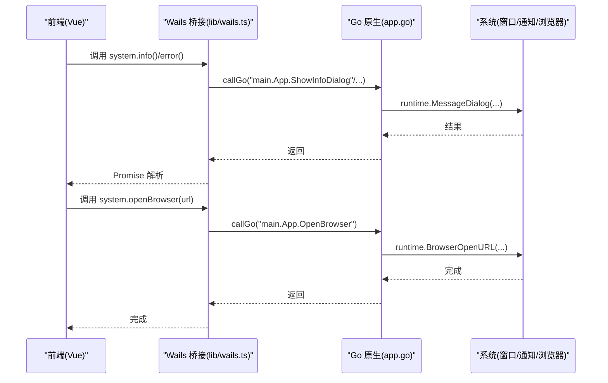
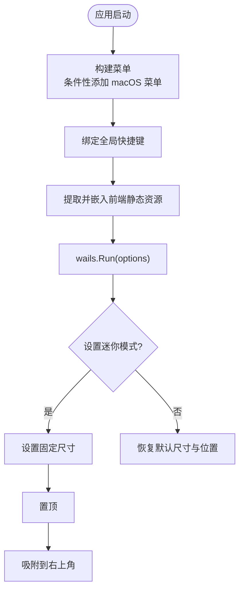
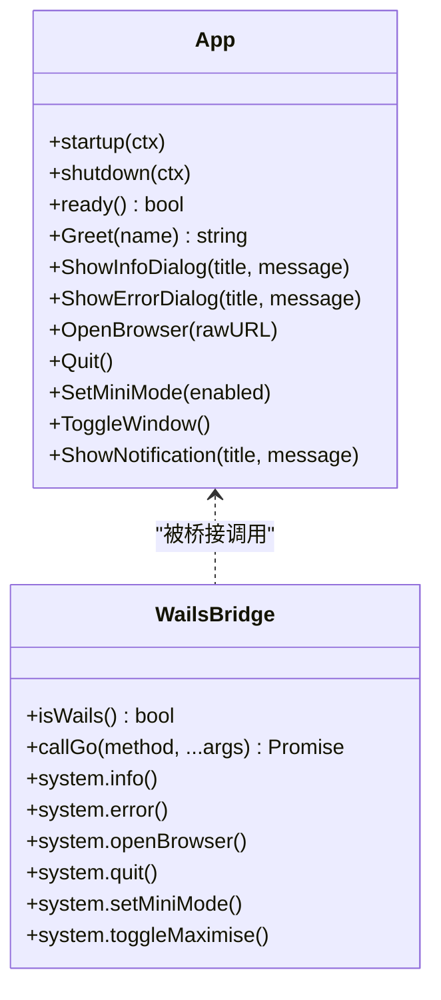
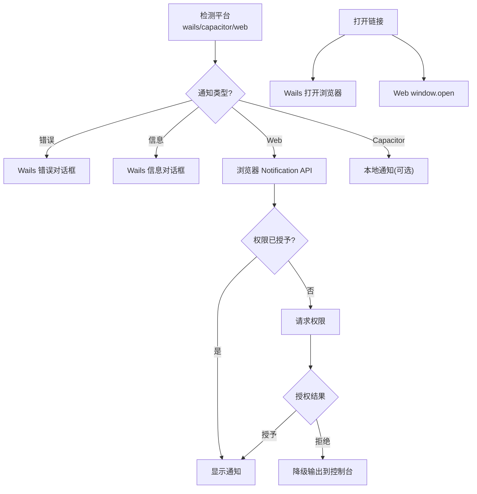
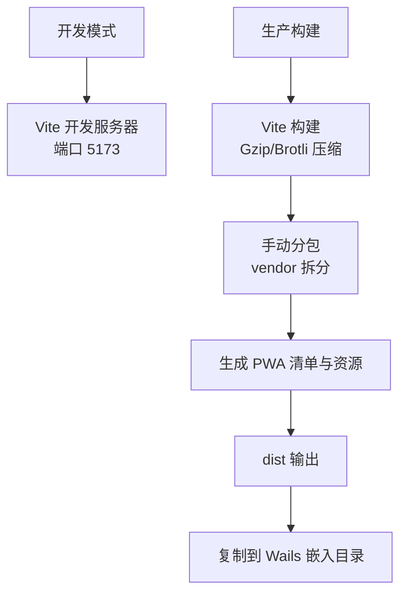
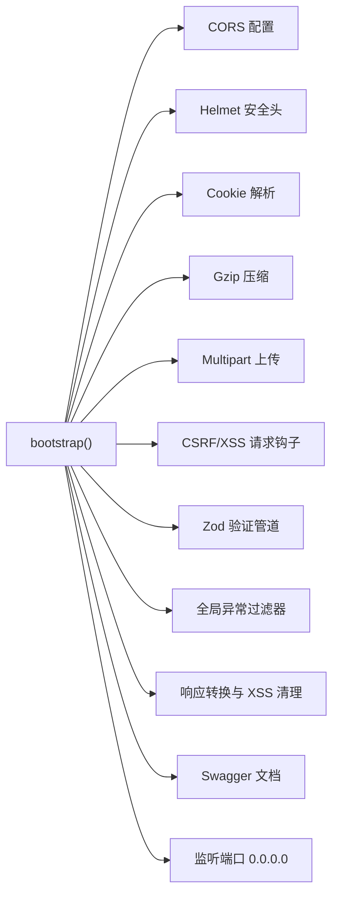
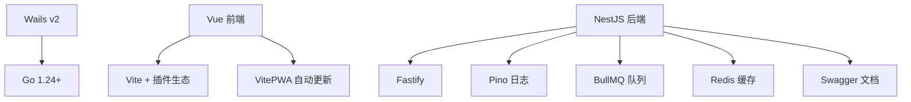

# 桌面应用开发

<cite>
**本文引用的文件**
- [apps/wails/app.go](file://apps/wails/app.go)
- [apps/wails/main.go](file://apps/wails/main.go)
- [apps/wails/wails.json](file://apps/wails/wails.json)
- [apps/wails/go.mod](file://apps/wails/go.mod)
- [apps/frontend/src/lib/wails.ts](file://apps/frontend/src/lib/wails.ts)
- [apps/frontend/src/services/native.ts](file://apps/frontend/src/services/native.ts)
- [apps/frontend/src/main.ts](file://apps/frontend/src/main.ts)
- [apps/frontend/src/router/index.ts](file://apps/frontend/src/router/index.ts)
- [apps/frontend/vite.config.mts](file://apps/frontend/vite.config.mts)
- [apps/frontend/package.json](file://apps/frontend/package.json)
- [apps/backend/src/main.ts](file://apps/backend/src/main.ts)
- [apps/backend/src/app.module.ts](file://apps/backend/src/app.module.ts)
- [apps/backend/nest-cli.json](file://apps/backend/nest-cli.json)
</cite>

## 目录
1. [简介](#简介)
2. [项目结构](#项目结构)
3. [核心组件](#核心组件)
4. [架构总览](#架构总览)
5. [详细组件分析](#详细组件分析)
6. [依赖分析](#依赖分析)
7. [性能考虑](#性能考虑)
8. [故障排除指南](#故障排除指南)
9. [结论](#结论)
10. [附录](#附录)

## 简介
本指南面向 Lumina Todo 桌面应用的开发与维护，围绕 Wails 框架的架构原理与 Go + Vue.js 的混合开发模式展开，系统讲解桌面应用的配置与构建流程、原生功能集成（系统托盘、全局快捷键、文件系统访问）、跨平台打包与分发策略、窗口管理与菜单系统、对话框实现、与后端服务的通信与数据同步、性能优化与资源管理、应用图标与安装包、自动更新、调试与故障排除，以及不同操作系统的要求与限制。

## 项目结构
Lumina 采用多应用工作区布局：
- apps/wails：基于 Wails 的桌面应用入口与原生绑定层，负责窗口、菜单、系统交互与与前端的桥接。
- apps/frontend：基于 Vue 3 + Vite 的前端应用，支持 PWA、自动更新、按需分包与代理后端。
- apps/backend：基于 NestJS 的后端服务，提供 REST API、认证、定时任务、队列、国际化、健康检查与安全中间件。
- packages/shared：共享 TypeScript 包，供前后端复用的数据传输对象与工具。

```mermaid
graph TB
subgraph "桌面应用(Wails)"
WMain["apps/wails/main.go"]
WApp["apps/wails/app.go"]
WCfg["apps/wails/wails.json"]
WGoMod["apps/wails/go.mod"]
end
subgraph "前端应用(Vue)"
FMain["apps/frontend/src/main.ts"]
FWailsLib["apps/frontend/src/lib/wails.ts"]
FNative["apps/frontend/src/services/native.ts"]
FRt["apps/frontend/src/router/index.ts"]
FVite["apps/frontend/vite.config.mts"]
FPkg["apps/frontend/package.json"]
end
subgraph "后端服务(NestJS)"
BMain["apps/backend/src/main.ts"]
BApp["apps/backend/src/app.module.ts"]
BNestCli["apps/backend/nest-cli.json"]
end
subgraph "共享包"
Shared["@lumina/shared"]
end
WMain --> WApp
WMain --> WCfg
WMain --> WGoMod
FMain --> FWailsLib
FMain --> FNative
FMain --> FRt
FVite --> FPkg
FNative --> FWailsLib
FWailsLib --> WApp
BMain --> BApp
BApp --> Shared
FVite -. 代理 /api 与 /socket.io .-> BMain
```

**图表来源**
- [apps/wails/main.go:1-95](file://apps/wails/main.go#L1-L95)
- [apps/wails/app.go:1-168](file://apps/wails/app.go#L1-L168)
- [apps/wails/wails.json:1-22](file://apps/wails/wails.json#L1-L22)
- [apps/wails/go.mod:1-38](file://apps/wails/go.mod#L1-L38)
- [apps/frontend/src/main.ts:1-138](file://apps/frontend/src/main.ts#L1-L138)
- [apps/frontend/src/lib/wails.ts:1-92](file://apps/frontend/src/lib/wails.ts#L1-L92)
- [apps/frontend/src/services/native.ts:1-116](file://apps/frontend/src/services/native.ts#L1-L116)
- [apps/frontend/src/router/index.ts:1-73](file://apps/frontend/src/router/index.ts#L1-L73)
- [apps/frontend/vite.config.mts:1-185](file://apps/frontend/vite.config.mts#L1-L185)
- [apps/frontend/package.json:1-104](file://apps/frontend/package.json#L1-L104)
- [apps/backend/src/main.ts:1-201](file://apps/backend/src/main.ts#L1-L201)
- [apps/backend/src/app.module.ts:1-175](file://apps/backend/src/app.module.ts#L1-L175)
- [apps/backend/nest-cli.json:1-11](file://apps/backend/nest-cli.json#L1-L11)

**章节来源**
- [apps/wails/main.go:1-95](file://apps/wails/main.go#L1-L95)
- [apps/frontend/src/main.ts:1-138](file://apps/frontend/src/main.ts#L1-L138)
- [apps/backend/src/main.ts:1-201](file://apps/backend/src/main.ts#L1-L201)

## 核心组件
- Wails 应用入口与选项：负责窗口尺寸、菜单、透明与半透明效果、平台特定外观、嵌入前端静态资源、生命周期回调绑定。
- 原生桥接与系统交互：提供对话框、浏览器打开、退出、迷你模式、窗口切换、通知事件等。
- 前端桥接与平台适配：统一检测 Wails/Capacitor/Web 环境，封装系统操作与通知。
- 路由与窗口历史：根据是否在 Wails 中运行选择 Hash 或 History 路由模式。
- 构建与 PWA：Vite 分包策略、Gzip/Brotli 压缩、PWA 清单与自动更新、开发代理。
- 后端服务：CORS、Helmet、CSRF/XSS 清理、压缩、Multipart、Swagger 文档、优雅关闭、模块化组织。

**章节来源**
- [apps/wails/main.go:32-89](file://apps/wails/main.go#L32-L89)
- [apps/wails/app.go:42-167](file://apps/wails/app.go#L42-L167)
- [apps/frontend/src/lib/wails.ts:22-91](file://apps/frontend/src/lib/wails.ts#L22-L91)
- [apps/frontend/src/services/native.ts:9-115](file://apps/frontend/src/services/native.ts#L9-L115)
- [apps/frontend/src/router/index.ts:8-10](file://apps/frontend/src/router/index.ts#L8-L10)
- [apps/frontend/vite.config.mts:104-146](file://apps/frontend/vite.config.mts#L104-L146)
- [apps/backend/src/main.ts:48-121](file://apps/backend/src/main.ts#L48-L121)

## 架构总览
Wails 将 Go 作为原生宿主，Vue 作为前端渲染层，二者通过桥接进行方法调用与事件通信。后端服务独立运行并通过本地代理或直连提供 API 与实时通信。



**图表来源**
- [apps/frontend/src/lib/wails.ts:29-52](file://apps/frontend/src/lib/wails.ts#L29-L52)
- [apps/wails/app.go:42-82](file://apps/wails/app.go#L42-L82)

## 详细组件分析

### Wails 应用入口与窗口管理
- 菜单系统：条件性添加“文件”子菜单与“编辑”菜单；在 macOS 下附加标准应用菜单与编辑菜单。
- 快捷键：为“切换窗口”绑定全局快捷键组合。
- 窗口行为：最小化/还原、置顶、尺寸调整、居中、迷你模式（固定尺寸、置顶、吸附到屏幕右上角）。
- 透明与半透明：Windows 使用 Mica 背景，macOS 隐藏标题栏并启用透明。
- 资源嵌入：将前端构建产物嵌入并作为资产服务器提供。



**图表来源**
- [apps/wails/main.go:32-89](file://apps/wails/main.go#L32-L89)
- [apps/wails/app.go:113-140](file://apps/wails/app.go#L113-L140)

**章节来源**
- [apps/wails/main.go:32-89](file://apps/wails/main.go#L32-L89)
- [apps/wails/app.go:113-140](file://apps/wails/app.go#L113-L140)

### 原生桥接与系统交互
- 对话框：信息/错误对话框通过 runtime.MessageDialog 展示。
- 浏览器打开：校验 URL 合法性后通过 runtime.BrowserOpenURL 打开。
- 退出应用：runtime.Quit。
- 通知：通过 runtime.EventsEmit 触发前端事件，前端可进一步调用系统通知。
- 窗口控制：ToggleWindow 实现最小化/还原与置顶切换；SetMiniMode 控制迷你模式。



**图表来源**
- [apps/wails/app.go:13-167](file://apps/wails/app.go#L13-L167)
- [apps/frontend/src/lib/wails.ts:22-91](file://apps/frontend/src/lib/wails.ts#L22-L91)

**章节来源**
- [apps/wails/app.go:42-167](file://apps/wails/app.go#L42-L167)
- [apps/frontend/src/lib/wails.ts:22-91](file://apps/frontend/src/lib/wails.ts#L22-L91)

### 前端平台适配与通知
- 平台检测：优先识别 Wails，其次 Capacitor 原生平台，最后回退到 Web。
- 通知策略：Wails 调用原生对话框；Web 使用浏览器 Notification API（按需请求权限）；Capacitor 可扩展本地通知。
- 链接打开：Wails 调用原生浏览器；Web 使用 window.open。
- 迷你模式与最大化：Wails 提供 setMiniMode 与 toggleMaximise。



**图表来源**
- [apps/frontend/src/services/native.ts:9-115](file://apps/frontend/src/services/native.ts#L9-L115)

**章节来源**
- [apps/frontend/src/services/native.ts:9-115](file://apps/frontend/src/services/native.ts#L9-L115)

### 路由与窗口历史
- 在 Wails 环境中使用 Hash 历史，避免与本地资源路径冲突。
- 其他环境使用 HTML5 History，保持一致的 URL 体验。

**章节来源**
- [apps/frontend/src/router/index.ts:8-10](file://apps/frontend/src/router/index.ts#L8-L10)

### 构建与 PWA
- Vite 配置：
  - 自动更新：VitePWA 自动更新策略。
  - 压缩：Gzip 与 Brotli 双通道压缩。
  - 分包：按框架/库类别手动拆分 vendor chunk。
  - 代理：/api 与 /socket.io 代理至后端。
- 前端脚本：提供 WAILS=true 的构建流程，将 dist 复制到 Wails 嵌入目录。



**图表来源**
- [apps/frontend/vite.config.mts:80-184](file://apps/frontend/vite.config.mts#L80-L184)
- [apps/frontend/package.json:28](file://apps/frontend/package.json#L28)

**章节来源**
- [apps/frontend/vite.config.mts:80-184](file://apps/frontend/vite.config.mts#L80-L184)
- [apps/frontend/package.json:28](file://apps/frontend/package.json#L28)

### 后端服务与通信
- 安全与中间件：Helmet、CORS、CSRF/XSS 清理、Gzip 压缩、Multipart 上传限制。
- 模块化：日志、队列、国际化、认证、用户、邮件、事件、上传、待办、定时任务、MCP 等模块。
- API 文档：Swagger 自动生成并清理 Zod Schema。
- 优雅关闭：监听 SIGINT/SIGTERM，释放资源。



**图表来源**
- [apps/backend/src/main.ts:34-195](file://apps/backend/src/main.ts#L34-L195)
- [apps/backend/src/app.module.ts:27-175](file://apps/backend/src/app.module.ts#L27-L175)

**章节来源**
- [apps/backend/src/main.ts:34-195](file://apps/backend/src/main.ts#L34-L195)
- [apps/backend/src/app.module.ts:27-175](file://apps/backend/src/app.module.ts#L27-L175)

## 依赖分析
- Wails 依赖：Wails v2 作为核心框架，Go 语言版本与工具链要求。
- 前端依赖：Vue 3、Pinia、Vue Router、TanStack Vue Query、ECharts、TailwindCSS、Vite、VitePWA、ESLint 等。
- 后端依赖：NestJS、Fastify、Pino、BullMQ、Redis、Prisma、Swagger、Zod、Helmet、CSRF/XSS 清理等。



**图表来源**
- [apps/wails/go.mod:1-38](file://apps/wails/go.mod#L1-L38)
- [apps/frontend/package.json:30-102](file://apps/frontend/package.json#L30-L102)
- [apps/backend/src/main.ts:18-29](file://apps/backend/src/main.ts#L18-L29)

**章节来源**
- [apps/wails/go.mod:1-38](file://apps/wails/go.mod#L1-L38)
- [apps/frontend/package.json:30-102](file://apps/frontend/package.json#L30-L102)
- [apps/backend/src/main.ts:18-29](file://apps/backend/src/main.ts#L18-L29)

## 性能考虑
- 前端构建：
  - 使用 Gzip 与 Brotli 双压缩，降低传输体积。
  - 手动分包策略减少首屏与第三方库重复加载。
  - 动态导入错误处理与节流刷新，避免部署后 Chunk 加载失败导致的死循环。
- 后端性能：
  - Fastify 适配器与 Pino 日志，减少 GC 压力。
  - Gzip 压缩与 Multipart 限制，控制带宽与上传风险。
  - BullMQ 默认作业策略（完成即删、失败保留、指数退避）提升稳定性。
- 窗口与渲染：
  - Wails 透明与半透明窗口在 macOS/Windows 上的性能差异，建议按需开启。
  - 迷你模式降低渲染复杂度，适合小组件场景。

**章节来源**
- [apps/frontend/vite.config.mts:88-103](file://apps/frontend/vite.config.mts#L88-L103)
- [apps/frontend/vite.config.mts:175-182](file://apps/frontend/vite.config.mts#L175-L182)
- [apps/frontend/src/main.ts:59-79](file://apps/frontend/src/main.ts#L59-L79)
- [apps/backend/src/main.ts:101-113](file://apps/backend/src/main.ts#L101-L113)
- [apps/backend/src/app.module.ts:97-115](file://apps/backend/src/app.module.ts#L97-L115)

## 故障排除指南
- 前端动态导入失败：
  - 现象：报错包含“Failed to fetch dynamically imported module”等。
  - 处理：自动刷新一次，限制 10 秒内仅刷新一次；若多次失败，建议手动刷新或检查 CDN/缓存。
- ResizeObserver 错误：
  - 现象：控制台出现“ResizeObserver loop limit exceeded”等。
  - 处理：忽略该类良性错误，不影响功能。
- Wails 环境外调用桥接：
  - 现象：调用 callGo 抛出“Not in Wails environment”。
  - 处理：在非 Wails 环境下使用 nativeService 的 web 降级逻辑。
- 后端跨域与安全头：
  - 现象：浏览器跨域失败或安全头不兼容。
  - 处理：确认 CORS 配置与 Helmet 策略，确保 wails://localhost 与开发端口在白名单中。
- PWA 更新与缓存：
  - 现象：页面未及时更新新版本。
  - 处理：启用自动更新策略；必要时清理浏览器缓存或强制刷新。

**章节来源**
- [apps/frontend/src/main.ts:82-113](file://apps/frontend/src/main.ts#L82-L113)
- [apps/frontend/src/lib/wails.ts:30-33](file://apps/frontend/src/lib/wails.ts#L30-L33)
- [apps/backend/src/main.ts:48-63](file://apps/backend/src/main.ts#L48-L63)
- [apps/frontend/vite.config.mts:104-146](file://apps/frontend/vite.config.mts#L104-L146)

## 结论
Lumina Todo 采用 Wails + Vue + NestJS 的混合架构，既保证了桌面原生体验，又具备现代化前端开发与后端工程化的高可维护性。通过清晰的桥接层、完善的构建与安全策略、模块化的后端设计，以及对跨平台差异的细致处理，项目在功能、性能与可运维性之间取得了良好平衡。后续可在原生通知、系统托盘、全局快捷键与自动更新方面进一步完善，以提升用户体验与交付质量。

## 附录

### 原生功能集成要点
- 系统托盘：可通过 Wails 事件与菜单扩展实现，结合后端定时任务与提醒。
- 全局快捷键：已在“文件”菜单中绑定，可扩展更多快捷键映射。
- 文件系统访问：通过后端 API 提供文件上传与下载，前端使用 axios 与 multipart 上传。

**章节来源**
- [apps/wails/main.go:40-46](file://apps/wails/main.go#L40-L46)
- [apps/backend/src/main.ts:106-113](file://apps/backend/src/main.ts#L106-L113)

### 跨平台打包与分发策略
- Windows：利用 Wails 的 Windows 选项（Mica、透明、半透明），构建后分发可执行文件。
- macOS：隐藏标题栏与透明窗口，配合 Info.plist 与签名发布。
- Linux：遵循 Wails 支持的发行版规范，打包为 AppImage 或 DEB/RPM。

**章节来源**
- [apps/wails/main.go:73-88](file://apps/wails/main.go#L73-L88)

### 应用图标、安装包与自动更新
- 图标与清单：PWA 清单与多尺寸图标在 VitePWA 中集中配置。
- 自动更新：VitePWA 的 autoUpdate 策略，结合后端 Swagger 与健康检查便于发布验证。
- 安装包：Wails 构建产物可直接分发；也可配合包管理器或安装器工具。

**章节来源**
- [apps/frontend/vite.config.mts:104-146](file://apps/frontend/vite.config.mts#L104-L146)

### 与后端服务的通信机制与数据同步
- REST API：前端通过 /api 前缀访问后端，Swagger 文档自动生成。
- 实时通信：/socket.io 代理至后端，支持 WebSocket 事件。
- 数据同步：前端 Store 与后端模块化服务协同，结合队列与定时任务保障一致性。

**章节来源**
- [apps/frontend/vite.config.mts:157-170](file://apps/frontend/vite.config.mts#L157-L170)
- [apps/backend/src/main.ts:171-181](file://apps/backend/src/main.ts#L171-L181)

### 不同操作系统的要求与限制
- Windows：启用 Mica 背景与透明窗口需满足系统版本；注意 DPI 与缩放。
- macOS：隐藏标题栏与透明窗口需遵循系统设计规范；注意权限与沙盒限制。
- Linux：窗口系统与桌面环境差异较大，建议在主流发行版测试。

**章节来源**
- [apps/wails/main.go:73-88](file://apps/wails/main.go#L73-L88)