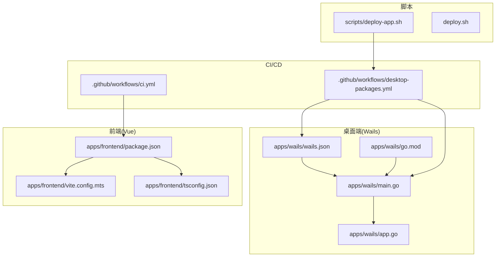
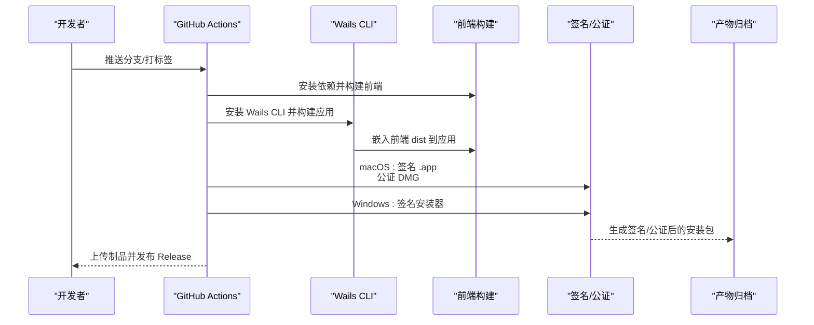
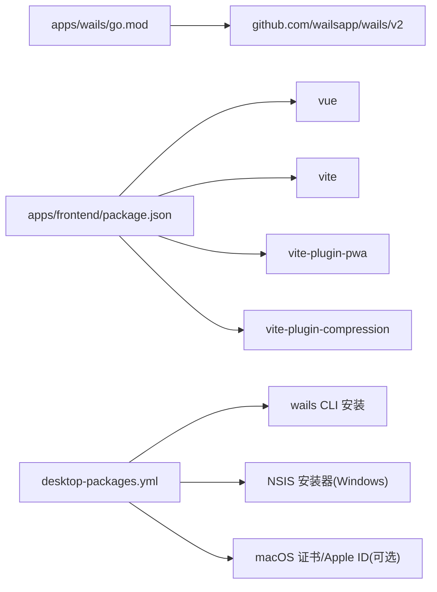

# 跨平台打包分发

<cite>
**本文引用的文件**
- [apps/wails/wails.json](file://apps/wails/wails.json)
- [apps/wails/app.go](file://apps/wails/app.go)
- [apps/wails/main.go](file://apps/wails/main.go)
- [apps/wails/go.mod](file://apps/wails/go.mod)
- [apps/wails/go.sum](file://apps/wails/go.sum)
- [apps/frontend/package.json](file://apps/frontend/package.json)
- [apps/frontend/vite.config.mts](file://apps/frontend/vite.config.mts)
- [apps/frontend/tsconfig.json](file://apps/frontend/tsconfig.json)
- [.github/workflows/desktop-packages.yml](file://.github/workflows/desktop-packages.yml)
- [.github/workflows/ci.yml](file://.github/workflows/ci.yml)
- [scripts/deploy-app.sh](file://scripts/deploy-app.sh)
- [deploy.sh](file://deploy.sh)
- [README.md](file://README.md)
</cite>

## 目录
1. [简介](#简介)
2. [项目结构](#项目结构)
3. [核心组件](#核心组件)
4. [架构总览](#架构总览)
5. [详细组件分析](#详细组件分析)
6. [依赖分析](#依赖分析)
7. [性能考虑](#性能考虑)
8. [故障排除指南](#故障排除指南)
9. [结论](#结论)
10. [附录](#附录)

## 简介
本指南面向使用 Wails 构建跨平台桌面应用的团队与个人，基于仓库中的实际配置与脚本，系统阐述构建流程、打包选项、平台差异、签名与公证、安装包制作、自动更新、版本管理、CI/CD 集成与自动化部署策略，并提供常见问题排查与优化建议。目标是帮助你在 Windows、macOS 与 Linux 上稳定地交付高质量的桌面应用。

## 项目结构
本项目采用多包工作区，桌面端位于 apps/wails，前端位于 apps/frontend，后端位于 apps/backend。桌面端通过 Wails 将前端构建产物嵌入到 Go 应用中，形成最终的原生可执行程序或安装包。

图表来源
- [apps/wails/wails.json:1-22](file://apps/wails/wails.json#L1-L22)
- [apps/wails/main.go:1-95](file://apps/wails/main.go#L1-L95)
- [apps/wails/app.go:1-168](file://apps/wails/app.go#L1-L168)
- [apps/wails/go.mod:1-38](file://apps/wails/go.mod#L1-L38)
- [apps/frontend/package.json:1-104](file://apps/frontend/package.json#L1-L104)
- [apps/frontend/vite.config.mts:1-185](file://apps/frontend/vite.config.mts#L1-L185)
- [.github/workflows/ci.yml:1-139](file://.github/workflows/ci.yml#L1-L139)
- [.github/workflows/desktop-packages.yml:1-354](file://.github/workflows/desktop-packages.yml#L1-L354)
- [scripts/deploy-app.sh:1-66](file://scripts/deploy-app.sh#L1-L66)
- [deploy.sh:1-481](file://deploy.sh#L1-L481)

章节来源
- [apps/wails/wails.json:1-22](file://apps/wails/wails.json#L1-L22)
- [apps/wails/main.go:1-95](file://apps/wails/main.go#L1-L95)
- [apps/frontend/package.json:1-104](file://apps/frontend/package.json#L1-L104)
- [.github/workflows/desktop-packages.yml:1-354](file://.github/workflows/desktop-packages.yml#L1-L354)

## 核心组件
- Wails 配置与构建元数据：桌面应用名称、输出文件名、前端目录、构建命令、作者信息与产品版本等。
- Wails 应用入口与窗口选项：菜单、窗口尺寸、透明度、平台特定外观与行为。
- 前端构建与 PWA 配置：Vite 压缩、PWA 自动更新、资源清单与分包策略。
- CI/CD 工作流：质量门禁、跨平台安装包构建、签名与公证、发布归档与校验清单生成。
- 本地部署脚本：macOS 应用复制与启动、部署锁与磁盘空间监控、Docker 镜像构建与健康检查。

章节来源
- [apps/wails/wails.json:1-22](file://apps/wails/wails.json#L1-L22)
- [apps/wails/main.go:1-95](file://apps/wails/main.go#L1-L95)
- [apps/frontend/vite.config.mts:1-185](file://apps/frontend/vite.config.mts#L1-L185)
- [.github/workflows/desktop-packages.yml:1-354](file://.github/workflows/desktop-packages.yml#L1-L354)
- [scripts/deploy-app.sh:1-66](file://scripts/deploy-app.sh#L1-L66)
- [deploy.sh:1-481](file://deploy.sh#L1-L481)

## 架构总览
下图展示了从源码到安装包的关键路径，以及各平台的差异化处理与签名/公证流程。

图表来源
- [.github/workflows/desktop-packages.yml:1-354](file://.github/workflows/desktop-packages.yml#L1-L354)
- [apps/frontend/vite.config.mts:1-185](file://apps/frontend/vite.config.mts#L1-L185)
- [apps/wails/main.go:1-95](file://apps/wails/main.go#L1-L95)

## 详细组件分析

### Wails 配置与构建元数据
- 应用名称与输出文件名：用于生成最终可执行文件或安装包的标识。
- 前端集成：指定前端目录、安装命令、构建命令、开发服务器地址与 Wails JS 输出目录。
- 产品信息：包含产品名称、版本、版权与注释，便于打包与发布展示。

章节来源
- [apps/wails/wails.json:1-22](file://apps/wails/wails.json#L1-L22)

### Wails 应用入口与窗口选项
- 菜单与快捷键：根据平台添加标准菜单与快捷键，如 macOS 的 App 菜单与 Edit 菜单。
- 窗口行为：窗口尺寸、最小尺寸、透明背景、隐藏标题栏、Mac 特定外观与行为。
- 平台特定选项：Windows 的 Webview 透明与背景材质；macOS 的 About 信息与隐藏标题栏。

章节来源
- [apps/wails/main.go:1-95](file://apps/wails/main.go#L1-L95)

### 前端构建与 PWA 自动更新
- 基础路径与 Wails 模式：在 Wails 模式下使用相对路径，避免生产环境路径问题。
- 分包策略：按依赖类别手动拆分 vendor 包，提升缓存命中与加载性能。
- 压缩与缓存：同时启用 gzip 与 brotli 压缩，降低传输体积。
- PWA 自动更新：注册类型为 autoUpdate，结合清单与图标资源，实现浏览器端的自动更新体验。

章节来源
- [apps/frontend/vite.config.mts:1-185](file://apps/frontend/vite.config.mts#L1-L185)
- [apps/frontend/package.json:1-104](file://apps/frontend/package.json#L1-L104)

### CI/CD 工作流与跨平台打包
- 质量门禁：校验 Docker Compose 配置、锁定文件一致性、Turbo 缓存与测试/类型检查/安全审计。
- 跨平台构建矩阵：Windows、macOS、Linux 三端并行构建。
- 平台差异：
  - Windows：使用 NSIS 安装器，产物为 .exe；支持签名。
  - macOS：生成 .app，随后制作 DMG；支持签名与公证。
  - Linux：生成二进制可执行文件，打包为 tar.gz。
- 签名与公证：
  - macOS：若配置齐全则进行 .app 签名、DMG 签名与 Notarization（公证），并 stapler 加固。
  - Windows：若配置齐全则对安装器进行时间戳签名。
- 发布：生成统一命名规范的安装包、校验清单与发布说明，自动上传至 GitHub Release。

章节来源
- [.github/workflows/ci.yml:1-139](file://.github/workflows/ci.yml#L1-L139)
- [.github/workflows/desktop-packages.yml:1-354](file://.github/workflows/desktop-packages.yml#L1-L354)

### 本地部署脚本（macOS）
- 自动部署：将构建产物 Lumina.app 复制到 /Applications，并尝试关闭旧版本后启动新版本。
- 权限与校验：检查构建产物存在性、目标目录权限与启动结果。

章节来源
- [scripts/deploy-app.sh:1-66](file://scripts/deploy-app.sh#L1-L66)

### Docker 部署与健康检查
- 部署脚本：包含磁盘占用阈值校验、镜像与构建器清理策略、服务健康检查与 Prisma 迁移。
- 健康检查：后端服务启动缓冲期较长，避免早期失败导致部署中断。
- 环境变量：通过 .env 控制数据库、缓存与认证等关键参数。

章节来源
- [deploy.sh:1-481](file://deploy.sh#L1-L481)

## 依赖分析
- Wails 版本与 Go 工具链：Go 语言版本与 Wails v2 依赖确保跨平台兼容性与稳定性。
- 前端依赖与构建：Vue 3、Vite、Tailwind、PWA 插件与压缩插件构成现代前端生态。
- CI 依赖：Node.js、pnpm、Go、Wails CLI、NSIS（Windows）、macOS 证书与 Apple ID（可选）。

图表来源
- [apps/wails/go.mod:1-38](file://apps/wails/go.mod#L1-L38)
- [apps/frontend/package.json:1-104](file://apps/frontend/package.json#L1-L104)
- [.github/workflows/desktop-packages.yml:1-354](file://.github/workflows/desktop-packages.yml#L1-L354)

章节来源
- [apps/wails/go.mod:1-38](file://apps/wails/go.mod#L1-L38)
- [apps/frontend/package.json:1-104](file://apps/frontend/package.json#L1-L104)
- [.github/workflows/desktop-packages.yml:1-354](file://.github/workflows/desktop-packages.yml#L1-L354)

## 性能考虑
- 前端分包与压缩：通过手动分包策略与 gzip/brotli 压缩，显著降低首屏加载时间与带宽消耗。
- 构建缓存：CI 中启用 Turbo 缓存与 pnpm store 缓存，缩短构建时间。
- 镜像瘦身：后端与前端 Docker 镜像分别采用多阶段构建与最小依赖提取，降低镜像体积与扫描风险。
- 磁盘清理：部署脚本在构建前后执行清理，避免磁盘空间不足影响后续流程。

章节来源
- [apps/frontend/vite.config.mts:1-185](file://apps/frontend/vite.config.mts#L1-L185)
- [.github/workflows/ci.yml:1-139](file://.github/workflows/ci.yml#L1-L139)
- [deploy.sh:1-481](file://deploy.sh#L1-L481)

## 故障排除指南
- macOS 提示“已损坏/无法打开”：
  - 由于未进行 Apple Developer 签名/公证，可通过移除隔离属性临时解决。
  - 参考：[README.md:253-257](file://README.md#L253-L257)
- Windows 安装器未签名：
  - 若未配置签名证书，将跳过签名步骤；可在具备证书后补充 Secrets。
  - 参考：[desktop-packages.yml:219-233](file://.github/workflows/desktop-packages.yml#L219-L233)
- macOS DMG 未公证：
  - 若 Apple ID/Team ID/App Password 未配置，将跳过公证；可在具备凭据后补充 Secrets。
  - 参考：[desktop-packages.yml:264-280](file://.github/workflows/desktop-packages.yml#L264-L280)
- 磁盘空间不足导致部署失败：
  - 部署脚本内置阈值与清理策略；可根据需要开启激进清理。
  - 参考：[deploy.sh:317-354](file://deploy.sh#L317-L354)
- 前端路径问题导致资源 404（Wails 模式）：
  - 确认 Vite base 设置为相对路径，避免生产环境绝对路径。
  - 参考：[apps/frontend/vite.config.mts:15-21](file://apps/frontend/vite.config.mts#L15-L21)

章节来源
- [README.md:253-257](file://README.md#L253-L257)
- [.github/workflows/desktop-packages.yml:219-233](file://.github/workflows/desktop-packages.yml#L219-L233)
- [.github/workflows/desktop-packages.yml:264-280](file://.github/workflows/desktop-packages.yml#L264-L280)
- [deploy.sh:317-354](file://deploy.sh#L317-L354)
- [apps/frontend/vite.config.mts:15-21](file://apps/frontend/vite.config.mts#L15-L21)

## 结论
本项目已建立完善的跨平台打包与分发体系：通过 Wails 将前端产物嵌入原生应用，借助 GitHub Actions 实现 Windows、macOS、Linux 三端并行构建与签名/公证，配合发布归档与校验清单，确保交付质量与可追溯性。同时，本地部署脚本与 Docker 部署流程提供了从开发到生产的稳定路径。建议在具备 Apple/Windows 证书后完善签名与公证流程，进一步提升用户信任度与合规性。

## 附录

### 平台打包配置与差异
- Windows
  - 安装器：NSIS；产物为 .exe；支持签名。
  - 参考：[desktop-packages.yml:148-154](file://.github/workflows/desktop-packages.yml#L148-L154)，[desktop-packages.yml:207-233](file://.github/workflows/desktop-packages.yml#L207-L233)
- macOS
  - 应用：.app；DMG 制作；支持签名与公证。
  - 参考：[desktop-packages.yml:155-158](file://.github/workflows/desktop-packages.yml#L155-L158)，[desktop-packages.yml:234-263](file://.github/workflows/desktop-packages.yml#L234-L263)，[desktop-packages.yml:264-280](file://.github/workflows/desktop-packages.yml#L264-L280)
- Linux
  - 二进制：tar.gz 归档；产物为 Lumina 可执行文件。
  - 参考：[desktop-packages.yml:159-162](file://.github/workflows/desktop-packages.yml#L159-L162)，[desktop-packages.yml:246-252](file://.github/workflows/desktop-packages.yml#L246-L252)

### 应用签名与公证流程
- macOS
  - 签名 .app：使用证书与身份标识进行 deep、runtime 等签名。
  - 签名 DMG：对 DMG 进行签名。
  - 公证：提交 notarytool 并 stapler 加固。
  - 参考：[desktop-packages.yml:186-206](file://.github/workflows/desktop-packages.yml#L186-L206)，[desktop-packages.yml:234-263](file://.github/workflows/desktop-packages.yml#L234-L263)，[desktop-packages.yml:264-280](file://.github/workflows/desktop-packages.yml#L264-L280)
- Windows
  - 安装器签名：使用 PFX 证书与时间戳服务进行 SHA256 签名。
  - 参考：[desktop-packages.yml:219-233](file://.github/workflows/desktop-packages.yml#L219-L233)

### 安装包制作与自动更新
- 安装包命名：统一采用 Lumina-版本-系统-架构 的命名规范，便于识别。
- 自动更新：前端 PWA 注册类型为 autoUpdate，结合清单与图标资源实现自动更新。
- 参考：[desktop-packages.yml:104-107](file://.github/workflows/desktop-packages.yml#L104-L107)，[apps/frontend/vite.config.mts:104-146](file://apps/frontend/vite.config.mts#L104-L146)

### 版本管理与发布
- 版本来源：Git Tag 或 dev-sha；发布说明自动生成。
- 校验清单：生成 checksums.txt，便于完整性校验。
- 参考：[desktop-packages.yml:73-123](file://.github/workflows/desktop-packages.yml#L73-L123)，[desktop-packages.yml:288-354](file://.github/workflows/desktop-packages.yml#L288-L354)

### CI/CD 集成与自动化部署策略
- 质量门禁：校验配置、锁定文件、Turbo 缓存、测试与安全审计。
- 构建：并行构建三端安装包，按需清理与健康检查。
- 发布：上传制品、生成校验清单与发布说明。
- 参考：[ci.yml:25-84](file://.github/workflows/ci.yml#L25-L84)，[desktop-packages.yml:31-354](file://.github/workflows/desktop-packages.yml#L31-L354)

### 打包脚本编写与优化建议
- 前端 Wails 模式：确保 base 设置为相对路径，避免生产环境路径问题。
  - 参考：[apps/frontend/vite.config.mts:15-21](file://apps/frontend/vite.config.mts#L15-L21)
- 分包策略：按依赖类别拆分 vendor，提升缓存命中率。
  - 参考：[apps/frontend/vite.config.mts:23-78](file://apps/frontend/vite.config.mts#L23-L78)
- 压缩策略：同时启用 gzip 与 brotli，降低体积。
  - 参考：[apps/frontend/vite.config.mts:88-103](file://apps/frontend/vite.config.mts#L88-L103)
- 本地部署：macOS 自动复制到 /Applications 并启动，注意权限与校验。
  - 参考：[scripts/deploy-app.sh:28-66](file://scripts/deploy-app.sh#L28-L66)
- Docker 部署：磁盘阈值与清理策略、健康检查与 Prisma 迁移。
  - 参考：[deploy.sh:15-481](file://deploy.sh#L15-L481)