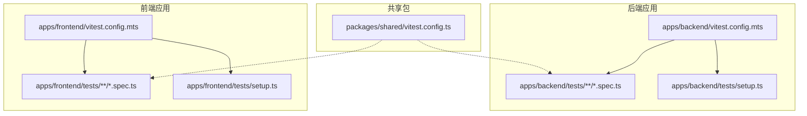
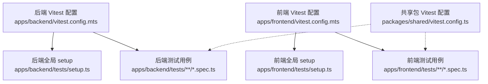
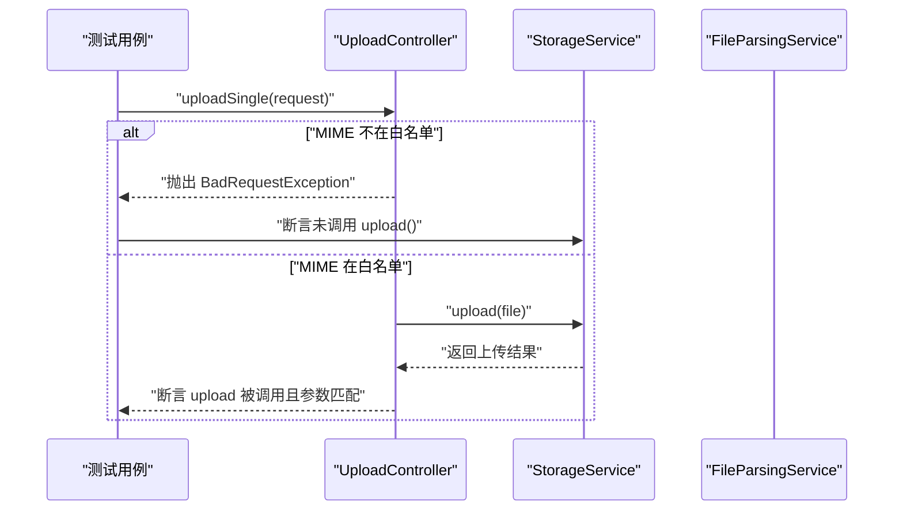
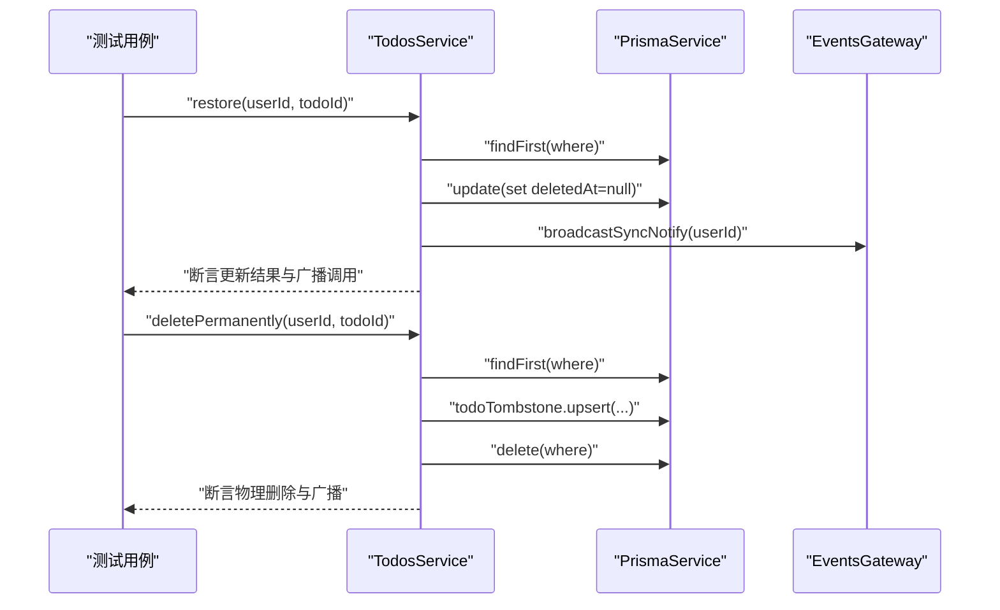
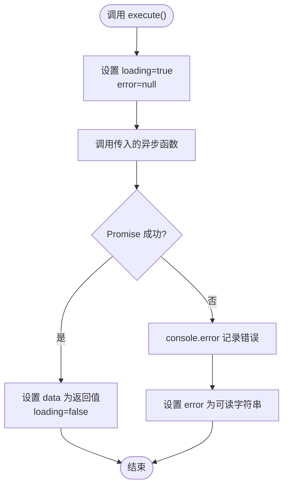
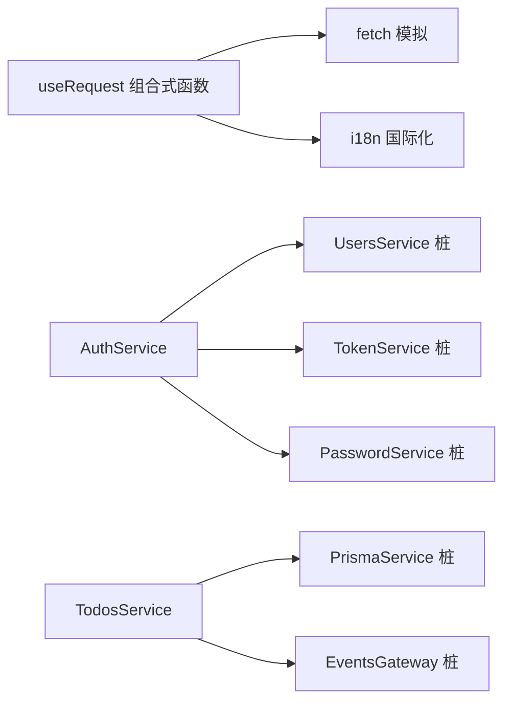

# 单元测试

<cite>
**本文引用的文件**
- [apps/backend/vitest.config.mts](file://apps/backend/vitest.config.mts)
- [apps/frontend/vitest.config.mts](file://apps/frontend/vitest.config.mts)
- [packages/shared/vitest.config.ts](file://packages/shared/vitest.config.ts)
- [apps/backend/tests/setup.ts](file://apps/backend/tests/setup.ts)
- [apps/frontend/tests/setup.ts](file://apps/frontend/tests/setup.ts)
- [apps/backend/tests/auth/auth.service.spec.ts](file://apps/backend/tests/auth/auth.service.spec.ts)
- [apps/backend/tests/auth/password.service.spec.ts](file://apps/backend/tests/auth/password.service.spec.ts)
- [apps/backend/tests/todos.service.spec.ts](file://apps/backend/tests/todos.service.spec.ts)
- [apps/backend/tests/upload/upload.controller.spec.ts](file://apps/backend/tests/upload/upload.controller.spec.ts)
- [apps/backend/tests/scheduled-tasks.processor.spec.ts](file://apps/backend/tests/scheduled-tasks.processor.spec.ts)
- [apps/backend/tests/e2e/auth.e2e.spec.ts](file://apps/backend/tests/e2e/auth.e2e.spec.ts)
- [apps/frontend/tests/components/ui/button/Button.spec.ts](file://apps/frontend/tests/components/ui/button/Button.spec.ts)
- [apps/frontend/tests/composables/useRequest.spec.ts](file://apps/frontend/tests/composables/useRequest.spec.ts)
- [apps/frontend/tests/features/todo/stores/todo.source.spec.ts](file://apps/frontend/tests/features/todo/stores/todo.source.spec.ts)
</cite>

## 目录
1. [简介](#简介)
2. [项目结构](#项目结构)
3. [核心组件](#核心组件)
4. [架构总览](#架构总览)
5. [详细组件分析](#详细组件分析)
6. [依赖分析](#依赖分析)
7. [性能考虑](#性能考虑)
8. [故障排查指南](#故障排查指南)
9. [结论](#结论)
10. [附录](#附录)

## 简介
本指南面向后端与前端的单元测试实践，结合仓库中现有的 Vitest 配置与大量测试用例，系统阐述如何编写高质量的单元测试：包括测试金字塔的应用、Mock 与 Stub 的使用、控制器与服务层测试、组合式测试、测试数据准备与清理、异步与错误处理测试、断言与期望规范、测试隔离与依赖注入、性能优化与并行执行，以及测试维护与重构的最佳实践。

## 项目结构
本仓库采用多包工作区（monorepo）结构，分别在后端、前端与共享包中配置了独立的 Vitest 测试环境与别名解析，确保测试运行时的隔离与一致性。

图示来源
- [apps/backend/vitest.config.mts:1-34](file://apps/backend/vitest.config.mts#L1-L34)
- [apps/frontend/vitest.config.mts:1-23](file://apps/frontend/vitest.config.mts#L1-L23)
- [packages/shared/vitest.config.ts:1-22](file://packages/shared/vitest.config.ts#L1-L22)

章节来源
- [apps/backend/vitest.config.mts:1-34](file://apps/backend/vitest.config.mts#L1-L34)
- [apps/frontend/vitest.config.mts:1-23](file://apps/frontend/vitest.config.mts#L1-L23)
- [packages/shared/vitest.config.ts:1-22](file://packages/shared/vitest.config.ts#L1-L22)

## 核心组件
- 测试运行器与环境
  - 后端使用 Node 环境，启用全局测试 API、覆盖率与 UTC 时区；通过 setupFiles 注入统一日志抑制逻辑。
  - 前端使用 happy-dom 环境，加载 Vue 插件，支持 DOM API 与浏览器全局对象的模拟。
  - 共享包使用 Node 环境，聚焦纯 TypeScript 工具与 DTO 的测试。
- 别名与路径
  - 后端与共享包为 src 目录设置 @ 别名，并将共享包别名为 @lumina/shared。
  - 前端为 src 目录设置 @ 别名，并将共享包别名为 @lumina/shared。
- 并发与覆盖率
  - maxWorkers 设置为 50%，提升并发执行效率；后端与共享包开启 v8 覆盖率输出到文本、JSON、HTML。

章节来源
- [apps/backend/vitest.config.mts:10-26](file://apps/backend/vitest.config.mts#L10-L26)
- [apps/frontend/vitest.config.mts:10-21](file://apps/frontend/vitest.config.mts#L10-L21)
- [packages/shared/vitest.config.ts:4-15](file://packages/shared/vitest.config.ts#L4-L15)

## 架构总览
下图展示了测试配置、全局 setup 与具体测试之间的关系，体现测试隔离、依赖注入与断言期望的组织方式。

图示来源
- [apps/backend/vitest.config.mts:10-26](file://apps/backend/vitest.config.mts#L10-L26)
- [apps/frontend/vitest.config.mts:10-21](file://apps/frontend/vitest.config.mts#L10-L21)
- [packages/shared/vitest.config.ts:4-15](file://packages/shared/vitest.config.ts#L4-L15)

## 详细组件分析

### 测试金字塔在项目中的应用
- 单元层（Unit）
  - 使用 Mock/Stub 替换外部依赖，验证函数行为与边界条件。例如：认证服务、密码服务、上传控制器、定时任务处理器等均以纯函数或受控依赖的方式进行单元测试。
- 集成层（Integration）
  - 通过 Nest 的 TestingModule 对服务进行依赖注入与模块编排，验证服务与数据库、事件网关等协作。例如：待办服务对 Prisma 与事件网关的交互。
- 端到端层（E2E）
  - 使用真实应用实例与注入器发起 HTTP 请求，覆盖完整业务流程。例如：认证注册、登录、刷新、登出与黑名单校验。

章节来源
- [apps/backend/tests/auth/auth.service.spec.ts:10-44](file://apps/backend/tests/auth/auth.service.spec.ts#L10-L44)
- [apps/backend/tests/todos.service.spec.ts:32-47](file://apps/backend/tests/todos.service.spec.ts#L32-L47)
- [apps/backend/tests/e2e/auth.e2e.spec.ts:20-28](file://apps/backend/tests/e2e/auth.e2e.spec.ts#L20-L28)

### Mock 与 Stub 的使用方法与最佳实践
- 后端纯函数/类的 Mock
  - 通过 vi.fn() 创建函数桩，返回预设值或抛出异常；通过 spyOn/spyOnConstructor 进行方法拦截与断言调用次数与参数。
  - 示例：认证服务对用户、令牌与密码服务的依赖均以对象桩形式注入，避免真实数据库与加密库的开销。
- 前端全局与组件级 Mock
  - 使用 vi.stubGlobal 对 localStorage、fetch、requestAnimationFrame、matchMedia 等进行模拟，保证测试环境一致性。
  - 使用 @vue/test-utils 的 mount 渲染组件，传入 props 与 slots 断言渲染结果。
- 组合式测试中的 Mock
  - 在前端组合式函数中，通过 vi.fn() 包装异步请求，断言 loading、data、error 的状态流转与控制台错误输出行为。

章节来源
- [apps/backend/tests/auth/auth.service.spec.ts:10-32](file://apps/backend/tests/auth/auth.service.spec.ts#L10-L32)
- [apps/frontend/tests/setup.ts:37-78](file://apps/frontend/tests/setup.ts#L37-L78)
- [apps/frontend/tests/components/ui/button/Button.spec.ts:5-38](file://apps/frontend/tests/components/ui/button/Button.spec.ts#L5-L38)
- [apps/frontend/tests/composables/useRequest.spec.ts:5-116](file://apps/frontend/tests/composables/useRequest.spec.ts#L5-L116)

### 控制器测试示例
- 场景：上传控制器针对不同 MIME 类型的单文件上传进行白名单校验与转发。
- 关键点：
  - 构造 multipart 文件片段与请求对象；
  - 断言 BadRequestException 抛出与存储服务未被调用；
  - 断言允许类型时，存储服务被调用且参数匹配。

图示来源
- [apps/backend/tests/upload/upload.controller.spec.ts:29-101](file://apps/backend/tests/upload/upload.controller.spec.ts#L29-L101)

章节来源
- [apps/backend/tests/upload/upload.controller.spec.ts:29-101](file://apps/backend/tests/upload/upload.controller.spec.ts#L29-L101)

### 服务层测试示例
- 场景：待办服务对回收站查询、恢复、永久删除与清空回收站的事务性操作。
- 关键点：
  - 使用 TestingModule 注入 PrismaService 与 EventsGateway 的桩；
  - 断言 Prisma 查询参数、事务回调与事件广播。

图示来源
- [apps/backend/tests/todos.service.spec.ts:30-47](file://apps/backend/tests/todos.service.spec.ts#L30-L47)
- [apps/backend/tests/todos.service.spec.ts:70-88](file://apps/backend/tests/todos.service.spec.ts#L70-L88)
- [apps/backend/tests/todos.service.spec.ts:91-114](file://apps/backend/tests/todos.service.spec.ts#L91-L114)

章节来源
- [apps/backend/tests/todos.service.spec.ts:30-47](file://apps/backend/tests/todos.service.spec.ts#L30-L47)
- [apps/backend/tests/todos.service.spec.ts:70-88](file://apps/backend/tests/todos.service.spec.ts#L70-L88)
- [apps/backend/tests/todos.service.spec.ts:91-114](file://apps/backend/tests/todos.service.spec.ts#L91-L114)

### 组合式测试示例
- 场景：useRequest 组合式函数在异步请求中的状态管理与错误处理。
- 关键点：
  - 初始化默认状态（data、loading、error）；
  - 执行 execute 时 loading=true，完成后 loading=false；
  - 失败时记录控制台错误并设置 error 字符串；
  - 重置错误前一次请求的影响；
  - 支持多次 execute 返回不同数据。

图示来源
- [apps/frontend/tests/composables/useRequest.spec.ts:5-116](file://apps/frontend/tests/composables/useRequest.spec.ts#L5-L116)

章节来源
- [apps/frontend/tests/composables/useRequest.spec.ts:5-116](file://apps/frontend/tests/composables/useRequest.spec.ts#L5-L116)

### 前端组件测试示例
- 场景：按钮组件根据 variant 与 size 应用样式类，并正确渲染插槽内容。
- 关键点：
  - 使用 mount 渲染组件；
  - 通过 props 与 slots 传参；
  - 断言 HTML 内容包含预期类名与文本。

章节来源
- [apps/frontend/tests/components/ui/button/Button.spec.ts:5-38](file://apps/frontend/tests/components/ui/button/Button.spec.ts#L5-L38)

### 端到端测试示例
- 场景：认证模块的完整流程，包括安全头校验、注册、登录、刷新、登出与黑名单校验。
- 关键点：
  - beforeAll 创建应用与注入器，afterAll 关闭应用；
  - 断言状态码与响应体字段；
  - 使用工具函数解包响应体并断言字段类型与值。

章节来源
- [apps/backend/tests/e2e/auth.e2e.spec.ts:20-28](file://apps/backend/tests/e2e/auth.e2e.spec.ts#L20-L28)
- [apps/backend/tests/e2e/auth.e2e.spec.ts:64-153](file://apps/backend/tests/e2e/auth.e2e.spec.ts#L64-153)

### 定时任务处理器测试示例
- 场景：每日统计数据聚合任务，包含正常流程与异常捕获。
- 关键点：
  - Mock Prisma 的计数与分组查询；
  - 断言日志输出与错误未抛出；
  - 异常场景断言错误日志包含特定信息。

章节来源
- [apps/backend/tests/scheduled-tasks.processor.spec.ts:31-73](file://apps/backend/tests/scheduled-tasks.processor.spec.ts#L31-L73)
- [apps/backend/tests/scheduled-tasks.processor.spec.ts:75-93](file://apps/backend/tests/scheduled-tasks.processor.spec.ts#L75-L93)

### 认证服务与密码服务测试示例
- 场景：认证服务的用户校验、登录、登出与刷新令牌流程；密码服务的哈希、比较、重置请求与重置。
- 关键点：
  - validateUser：用户不存在、密码不匹配、格式化用户返回；
  - login：失败抛出未授权异常，成功返回令牌与用户；
  - refreshToken：黑名单、会话失效、有效令牌三种分支；
  - password.hash/compare：断言 bcrypt 行为；
  - requestReset：存在用户发送邮件、不存在用户不发送；
  - reset：有效令牌更新密码并使会话失效，无效令牌抛出异常。

章节来源
- [apps/backend/tests/auth/auth.service.spec.ts:46-83](file://apps/backend/tests/auth/auth.service.spec.ts#L46-L83)
- [apps/backend/tests/auth/auth.service.spec.ts:85-114](file://apps/backend/tests/auth/auth.service.spec.ts#L85-L114)
- [apps/backend/tests/auth/auth.service.spec.ts:116-143](file://apps/backend/tests/auth/auth.service.spec.ts#L116-L143)
- [apps/backend/tests/auth/auth.service.spec.ts:145-175](file://apps/backend/tests/auth/auth.service.spec.ts#L145-L175)
- [apps/backend/tests/auth/password.service.spec.ts:37-58](file://apps/backend/tests/auth/password.service.spec.ts#L37-L58)
- [apps/backend/tests/auth/password.service.spec.ts:60-91](file://apps/backend/tests/auth/password.service.spec.ts#L60-L91)
- [apps/backend/tests/auth/password.service.spec.ts:93-120](file://apps/backend/tests/auth/password.service.spec.ts#L93-L120)

### 待办源管理测试示例
- 场景：本地与远程待办源的切换、快照持久化与冲突清除。
- 关键点：
  - persistActiveSourceTodos：按当前源写入对应列表；
  - applyTodoSource：切换源、重置标志位、标记远程待办为待同步、清空冲突与加载标记。

章节来源
- [apps/frontend/tests/features/todo/stores/todo.source.spec.ts:24-53](file://apps/frontend/tests/features/todo/stores/todo.source.spec.ts#L24-L53)
- [apps/frontend/tests/features/todo/stores/todo.source.spec.ts:55-85](file://apps/frontend/tests/features/todo/stores/todo.source.spec.ts#L55-L85)

## 依赖分析
- 测试隔离
  - 每个测试文件内部通过 beforeEach 清理 mocks 与重置全局桩，避免跨用例污染。
  - 前端 setup 中对 localStorage、fetch、requestAnimationFrame 等进行全局模拟，确保 DOM 与网络行为可控。
- 依赖注入
  - 后端使用 TestingModule 提供自定义 Provider，替换 PrismaService 与 EventsGateway，实现服务间解耦。
- 外部依赖
  - 后端使用 bcrypt 进行密码校验，测试中通过比较函数验证哈希正确性；
  - 前端使用 i18n 进行错误消息国际化，测试中断言错误字符串符合本地化键。

图示来源
- [apps/frontend/tests/composables/useRequest.spec.ts:5-116](file://apps/frontend/tests/composables/useRequest.spec.ts#L5-L116)
- [apps/backend/tests/auth/auth.service.spec.ts:10-32](file://apps/backend/tests/auth/auth.service.spec.ts#L10-L32)
- [apps/backend/tests/todos.service.spec.ts:32-47](file://apps/backend/tests/todos.service.spec.ts#L32-L47)

章节来源
- [apps/frontend/tests/composables/useRequest.spec.ts:5-116](file://apps/frontend/tests/composables/useRequest.spec.ts#L5-L116)
- [apps/backend/tests/auth/auth.service.spec.ts:10-32](file://apps/backend/tests/auth/auth.service.spec.ts#L10-L32)
- [apps/backend/tests/todos.service.spec.ts:32-47](file://apps/backend/tests/todos.service.spec.ts#L32-L47)

## 性能考虑
- 并发执行
  - maxWorkers 设为 50%，在 CPU 可用核数与测试数量之间取得平衡，缩短整体耗时。
- 覆盖率与报告
  - 后端与共享包启用 v8 覆盖率，输出文本、JSON、HTML，便于 CI 分析与可视化。
- 日志抑制
  - 后端 setup 通过过滤特定日志内容减少控制台噪声，提升测试运行速度与可读性。
- 前端 DOM 环境
  - happy-dom 提供轻量 DOM 实现，避免启动真实浏览器带来的额外开销。

章节来源
- [apps/backend/vitest.config.mts:13](file://apps/backend/vitest.config.mts#L13)
- [apps/frontend/vitest.config.mts:15](file://apps/frontend/vitest.config.mts#L15)
- [apps/backend/vitest.config.mts:21-25](file://apps/backend/vitest.config.mts#L21-L25)
- [apps/backend/tests/setup.ts:3-64](file://apps/backend/tests/setup.ts#L3-L64)

## 故障排查指南
- 常见问题
  - 控制台出现框架日志噪声：检查后端 setup 是否正确过滤 Nest 日志与特定异常堆栈。
  - 前端测试报错找不到 DOM API：确认已加载 happy-dom 插件与全局桩（localStorage、fetch、matchMedia）。
  - 前端动画相关测试不稳定：检查 requestAnimationFrame 的模拟与 pending 定时器清理。
- 排查步骤
  - 在 beforeEach 中重置所有 mocks 与全局桩；
  - 使用 spy 观察方法调用次数与参数；
  - 对异步流程使用超时与断言顺序验证；
  - 对 E2E 场景，先断言状态码再断言响应体字段。

章节来源
- [apps/backend/tests/setup.ts:3-64](file://apps/backend/tests/setup.ts#L3-L64)
- [apps/frontend/tests/setup.ts:85-101](file://apps/frontend/tests/setup.ts#L85-L101)
- [apps/backend/tests/e2e/auth.e2e.spec.ts:30-45](file://apps/backend/tests/e2e/auth.e2e.spec.ts#L30-L45)

## 结论
本仓库的测试体系以 Vitest 为核心，结合后端 Nest 与前端 Vue 生态，形成了从单元到端到端的完整测试金字塔。通过合理的 Mock/Stub、依赖注入与全局 setup，实现了高隔离、高可读与高可维护的测试实践。建议在新增功能时遵循现有模式：优先单元测试，其次集成测试，最后补充必要的端到端场景，并持续关注覆盖率与性能指标。

## 附录

### 测试数据准备与清理策略
- 准备
  - 使用 vi.fn() 或 vi.mocked(...) 构造桩函数；
  - 在 describe/beforeEach 中初始化最小化的测试数据对象；
  - 前端通过 createMultipartPart/createSingleFileRequest 等辅助函数构造请求对象。
- 清理
  - beforeEach 中调用 vi.clearAllMocks()；
  - 前端 beforeEach 中清理 pending RAF、localStorage 与 fetch 的 mock。

章节来源
- [apps/backend/tests/auth/auth.service.spec.ts:37-44](file://apps/backend/tests/auth/auth.service.spec.ts#L37-L44)
- [apps/frontend/tests/upload/upload.controller.spec.ts:7-27](file://apps/frontend/tests/upload/upload.controller.spec.ts#L7-L27)
- [apps/frontend/tests/setup.ts:85-101](file://apps/frontend/tests/setup.ts#L85-L101)

### 异步测试与错误处理测试
- 异步
  - 使用 Promise 断言与 await execute()；
  - 验证 loading 状态在请求期间与结束后的变化。
- 错误处理
  - 断言错误字符串来自 i18n；
  - 断言 console.error 被调用并携带原始错误；
  - 对无效令牌/过期令牌抛出 BadRequestException 的场景进行拒绝断言。

章节来源
- [apps/frontend/tests/composables/useRequest.spec.ts:19-62](file://apps/frontend/tests/composables/useRequest.spec.ts#L19-L62)
- [apps/frontend/tests/composables/useRequest.spec.ts:64-76](file://apps/frontend/tests/composables/useRequest.spec.ts#L64-L76)
- [apps/backend/tests/auth/password.service.spec.ts:115-120](file://apps/backend/tests/auth/password.service.spec.ts#L115-L120)

### 测试断言与期望值编写规范
- 明确性
  - 断言字段类型与值，如 accessToken/refreshToken 为字符串类型；
  - 断言对象属性存在与值相等，如 user.email。
- 可读性
  - 使用 toBe、toEqual、toMatchObject、toContain 等语义化断言；
  - 对正则或字符串片段使用 toMatchObject/expect.stringContaining。
- 边界与异常
  - 对空值、null、undefined 的显式断言；
  - 对异常抛出使用 rejects.toThrow。

章节来源
- [apps/backend/tests/e2e/auth.e2e.spec.ts:72-77](file://apps/backend/tests/e2e/auth.e2e.spec.ts#L72-L77)
- [apps/backend/tests/e2e/auth.e2e.spec.ts:98-102](file://apps/backend/tests/e2e/auth.e2e.spec.ts#L98-L102)
- [apps/frontend/tests/components/ui/button/Button.spec.ts:6-25](file://apps/frontend/tests/components/ui/button/Button.spec.ts#L6-L25)

### 测试隔离与依赖注入处理
- 隔离
  - 每个测试文件内使用 beforeEach 清理 mocks；
  - 前端通过 vi.stubGlobal 与 setupFiles 确保全局环境一致。
- 注入
  - 后端使用 TestingModule 提供自定义 Provider；
  - 前端通过组合式函数的参数注入与全局桩实现解耦。

章节来源
- [apps/backend/tests/todos.service.spec.ts:32-47](file://apps/backend/tests/todos.service.spec.ts#L32-L47)
- [apps/frontend/tests/setup.ts:104-118](file://apps/frontend/tests/setup.ts#L104-L118)

### 测试性能优化与并行执行策略
- 并行
  - maxWorkers=50% 提升并发度；
  - happy-dom 与 v8 覆盖率减少环境开销。
- 优化
  - 将昂贵操作（如 bcrypt）封装在测试工具中复用；
  - 避免在测试中访问真实网络或数据库，统一使用桩。

章节来源
- [apps/backend/vitest.config.mts:13](file://apps/backend/vitest.config.mts#L13)
- [apps/frontend/vitest.config.mts:15](file://apps/frontend/vitest.config.mts#L15)
- [apps/backend/vitest.config.mts:21-25](file://apps/backend/vitest.config.mts#L21-L25)

### 测试维护与重构最佳实践
- 保持测试命名清晰，描述行为而非实现；
- 将公共桩与辅助函数抽取到测试工具文件；
- 随着业务演进定期重构测试，移除冗余断言与重复逻辑；
- 在 CI 中启用覆盖率阈值与报告，持续监控质量。