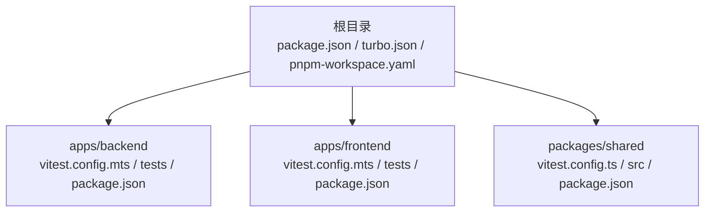
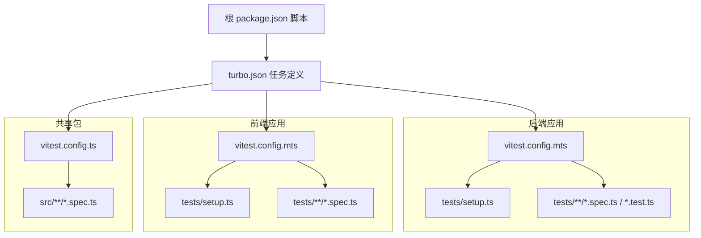
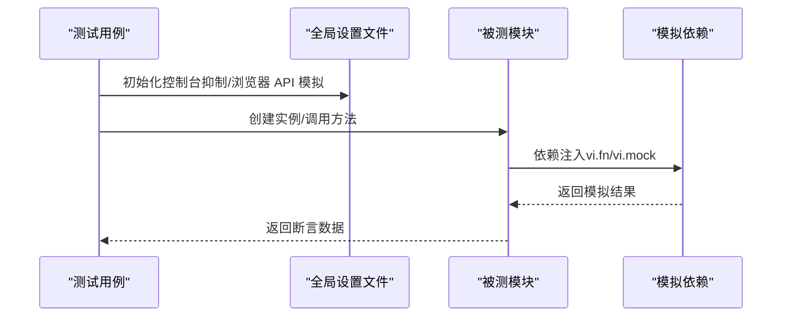
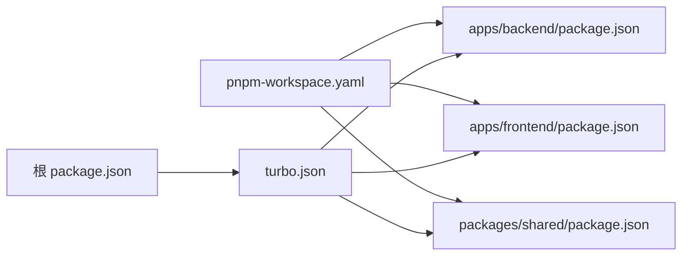

# 测试框架配置

<cite>
**本文引用的文件**
- [apps/backend/vitest.config.mts](file://apps/backend/vitest.config.mts)
- [apps/frontend/vitest.config.mts](file://apps/frontend/vitest.config.mts)
- [packages/shared/vitest.config.ts](file://packages/shared/vitest.config.ts)
- [apps/backend/tests/setup.ts](file://apps/backend/tests/setup.ts)
- [apps/frontend/tests/setup.ts](file://apps/frontend/tests/setup.ts)
- [apps/backend/tests/auth/auth.service.spec.ts](file://apps/backend/tests/auth/auth.service.spec.ts)
- [apps/frontend/tests/components/ui/button/Button.spec.ts](file://apps/frontend/tests/components/ui/button/Button.spec.ts)
- [apps/backend/tests/e2e/auth.e2e.spec.ts](file://apps/backend/tests/e2e/auth.e2e.spec.ts)
- [apps/backend/tests/e2e/test-app.ts](file://apps/backend/tests/e2e/test-app.ts)
- [apps/frontend/tests/features/todo/TodoView.animation.spec.ts](file://apps/frontend/tests/features/todo/TodoView.animation.spec.ts)
- [package.json](file://package.json)
- [turbo.json](file://turbo.json)
- [pnpm-workspace.yaml](file://pnpm-workspace.yaml)
- [apps/backend/package.json](file://apps/backend/package.json)
- [apps/frontend/package.json](file://apps/frontend/package.json)
- [packages/shared/package.json](file://packages/shared/package.json)
</cite>

## 目录
1. [简介](#简介)
2. [项目结构](#项目结构)
3. [核心组件](#核心组件)
4. [架构总览](#架构总览)
5. [详细组件分析](#详细组件分析)
6. [依赖分析](#依赖分析)
7. [性能考虑](#性能考虑)
8. [故障排查指南](#故障排查指南)
9. [结论](#结论)
10. [附录](#附录)

## 简介
本文件系统化梳理了本仓库中基于 Vitest 的测试框架配置与实践，覆盖以下方面：
- Vitest 全局配置结构与各应用（后端、前端、共享包）的差异化配置
- 测试环境设置、全局配置选项与插件配置
- Monorepo 中的测试配置管理策略与工作区组织
- 测试文件命名约定与目录结构要求
- 测试环境变量配置与模拟服务设置
- 测试覆盖率配置与报告生成
- 测试调试配置与断点设置方法
- 测试过滤与选择性执行
- 配置最佳实践与常见问题解决方案

## 项目结构
本仓库采用 Monorepo 结构，使用 pnpm workspace 组织，测试相关的关键位置如下：
- 应用层：apps/backend、apps/frontend
- 共享包：packages/shared
- 根级脚本与缓存策略：根 package.json、turbo.json
- 工作区声明：pnpm-workspace.yaml

图表来源
- [pnpm-workspace.yaml:1-4](file://pnpm-workspace.yaml#L1-L4)
- [turbo.json:1-186](file://turbo.json#L1-L186)
- [package.json:1-133](file://package.json#L1-L133)

章节来源
- [pnpm-workspace.yaml:1-4](file://pnpm-workspace.yaml#L1-L4)
- [turbo.json:1-186](file://turbo.json#L1-L186)
- [package.json:1-133](file://package.json#L1-L133)

## 核心组件
- 后端应用测试配置：定义 Node 环境、全局变量、覆盖率、别名与设置文件等
- 前端应用测试配置：定义浏览器 DOM 环境（happy-dom）、Vue 插件、别名与设置文件等
- 共享包测试配置：定义 Node 环境、覆盖率与别名等
- 全局设置文件：分别在后端与前端注入统一的控制台抑制逻辑、浏览器 API 模拟与全局清理
- 根与任务编排：通过 Turbo 管理测试任务输入输出、并发与缓存策略

章节来源
- [apps/backend/vitest.config.mts:1-34](file://apps/backend/vitest.config.mts#L1-L34)
- [apps/frontend/vitest.config.mts:1-23](file://apps/frontend/vitest.config.mts#L1-L23)
- [packages/shared/vitest.config.ts:1-22](file://packages/shared/vitest.config.ts#L1-L22)
- [apps/backend/tests/setup.ts:1-65](file://apps/backend/tests/setup.ts#L1-L65)
- [apps/frontend/tests/setup.ts:1-134](file://apps/frontend/tests/setup.ts#L1-L134)
- [turbo.json:29-36](file://turbo.json#L29-L36)

## 架构总览
下图展示 Vitest 在各应用中的配置与运行关系，以及根级任务编排如何驱动测试执行。

图表来源
- [apps/backend/vitest.config.mts:1-34](file://apps/backend/vitest.config.mts#L1-L34)
- [apps/frontend/vitest.config.mts:1-23](file://apps/frontend/vitest.config.mts#L1-L23)
- [packages/shared/vitest.config.ts:1-22](file://packages/shared/vitest.config.ts#L1-L22)
- [apps/backend/tests/setup.ts:1-65](file://apps/backend/tests/setup.ts#L1-L65)
- [apps/frontend/tests/setup.ts:1-134](file://apps/frontend/tests/setup.ts#L1-L134)
- [package.json:31-47](file://package.json#L31-L47)
- [turbo.json:29-36](file://turbo.json#L29-L36)

## 详细组件分析

### 后端应用测试配置（Node 环境）
- 环境与全局变量
  - 环境：Node
  - 全局：启用 globals
  - 时区：UTC
- 并发与扫描
  - 最大工作进程：50%
  - 包含：tests/**/*.{test,spec}.ts
  - 排除：node_modules、dist
  - 根目录：当前应用根
- 设置文件与别名
  - 设置文件：./tests/setup.ts
  - 别名：@ -> src；@lumina/shared -> packages/shared/src/index.ts
- 覆盖率
  - 提供者：v8
  - 报告器：text、json、html
  - 排除：node_modules、dist、*.d.ts、main.ts

章节来源
- [apps/backend/vitest.config.mts:9-34](file://apps/backend/vitest.config.mts#L9-L34)

### 前端应用测试配置（浏览器 DOM 环境）
- 插件与环境
  - 插件：Vue
  - 环境：happy-dom
  - 全局：启用 globals
- 并发与扫描
  - 最大工作进程：50%
  - 包含与排除：默认规则
  - 根目录：当前应用根
- 设置文件与别名
  - 设置文件：./tests/setup.ts
  - 别名：@ -> src；@lumina/shared -> packages/shared/src/index.ts

章节来源
- [apps/frontend/vitest.config.mts:10-22](file://apps/frontend/vitest.config.mts#L10-L22)

### 共享包测试配置（Node 环境）
- 环境与扫描
  - 环境：Node
  - 包含：src/**/*.spec.ts
  - 排除：node_modules、dist
- 覆盖率
  - 提供者：v8
  - 报告器：text、json、html
  - 排除：node_modules、dist、*.d.ts、index.ts
- 别名：@ -> src

章节来源
- [packages/shared/vitest.config.ts:4-22](file://packages/shared/vitest.config.ts#L4-L22)

### 全局设置文件（后端）
- 控制台日志抑制
  - 屏蔽包含特定前缀或错误模式的日志输出，避免测试噪声
- 标准输出写入拦截
  - 对 stdout/stderr 的 write 进行包装，按规则放行或拦截
- 作用范围
  - 在每个后端测试启动时自动加载，确保一致的输出行为

章节来源
- [apps/backend/tests/setup.ts:1-65](file://apps/backend/tests/setup.ts#L1-L65)

### 全局设置文件（前端）
- 控制台日志抑制
  - 屏蔽前端特定警告/错误信息，减少噪音
- 浏览器 API 模拟
  - localStorage：基于内存对象的完整实现
  - fetch：vi.fn()
  - requestAnimationFrame / cancelAnimationFrame：定时器包装，支持清理
  - doctype：若缺失则注入
- 测试前后清理
  - beforeEach 清理未完成的 raf 定时器与 mock 调用计数
- 全局模块模拟
  - 对关键功能模块进行 vi.mock，如 MCP API、matchMedia 等

章节来源
- [apps/frontend/tests/setup.ts:1-134](file://apps/frontend/tests/setup.ts#L1-L134)

### 测试文件命名约定与目录结构
- 后端
  - 文件扩展：.spec.ts 或 .test.ts
  - 扫描路径：tests/**/*.{test,spec}.ts
  - 示例：auth.service.spec.ts、e2e/*.e2e.spec.ts
- 前端
  - 文件扩展：.spec.ts
  - 扫描路径：默认规则（tests/**/*.{spec,test}.{js,ts,vue}）
  - 示例：components/ui/button/Button.spec.ts、features/todo/TodoView.animation.spec.ts
- 共享包
  - 文件扩展：.spec.ts
  - 扫描路径：src/**/*.spec.ts
- E2E
  - 使用 Nest 测试应用与自定义注入器，示例：auth.e2e.spec.ts、test-app.ts

章节来源
- [apps/backend/vitest.config.mts:18](file://apps/backend/vitest.config.mts#L18)
- [apps/frontend/vitest.config.mts:12](file://apps/frontend/vitest.config.mts#L12)
- [packages/shared/vitest.config.ts:8](file://packages/shared/vitest.config.ts#L8)
- [apps/backend/tests/e2e/auth.e2e.spec.ts:1-155](file://apps/backend/tests/e2e/auth.e2e.spec.ts#L1-L155)
- [apps/backend/tests/e2e/test-app.ts:1-547](file://apps/backend/tests/e2e/test-app.ts#L1-L547)

### 测试环境变量配置与模拟服务设置
- 后端
  - 时区：UTC
  - 设置文件：tests/setup.ts
  - 模拟服务：Prisma、Redis、Config、Mail、Events 等，见 E2E 辅助函数
- 前端
  - 设置文件：tests/setup.ts
  - 模拟：localStorage、fetch、RAF、matchMedia、MCP API 等
- 共享包
  - 无特殊环境变量，按 Node 默认行为运行

章节来源
- [apps/backend/vitest.config.mts:15-17](file://apps/backend/vitest.config.mts#L15-L17)
- [apps/backend/tests/e2e/test-app.ts:408-450](file://apps/backend/tests/e2e/test-app.ts#L408-L450)
- [apps/frontend/tests/setup.ts:37-134](file://apps/frontend/tests/setup.ts#L37-L134)

### 测试覆盖率配置与报告生成
- 后端
  - 提供者：v8
  - 报告器：text、json、html
  - 排除：node_modules、dist、*.d.ts、main.ts
- 前端
  - 提供者：v8（由根依赖 @vitest/coverage-v8 提供）
  - 报告器：默认（可结合根配置）
  - 排除：同 Node 约定
- 共享包
  - 提供者：v8
  - 报告器：text、json、html
  - 排除：node_modules、dist、*.d.ts、index.ts
- 报告生成
  - 根脚本：test:coverage
  - Turbo 输出：coverage/**（用于缓存与产物收集）

章节来源
- [apps/backend/vitest.config.mts:21-25](file://apps/backend/vitest.config.mts#L21-L25)
- [apps/frontend/vitest.config.mts:12](file://apps/frontend/vitest.config.mts#L12)
- [packages/shared/vitest.config.ts:10-14](file://packages/shared/vitest.config.ts#L10-L14)
- [package.json:47](file://package.json#L47)
- [turbo.json:33-35](file://turbo.json#L33-L35)

### 测试调试配置与断点设置
- 后端
  - 支持调试运行：start:debug（Nest 启动参数）
  - 测试运行：test、test:watch、test:coverage
- 前端
  - 测试运行：test、test:watch、test:coverage
  - Vue 测试工具：@vue/test-utils（用于组件挂载与交互）
- 共享包
  - 测试运行：test、test:watch、test:coverage

章节来源
- [apps/backend/package.json:13](file://apps/backend/package.json#L13)
- [apps/backend/package.json:22-24](file://apps/backend/package.json#L22-L24)
- [apps/frontend/package.json:18-20](file://apps/frontend/package.json#L18-L20)
- [packages/shared/package.json:33-35](file://packages/shared/package.json#L33-L35)

### 测试过滤与选择性执行
- 后端
  - 包含模式：tests/**/*.{test,spec}.ts
  - 排除：node_modules、dist
- 前端
  - 包含模式：默认（tests/**/*.{spec,test}.{js,ts,vue}）
  - 排除：默认（可结合工程配置）
- 共享包
  - 包含模式：src/**/*.spec.ts
  - 排除：node_modules、dist
- 选择性执行
  - 可通过 Vitest CLI 参数筛选文件或目录（例如指定 tests 子目录）
  - Turbo 任务：test、test:coverage、test:watch

章节来源
- [apps/backend/vitest.config.mts:18-19](file://apps/backend/vitest.config.mts#L18-L19)
- [apps/frontend/vitest.config.mts:12](file://apps/frontend/vitest.config.mts#L12)
- [packages/shared/vitest.config.ts:8](file://packages/shared/vitest.config.ts#L8)
- [turbo.json:29-36](file://turbo.json#L29-L36)

### 典型测试用例与模拟实践
- 后端服务层
  - 依赖注入与 mock：AuthService、TokenService、PasswordService、UsersService
  - 断言：返回值格式、异常抛出、用户字段脱敏
- 前端组件层
  - 组件渲染与属性：mount/shallowMount、props 与 slots
- 前端动画与状态
  - GSAP 动画模拟、Pinia 状态模拟、窗口尺寸与 i18n 模拟
- E2E
  - 自定义测试应用：Prisma 内存实现、Redis 内存实现、Config 注入、事件网关模拟
  - 请求注入：inject 封装，统一响应体解析

图表来源
- [apps/backend/tests/setup.ts:1-65](file://apps/backend/tests/setup.ts#L1-L65)
- [apps/frontend/tests/setup.ts:1-134](file://apps/frontend/tests/setup.ts#L1-L134)
- [apps/backend/tests/auth/auth.service.spec.ts:10-44](file://apps/backend/tests/auth/auth.service.spec.ts#L10-L44)
- [apps/frontend/tests/components/ui/button/Button.spec.ts:1-39](file://apps/frontend/tests/components/ui/button/Button.spec.ts#L1-L39)
- [apps/frontend/tests/features/todo/TodoView.animation.spec.ts:35-92](file://apps/frontend/tests/features/todo/TodoView.animation.spec.ts#L35-L92)
- [apps/backend/tests/e2e/test-app.ts:452-546](file://apps/backend/tests/e2e/test-app.ts#L452-L546)

章节来源
- [apps/backend/tests/auth/auth.service.spec.ts:10-177](file://apps/backend/tests/auth/auth.service.spec.ts#L10-L177)
- [apps/frontend/tests/components/ui/button/Button.spec.ts:1-39](file://apps/frontend/tests/components/ui/button/Button.spec.ts#L1-L39)
- [apps/frontend/tests/features/todo/TodoView.animation.spec.ts:1-151](file://apps/frontend/tests/features/todo/TodoView.animation.spec.ts#L1-L151)
- [apps/backend/tests/e2e/auth.e2e.spec.ts:1-155](file://apps/backend/tests/e2e/auth.e2e.spec.ts#L1-L155)
- [apps/backend/tests/e2e/test-app.ts:452-546](file://apps/backend/tests/e2e/test-app.ts#L452-L546)

## 依赖分析
- 工作区组织
  - pnpm-workspace.yaml 指定 apps/* 与 packages/* 为工作区包
- 任务编排
  - turbo.json 定义 test、test:coverage、test:watch 任务，并声明输入输出目录（含 coverage/**）
  - 根 package.json 提供统一脚本入口（test、test:watch、test:coverage）
- 应用内脚本
  - 各应用 package.json 提供 test、test:watch、test:coverage 脚本，直接调用 Vitest

图表来源
- [pnpm-workspace.yaml:1-4](file://pnpm-workspace.yaml#L1-L4)
- [turbo.json:29-36](file://turbo.json#L29-L36)
- [package.json:42-47](file://package.json#L42-L47)
- [apps/backend/package.json:22-24](file://apps/backend/package.json#L22-L24)
- [apps/frontend/package.json:18-20](file://apps/frontend/package.json#L18-L20)
- [packages/shared/package.json:33-35](file://packages/shared/package.json#L33-L35)

章节来源
- [pnpm-workspace.yaml:1-4](file://pnpm-workspace.yaml#L1-L4)
- [turbo.json:29-36](file://turbo.json#L29-L36)
- [package.json:42-47](file://package.json#L42-L47)
- [apps/backend/package.json:22-24](file://apps/backend/package.json#L22-L24)
- [apps/frontend/package.json:18-20](file://apps/frontend/package.json#L18-L20)
- [packages/shared/package.json:33-35](file://packages/shared/package.json#L33-L35)

## 性能考虑
- 并发与缓存
  - 后端与前端配置均设置最大工作进程为 50%，提升并行度
  - Turbo 任务开启持久化与缓存，减少重复构建与测试开销
- 覆盖率与报告
  - 使用 v8 提供者，兼顾速度与准确性
  - 报告器包含 text、json、html，便于本地与 CI 查看
- 扫描范围
  - 明确包含/排除规则，避免扫描无关目录（如 node_modules、dist），降低 IO 压力

章节来源
- [apps/backend/vitest.config.mts:13](file://apps/backend/vitest.config.mts#L13)
- [apps/frontend/vitest.config.mts:15](file://apps/frontend/vitest.config.mts#L15)
- [turbo.json:14](file://turbo.json#L14)
- [turbo.json:33-35](file://turbo.json#L33-L35)

## 故障排查指南
- 控制台噪音
  - 后端：检查 tests/setup.ts 的日志抑制规则是否覆盖目标日志
  - 前端：检查 tests/setup.ts 的日志抑制列表与 doctype 注入逻辑
- 浏览器 API 缺失
  - 确认 happy-dom 环境已启用，且 tests/setup.ts 中的 localStorage、fetch、RAF、matchMedia 模拟已生效
- E2E 失败
  - 检查 test-app.ts 中的 Prisma/Redis/Config/Mail/Events 模拟是否完整
  - 确认注入器 inject 的请求头与负载格式正确
- 覆盖率不更新
  - 确认 Turbo 任务输出目录包含 coverage/**
  - 检查根脚本 test:coverage 是否正确传递 --coverage 参数

章节来源
- [apps/backend/tests/setup.ts:1-65](file://apps/backend/tests/setup.ts#L1-L65)
- [apps/frontend/tests/setup.ts:1-134](file://apps/frontend/tests/setup.ts#L1-L134)
- [apps/backend/tests/e2e/test-app.ts:452-546](file://apps/backend/tests/e2e/test-app.ts#L452-L546)
- [turbo.json:33-35](file://turbo.json#L33-L35)

## 结论
本仓库以 Vitest 为核心，结合 Turbo 与 pnpm workspace，实现了清晰的 Monorepo 测试配置与执行体系。后端、前端与共享包分别采用适配其运行环境的配置策略，并通过全局设置文件统一处理日志与浏览器 API 模拟。覆盖率、报告与任务编排在根级脚本与 Turbo 中得到一致化管理，既保证了开发效率，也为 CI 提供了稳定可靠的测试基线。

## 附录

### 配置最佳实践
- 环境隔离
  - 后端使用 Node 环境，前端使用 happy-dom 环境，避免跨环境副作用
- 设置文件集中化
  - 将日志抑制与浏览器 API 模拟放入 tests/setup.ts，确保所有测试共享一致行为
- 覆盖率策略
  - 使用 v8 提供者，合理排除 d.ts、main.ts、dist 等非业务文件
- 任务与缓存
  - 在 turbo.json 中声明输入输出，配合持久化任务减少重复计算
- E2E 设计
  - 使用内存版 Prisma/Redis/Config/Mail/Events，提高稳定性与可重复性

### 常见问题与解决
- 日志过多
  - 在对应应用的 tests/setup.ts 中补充抑制规则
- 组件测试失败（缺少 fetch/localStorage）
  - 确保启用 happy-dom 并在 tests/setup.ts 中完成模拟
- E2E 请求头校验失败
  - 确认请求头包含 x-requested-with，或调整 test-app.ts 的安全钩子逻辑
- 覆盖率报告缺失
  - 检查根脚本 test:coverage 与 turbo.json 的输出目录配置