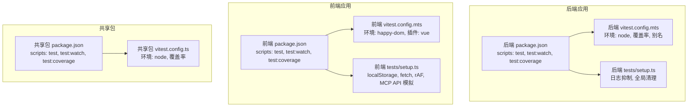
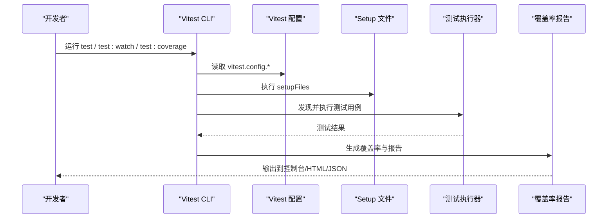
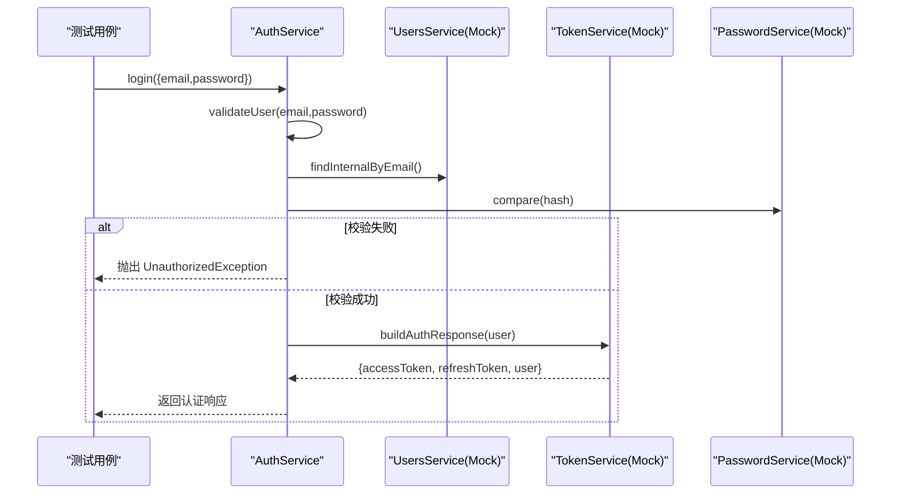
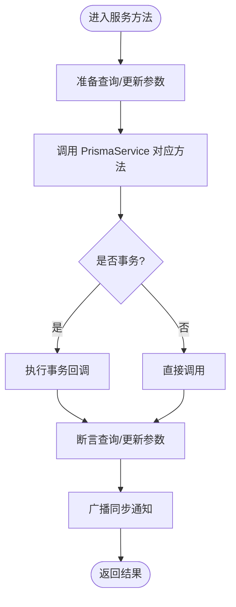
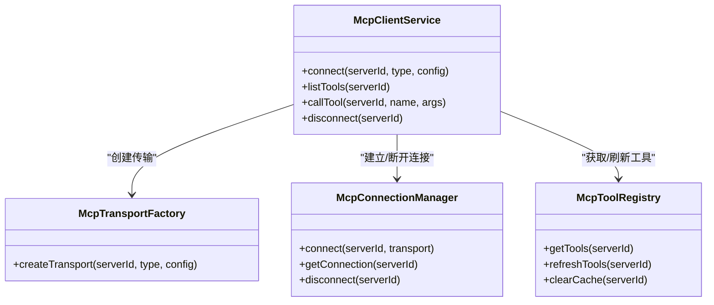
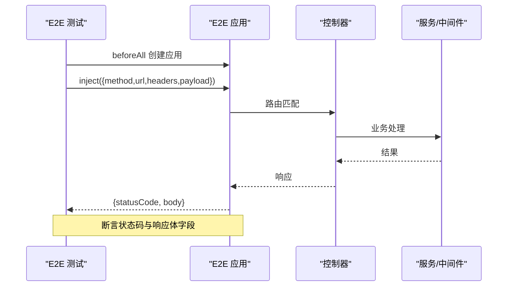
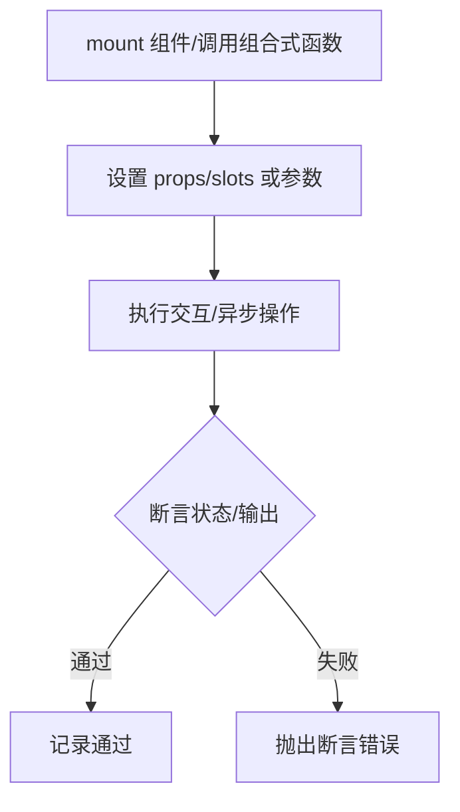
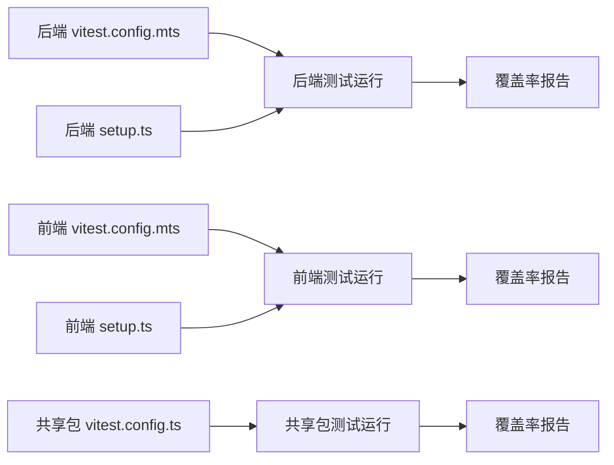

# 测试策略

<cite>
**本文引用的文件**
- [apps/backend/vitest.config.mts](file://apps/backend/vitest.config.mts)
- [apps/frontend/vitest.config.mts](file://apps/frontend/vitest.config.mts)
- [packages/shared/vitest.config.ts](file://packages/shared/vitest.config.ts)
- [apps/backend/tests/setup.ts](file://apps/backend/tests/setup.ts)
- [apps/frontend/tests/setup.ts](file://apps/frontend/tests/setup.ts)
- [apps/backend/package.json](file://apps/backend/package.json)
- [apps/frontend/package.json](file://apps/frontend/package.json)
- [packages/shared/package.json](file://packages/shared/package.json)
- [apps/backend/tests/auth/auth.service.spec.ts](file://apps/backend/tests/auth/auth.service.spec.ts)
- [apps/backend/tests/todos.service.spec.ts](file://apps/backend/tests/todos.service.spec.ts)
- [apps/backend/tests/mcp/mcp-client.service.spec.ts](file://apps/backend/tests/mcp/mcp-client.service.spec.ts)
- [apps/backend/tests/e2e/auth.e2e.spec.ts](file://apps/backend/tests/e2e/auth.e2e.spec.ts)
- [apps/backend/tests/e2e/test-app.ts](file://apps/backend/tests/e2e/test-app.ts)
- [apps/frontend/tests/components/ui/button/Button.spec.ts](file://apps/frontend/tests/components/ui/button/Button.spec.ts)
- [apps/frontend/tests/composables/useRequest.spec.ts](file://apps/frontend/tests/composables/useRequest.spec.ts)
- [apps/frontend/tests/features/todo/stores/todo.source.spec.ts](file://apps/frontend/tests/features/todo/stores/todo.source.spec.ts)
- [apps/frontend/tests/api/index.spec.ts](file://apps/frontend/tests/api/index.spec.ts)
- [apps/frontend/tests/lib/utils.spec.ts](file://apps/frontend/tests/lib/utils.spec.ts)
</cite>

## 目录
1. [引言](#引言)
2. [项目结构](#项目结构)
3. [核心组件](#核心组件)
4. [架构总览](#架构总览)
5. [详细组件分析](#详细组件分析)
6. [依赖分析](#依赖分析)
7. [性能考虑](#性能考虑)
8. [故障排查指南](#故障排查指南)
9. [结论](#结论)
10. [附录](#附录)

## 引言
本测试策略文档面向 Lumina Todo 项目，系统化阐述单元测试、集成测试与端到端测试（E2E）的实施方法，覆盖后端（NestJS）、前端（Vue + Vite）与共享包（shared）。文档重点说明 Vitest 配置与使用规范、Mock/Stub 最佳实践、API 与集成测试方案、测试覆盖率与质量门禁、CI 中的测试自动化、性能与压力测试思路、测试数据管理与环境隔离，以及常见问题与调试技巧。

## 项目结构
项目采用多包工作区（monorepo），包含后端应用、前端应用与共享包，分别拥有独立的 Vitest 配置与测试脚本。测试组织遵循按功能域分层：单元测试位于各模块目录下，集成测试与 E2E 测试集中在 tests 目录中。

图表来源
- [apps/backend/vitest.config.mts:1-34](file://apps/backend/vitest.config.mts#L1-L34)
- [apps/frontend/vitest.config.mts:1-23](file://apps/frontend/vitest.config.mts#L1-L23)
- [packages/shared/vitest.config.ts:1-22](file://packages/shared/vitest.config.ts#L1-L22)
- [apps/backend/tests/setup.ts:1-65](file://apps/backend/tests/setup.ts#L1-L65)
- [apps/frontend/tests/setup.ts:1-134](file://apps/frontend/tests/setup.ts#L1-L134)
- [apps/backend/package.json:22-28](file://apps/backend/package.json#L22-L28)
- [apps/frontend/package.json:18-20](file://apps/frontend/package.json#L18-L20)
- [packages/shared/package.json:33-35](file://packages/shared/package.json#L33-L35)

章节来源
- [apps/backend/vitest.config.mts:1-34](file://apps/backend/vitest.config.mts#L1-L34)
- [apps/frontend/vitest.config.mts:1-23](file://apps/frontend/vitest.config.mts#L1-L23)
- [packages/shared/vitest.config.ts:1-22](file://packages/shared/vitest.config.ts#L1-L22)
- [apps/backend/tests/setup.ts:1-65](file://apps/backend/tests/setup.ts#L1-L65)
- [apps/frontend/tests/setup.ts:1-134](file://apps/frontend/tests/setup.ts#L1-L134)
- [apps/backend/package.json:22-28](file://apps/backend/package.json#L22-L28)
- [apps/frontend/package.json:18-20](file://apps/frontend/package.json#L18-L20)
- [packages/shared/package.json:33-35](file://packages/shared/package.json#L33-L35)

## 核心组件
- 后端测试核心
  - Vitest 配置：全局环境、覆盖率、别名、setupFiles。
  - 日志抑制：屏蔽框架输出与特定异常信息，减少噪音。
  - 测试脚本：run/watch/coverage。
- 前端测试核心
  - Vitest 配置：happy-dom 环境、Vue 插件、setupFiles。
  - 全局模拟：localStorage、fetch、requestAnimationFrame、matchMedia。
  - 测试脚本：run/watch/coverage。
- 共享包测试核心
  - Vitest 配置：纯 Node 环境，覆盖率。
  - 测试脚本：run/watch/coverage。

章节来源
- [apps/backend/vitest.config.mts:10-26](file://apps/backend/vitest.config.mts#L10-L26)
- [apps/frontend/vitest.config.mts:12-21](file://apps/frontend/vitest.config.mts#L12-L21)
- [packages/shared/vitest.config.ts:5-15](file://packages/shared/vitest.config.ts#L5-L15)
- [apps/backend/tests/setup.ts:3-64](file://apps/backend/tests/setup.ts#L3-L64)
- [apps/frontend/tests/setup.ts:37-133](file://apps/frontend/tests/setup.ts#L37-L133)
- [apps/backend/package.json:22-28](file://apps/backend/package.json#L22-L28)
- [apps/frontend/package.json:18-20](file://apps/frontend/package.json#L18-L20)
- [packages/shared/package.json:33-35](file://packages/shared/package.json#L33-L35)

## 架构总览
下图展示测试运行时的总体流程：Vitest 启动 → 加载配置与 setupFiles → 执行测试用例 → 生成覆盖率报告。

图表来源
- [apps/backend/vitest.config.mts:10-26](file://apps/backend/vitest.config.mts#L10-L26)
- [apps/frontend/vitest.config.mts:12-21](file://apps/frontend/vitest.config.mts#L12-L21)
- [packages/shared/vitest.config.ts:5-15](file://packages/shared/vitest.config.ts#L5-L15)
- [apps/backend/tests/setup.ts:1-65](file://apps/backend/tests/setup.ts#L1-L65)
- [apps/frontend/tests/setup.ts:1-134](file://apps/frontend/tests/setup.ts#L1-L134)

## 详细组件分析

### 后端：认证服务测试
- 目标：验证用户校验、登录、登出、刷新令牌等流程。
- 方法：对依赖进行 Mock（UsersService、TokenService、PasswordService），断言行为与返回值。
- 关键点：密码比较、令牌黑名单检查、会话失效判断、构建认证响应。

图表来源
- [apps/backend/tests/auth/auth.service.spec.ts:34-114](file://apps/backend/tests/auth/auth.service.spec.ts#L34-L114)

章节来源
- [apps/backend/tests/auth/auth.service.spec.ts:1-177](file://apps/backend/tests/auth/auth.service.spec.ts#L1-L177)

### 后端：待办服务测试（数据库层）
- 目标：验证待办 CRUD、回收站查询/恢复/永久删除、清空回收站等逻辑。
- 方法：通过 TestingModule 注入 Mock 的 PrismaService 与 EventsGateway，断言查询参数与事务调用。
- 关键点：事务包裹、软删除 Tombstone 写入、事件广播。

图表来源
- [apps/backend/tests/todos.service.spec.ts:30-47](file://apps/backend/tests/todos.service.spec.ts#L30-L47)

章节来源
- [apps/backend/tests/todos.service.spec.ts:1-168](file://apps/backend/tests/todos.service.spec.ts#L1-L168)

### 后端：MCP 客户端服务测试
- 目标：验证连接、工具列表、工具调用、断开连接等流程。
- 方法：Mock TransportFactory、ConnectionManager、ToolRegistry，断言调用链。
- 关键点：不存在服务器或工具时的错误处理。

图表来源
- [apps/backend/tests/mcp/mcp-client.service.spec.ts:10-66](file://apps/backend/tests/mcp/mcp-client.service.spec.ts#L10-L66)

章节来源
- [apps/backend/tests/mcp/mcp-client.service.spec.ts:1-144](file://apps/backend/tests/mcp/mcp-client.service.spec.ts#L1-L144)

### 后端：端到端测试（E2E）
- 目标：验证安全头校验、注册/登录/刷新/登出、令牌黑名单生效等端到端流程。
- 方法：使用 createE2eApp 构建内存数据库与服务，注入自定义 Cookie 与拦截器，通过 app.inject 发送请求。
- 关键点：X-Requested-With 校验、403/401 行为、响应体结构断言。

图表来源
- [apps/backend/tests/e2e/auth.e2e.spec.ts:11-28](file://apps/backend/tests/e2e/auth.e2e.spec.ts#L11-L28)
- [apps/backend/tests/e2e/test-app.ts:452-546](file://apps/backend/tests/e2e/test-app.ts#L452-L546)

章节来源
- [apps/backend/tests/e2e/auth.e2e.spec.ts:1-155](file://apps/backend/tests/e2e/auth.e2e.spec.ts#L1-L155)
- [apps/backend/tests/e2e/test-app.ts:1-547](file://apps/backend/tests/e2e/test-app.ts#L1-L547)

### 前端：组件与组合式函数测试
- UI 组件：使用 @vue/test-utils 挂载组件，断言插槽内容、属性与类名。
- 组合式函数：使用 useRequest，断言加载态、数据、错误处理、重试与类型支持。
- 工具函数：断言工具类合并与高亮逻辑。

图表来源
- [apps/frontend/tests/components/ui/button/Button.spec.ts:5-37](file://apps/frontend/tests/components/ui/button/Button.spec.ts#L5-L37)
- [apps/frontend/tests/composables/useRequest.spec.ts:10-115](file://apps/frontend/tests/composables/useRequest.spec.ts#L10-L115)
- [apps/frontend/tests/lib/utils.spec.ts:4-50](file://apps/frontend/tests/lib/utils.spec.ts#L4-L50)

章节来源
- [apps/frontend/tests/components/ui/button/Button.spec.ts:1-39](file://apps/frontend/tests/components/ui/button/Button.spec.ts#L1-L39)
- [apps/frontend/tests/composables/useRequest.spec.ts:1-117](file://apps/frontend/tests/composables/useRequest.spec.ts#L1-L117)
- [apps/frontend/tests/lib/utils.spec.ts:1-51](file://apps/frontend/tests/lib/utils.spec.ts#L1-L51)

### 前端：API 层与状态管理测试
- API 客户端：断言 axios 实例创建、拦截器安装、错误处理与重试逻辑。
- 令牌读取：从 localStorage/pinia 状态中读取 token，处理无效 JSON、缺失字段等边界场景。
- MCP API：全局 Mock，确保组件渲染与交互不依赖真实外部服务。

章节来源
- [apps/frontend/tests/api/index.spec.ts:1-204](file://apps/frontend/tests/api/index.spec.ts#L1-L204)
- [apps/frontend/tests/setup.ts:103-133](file://apps/frontend/tests/setup.ts#L103-L133)

## 依赖分析
- Vitest 配置与脚本
  - 后端：配置环境、覆盖率、别名、setupFiles；脚本 run/watch/coverage。
  - 前端：配置 happy-dom、Vue 插件、setupFiles；脚本 run/watch/coverage。
  - 共享包：纯 Node 环境与覆盖率。
- 测试隔离与耦合
  - 后端通过 TestingModule 注入 Mock，避免真实数据库与缓存。
  - 前端通过 setup.ts 提供全局模拟，降低第三方库副作用。
- 外部依赖与集成点
  - E2E 使用内存版 Prisma 与 Redis，确保可重复性与隔离性。

图表来源
- [apps/backend/vitest.config.mts:10-26](file://apps/backend/vitest.config.mts#L10-L26)
- [apps/frontend/vitest.config.mts:12-21](file://apps/frontend/vitest.config.mts#L12-L21)
- [packages/shared/vitest.config.ts:5-15](file://packages/shared/vitest.config.ts#L5-L15)
- [apps/backend/tests/setup.ts:1-65](file://apps/backend/tests/setup.ts#L1-L65)
- [apps/frontend/tests/setup.ts:1-134](file://apps/frontend/tests/setup.ts#L1-L134)

章节来源
- [apps/backend/vitest.config.mts:1-34](file://apps/backend/vitest.config.mts#L1-L34)
- [apps/frontend/vitest.config.mts:1-23](file://apps/frontend/vitest.config.mts#L1-L23)
- [packages/shared/vitest.config.ts:1-22](file://packages/shared/vitest.config.ts#L1-L22)
- [apps/backend/tests/setup.ts:1-65](file://apps/backend/tests/setup.ts#L1-L65)
- [apps/frontend/tests/setup.ts:1-134](file://apps/frontend/tests/setup.ts#L1-L134)

## 性能考虑
- 单测并发：配置 maxWorkers 以提升并行度，缩短测试时间。
- 快照与内存：E2E 使用内存版 Prisma/Redis，避免磁盘 IO 与网络延迟。
- 覆盖率粒度：按模块与功能域拆分覆盖率目标，避免过度关注整体阈值而忽略关键路径。
- CI 并行：在 CI 中按包并行执行测试，结合缓存加速依赖安装。

## 故障排查指南
- 控制台噪声过多
  - 后端：setup.ts 已屏蔽框架日志与特定异常输出，如需进一步过滤可在 setup 中扩展条件。
  - 前端：setup.ts 已屏蔽常见警告与重试信息，必要时增加条件。
- Mock 不生效
  - 确认模块导入顺序与 vi.mock 的作用范围；在 beforeEach 中 vi.clearAllMocks。
  - 前端注意模块热重载导致的 mock 失效，使用 vi.resetModules 或在测试中动态 import。
- E2E 请求被拦截
  - 确保请求携带正确的 X-Requested-With 头；检查 preHandler 钩子逻辑。
- 覆盖率不达标
  - 分析未覆盖分支与异常路径，补充针对边界条件的用例。
- 本地与 CI 差异
  - 统一 Node 版本与依赖版本；在 CI 中开启覆盖率上传与报告。

章节来源
- [apps/backend/tests/setup.ts:3-64](file://apps/backend/tests/setup.ts#L3-L64)
- [apps/frontend/tests/setup.ts:3-133](file://apps/frontend/tests/setup.ts#L3-L133)
- [apps/backend/tests/e2e/test-app.ts:505-520](file://apps/backend/tests/e2e/test-app.ts#L505-L520)

## 结论
本测试策略以 Vitest 为核心，结合 Mock/Stub、内存数据库与状态模拟，覆盖后端服务、前端组件与 API 层的关键路径，并通过 E2E 保障端到端行为正确性。建议在 CI 中强制覆盖率门槛与质量门禁，持续优化测试并行度与稳定性。

## 附录

### Vitest 配置与使用规范
- 后端
  - 环境：node；setupFiles 指向 tests/setup.ts；覆盖率 reporter 包含 text/json/html。
  - 别名：@ 指向 src，@lumina/shared 指向共享包入口。
- 前端
  - 环境：happy-dom；插件：@vitejs/plugin-vue；setupFiles 指向 tests/setup.ts。
  - 别名：@ 指向 src，@lumina/shared 指向共享包入口。
- 共享包
  - 环境：node；覆盖率 reporter 包含 text/json/html。

章节来源
- [apps/backend/vitest.config.mts:9-33](file://apps/backend/vitest.config.mts#L9-L33)
- [apps/frontend/vitest.config.mts:10-22](file://apps/frontend/vitest.config.mts#L10-L22)
- [packages/shared/vitest.config.ts:4-21](file://packages/shared/vitest.config.ts#L4-L21)

### 测试脚本与覆盖率
- 后端：test、test:watch、test:coverage。
- 前端：test、test:watch、test:coverage。
- 共享包：test、test:watch、test:coverage。

章节来源
- [apps/backend/package.json:22-28](file://apps/backend/package.json#L22-L28)
- [apps/frontend/package.json:18-20](file://apps/frontend/package.json#L18-L20)
- [packages/shared/package.json:33-35](file://packages/shared/package.json#L33-L35)

### Mock 与 Stub 最佳实践
- 后端：使用 TestingModule 注入 Mock 服务，断言调用参数与返回值；对数据库层使用内存版 Prisma。
- 前端：在 setup.ts 中统一模拟全局对象；对第三方库使用 vi.mock；对组件使用 mount 渲染。
- E2E：通过 createE2eApp 构建最小化应用，仅保留必要中间件与拦截器。

章节来源
- [apps/backend/tests/todos.service.spec.ts:30-47](file://apps/backend/tests/todos.service.spec.ts#L30-L47)
- [apps/frontend/tests/setup.ts:37-133](file://apps/frontend/tests/setup.ts#L37-L133)
- [apps/backend/tests/e2e/test-app.ts:452-546](file://apps/backend/tests/e2e/test-app.ts#L452-L546)

### API 与集成测试方案
- 后端：控制器与服务分离测试；通过 TestingModule 注入 Mock；E2E 使用 app.inject 发送请求。
- 前端：API 客户端拦截器测试；令牌读取与状态管理测试；MCP API 全局 Mock。

章节来源
- [apps/backend/tests/auth/auth.service.spec.ts:34-114](file://apps/backend/tests/auth/auth.service.spec.ts#L34-L114)
- [apps/backend/tests/e2e/auth.e2e.spec.ts:11-28](file://apps/backend/tests/e2e/auth.e2e.spec.ts#L11-L28)
- [apps/frontend/tests/api/index.spec.ts:1-204](file://apps/frontend/tests/api/index.spec.ts#L1-L204)

### 测试覆盖率与质量门禁
- 覆盖率配置：v8 提供器，输出 text/json/html；排除 d.ts、main.ts、dist、node_modules。
- 建议门禁：按模块设定最小覆盖率阈值（如 80%），对关键路径（认证、同步、存储）提高阈值。
- CI 集成：在流水线中执行 test:coverage 并上传报告至覆盖率平台。

章节来源
- [apps/backend/vitest.config.mts:21-25](file://apps/backend/vitest.config.mts#L21-L25)
- [apps/frontend/vitest.config.mts:12-21](file://apps/frontend/vitest.config.mts#L12-L21)
- [packages/shared/vitest.config.ts:10-14](file://packages/shared/vitest.config.ts#L10-L14)

### 持续集成中的测试自动化
- 并行执行：按包并行运行 test 与 test:coverage。
- 缓存优化：缓存 node_modules 与构建产物，加速依赖安装。
- 报告与门禁：上传覆盖率报告，失败时阻止合并。

章节来源
- [apps/backend/package.json:22-28](file://apps/backend/package.json#L22-L28)
- [apps/frontend/package.json:18-20](file://apps/frontend/package.json#L18-L20)
- [packages/shared/package.json:33-35](file://packages/shared/package.json#L33-L35)

### 性能测试与压力测试
- 单元与集成：优先保证用例执行速度，避免长耗时任务；对异步逻辑使用定时器控制。
- E2E：使用内存版依赖，减少 IO；限制并发请求数量。
- 压力测试：在独立环境使用工具（如 k6/Artillery）对关键接口进行压力验证，结合日志与指标监控。

[本节为通用指导，无需具体文件引用]

### 测试数据管理与环境隔离
- 内存数据库：E2E 使用内存版 Prisma 与 Redis，确保每次测试前后的状态一致。
- 环境变量：通过 createConfigService 注入测试专用配置（如 JWT 密钥、过期时间）。
- 状态隔离：在 setup.ts 中清理全局状态（localStorage、fetch、raf）。

章节来源
- [apps/backend/tests/e2e/test-app.ts:138-426](file://apps/backend/tests/e2e/test-app.ts#L138-L426)
- [apps/frontend/tests/setup.ts:85-101](file://apps/frontend/tests/setup.ts#L85-L101)

### 测试调试技巧与常见问题
- 使用 beforeEach 清理 Mock 状态，避免跨用例污染。
- 在前端测试中，对动态导入使用 vi.resetModules，确保每次导入都是最新状态。
- 对 E2E，打印 app.inject 的 payload 与响应体，便于定位请求/响应问题。
- 遇到“未捕获异常”或“超时”，检查拦截器与异步逻辑，必要时增加超时与重试策略。

章节来源
- [apps/frontend/tests/composables/useRequest.spec.ts:6-9](file://apps/frontend/tests/composables/useRequest.spec.ts#L6-L9)
- [apps/frontend/tests/setup.ts:85-101](file://apps/frontend/tests/setup.ts#L85-L101)
- [apps/backend/tests/e2e/test-app.ts:527-543](file://apps/backend/tests/e2e/test-app.ts#L527-L543)