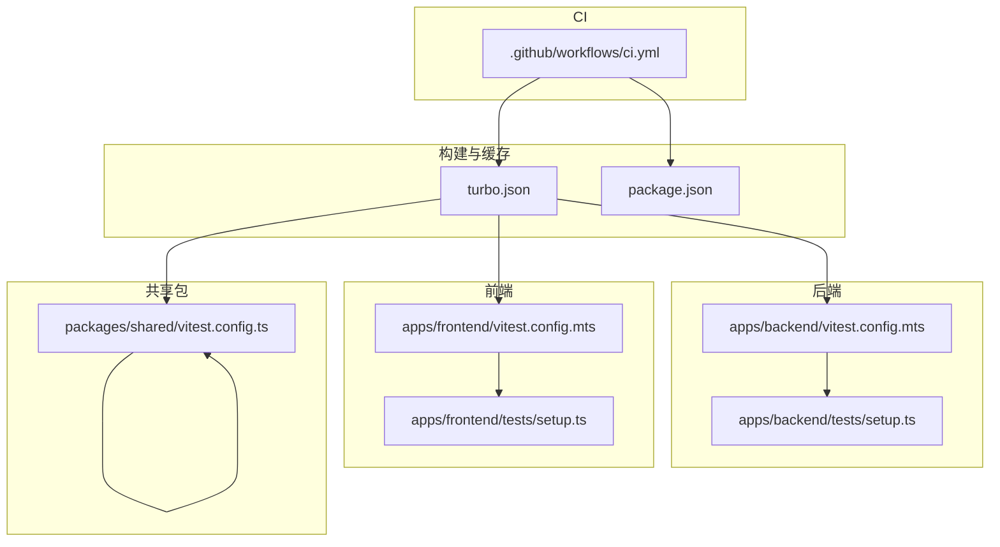
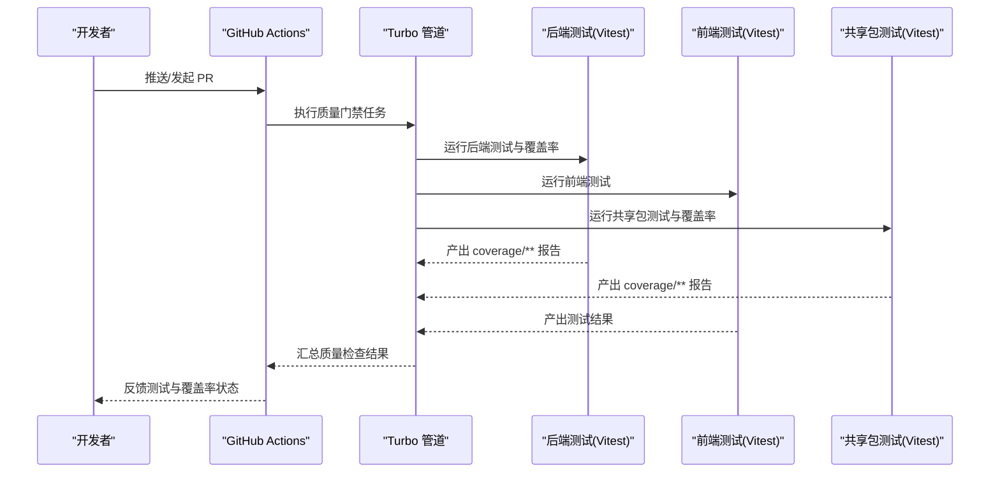
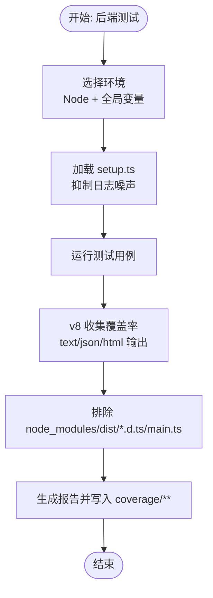
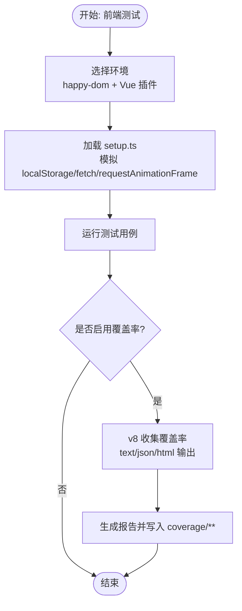
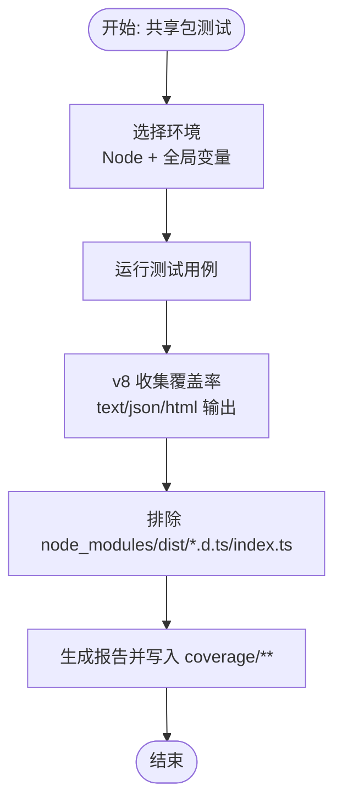
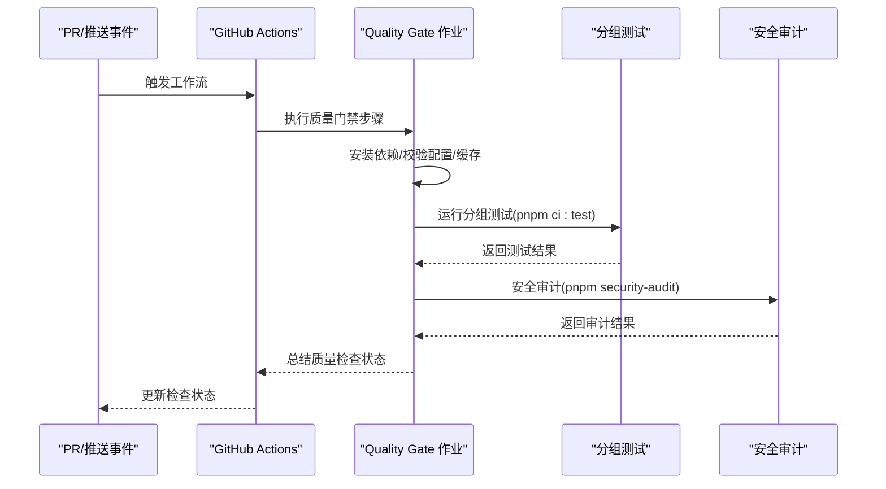
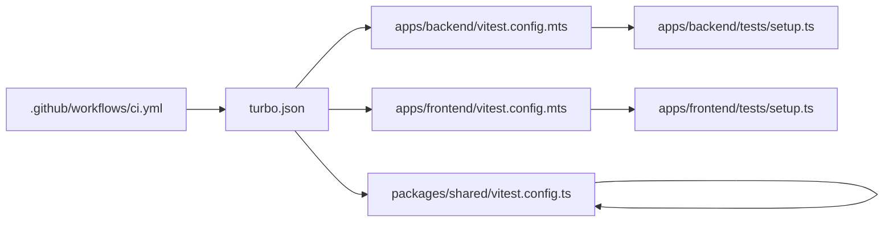

# 测试覆盖率与质量门禁

<cite>
**本文档引用的文件**
- [apps/backend/vitest.config.mts](file://apps/backend/vitest.config.mts)
- [apps/frontend/vitest.config.mts](file://apps/frontend/vitest.config.mts)
- [packages/shared/vitest.config.ts](file://packages/shared/vitest.config.ts)
- [apps/backend/tests/setup.ts](file://apps/backend/tests/setup.ts)
- [apps/frontend/tests/setup.ts](file://apps/frontend/tests/setup.ts)
- [.github/workflows/ci.yml](file://.github/workflows/ci.yml)
- [turbo.json](file://turbo.json)
- [package.json](file://package.json)
- [apps/backend/tests/auth/auth.service.spec.ts](file://apps/backend/tests/auth/auth.service.spec.ts)
- [apps/frontend/tests/features/todo/TodoView.animation.spec.ts](file://apps/frontend/tests/features/todo/TodoView.animation.spec.ts)
</cite>

## 目录
1. [简介](#简介)
2. [项目结构](#项目结构)
3. [核心组件](#核心组件)
4. [架构总览](#架构总览)
5. [详细组件分析](#详细组件分析)
6. [依赖关系分析](#依赖关系分析)
7. [性能考量](#性能考量)
8. [故障排查指南](#故障排查指南)
9. [结论](#结论)
10. [附录](#附录)

## 简介
本指南面向工程团队，系统阐述本仓库在多包（后端 NestJS、前端 Vue、共享包）下的测试覆盖率与质量门禁落地实践。内容涵盖覆盖率计算方法、报告生成与格式、不同测试类型的要求与阈值建议、质量门禁标准与自动化检查流程、覆盖率配置与报告定制、分支/行/函数覆盖率的差异与重要性、持续集成中的覆盖率检查与报告发布、覆盖率回归与趋势分析、低覆盖率代码识别与改进策略、覆盖率优化技巧与最佳实践，以及覆盖率数据可视化与团队协作工具集成建议。

## 项目结构
本仓库采用 monorepo 结构，包含后端、前端、共享包三个主要应用，分别使用 Vitest 进行单元测试与覆盖率收集，并通过 Turbo 管道统一执行测试与构建任务。质量门禁由 GitHub Actions 工作流驱动，串联“格式校验 + Lint + 类型检查 + 分组测试 + 安全审计”。

**图表来源**
- [apps/backend/vitest.config.mts:1-34](file://apps/backend/vitest.config.mts#L1-L34)
- [apps/frontend/vitest.config.mts:1-23](file://apps/frontend/vitest.config.mts#L1-L23)
- [packages/shared/vitest.config.ts:1-22](file://packages/shared/vitest.config.ts#L1-L22)
- [.github/workflows/ci.yml:1-139](file://.github/workflows/ci.yml#L1-L139)
- [turbo.json:1-186](file://turbo.json#L1-L186)
- [package.json:1-133](file://package.json#L1-L133)

**章节来源**
- [apps/backend/vitest.config.mts:1-34](file://apps/backend/vitest.config.mts#L1-L34)
- [apps/frontend/vitest.config.mts:1-23](file://apps/frontend/vitest.config.mts#L1-L23)
- [packages/shared/vitest.config.ts:1-22](file://packages/shared/vitest.config.ts#L1-L22)
- [.github/workflows/ci.yml:1-139](file://.github/workflows/ci.yml#L1-L139)
- [turbo.json:1-186](file://turbo.json#L1-L186)
- [package.json:1-133](file://package.json#L1-L133)

## 核心组件
- 覆盖率提供器与报告器：后端与共享包使用 v8 提供器，报告器包含 text、json、html；前端使用 happy-dom 环境，未启用覆盖率（需按需开启）。
- 测试环境与别名：后端使用 Node 环境与全局 setup；前端使用 happy-dom 并配置别名与插件。
- CI 质量门禁：工作流中包含“格式 + Lint + 类型检查 + 分组测试 + 安全审计”的质量检查阶段。
- Turbo 任务：定义了 test 与 test:coverage 任务输出目录为 coverage/**，便于缓存与产物定位。

**章节来源**
- [apps/backend/vitest.config.mts:21-26](file://apps/backend/vitest.config.mts#L21-L26)
- [packages/shared/vitest.config.ts:10-15](file://packages/shared/vitest.config.ts#L10-L15)
- [apps/frontend/vitest.config.mts:10-22](file://apps/frontend/vitest.config.mts#L10-L22)
- [.github/workflows/ci.yml:77-84](file://.github/workflows/ci.yml#L77-L84)
- [turbo.json:29-36](file://turbo.json#L29-L36)

## 架构总览
下图展示从 CI 触发到测试执行与覆盖率产出的整体流程，包括任务编排、覆盖率生成与产物输出。

**图表来源**
- [.github/workflows/ci.yml:25-84](file://.github/workflows/ci.yml#L25-L84)
- [turbo.json:29-36](file://turbo.json#L29-L36)
- [apps/backend/vitest.config.mts:21-26](file://apps/backend/vitest.config.mts#L21-L26)
- [packages/shared/vitest.config.ts:10-15](file://packages/shared/vitest.config.ts#L10-L15)

## 详细组件分析

### 后端覆盖率配置与报告
- 提供器：v8
- 报告器：text、json、html
- 排除规则：node_modules、dist、类型声明文件、入口文件等
- 环境：Node，全局变量可用，setup 文件用于抑制日志噪声
- 别名：@ 指向 src，@lumina/shared 指向共享包入口

**图表来源**
- [apps/backend/vitest.config.mts:10-26](file://apps/backend/vitest.config.mts#L10-L26)
- [apps/backend/tests/setup.ts:1-65](file://apps/backend/tests/setup.ts#L1-L65)

**章节来源**
- [apps/backend/vitest.config.mts:10-26](file://apps/backend/vitest.config.mts#L10-L26)
- [apps/backend/tests/setup.ts:1-65](file://apps/backend/tests/setup.ts#L1-L65)

### 前端覆盖率配置与报告
- 环境：happy-dom
- 插件：Vue 插件
- 别名：@ 指向 src，@lumina/shared 指向共享包入口
- 当前未启用覆盖率（可通过在 vitest.config.mts 中添加 coverage 字段启用）

**图表来源**
- [apps/frontend/vitest.config.mts:10-22](file://apps/frontend/vitest.config.mts#L10-L22)
- [apps/frontend/tests/setup.ts:1-134](file://apps/frontend/tests/setup.ts#L1-L134)

**章节来源**
- [apps/frontend/vitest.config.mts:10-22](file://apps/frontend/vitest.config.mts#L10-L22)
- [apps/frontend/tests/setup.ts:1-134](file://apps/frontend/tests/setup.ts#L1-L134)

### 共享包覆盖率配置与报告
- 提供器：v8
- 报告器：text、json、html
- 排除规则：node_modules、dist、类型声明文件、入口索引文件
- 别名：@ 指向 src

**图表来源**
- [packages/shared/vitest.config.ts:4-15](file://packages/shared/vitest.config.ts#L4-L15)

**章节来源**
- [packages/shared/vitest.config.ts:4-15](file://packages/shared/vitest.config.ts#L4-L15)

### CI 质量门禁与自动化检查
- 触发条件：PR 打开/同步/重新打开/就绪审查，或推送至 main/develop
- 步骤：
  - 检出代码
  - 安装 pnpm 与 Node.js
  - 安装依赖
  - 校验 Docker Compose 配置
  - 校验生产镜像引用可复现性
  - 配置 Turbo 缓存
  - 生成 Prisma Client
  - 运行分组质量检查（格式 + Lint + 类型）
  - 运行分组测试
  - 安全审计

**图表来源**
- [.github/workflows/ci.yml:25-84](file://.github/workflows/ci.yml#L25-L84)

**章节来源**
- [.github/workflows/ci.yml:25-84](file://.github/workflows/ci.yml#L25-L84)

### 测试类型与覆盖率要求建议
- 单元测试（Unit）：面向函数/服务/模块内部逻辑，建议行覆盖率≥80%，分支覆盖率≥60%；对关键路径与异常分支应重点覆盖。
- 集成测试（Integration）：面向模块间交互，建议行覆盖率≥70%，分支覆盖率≥50%。
- E2E 测试（End-to-End）：面向用户场景链路，建议行覆盖率≥60%，分支覆盖率≥40%。
- 注意：以上阈值为通用建议，实际应结合业务风险与历史趋势设定团队级门禁。

### 覆盖率报告生成与格式定制
- 后端与共享包：默认生成 text、json、html 报告，输出至 coverage/**。
- 前端：当前未启用覆盖率，如需启用可在 vitest.config.mts 中添加 coverage 字段并配置 reporter。
- 报告格式：
  - text：控制台摘要
  - json：机器可读，便于趋势分析与平台集成
  - html：人类可读，便于定位未覆盖文件与行号

**章节来源**
- [apps/backend/vitest.config.mts:21-26](file://apps/backend/vitest.config.mts#L21-L26)
- [packages/shared/vitest.config.ts:10-15](file://packages/shared/vitest.config.ts#L10-L15)
- [apps/frontend/vitest.config.mts:10-22](file://apps/frontend/vitest.config.mts#L10-L22)

### 分支覆盖率、行覆盖率与函数覆盖率的区别与重要性
- 行覆盖率（Line Coverage）：已执行的代码行占总代码行的比例。衡量“是否覆盖到每行”。
- 分支覆盖率（Branch Coverage）：已执行的分支（if/else、三元等）占总分支的比例。衡量“是否覆盖到每个判断分支”。
- 函数覆盖率（Function Coverage）：已执行的函数占总函数的比例。衡量“是否调用了每个函数”。
- 实践建议：
  - 优先保证分支覆盖率，以确保关键判断路径被验证；
  - 行覆盖率作为基础指标，避免遗漏；
  - 函数覆盖率辅助确认公共工具与服务的调用完整性。

### 持续集成中的覆盖率检查与报告发布
- 在 CI 的“质量门禁”作业中，通过 Turbo 统一执行测试与覆盖率生成，产物输出到 coverage/**。
- 建议在 CI 中增加覆盖率门禁步骤（例如基于 json 报告解析阈值），并在 PR 中展示覆盖率摘要。
- 报告发布：可将 html 报告上传为工件或发布到内部站点，便于团队查阅。

**章节来源**
- [.github/workflows/ci.yml:77-84](file://.github/workflows/ci.yml#L77-L84)
- [turbo.json:29-36](file://turbo.json#L29-L36)

### 覆盖率回归测试与趋势分析
- 回归测试：在每次提交或 PR 中对比覆盖率变化，若下降则阻断合并或触发提醒。
- 趋势分析：定期导出 json 报告，统计行/分支覆盖率月度/季度趋势，识别退化热点模块。
- 工具建议：使用外部平台（如 codecov/codeclimate）聚合多源报告，形成可视化看板。

### 低覆盖率代码识别与改进策略
- 识别手段：
  - 查看 html 报告中标记为未覆盖的行与文件；
  - 使用 json 报告筛选低覆盖率模块；
  - 关注高复杂度函数与异常分支缺失的模块。
- 改进策略：
  - 为未覆盖分支补充单元测试；
  - 将复杂逻辑拆分为更小的纯函数并单独测试；
  - 引入边界条件与异常场景测试；
  - 对于外部依赖，使用适配层或桩对象隔离测试。

### 覆盖率优化技巧与最佳实践
- 优化技巧：
  - 合理拆分测试文件，聚焦单一职责；
  - 使用测试夹具与工厂模式减少重复代码；
  - 对异步逻辑使用合理的等待与清理；
  - 在 setup 中统一模拟全局依赖，避免跨用例副作用。
- 最佳实践：
  - 将覆盖率门禁纳入 CI 必须项；
  - 为关键模块设定最小覆盖率阈值；
  - 定期回顾与更新阈值，平衡质量与效率；
  - 将覆盖率报告与 PR 检查联动，提升反馈及时性。

### 覆盖率数据可视化与团队协作工具集成
- 可视化：利用 html 报告生成模块级/文件级热力图，标注高风险区域。
- 工具集成：
  - 将 json 报告上传至第三方平台（如 codecov/codeclimate）进行趋势与 PR 状态展示；
  - 在 PR 描述中嵌入覆盖率摘要链接；
  - 与项目管理工具联动，将覆盖率目标纳入迭代计划。

## 依赖关系分析
- 覆盖率配置依赖：
  - Vitest 配置文件决定提供器、报告器与排除规则；
  - Turbo 任务定义测试与覆盖率产物输出目录；
  - CI 工作流串联质量检查与测试执行。
- 测试环境依赖：
  - 后端使用 Node 环境与全局 setup；
  - 前端使用 happy-dom 环境与 Vue 插件；
  - 共享包使用 Node 环境与最小化排除规则。

**图表来源**
- [apps/backend/vitest.config.mts:10-26](file://apps/backend/vitest.config.mts#L10-L26)
- [apps/frontend/vitest.config.mts:10-22](file://apps/frontend/vitest.config.mts#L10-L22)
- [packages/shared/vitest.config.ts:4-15](file://packages/shared/vitest.config.ts#L4-L15)
- [.github/workflows/ci.yml:25-84](file://.github/workflows/ci.yml#L25-L84)
- [turbo.json:29-36](file://turbo.json#L29-L36)

**章节来源**
- [apps/backend/vitest.config.mts:10-26](file://apps/backend/vitest.config.mts#L10-L26)
- [apps/frontend/vitest.config.mts:10-22](file://apps/frontend/vitest.config.mts#L10-L22)
- [packages/shared/vitest.config.ts:4-15](file://packages/shared/vitest.config.ts#L4-L15)
- [.github/workflows/ci.yml:25-84](file://.github/workflows/ci.yml#L25-L84)
- [turbo.json:29-36](file://turbo.json#L29-L36)

## 性能考量
- 并发与缓存：Turbo 通过并发与缓存显著缩短测试与构建时间；建议在本地与 CI 中保持一致的并发策略。
- 排除规则：合理排除 node_modules、dist、类型声明与入口文件，减少覆盖率扫描开销。
- 前端覆盖率：如启用覆盖率，建议仅在 CI 或特定任务中开启，避免本地开发时的额外开销。

## 故障排查指南
- 日志噪声影响：
  - 后端通过 setup.ts 抑制 Nest 日志与特定认证错误输出，避免干扰覆盖率统计。
  - 前端通过 setup.ts 模拟 localStorage、fetch、requestAnimationFrame，并抑制部分警告信息。
- 常见问题定位：
  - 覆盖率报告为空：检查 vitest.config 是否正确配置 coverage 字段与 reporter。
  - 前端测试失败：确认 happy-dom 环境与插件安装，以及 setup.ts 中的全局模拟是否完整。
  - CI 失败：检查质量门禁步骤顺序与依赖安装，确认 Turbo 缓存命中情况。

**章节来源**
- [apps/backend/tests/setup.ts:1-65](file://apps/backend/tests/setup.ts#L1-L65)
- [apps/frontend/tests/setup.ts:1-134](file://apps/frontend/tests/setup.ts#L1-L134)

## 结论
本仓库已在多包环境下建立了完善的测试与覆盖率基础：后端与共享包使用 v8 提供器与多格式报告，前端具备启用覆盖率的能力，CI 工作流串联质量检查与测试执行。建议在现有基础上引入覆盖率门禁阈值、趋势分析与可视化集成，持续提升代码质量与交付稳定性。

## 附录
- 示例参考用例路径（不展示具体代码）：
  - 后端服务测试示例：[apps/backend/tests/auth/auth.service.spec.ts:1-177](file://apps/backend/tests/auth/auth.service.spec.ts#L1-L177)
  - 前端组件动画测试示例：[apps/frontend/tests/features/todo/TodoView.animation.spec.ts:1-151](file://apps/frontend/tests/features/todo/TodoView.animation.spec.ts#L1-L151)