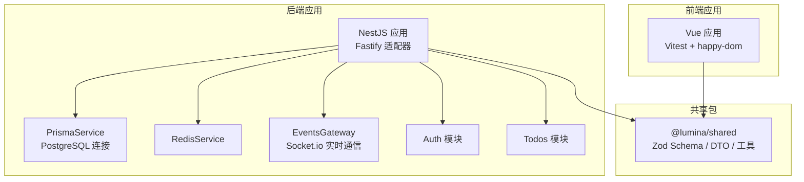
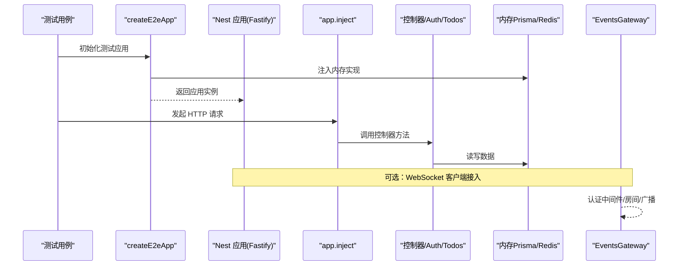
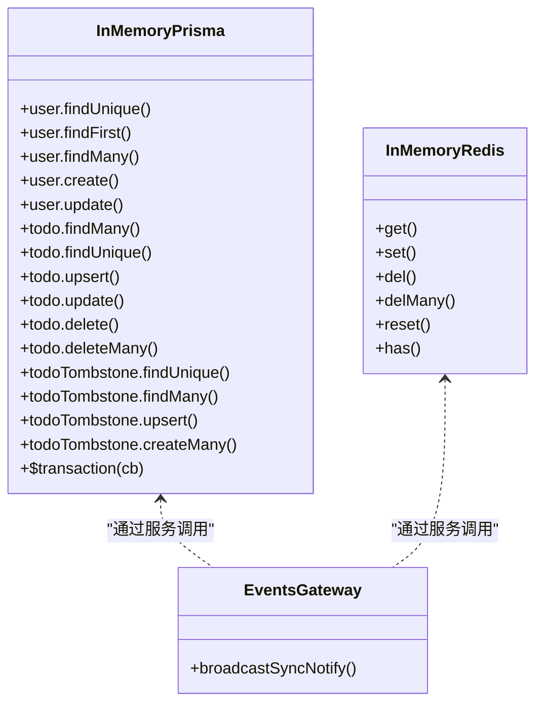
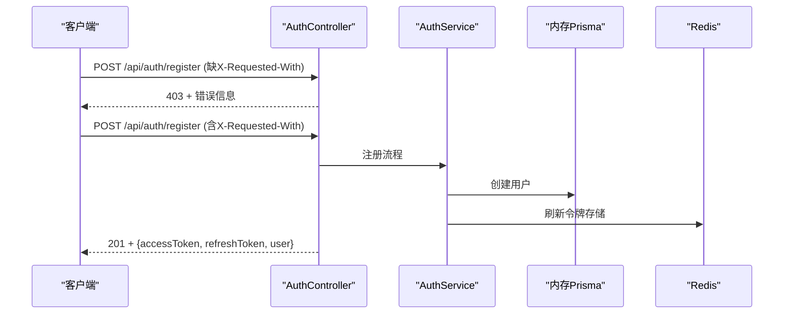
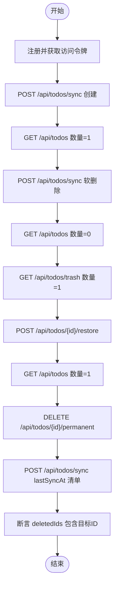
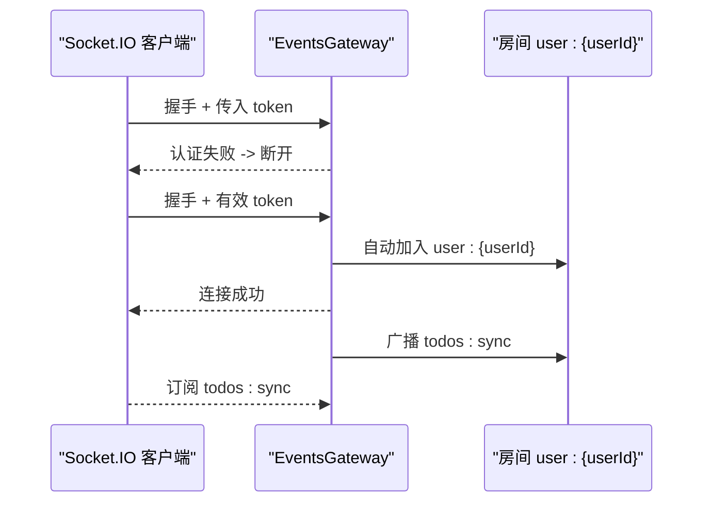
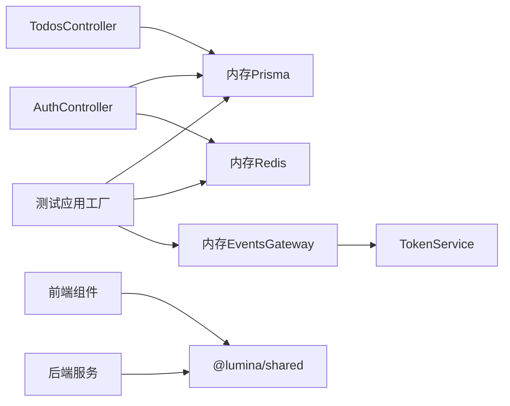

# 集成测试

<cite>
**本文引用的文件**
- [apps/backend/tests/e2e/test-app.ts](file://apps/backend/tests/e2e/test-app.ts)
- [apps/backend/tests/e2e/auth.e2e.spec.ts](file://apps/backend/tests/e2e/auth.e2e.spec.ts)
- [apps/backend/tests/e2e/todos.e2e.spec.ts](file://apps/backend/tests/e2e/todos.e2e.spec.ts)
- [apps/backend/tests/setup.ts](file://apps/backend/tests/setup.ts)
- [apps/frontend/tests/setup.ts](file://apps/frontend/tests/setup.ts)
- [apps/backend/vitest.config.mts](file://apps/backend/vitest.config.mts)
- [apps/frontend/vitest.config.mts](file://apps/frontend/vitest.config.mts)
- [apps/backend/src/events/events.gateway.ts](file://apps/backend/src/events/events.gateway.ts)
- [apps/backend/src/prisma/prisma.service.ts](file://apps/backend/src/prisma/prisma.service.ts)
- [apps/backend/src/prisma/prisma.module.ts](file://apps/backend/src/prisma/prisma.module.ts)
- [apps/backend/prisma/schema/todo.prisma](file://apps/backend/prisma/schema/todo.prisma)
- [apps/backend/prisma/schema/user.prisma](file://apps/backend/prisma/schema/user.prisma)
- [packages/shared/src/index.ts](file://packages/shared/src/index.ts)
</cite>

## 目录
1. [引言](#引言)
2. [项目结构](#项目结构)
3. [核心组件](#核心组件)
4. [架构总览](#架构总览)
5. [详细组件分析](#详细组件分析)
6. [依赖分析](#依赖分析)
7. [性能考虑](#性能考虑)
8. [故障排除指南](#故障排除指南)
9. [结论](#结论)
10. [附录](#附录)

## 引言
本指南面向需要在多应用、多模块、多技术栈（后端 NestJS、前端 Vue、共享包）环境下落地“端到端集成测试”的工程团队。文档基于仓库现有实现，系统阐述以下主题：
- 端到端测试设计原则与实现方法
- 数据库集成测试、API 集成测试、组件集成测试策略
- 测试环境搭建与数据库种子数据准备
- WebSocket 通信与实时功能测试方法
- 第三方服务集成测试的模拟与断言
- 跨应用与共享包测试实施方案
- 测试数据管理与状态清理策略
- 测试稳定性保障与 flaky test 处理
- 集成测试调试与故障排除技巧
- 测试性能监控与结果分析方法

## 项目结构
本项目采用 Monorepo 结构，包含：
- 后端应用（NestJS + Fastify + Prisma + Redis + Socket.io）
- 前端应用（Vue + Vite + Vitest + happy-dom）
- 共享包（Zod Schema、DTO、工具函数）

图表来源
- [apps/backend/src/prisma/prisma.service.ts:1-34](file://apps/backend/src/prisma/prisma.service.ts#L1-L34)
- [apps/backend/src/prisma/prisma.module.ts:1-10](file://apps/backend/src/prisma/prisma.module.ts#L1-L10)
- [apps/backend/src/events/events.gateway.ts:1-266](file://apps/backend/src/events/events.gateway.ts#L1-L266)
- [apps/backend/tests/e2e/test-app.ts:452-547](file://apps/backend/tests/e2e/test-app.ts#L452-L547)
- [packages/shared/src/index.ts:1-22](file://packages/shared/src/index.ts#L1-L22)

章节来源
- [apps/backend/vitest.config.mts:1-34](file://apps/backend/vitest.config.mts#L1-L34)
- [apps/frontend/vitest.config.mts:1-23](file://apps/frontend/vitest.config.mts#L1-L23)

## 核心组件
- 测试应用工厂与内存数据库
  - 使用内存版 Prisma 与 Redis，替代真实数据库与缓存，提升可重复性与速度
  - 提供内存版 EventsGateway 的最小化实现，便于 WebSocket 场景测试
- E2E 测试套件
  - 认证流程与安全头校验
  - 待办事项 CRUD、回收站与永久删除、版本与时间戳一致性
- 前后端测试配置
  - 后端 Vitest 配置与日志抑制
  - 前端 Vitest 配置与 DOM/Storage/MCP API 模拟
- 共享包
  - 统一的 Zod Schema 与 DTO，确保前后端契约一致

章节来源
- [apps/backend/tests/e2e/test-app.ts:1-547](file://apps/backend/tests/e2e/test-app.ts#L1-L547)
- [apps/backend/tests/e2e/auth.e2e.spec.ts:1-155](file://apps/backend/tests/e2e/auth.e2e.spec.ts#L1-L155)
- [apps/backend/tests/e2e/todos.e2e.spec.ts:1-203](file://apps/backend/tests/e2e/todos.e2e.spec.ts#L1-L203)
- [apps/backend/tests/setup.ts:1-65](file://apps/backend/tests/setup.ts#L1-L65)
- [apps/frontend/tests/setup.ts:1-134](file://apps/frontend/tests/setup.ts#L1-L134)
- [packages/shared/src/index.ts:1-22](file://packages/shared/src/index.ts#L1-L22)

## 架构总览
下图展示端到端测试的运行时架构：测试通过内存版依赖注入构建最小化 Nest 应用，使用 Fastify 注入器发起 HTTP 请求，并在需要时建立 Socket.io 连接进行实时通信。

图表来源
- [apps/backend/tests/e2e/test-app.ts:452-547](file://apps/backend/tests/e2e/test-app.ts#L452-L547)
- [apps/backend/src/events/events.gateway.ts:86-145](file://apps/backend/src/events/events.gateway.ts#L86-L145)

## 详细组件分析

### 测试应用工厂与内存数据库
- 内存 Prisma
  - 提供 user/todo/todoTombstone 的查询/增删改查与事务封装，满足端到端测试的数据一致性需求
  - 支持 select 投影与版本号自增等业务逻辑
- 内存 Redis
  - 提供 get/set/del/reset/has 等常用接口，支持 TTL 与前缀
- 内存 EventsGateway
  - 提供 broadcastSyncNotify 占位实现，便于测试实时广播触发点
- 配置与安全钩子
  - 注册 Cookie 插件与预处理钩子，强制 X-Requested-With 安全校验，阻断非 AJAX 请求

图表来源
- [apps/backend/tests/e2e/test-app.ts:138-359](file://apps/backend/tests/e2e/test-app.ts#L138-L359)
- [apps/backend/tests/e2e/test-app.ts:361-406](file://apps/backend/tests/e2e/test-app.ts#L361-L406)
- [apps/backend/tests/e2e/test-app.ts:443-450](file://apps/backend/tests/e2e/test-app.ts#L443-L450)

章节来源
- [apps/backend/tests/e2e/test-app.ts:1-547](file://apps/backend/tests/e2e/test-app.ts#L1-L547)

### 认证与安全头校验（E2E）
- 行为要点
  - 非 GET 请求若缺少 X-Requested-With 头，返回 403
  - 查询字符串中的路径片段无法绕过校验
  - 注册/登录/刷新/登出流程与黑名单刷新令牌校验
- 断言策略
  - 状态码 + 响应体字段校验
  - 使用共享 DTO 解包响应体，确保契约一致

图表来源
- [apps/backend/tests/e2e/test-app.ts:505-520](file://apps/backend/tests/e2e/test-app.ts#L505-L520)
- [apps/backend/tests/e2e/auth.e2e.spec.ts:30-62](file://apps/backend/tests/e2e/auth.e2e.spec.ts#L30-L62)
- [apps/backend/tests/e2e/auth.e2e.spec.ts:64-153](file://apps/backend/tests/e2e/auth.e2e.spec.ts#L64-L153)

章节来源
- [apps/backend/tests/e2e/auth.e2e.spec.ts:1-155](file://apps/backend/tests/e2e/auth.e2e.spec.ts#L1-L155)
- [apps/backend/tests/e2e/test-app.ts:1-547](file://apps/backend/tests/e2e/test-app.ts#L1-L547)

### 待办事项同步与回收站（E2E）
- 行为要点
  - 通过 /api/todos/sync 批量同步待办，返回 synced 与 deletedIds
  - 支持软删除（trash）、回收站列表、恢复（restore）、永久删除（permanent）
  - 版本号与时间戳一致性校验
- 断言策略
  - 校验 synced 数组长度/字段、deletedIds 包含关系
  - GET /api/todos 与 /api/todos/trash 的数量变化

图表来源
- [apps/backend/tests/e2e/todos.e2e.spec.ts:37-201](file://apps/backend/tests/e2e/todos.e2e.spec.ts#L37-L201)

章节来源
- [apps/backend/tests/e2e/todos.e2e.spec.ts:1-203](file://apps/backend/tests/e2e/todos.e2e.spec.ts#L1-L203)

### WebSocket 通信与实时功能测试
- 网关特性
  - CORS 白名单、认证中间件、房间权限校验、广播防抖
  - 提供 broadcastSyncNotify 用于向用户房间广播 todos:sync 事件
- 测试建议
  - 使用 Socket.io 客户端连接 /events 命名空间，携带访问令牌
  - 认证失败时断开连接；房间名 user:{userId} 仅允许本人进入
  - 观察广播频率与去抖效果，避免风暴

图表来源
- [apps/backend/src/events/events.gateway.ts:86-145](file://apps/backend/src/events/events.gateway.ts#L86-L145)
- [apps/backend/src/events/events.gateway.ts:177-202](file://apps/backend/src/events/events.gateway.ts#L177-L202)

章节来源
- [apps/backend/src/events/events.gateway.ts:1-266](file://apps/backend/src/events/events.gateway.ts#L1-L266)

### 数据库集成测试策略
- 使用内存 Prisma 替代真实数据库，具备如下优势：
  - 快速、可重复、无副作用
  - 支持事务包裹，便于回滚与隔离
- 关键索引与约束
  - 用户与待办模型定义了复合索引与唯一约束，确保查询效率与数据完整性
- 种子数据准备
  - 在测试前置中创建用户与初始待办，使用固定时间戳与版本号，便于断言

章节来源
- [apps/backend/tests/e2e/test-app.ts:138-359](file://apps/backend/tests/e2e/test-app.ts#L138-L359)
- [apps/backend/prisma/schema/todo.prisma:1-39](file://apps/backend/prisma/schema/todo.prisma#L1-L39)
- [apps/backend/prisma/schema/user.prisma:1-16](file://apps/backend/prisma/schema/user.prisma#L1-L16)

### API 集成测试策略
- 控制器层测试
  - 使用 app.inject 发送 HTTP 请求，覆盖正常与异常路径
  - 通过共享 DTO 解包响应体，统一断言格式
- 安全校验
  - 强制 X-Requested-With 头，防止 CSRF 与非 AJAX 调用
- 并发与幂等
  - 对同步接口（如 /api/todos/sync）进行多次调用，验证版本号与去重行为

章节来源
- [apps/backend/tests/e2e/test-app.ts:527-546](file://apps/backend/tests/e2e/test-app.ts#L527-L546)
- [apps/backend/tests/e2e/auth.e2e.spec.ts:30-62](file://apps/backend/tests/e2e/auth.e2e.spec.ts#L30-L62)
- [apps/backend/tests/e2e/todos.e2e.spec.ts:37-201](file://apps/backend/tests/e2e/todos.e2e.spec.ts#L37-L201)

### 组件集成测试策略（前端）
- 环境与模拟
  - happy-dom 环境 + localStorage mock + fetch mock
  - 全局 MCP API mock，屏蔽外部依赖
- 生命周期与清理
  - beforeEach 中清理 pending RAF、localStorage、fetch 调用计数
- 交互与渲染
  - 通过事件驱动（如点击、输入）与异步回调（动画帧）验证组件行为

章节来源
- [apps/frontend/vitest.config.mts:1-23](file://apps/frontend/vitest.config.mts#L1-L23)
- [apps/frontend/tests/setup.ts:1-134](file://apps/frontend/tests/setup.ts#L1-L134)

### 跨应用与共享包测试
- 共享契约
  - 使用 @lumina/shared 导出的 Zod Schema 与 DTO，确保前后端一致
- 测试隔离
  - 前端测试通过别名 @ 指向 src，共享包通过 @lumina/shared 指向 packages/shared
- 端到端联动
  - 后端 E2E 与前端组件测试共同验证端到端流程（注册 → 登录 → 实时同步）

章节来源
- [apps/backend/vitest.config.mts:27-32](file://apps/backend/vitest.config.mts#L27-L32)
- [apps/frontend/vitest.config.mts:16-21](file://apps/frontend/vitest.config.mts#L16-L21)
- [packages/shared/src/index.ts:1-22](file://packages/shared/src/index.ts#L1-L22)

### 测试数据管理与状态清理
- 内存数据库
  - 每次测试运行重建内存表，避免跨用例污染
- 日志与输出控制
  - 后端测试抑制框架日志与敏感错误输出，减少噪音
  - 前端测试抑制特定告警与重试信息
- 前后端清理
  - 前置清理 localStorage、RAF、fetch 调用；后置关闭 Nest 应用

章节来源
- [apps/backend/tests/e2e/test-app.ts:452-547](file://apps/backend/tests/e2e/test-app.ts#L452-L547)
- [apps/backend/tests/setup.ts:1-65](file://apps/backend/tests/setup.ts#L1-L65)
- [apps/frontend/tests/setup.ts:85-101](file://apps/frontend/tests/setup.ts#L85-L101)

### 测试稳定性与 flaky test 处理
- 稳定性策略
  - 固定时区（TZ=UTC），避免时差导致的时间断言波动
  - 使用内存数据库与可控的 JWT/Redis 行为，降低外部依赖不确定性
  - 幂等断言（版本号、时间戳、集合包含关系）
- flaky test 处理
  - 识别并隔离随机性来源（网络、时钟、并发）
  - 为易抖动场景增加重试或放宽断言范围
  - 将外部服务替换为本地 mock 或内存实现

章节来源
- [apps/backend/vitest.config.mts:15-17](file://apps/backend/vitest.config.mts#L15-L17)
- [apps/backend/tests/e2e/test-app.ts:408-426](file://apps/backend/tests/e2e/test-app.ts#L408-L426)

### 集成测试调试与故障排除
- 常见问题
  - CORS/认证失败：检查握手头与 token 有效性
  - 房间访问被拒：确认房间名 user:{userId} 且为本人
  - 广播风暴：确认防抖逻辑生效（默认 500ms）
- 排查步骤
  - 开启日志（必要时临时关闭抑制）定位错误来源
  - 分段断言：先验证控制器返回，再验证数据库状态与广播事件
  - 使用固定时间戳与版本号，简化断言复杂度

章节来源
- [apps/backend/src/events/events.gateway.ts:86-145](file://apps/backend/src/events/events.gateway.ts#L86-L145)
- [apps/backend/src/events/events.gateway.ts:177-202](file://apps/backend/src/events/events.gateway.ts#L177-L202)

### 性能监控与结果分析
- 覆盖率
  - 后端启用 v8 覆盖率，报告文本/JSON/HTML
- 并发与吞吐
  - 使用 maxWorkers 控制并发，平衡速度与资源占用
- 结果分析
  - 结合断言通过率与覆盖率报告，识别薄弱环节（如 WebSocket 广播链路）

章节来源
- [apps/backend/vitest.config.mts:21-26](file://apps/backend/vitest.config.mts#L21-L26)
- [apps/backend/vitest.config.mts:13-14](file://apps/backend/vitest.config.mts#L13-L14)

## 依赖分析
- 组件耦合
  - 测试应用工厂集中注入内存实现，降低对真实外部系统的耦合
  - EventsGateway 依赖 TokenService 进行认证与会话校验
- 外部依赖
  - 后端依赖 Prisma/PG、Redis、Socket.io
  - 前端依赖 happy-dom、Vitest、Vue 插件
- 接口契约
  - 共享包提供统一的响应结构与校验规则，保证前后端一致性

图表来源
- [apps/backend/tests/e2e/test-app.ts:452-547](file://apps/backend/tests/e2e/test-app.ts#L452-L547)
- [apps/backend/src/events/events.gateway.ts:66-116](file://apps/backend/src/events/events.gateway.ts#L66-L116)
- [packages/shared/src/index.ts:1-22](file://packages/shared/src/index.ts#L1-L22)

章节来源
- [apps/backend/src/events/events.gateway.ts:1-266](file://apps/backend/src/events/events.gateway.ts#L1-L266)
- [apps/backend/src/prisma/prisma.service.ts:1-34](file://apps/backend/src/prisma/prisma.service.ts#L1-L34)
- [apps/backend/src/prisma/prisma.module.ts:1-10](file://apps/backend/src/prisma/prisma.module.ts#L1-L10)

## 性能考虑
- 内存数据库与缓存显著降低 IO 延迟，适合高频集成测试
- WebSocket 广播防抖（500ms）避免风暴，提升稳定性
- Vitest 并发 worker 与覆盖率配置平衡执行速度与质量

## 故障排除指南
- 认证失败
  - 确认握手头包含有效 token；检查 TokenService 校验逻辑
- CORS 拒绝
  - 校验 CORS_ORIGIN 配置与客户端 origin 是否在白名单
- 房间访问被拒
  - 确认房间名为 user:{userId} 且与 token 中 sub 匹配
- 广播未触发
  - 检查 broadcastSyncNotify 是否被调用以及防抖定时器是否清理

章节来源
- [apps/backend/src/events/events.gateway.ts:20-56](file://apps/backend/src/events/events.gateway.ts#L20-L56)
- [apps/backend/src/events/events.gateway.ts:68-84](file://apps/backend/src/events/events.gateway.ts#L68-L84)
- [apps/backend/src/events/events.gateway.ts:177-202](file://apps/backend/src/events/events.gateway.ts#L177-L202)

## 结论
本项目通过“内存数据库 + 最小化应用注入 + 统一契约”的方式，构建了高可重复、低耦合、强一致性的端到端集成测试体系。配合 WebSocket 广播防抖、安全头校验与严格的日志抑制策略，能够在 CI 环境中稳定产出高质量的测试结果。建议在后续迭代中持续完善第三方服务模拟、并发场景断言与性能回归指标，以进一步提升测试深度与广度。

## 附录
- 测试运行建议
  - 后端：使用 Vitest Node 环境，设置 TZ=UTC，启用覆盖率
  - 前端：使用 Vitest happy-dom 环境，全局 mock MCP API
- 数据库与 Schema
  - 使用 Prisma Schema 定义用户与待办模型，配合内存实现进行断言
- 共享包使用
  - 通过 @lumina/shared 统一响应结构与校验规则，减少契约漂移