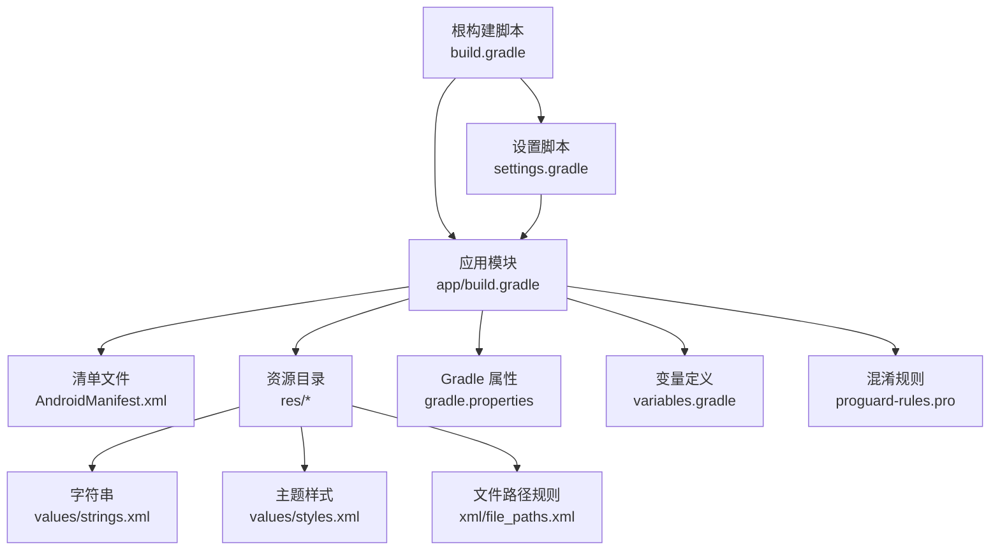
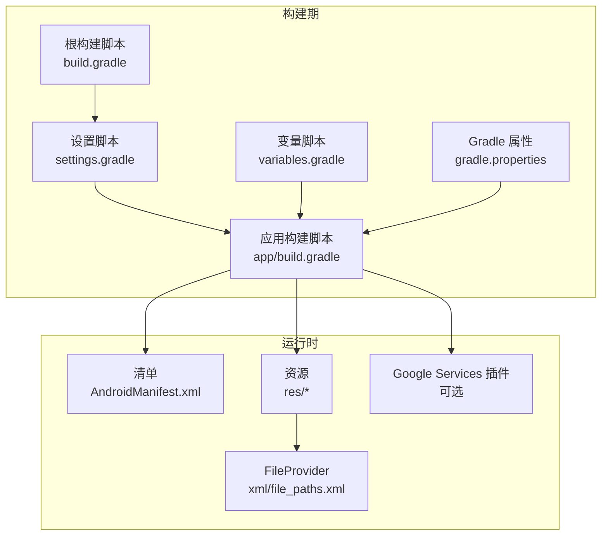
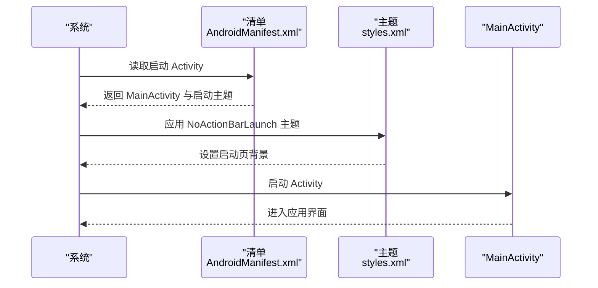
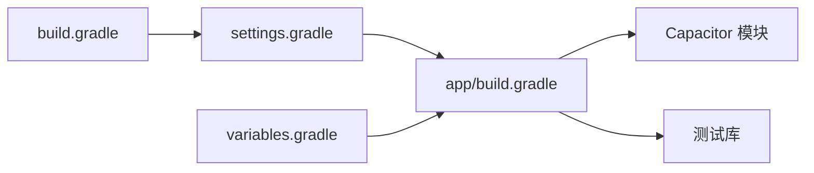

# Android 开发

<cite>
**本文引用的文件**
- [apps/frontend/android/app/src/main/AndroidManifest.xml](file://apps/frontend/android/app/src/main/AndroidManifest.xml)
- [apps/frontend/android/app/build.gradle](file://apps/frontend/android/app/build.gradle)
- [apps/frontend/android/build.gradle](file://apps/frontend/android/build.gradle)
- [apps/frontend/android/settings.gradle](file://apps/frontend/android/settings.gradle)
- [apps/frontend/android/gradle.properties](file://apps/frontend/android/gradle.properties)
- [apps/frontend/android/variables.gradle](file://apps/frontend/android/variables.gradle)
- [apps/frontend/android/app/proguard-rules.pro](file://apps/frontend/android/app/proguard-rules.pro)
- [apps/frontend/android/app/src/main/res/xml/file_paths.xml](file://apps/frontend/android/app/src/main/res/xml/file_paths.xml)
- [apps/frontend/android/app/src/main/res/values/strings.xml](file://apps/frontend/android/app/src/main/res/values/strings.xml)
- [apps/frontend/android/app/src/main/res/values/styles.xml](file://apps/frontend/android/app/src/main/res/values/styles.xml)
</cite>

## 目录
1. [简介](#简介)
2. [项目结构](#项目结构)
3. [核心组件](#核心组件)
4. [架构总览](#架构总览)
5. [详细组件分析](#详细组件分析)
6. [依赖关系分析](#依赖关系分析)
7. [性能考虑](#性能考虑)
8. [故障排查指南](#故障排查指南)
9. [结论](#结论)
10. [附录](#附录)

## 简介
本指南面向 Android 平台开发，基于仓库中的 Capacitor 项目结构，系统讲解 Android 工程的目录组织、Gradle 配置与构建流程、AndroidManifest.xml 权限与组件声明、应用图标与启动页配置、文件访问与共享、通知能力（通过 google-services 插件）、UI 主题与启动页样式、以及发布与调试相关实践。内容以仓库现有文件为依据，避免臆测，确保可操作性与准确性。

## 项目结构
该 Android 工程位于 apps/frontend/android，采用标准的 Android 应用模块结构，并结合 Capacitor 的多模块组织方式：
- 根级构建脚本负责全局仓库与插件类路径配置
- settings.gradle 声明子模块并应用 Capacitor 的设置
- app 模块为应用主体，包含清单、资源、构建脚本与依赖
- gradle.properties 提供全局 Gradle 运行参数
- variables.gradle 统一管理 SDK 与依赖版本
- 资源目录包含字符串、样式、图标与文件路径规则

图表来源
- [apps/frontend/android/build.gradle:1-30](file://apps/frontend/android/build.gradle#L1-L30)
- [apps/frontend/android/settings.gradle:1-5](file://apps/frontend/android/settings.gradle#L1-L5)
- [apps/frontend/android/app/build.gradle:1-55](file://apps/frontend/android/app/build.gradle#L1-L55)
- [apps/frontend/android/app/src/main/AndroidManifest.xml:1-42](file://apps/frontend/android/app/src/main/AndroidManifest.xml#L1-L42)
- [apps/frontend/android/gradle.properties:1-23](file://apps/frontend/android/gradle.properties#L1-L23)
- [apps/frontend/android/variables.gradle:1-16](file://apps/frontend/android/variables.gradle#L1-L16)
- [apps/frontend/android/app/proguard-rules.pro:1-22](file://apps/frontend/android/app/proguard-rules.pro#L1-L22)
- [apps/frontend/android/app/src/main/res/values/strings.xml:1-8](file://apps/frontend/android/app/src/main/res/values/strings.xml#L1-L8)
- [apps/frontend/android/app/src/main/res/values/styles.xml:1-22](file://apps/frontend/android/app/src/main/res/values/styles.xml#L1-L22)
- [apps/frontend/android/app/src/main/res/xml/file_paths.xml:1-5](file://apps/frontend/android/app/src/main/res/xml/file_paths.xml#L1-L5)

章节来源
- [apps/frontend/android/build.gradle:1-30](file://apps/frontend/android/build.gradle#L1-L30)
- [apps/frontend/android/settings.gradle:1-5](file://apps/frontend/android/settings.gradle#L1-L5)
- [apps/frontend/android/app/build.gradle:1-55](file://apps/frontend/android/app/build.gradle#L1-L55)
- [apps/frontend/android/gradle.properties:1-23](file://apps/frontend/android/gradle.properties#L1-L23)
- [apps/frontend/android/variables.gradle:1-16](file://apps/frontend/android/variables.gradle#L1-L16)

## 核心组件
- 构建脚本与版本管理
  - 根级 build.gradle 定义 Gradle 插件类路径（AGP 与 Google Services），统一仓库源
  - settings.gradle 引入 app 与 Capacitor 插件模块
  - variables.gradle 统一管理 minSdk、compileSdk、targetSdk 与关键依赖版本
  - gradle.properties 配置 JVM 内存与 AndroidX 开关
- 应用模块 app
  - app/build.gradle 配置命名空间、SDK 版本、默认配置、构建类型与依赖
  - 自动应用 capacitor.build.gradle，集成 Capacitor 能力
  - 可选应用 google-services 插件以启用 Firebase/推送能力
- 清单与资源
  - AndroidManifest.xml 声明应用主题、图标、启动 Activity、FileProvider 与权限
  - res/values/strings.xml 定义应用名、包名、URL Scheme
  - res/values/styles.xml 定义主题与启动页样式
  - res/xml/file_paths.xml 配置外部存储与缓存目录共享路径

章节来源
- [apps/frontend/android/build.gradle:1-30](file://apps/frontend/android/build.gradle#L1-L30)
- [apps/frontend/android/settings.gradle:1-5](file://apps/frontend/android/settings.gradle#L1-L5)
- [apps/frontend/android/app/build.gradle:1-55](file://apps/frontend/android/app/build.gradle#L1-L55)
- [apps/frontend/android/variables.gradle:1-16](file://apps/frontend/android/variables.gradle#L1-L16)
- [apps/frontend/android/gradle.properties:1-23](file://apps/frontend/android/gradle.properties#L1-L23)
- [apps/frontend/android/app/src/main/AndroidManifest.xml:1-42](file://apps/frontend/android/app/src/main/AndroidManifest.xml#L1-L42)
- [apps/frontend/android/app/src/main/res/values/strings.xml:1-8](file://apps/frontend/android/app/src/main/res/values/strings.xml#L1-L8)
- [apps/frontend/android/app/src/main/res/values/styles.xml:1-22](file://apps/frontend/android/app/src/main/res/values/styles.xml#L1-L22)
- [apps/frontend/android/app/src/main/res/xml/file_paths.xml:1-5](file://apps/frontend/android/app/src/main/res/xml/file_paths.xml#L1-L5)

## 架构总览
下图展示从 Gradle 构建到运行时的关键交互：根构建脚本与设置脚本初始化环境；应用模块解析变量与依赖；清单与资源参与运行时行为；FileProvider 支持文件分享；Google Services 插件按需启用通知能力。

图表来源
- [apps/frontend/android/build.gradle:1-30](file://apps/frontend/android/build.gradle#L1-L30)
- [apps/frontend/android/settings.gradle:1-5](file://apps/frontend/android/settings.gradle#L1-L5)
- [apps/frontend/android/app/build.gradle:1-55](file://apps/frontend/android/app/build.gradle#L1-L55)
- [apps/frontend/android/variables.gradle:1-16](file://apps/frontend/android/variables.gradle#L1-L16)
- [apps/frontend/android/gradle.properties:1-23](file://apps/frontend/android/gradle.properties#L1-L23)
- [apps/frontend/android/app/src/main/AndroidManifest.xml:1-42](file://apps/frontend/android/app/src/main/AndroidManifest.xml#L1-L42)
- [apps/frontend/android/app/src/main/res/xml/file_paths.xml:1-5](file://apps/frontend/android/app/src/main/res/xml/file_paths.xml#L1-L5)

## 详细组件分析

### 清单与权限配置（AndroidManifest.xml）
- 应用属性
  - 启用备份、图标、名称、圆角图标、RTL 支持与主题
- 启动 Activity
  - MainActivity 作为主入口，支持多配置变更、无 ActionBar 启动主题、单任务模式
  - Intent Filter 指定 LAUNCHER 动作
- 文件分享 Provider
  - 使用 androidx.core.content.FileProvider，授权域为应用 ID 的 fileprovider
  - meta-data 指向 file_paths.xml，开放外部存储与缓存目录
- 权限
  - 声明 INTERNET 权限（网络访问）

章节来源
- [apps/frontend/android/app/src/main/AndroidManifest.xml:1-42](file://apps/frontend/android/app/src/main/AndroidManifest.xml#L1-L42)
- [apps/frontend/android/app/src/main/res/xml/file_paths.xml:1-5](file://apps/frontend/android/app/src/main/res/xml/file_paths.xml#L1-L5)

### 资源与 UI 主题（strings.xml、styles.xml）
- 字符串资源
  - 应用名、主活动标题、包名、自定义 URL Scheme
- 主题样式
  - AppTheme 基于 AppCompat，定义主色、深色主色、强调色
  - NoActionBar 主题移除 ActionBar，设置背景为空
  - NoActionBarLaunch 主题继承 SplashScreen，背景使用启动页资源

章节来源
- [apps/frontend/android/app/src/main/res/values/strings.xml:1-8](file://apps/frontend/android/app/src/main/res/values/strings.xml#L1-L8)
- [apps/frontend/android/app/src/main/res/values/styles.xml:1-22](file://apps/frontend/android/app/src/main/res/values/styles.xml#L1-L22)

### 构建与依赖（app/build.gradle、根 build.gradle、settings.gradle、gradle.properties、variables.gradle）
- 根构建脚本
  - AGP 与 Google Services 类路径
  - 全局仓库源
- 应用模块
  - 命名空间与 SDK 版本来自变量脚本
  - 默认配置含 applicationId、min/targetSdk、版本号与混淆规则
  - 依赖包含 AppCompat、CoordinatorLayout、SplashScreen、Capacitor 模块与测试库
  - 自动应用 capacitor.build.gradle
  - 尝试应用 google-services 插件（若存在 google-services.json）
- 设置脚本
  - 包含 app 与 Capacitor 插件模块
- Gradle 属性
  - JVM 最大堆、并行构建注释、AndroidX 开关
- 变量脚本
  - 统一管理 minSdk、compileSdk、targetSdk 与关键依赖版本

章节来源
- [apps/frontend/android/app/build.gradle:1-55](file://apps/frontend/android/app/build.gradle#L1-L55)
- [apps/frontend/android/build.gradle:1-30](file://apps/frontend/android/build.gradle#L1-L30)
- [apps/frontend/android/settings.gradle:1-5](file://apps/frontend/android/settings.gradle#L1-L5)
- [apps/frontend/android/gradle.properties:1-23](file://apps/frontend/android/gradle.properties#L1-L23)
- [apps/frontend/android/variables.gradle:1-16](file://apps/frontend/android/variables.gradle#L1-L16)

### 文件访问与共享（FileProvider）
- FileProvider 配置
  - authorities 使用应用 ID 的 fileprovider
  - meta-data 指向 file_paths.xml
- 文件路径规则
  - external-path 与 cache-path 对应外部存储与缓存目录
- 用途
  - 通过 FileProvider 安全地分享图片等文件 URI，避免 FileUriExposedException

章节来源
- [apps/frontend/android/app/src/main/AndroidManifest.xml:27-35](file://apps/frontend/android/app/src/main/AndroidManifest.xml#L27-L35)
- [apps/frontend/android/app/src/main/res/xml/file_paths.xml:1-5](file://apps/frontend/android/app/src/main/res/xml/file_paths.xml#L1-L5)

### 通知能力与 Google Services（可选）
- 插件应用逻辑
  - 在 app/build.gradle 中尝试读取 google-services.json 并应用 com.google.gms.google-services 插件
  - 若缺失则记录提示信息，表示推送通知等功能不可用
- 实践建议
  - 如需推送或云端服务，应在工程根目录放置 google-services.json 并重新同步

章节来源
- [apps/frontend/android/app/build.gradle:47-54](file://apps/frontend/android/app/build.gradle#L47-L54)

### 启动页与主题序列图
以下序列图展示应用启动时的主题与启动页加载流程：

图表来源
- [apps/frontend/android/app/src/main/AndroidManifest.xml:12-25](file://apps/frontend/android/app/src/main/AndroidManifest.xml#L12-L25)
- [apps/frontend/android/app/src/main/res/values/styles.xml:19-21](file://apps/frontend/android/app/src/main/res/values/styles.xml#L19-L21)

## 依赖关系分析
- 模块耦合
  - settings.gradle 将 app 与 Capacitor 插件模块纳入构建
  - app/build.gradle 依赖 variables.gradle 提供的版本常量
  - app/build.gradle 自动应用 capacitor.build.gradle，整合 Capacitor 能力
- 外部依赖
  - AppCompat、CoordinatorLayout、SplashScreen、Capacitor 模块与测试库
- 可能的循环依赖
  - 当前结构未见直接循环；Capacitor 插件模块通过 include 引入，避免反向依赖

图表来源
- [apps/frontend/android/settings.gradle:1-5](file://apps/frontend/android/settings.gradle#L1-L5)
- [apps/frontend/android/app/build.gradle:33-43](file://apps/frontend/android/app/build.gradle#L33-L43)
- [apps/frontend/android/variables.gradle:1-16](file://apps/frontend/android/variables.gradle#L1-L16)
- [apps/frontend/android/build.gradle:1-30](file://apps/frontend/android/build.gradle#L1-L30)

章节来源
- [apps/frontend/android/settings.gradle:1-5](file://apps/frontend/android/settings.gradle#L1-L5)
- [apps/frontend/android/app/build.gradle:1-55](file://apps/frontend/android/app/build.gradle#L1-L55)
- [apps/frontend/android/variables.gradle:1-16](file://apps/frontend/android/variables.gradle#L1-L16)
- [apps/frontend/android/build.gradle:1-30](file://apps/frontend/android/build.gradle#L1-L30)

## 性能考虑
- Gradle 参数
  - gradle.properties 中设置了 JVM 最大堆，有助于大型工程构建稳定性
  - AndroidX 开关已启用，确保兼容性与现代化库支持
- 构建优化
  - app/build.gradle 中未启用代码压缩与混淆，便于调试；生产构建可开启混淆并配置 proguard 规则
- 依赖版本
  - variables.gradle 统一管理版本，避免冲突与重复升级成本

章节来源
- [apps/frontend/android/gradle.properties:10-22](file://apps/frontend/android/gradle.properties#L10-L22)
- [apps/frontend/android/app/build.gradle:19-24](file://apps/frontend/android/app/build.gradle#L19-L24)
- [apps/frontend/android/variables.gradle:1-16](file://apps/frontend/android/variables.gradle#L1-L16)

## 故障排查指南
- 启动页不生效
  - 检查 NoActionBarLaunch 主题是否正确应用至启动 Activity
  - 确认 styles.xml 中的启动页背景资源存在且路径正确
- 文件分享失败
  - 检查 AndroidManifest.xml 中 FileProvider 的 authorities 是否与应用 ID 一致
  - 确认 file_paths.xml 中的 external-path/cache-path 配置是否覆盖目标目录
- 权限相关问题
  - 若需要额外权限（如相机、存储），需在清单中添加相应权限声明
- 推送/云服务不可用
  - 若缺少 google-services.json，插件不会被应用，相关功能不可用
  - 放置正确的 google-services.json 并重新同步工程

章节来源
- [apps/frontend/android/app/src/main/res/values/styles.xml:19-21](file://apps/frontend/android/app/src/main/res/values/styles.xml#L19-L21)
- [apps/frontend/android/app/src/main/AndroidManifest.xml:27-35](file://apps/frontend/android/app/src/main/AndroidManifest.xml#L27-L35)
- [apps/frontend/android/app/src/main/res/xml/file_paths.xml:1-5](file://apps/frontend/android/app/src/main/res/xml/file_paths.xml#L1-L5)
- [apps/frontend/android/app/build.gradle:47-54](file://apps/frontend/android/app/build.gradle#L47-L54)

## 结论
本指南基于仓库现有 Android 配置，梳理了构建脚本、清单与资源、文件分享与通知能力等关键环节。建议在生产发布前完善混淆与签名配置、补充缺失权限与 google-services.json，并针对目标设备进行启动页与主题的最终验证。

## 附录
- 发布准备要点
  - 生成并签署 APK 或 AAB
  - 配置混淆与资源压缩
  - 准备应用截图与元数据
- Google Play 发布流程（通用步骤）
  - 创建开发者账号并提交应用信息
  - 上传 APK/AAB 与截图
  - 填写隐私政策与服务条款链接
  - 提交审核并跟进状态