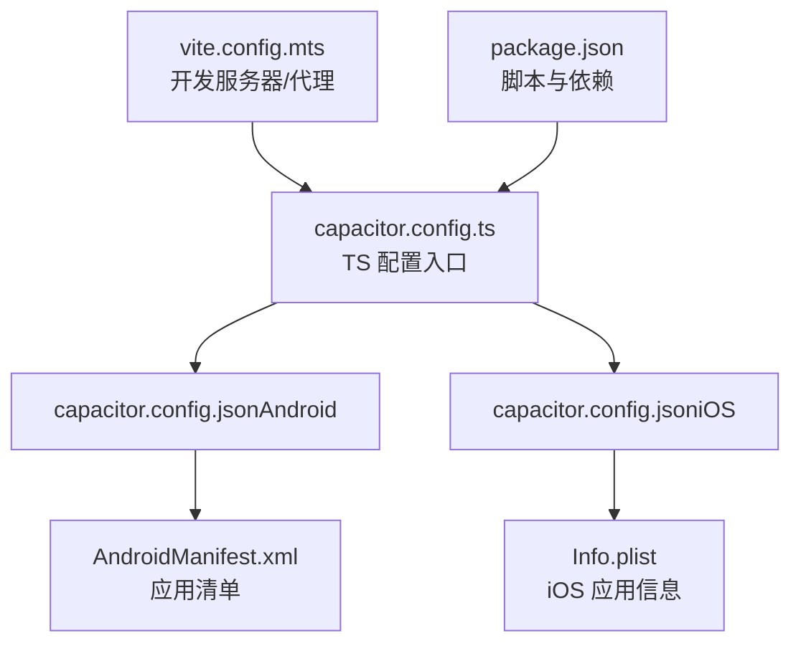
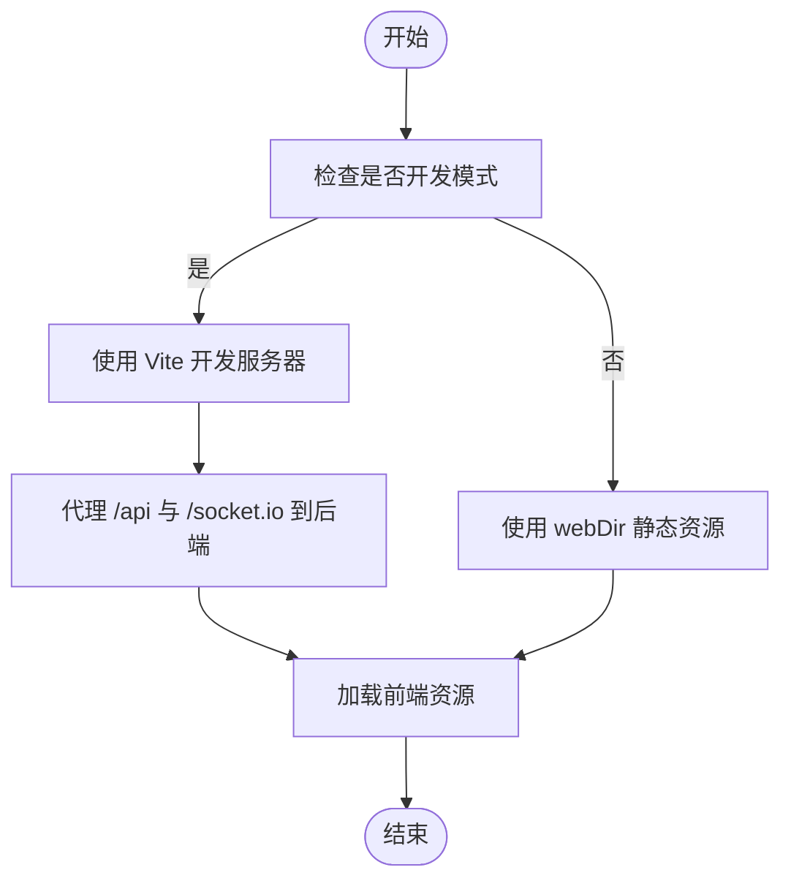
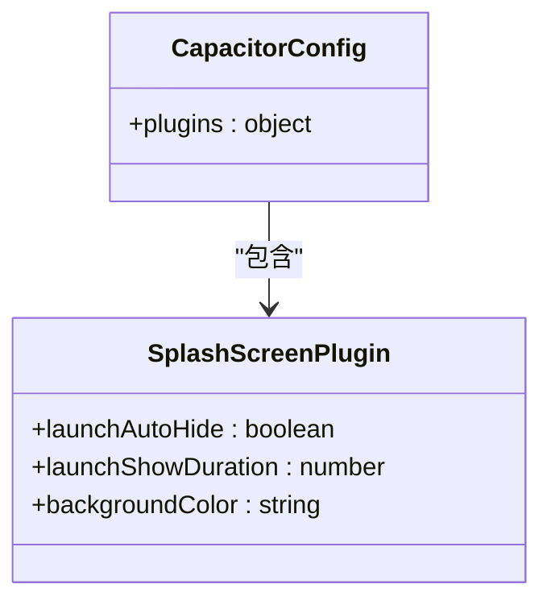
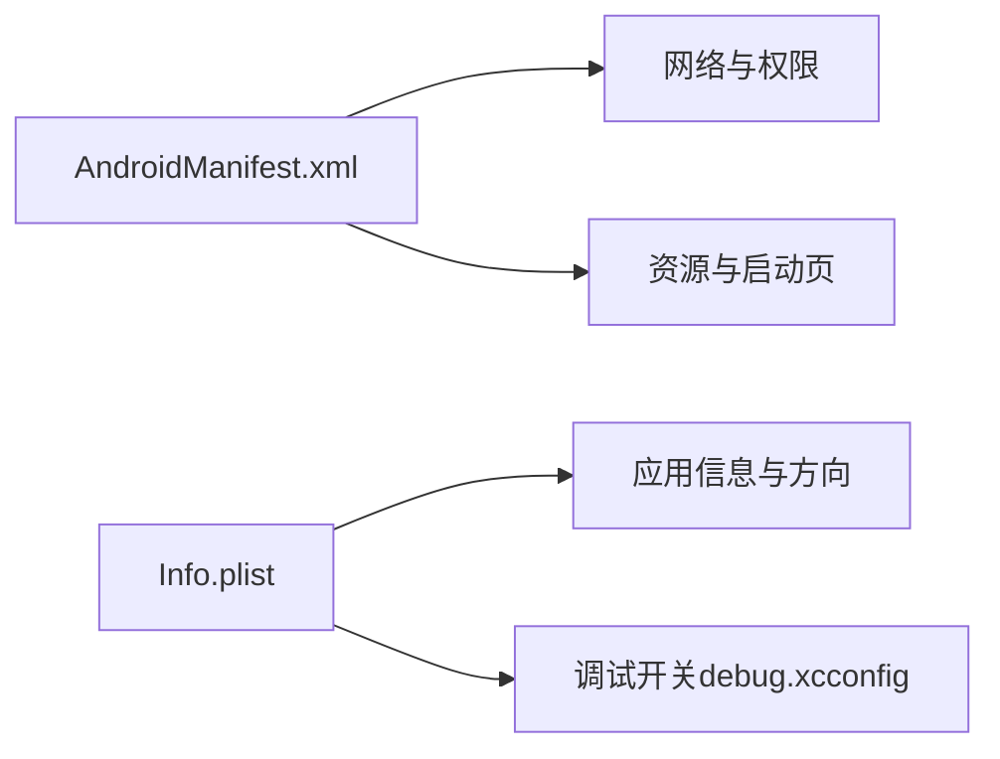
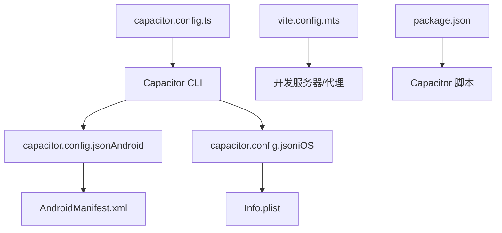

# Capacitor 配置

<cite>
**本文引用的文件**
- [capacitor.config.ts](file://apps/frontend/capacitor.config.ts)
- [capacitor.config.json（Android）](file://apps/frontend/android/app/src/main/assets/capacitor.config.json)
- [capacitor.config.json（iOS）](file://apps/frontend/ios/App/App/capacitor.config.json)
- [AndroidManifest.xml（Android 应用清单）](file://apps/frontend/android/app/src/main/AndroidManifest.xml)
- [AndroidManifest.xml（Cordova 插件）](file://apps/frontend/android/capacitor-cordova-android-plugins/src/main/AndroidManifest.xml)
- [Info.plist（iOS 应用信息）](file://apps/frontend/ios/App/App/Info.plist)
- [package.json（前端包配置）](file://apps/frontend/package.json)
- [vite.config.mts（Vite 构建配置）](file://apps/frontend/vite.config.mts)
- [debug.xcconfig（iOS 调试配置）](file://apps/frontend/ios/debug.xcconfig)
</cite>

## 目录
1. [简介](#简介)
2. [项目结构与配置文件定位](#项目结构与配置文件定位)
3. [核心配置项详解](#核心配置项详解)
4. [架构概览](#架构概览)
5. [组件与配置细节](#组件与配置细节)
6. [依赖关系分析](#依赖关系分析)
7. [性能与安全考量](#性能与安全考量)
8. [故障排查指南](#故障排查指南)
9. [结论](#结论)
10. [附录：开发与生产环境策略](#附录开发与生产环境策略)

## 简介
本文件系统性梳理 Capacitor 混合应用的配置体系，覆盖配置文件结构、关键选项作用、服务器与网络配置、插件配置（尤其是启动屏插件）、平台差异（Android/iOS），以及开发与生产环境的最佳实践与常见问题解决方案。目标是帮助开发者快速理解并正确配置 Capacitor，确保在多端环境中稳定运行。

## 项目结构与配置文件定位
- TypeScript 配置入口位于前端工程根目录，作为 Capacitor CLI 的主要配置来源。
- 平台侧生成的 JSON 配置文件用于打包阶段注入最终产物。
- 平台清单文件（AndroidManifest.xml、Info.plist）影响运行时权限与网络策略。
- 构建工具（Vite）提供开发服务器与代理，与 Capacitor 的 server 配置协同工作。



图表来源
- [capacitor.config.ts:1-23](file://apps/frontend/capacitor.config.ts#L1-L23)
- [capacitor.config.json（Android）:1-18](file://apps/frontend/android/app/src/main/assets/capacitor.config.json#L1-L18)
- [capacitor.config.json（iOS）:1-19](file://apps/frontend/ios/App/App/capacitor.config.json#L1-L19)
- [AndroidManifest.xml（Android 应用清单）:1-42](file://apps/frontend/android/app/src/main/AndroidManifest.xml#L1-L42)
- [Info.plist（iOS 应用信息）:1-52](file://apps/frontend/ios/App/App/Info.plist#L1-L52)
- [vite.config.mts（Vite 构建配置）:154-174](file://apps/frontend/vite.config.mts#L154-L174)
- [package.json（前端包配置）:9-29](file://apps/frontend/package.json#L9-L29)

章节来源
- [capacitor.config.ts:1-23](file://apps/frontend/capacitor.config.ts#L1-L23)
- [capacitor.config.json（Android）:1-18](file://apps/frontend/android/app/src/main/assets/capacitor.config.json#L1-L18)
- [capacitor.config.json（iOS）:1-19](file://apps/frontend/ios/App/App/capacitor.config.json#L1-L19)
- [AndroidManifest.xml（Android 应用清单）:1-42](file://apps/frontend/android/app/src/main/AndroidManifest.xml#L1-L42)
- [Info.plist（iOS 应用信息）:1-52](file://apps/frontend/ios/App/App/Info.plist#L1-L52)
- [vite.config.mts（Vite 构建配置）:154-174](file://apps/frontend/vite.config.mts#L154-L174)
- [package.json（前端包配置）:9-29](file://apps/frontend/package.json#L9-L29)

## 核心配置项详解
- 应用标识与名称
  - appId：应用唯一标识符，用于 Android 包名风格与 iOS Bundle Identifier 的映射与校验。
  - appName：应用显示名称，用于启动页、系统界面等展示。
- Web 目录
  - webDir：构建产物目录，Capacitor 将该目录作为静态资源根目录提供给原生层加载。
- 服务器配置（server）
  - url：开发或预发布时指定的前端服务器地址；生产打包后通常由 webDir 提供静态资源。
  - cleartext：允许明文 HTTP（HTTP/1.1）流量，便于开发调试；生产环境建议关闭。
  - androidScheme：Android 使用的默认协议（如 https），结合本地资源加载策略。
- 插件配置（plugins）
  - 启动屏插件（SplashScreen）：
    - launchAutoHide：是否自动隐藏启动屏。
    - launchShowDuration：启动屏显示时长（毫秒）。
    - backgroundColor：启动屏背景色（十六进制）。

章节来源
- [capacitor.config.ts:3-20](file://apps/frontend/capacitor.config.ts#L3-L20)
- [capacitor.config.json（Android）:5-9](file://apps/frontend/android/app/src/main/assets/capacitor.config.json#L5-L9)
- [capacitor.config.json（iOS）:5-16](file://apps/frontend/ios/App/App/capacitor.config.json#L5-L16)

## 架构概览
Capacitor 配置在“开发—构建—打包—运行”链路中的位置如下：
- 开发阶段：Vite 提供开发服务器与代理，Capacitor server 配置决定如何访问前端资源。
- 构建阶段：Capacitor CLI 读取 TS 配置，生成平台侧 JSON 配置，并同步到 Android/iOS 工程。
- 运行阶段：原生层根据 JSON 配置加载 webDir 或远程 URL；Android/iOS 清单控制网络与权限。

```mermaid
sequenceDiagram
participant Dev as "开发者"
participant Vite as "Vite 开发服务器"
participant CLI as "Capacitor CLI"
participant TS as "capacitor.config.ts"
participant AND as "AndroidManifest.xml"
participant IOS as "Info.plist"
participant APP as "应用运行时"
Dev->>CLI : 运行构建/同步命令
CLI->>TS : 读取配置
CLI->>AND : 注入网络与权限策略
CLI->>IOS : 注入应用信息
Dev->>Vite : 启动开发服务器
APP->>Vite : 加载前端资源受 server 配置影响
```

图表来源
- [capacitor.config.ts:7-12](file://apps/frontend/capacitor.config.ts#L7-L12)
- [vite.config.mts（Vite 构建配置）:154-174](file://apps/frontend/vite.config.mts#L154-L174)
- [AndroidManifest.xml（Android 应用清单）:38-41](file://apps/frontend/android/app/src/main/AndroidManifest.xml#L38-L41)
- [Info.plist（iOS 应用信息）:1-52](file://apps/frontend/ios/App/App/Info.plist#L1-L52)

## 组件与配置细节

### 服务器与网络配置
- 开发服务器设置
  - Vite 提供开发服务器，默认监听 0.0.0.0，便于容器或局域网访问。
  - 通过代理将 /api 与 /socket.io 请求转发至后端服务，支持 WebSocket。
- HTTPS 与 Cleartext HTTP
  - Capacitor server.cleartext 控制是否允许明文 HTTP。
  - AndroidManifest 中声明 usesCleartextTraffic，使 Cordova 插件层支持明文流量。
- Android 协议与 Scheme
  - androidScheme 可设置为 https，结合本地资源加载策略，提升安全性。



图表来源
- [vite.config.mts（Vite 构建配置）:154-174](file://apps/frontend/vite.config.mts#L154-L174)
- [capacitor.config.ts:7-12](file://apps/frontend/capacitor.config.ts#L7-L12)
- [AndroidManifest.xml（Cordova 插件）](file://apps/frontend/android/capacitor-cordova-android-plugins/src/main/AndroidManifest.xml#L4)

章节来源
- [vite.config.mts（Vite 构建配置）:154-174](file://apps/frontend/vite.config.mts#L154-L174)
- [capacitor.config.ts:7-12](file://apps/frontend/capacitor.config.ts#L7-L12)
- [AndroidManifest.xml（Cordova 插件）](file://apps/frontend/android/capacitor-cordova-android-plugins/src/main/AndroidManifest.xml#L4)

### 插件配置：启动屏（SplashScreen）
- 关键参数
  - launchAutoHide：自动隐藏启动屏，避免阻塞用户交互。
  - launchShowDuration：启动屏显示时长，避免过短导致白屏或过长影响体验。
  - backgroundColor：启动屏背景色，与主题一致，减少视觉跳变。
- 平台差异
  - Android/iOS 均支持上述参数；iOS 还可通过 Info.plist 的启动画面相关键值进行补充配置。



图表来源
- [capacitor.config.ts:13-19](file://apps/frontend/capacitor.config.ts#L13-L19)
- [capacitor.config.json（Android）:10-16](file://apps/frontend/android/app/src/main/assets/capacitor.config.json#L10-L16)
- [capacitor.config.json（iOS）:10-16](file://apps/frontend/ios/App/App/capacitor.config.json#L10-L16)

章节来源
- [capacitor.config.ts:13-19](file://apps/frontend/capacitor.config.ts#L13-L19)
- [capacitor.config.json（Android）:10-16](file://apps/frontend/android/app/src/main/assets/capacitor.config.json#L10-L16)
- [capacitor.config.json（iOS）:10-16](file://apps/frontend/ios/App/App/capacitor.config.json#L10-L16)

### 平台特定配置差异
- Android
  - 权限与网络：清单中声明 INTERNET 权限；Cordova 插件层允许明文流量。
  - 启动页与图标：通过资源目录与清单配置，配合 Capacitor 启动屏插件。
- iOS
  - 应用信息：通过 Info.plist 设置显示名称、方向支持、启动画面等。
  - 调试开关：debug.xcconfig 中设置 CAPACITOR_DEBUG，影响调试行为与日志输出。



图表来源
- [AndroidManifest.xml（Android 应用清单）:38-41](file://apps/frontend/android/app/src/main/AndroidManifest.xml#L38-L41)
- [AndroidManifest.xml（Cordova 插件）](file://apps/frontend/android/capacitor-cordova-android-plugins/src/main/AndroidManifest.xml#L4)
- [Info.plist（iOS 应用信息）:27-47](file://apps/frontend/ios/App/App/Info.plist#L27-L47)
- [debug.xcconfig（iOS 调试配置）](file://apps/frontend/ios/debug.xcconfig#L1)

章节来源
- [AndroidManifest.xml（Android 应用清单）:38-41](file://apps/frontend/android/app/src/main/AndroidManifest.xml#L38-L41)
- [AndroidManifest.xml（Cordova 插件）](file://apps/frontend/android/capacitor-cordova-android-plugins/src/main/AndroidManifest.xml#L4)
- [Info.plist（iOS 应用信息）:27-47](file://apps/frontend/ios/App/App/Info.plist#L27-L47)
- [debug.xcconfig（iOS 调试配置）](file://apps/frontend/ios/debug.xcconfig#L1)

## 依赖关系分析
- 配置来源与生成
  - TS 配置文件为权威来源，Capacitor CLI 会将其转换为平台侧 JSON 配置。
- 构建与运行时依赖
  - Vite 提供开发服务器与代理，与 Capacitor server 配置协同。
  - 平台清单文件影响运行时网络策略与权限。
- 脚本与命令
  - package.json 中的 Capacitor 脚本用于同步、打开、运行平台工程。



图表来源
- [capacitor.config.ts:1-23](file://apps/frontend/capacitor.config.ts#L1-L23)
- [capacitor.config.json（Android）:1-18](file://apps/frontend/android/app/src/main/assets/capacitor.config.json#L1-L18)
- [capacitor.config.json（iOS）:1-19](file://apps/frontend/ios/App/App/capacitor.config.json#L1-L19)
- [vite.config.mts（Vite 构建配置）:154-174](file://apps/frontend/vite.config.mts#L154-L174)
- [AndroidManifest.xml（Android 应用清单）:1-42](file://apps/frontend/android/app/src/main/AndroidManifest.xml#L1-L42)
- [Info.plist（iOS 应用信息）:1-52](file://apps/frontend/ios/App/App/Info.plist#L1-L52)
- [package.json（前端包配置）:9-29](file://apps/frontend/package.json#L9-L29)

章节来源
- [capacitor.config.ts:1-23](file://apps/frontend/capacitor.config.ts#L1-L23)
- [capacitor.config.json（Android）:1-18](file://apps/frontend/android/app/src/main/assets/capacitor.config.json#L1-L18)
- [capacitor.config.json（iOS）:1-19](file://apps/frontend/ios/App/App/capacitor.config.json#L1-L19)
- [vite.config.mts（Vite 构建配置）:154-174](file://apps/frontend/vite.config.mts#L154-L174)
- [AndroidManifest.xml（Android 应用清单）:1-42](file://apps/frontend/android/app/src/main/AndroidManifest.xml#L1-L42)
- [Info.plist（iOS 应用信息）:1-52](file://apps/frontend/ios/App/App/Info.plist#L1-L52)
- [package.json（前端包配置）:9-29](file://apps/frontend/package.json#L9-L29)

## 性能与安全考量
- 明文 HTTP（cleartext）
  - 开发阶段开启以简化联调；生产环境应关闭，避免中间人攻击风险。
- HTTPS 与证书
  - 生产环境建议使用 HTTPS，确保传输安全。
- 启动屏优化
  - 合理设置显示时长与自动隐藏，避免阻塞首屏渲染。
- 网络代理
  - Vite 代理仅用于开发，生产环境应通过后端统一处理跨域与路由。

章节来源
- [capacitor.config.ts:10-11](file://apps/frontend/capacitor.config.ts#L10-L11)
- [AndroidManifest.xml（Cordova 插件）](file://apps/frontend/android/capacitor-cordova-android-plugins/src/main/AndroidManifest.xml#L4)
- [vite.config.mts（Vite 构建配置）:157-169](file://apps/frontend/vite.config.mts#L157-L169)

## 故障排查指南
- 无法加载开发服务器资源
  - 检查 Vite server.host 是否为 0.0.0.0，确保可从设备访问。
  - 确认 Capacitor server.url 与 Vite 端口一致。
- Android 明文流量被阻止
  - 确认 AndroidManifest 中 usesCleartextTraffic 为 true（开发阶段）。
- iOS 启动画面不生效
  - 检查 Info.plist 中启动画面相关键值与资源是否存在。
- 调试模式未开启
  - 确认 debug.xcconfig 中 CAPACITOR_DEBUG 为 true。

章节来源
- [vite.config.mts（Vite 构建配置）:154-157](file://apps/frontend/vite.config.mts#L154-L157)
- [capacitor.config.ts:7-12](file://apps/frontend/capacitor.config.ts#L7-L12)
- [AndroidManifest.xml（Cordova 插件）](file://apps/frontend/android/capacitor-cordova-android-plugins/src/main/AndroidManifest.xml#L4)
- [Info.plist（iOS 应用信息）:27-28](file://apps/frontend/ios/App/App/Info.plist#L27-L28)
- [debug.xcconfig（iOS 调试配置）](file://apps/frontend/ios/debug.xcconfig#L1)

## 结论
本项目采用 TypeScript 配置作为权威来源，结合 Vite 开发服务器与平台清单文件，形成完整的 Capacitor 配置闭环。通过合理设置服务器与插件参数、遵循平台差异与安全策略，可在多端环境中获得一致且稳定的用户体验。

## 附录：开发与生产环境策略
- 开发环境
  - 开启 cleartext 与代理，确保前后端联调顺畅。
  - 使用 Vite 的 host 与端口，保证设备可访问。
- 生产环境
  - 关闭 cleartext，使用 HTTPS。
  - 固定 server.url 或使用 webDir 静态资源。
  - 确保平台清单权限最小化，仅保留必要权限。

章节来源
- [capacitor.config.ts:7-12](file://apps/frontend/capacitor.config.ts#L7-L12)
- [vite.config.mts（Vite 构建配置）:154-174](file://apps/frontend/vite.config.mts#L154-L174)
- [AndroidManifest.xml（Android 应用清单）:38-41](file://apps/frontend/android/app/src/main/AndroidManifest.xml#L38-L41)
- [Info.plist（iOS 应用信息）:1-52](file://apps/frontend/ios/App/App/Info.plist#L1-L52)