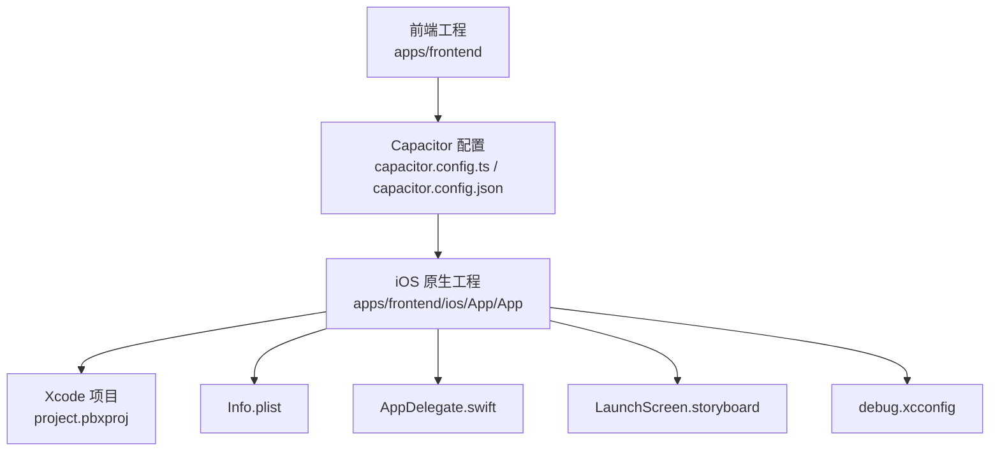
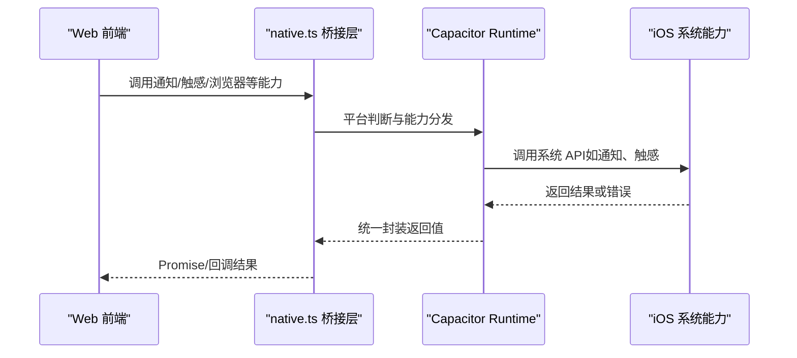
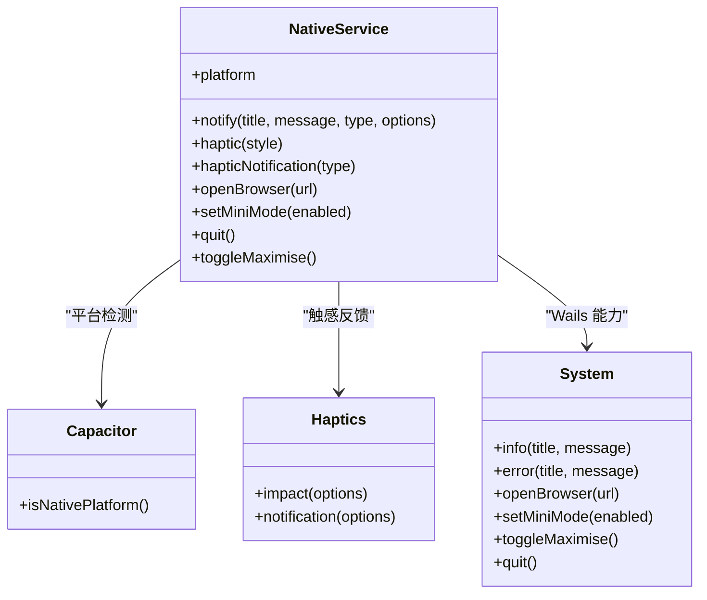
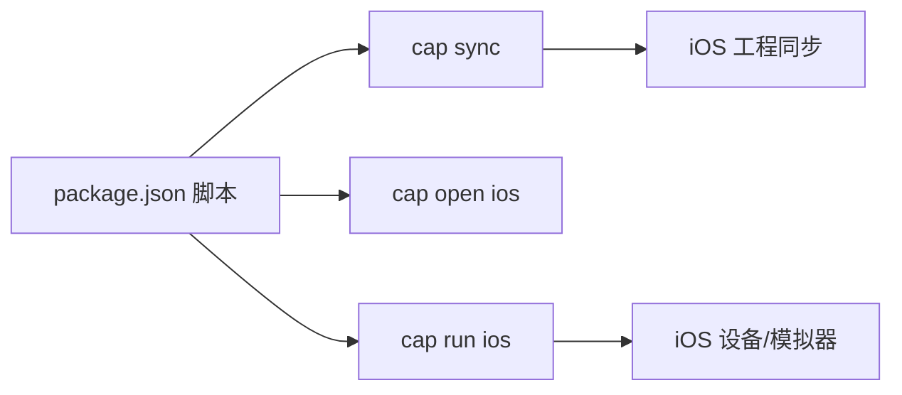

# iOS 开发

<cite>
**本文引用的文件**
- [apps/frontend/ios/App/App/Info.plist](file://apps/frontend/ios/App/App/Info.plist)
- [apps/frontend/ios/App/App/AppDelegate.swift](file://apps/frontend/ios/App/App/AppDelegate.swift)
- [apps/frontend/ios/App/App/Base.lproj/LaunchScreen.storyboard](file://apps/frontend/ios/App/App/Base.lproj/LaunchScreen.storyboard)
- [apps/frontend/ios/App/App/capacitor.config.json](file://apps/frontend/ios/App/App/capacitor.config.json)
- [apps/frontend/capacitor.config.ts](file://apps/frontend/capacitor.config.ts)
- [apps/frontend/ios/debug.xcconfig](file://apps/frontend/ios/debug.xcconfig)
- [apps/frontend/ios/App/App.xcodeproj/project.pbxproj](file://apps/frontend/ios/App/App.xcodeproj/project.pbxproj)
- [apps/frontend/src/services/native.ts](file://apps/frontend/src/services/native.ts)
- [apps/frontend/package.json](file://apps/frontend/package.json)
</cite>

## 目录
1. [简介](#简介)
2. [项目结构](#项目结构)
3. [核心组件](#核心组件)
4. [架构总览](#架构总览)
5. [详细组件分析](#详细组件分析)
6. [依赖关系分析](#依赖关系分析)
7. [性能与内存管理](#性能与内存管理)
8. [故障排查指南](#故障排查指南)
9. [结论](#结论)
10. [附录](#附录)

## 简介
本指南面向 iOS 平台开发，基于仓库中的 Capacitor + Vue 前端工程，系统讲解 iOS 项目结构与配置、Xcode 项目设置、Info.plist 配置、证书与签名、iOS 特性实现（如触感反馈、通知）、UI 适配（Safe Area、手势、状态栏）、应用商店发布流程与审核要点、性能优化与内存管理最佳实践，以及常见问题与调试技巧。文中所有技术细节均以仓库现有文件为依据，避免臆测。

## 项目结构
该工程采用多包工作区，iOS 端位于 apps/frontend/ios/App/App 下，使用 Capacitor 作为原生桥接层，前端代码位于 apps/frontend。iOS 工程通过 Xcode 项目文件组织资源、构建阶段与目标产物；前端通过 Capacitor CLI 同步原生配置与资源。

图表来源
- [apps/frontend/capacitor.config.ts:1-23](file://apps/frontend/capacitor.config.ts#L1-L23)
- [apps/frontend/ios/App/App/capacitor.config.json:1-19](file://apps/frontend/ios/App/App/capacitor.config.json#L1-L19)
- [apps/frontend/ios/App/App.xcodeproj/project.pbxproj:1-200](file://apps/frontend/ios/App/App.xcodeproj/project.pbxproj#L1-L200)
- [apps/frontend/ios/App/App/Info.plist:1-52](file://apps/frontend/ios/App/App/Info.plist#L1-L52)
- [apps/frontend/ios/App/App/AppDelegate.swift:1-50](file://apps/frontend/ios/App/App/AppDelegate.swift#L1-L50)
- [apps/frontend/ios/App/App/Base.lproj/LaunchScreen.storyboard:1-33](file://apps/frontend/ios/App/App/Base.lproj/LaunchScreen.storyboard#L1-L33)
- [apps/frontend/ios/debug.xcconfig:1-2](file://apps/frontend/ios/debug.xcconfig#L1-L2)

章节来源
- [apps/frontend/ios/App/App.xcodeproj/project.pbxproj:1-200](file://apps/frontend/ios/App/App.xcodeproj/project.pbxproj#L1-L200)

## 核心组件
- 原生桥接与平台适配：通过 native.ts 将 Capacitor、Wails 与 Web 的能力统一抽象，提供跨平台一致的调用接口。
- 应用生命周期代理：AppDelegate.swift 实现标准 iOS 生命周期回调，支持 URL 打开与通用链接处理。
- 启动页与启动画面：LaunchScreen.storyboard 定义启动界面，配合 Info.plist 中的启动项配置。
- 配置中心：Capacitor 配置在前端与 iOS 两端分别维护，确保构建与运行参数一致。

章节来源
- [apps/frontend/src/services/native.ts:1-116](file://apps/frontend/src/services/native.ts#L1-L116)
- [apps/frontend/ios/App/App/AppDelegate.swift:1-50](file://apps/frontend/ios/App/App/AppDelegate.swift#L1-L50)
- [apps/frontend/ios/App/App/Base.lproj/LaunchScreen.storyboard:1-33](file://apps/frontend/ios/App/App/Base.lproj/LaunchScreen.storyboard#L1-L33)
- [apps/frontend/capacitor.config.ts:1-23](file://apps/frontend/capacitor.config.ts#L1-L23)
- [apps/frontend/ios/App/App/capacitor.config.json:1-19](file://apps/frontend/ios/App/App/capacitor.config.json#L1-L19)

## 架构总览
下图展示从前端到 iOS 原生的关键交互路径，包括 Capacitor 插件、原生桥接与系统能力调用。

图表来源
- [apps/frontend/src/services/native.ts:1-116](file://apps/frontend/src/services/native.ts#L1-L116)

## 详细组件分析

### iOS 项目配置与 Xcode 设置
- 项目文件与目标：Xcode 项目文件定义了 App 目标、构建阶段（Sources/Frameworks/Resources）、产品引用与包依赖。
- 资源与构建：App 目标包含 AppDelegate.swift、Storyboard、Assets.xcassets、Info.plist、capacitor.config.json、config.xml 与 public 资源目录。
- 调试配置：debug.xcconfig 设置 CAPACITOR_DEBUG 标志，用于区分调试与发布构建。

章节来源
- [apps/frontend/ios/App/App.xcodeproj/project.pbxproj:1-200](file://apps/frontend/ios/App/App.xcodeproj/project.pbxproj#L1-L200)
- [apps/frontend/ios/debug.xcconfig:1-2](file://apps/frontend/ios/debug.xcconfig#L1-L2)

### Info.plist 配置要点
- 基本元数据：显示名称、Bundle ID、版本号、短版本号等。
- 启动与界面：指定启动故事板与主故事板，声明所需设备能力与支持的方向。
- 状态栏：通过 UIViewControllerBasedStatusBarAppearance 控制状态栏外观。

章节来源
- [apps/frontend/ios/App/App/Info.plist:1-52](file://apps/frontend/ios/App/App/Info.plist#L1-L52)

### AppDelegate 生命周期与 URL/活动处理
- 生命周期：实现应用进入后台、回到前台、终止等回调，便于保存状态与恢复 UI。
- URL 打开：转发至 ApplicationDelegateProxy，确保 Capacitor App API 支持追踪外部 URL 打开。
- 用户活动：处理通用链接（Universal Links）等场景，保持与 Capacitor 的集成一致性。

章节来源
- [apps/frontend/ios/App/App/AppDelegate.swift:1-50](file://apps/frontend/ios/App/App/AppDelegate.swift#L1-L50)

### 启动画面与启动体验
- LaunchScreen.storyboard：定义启动时的视图控制器与背景图片，确保从原生层到 Web 内容加载的平滑过渡。
- 配合 Capacitor：前端可通过插件控制启动画面自动隐藏与显示时长。

章节来源
- [apps/frontend/ios/App/App/Base.lproj/LaunchScreen.storyboard:1-33](file://apps/frontend/ios/App/App/Base.lproj/LaunchScreen.storyboard#L1-L33)
- [apps/frontend/ios/App/App/capacitor.config.json:10-16](file://apps/frontend/ios/App/App/capacitor.config.json#L10-L16)

### Capacitor 配置与同步
- 前端配置：capacitor.config.ts 定义 appId、appName、webDir、服务器地址与插件（如启动画面）。
- iOS 本地配置：capacitor.config.json 与前端配置对应，确保构建时一致。
- 同步命令：package.json 中提供 cap:sync、cap:open:ios、cap:run:ios 等脚本，便于快速同步与运行。

章节来源
- [apps/frontend/capacitor.config.ts:1-23](file://apps/frontend/capacitor.config.ts#L1-L23)
- [apps/frontend/ios/App/App/capacitor.config.json:1-19](file://apps/frontend/ios/App/App/capacitor.config.json#L1-L19)
- [apps/frontend/package.json:21-28](file://apps/frontend/package.json#L21-L28)

### 原生能力适配层（Bridge Pattern）
- 平台检测：根据是否为 Wails 或 Capacitor 原生平台，选择不同实现路径。
- 通知与浏览器：在 Web 环境尝试使用浏览器通知 API；在原生平台可扩展为本地通知。
- 触感反馈：封装 Capacitor Haptics，提供 Impact 与 Notification 反馈。
- 其他：提供打开浏览器、最小化窗口（Wails）、切换最大化（Wails）等跨平台方法。

图表来源
- [apps/frontend/src/services/native.ts:1-116](file://apps/frontend/src/services/native.ts#L1-L116)

章节来源
- [apps/frontend/src/services/native.ts:1-116](file://apps/frontend/src/services/native.ts#L1-L116)

### iOS UI 适配与交互设计
- Safe Area：Storyboard 中使用 Auto Layout 与安全区域约束，保证内容在刘海屏与异形屏上的正确显示。
- 手势识别：可在 ViewController 中添加 UIGestureRecognizer，结合前端交互逻辑实现复杂手势。
- 状态栏：通过 Info.plist 的 UIViewControllerBasedStatusBarAppearance 控制状态栏外观，必要时在控制器中调整样式。

章节来源
- [apps/frontend/ios/App/App/Base.lproj/LaunchScreen.storyboard:1-33](file://apps/frontend/ios/App/App/Base.lproj/LaunchScreen.storyboard#L1-L33)
- [apps/frontend/ios/App/App/Info.plist:48-49](file://apps/frontend/ios/App/App/Info.plist#L48-L49)

### iOS 特性实现示例
- 触感反馈：通过 native.ts 调用 Capacitor Haptics，提供轻、中、重等 Impact 风格与成功/警告/失败的通知反馈。
- 通知：在 Web 环境请求权限后使用浏览器通知；在原生平台可扩展为本地通知（需在 native.ts 中接入 Capacitor Local Notifications 插件）。
- 浏览器打开：统一在 native.ts 中处理，原生平台使用系统浏览器，Web 使用 window.open。

章节来源
- [apps/frontend/src/services/native.ts:22-86](file://apps/frontend/src/services/native.ts#L22-L86)

## 依赖关系分析
- 前端对 Capacitor 的依赖：通过 @capacitor/* 包提供核心能力与插件生态。
- 原生工程对 Capacitor 的依赖：通过 Xcode 项目中的包引用与构建配置集成。
- 运行脚本：package.json 中的 Capacitor 命令用于同步与运行 iOS 工程。

图表来源
- [apps/frontend/package.json:21-28](file://apps/frontend/package.json#L21-L28)

章节来源
- [apps/frontend/package.json:1-104](file://apps/frontend/package.json#L1-L104)
- [apps/frontend/ios/App/App.xcodeproj/project.pbxproj:108-114](file://apps/frontend/ios/App/App.xcodeproj/project.pbxproj#L108-L114)

## 性能与内存管理
- 构建内存：前端构建脚本设置了较大的堆内存限制，有助于大型项目编译稳定性。
- 原生桥接：尽量减少频繁跨语言调用，合并批量操作，避免在主线程执行耗时任务。
- 启动体验：合理配置启动画面显示时长与自动隐藏策略，缩短首屏等待时间。
- 资源管理：在 iOS 侧使用 Asset Catalog 管理图片与图标，避免重复解码与内存占用。

章节来源
- [apps/frontend/package.json:10-13](file://apps/frontend/package.json#L10-L13)

## 故障排查指南
- 启动黑屏或白屏：检查 Info.plist 的启动故事板与主故事板配置，确认 LaunchScreen.storyboard 是否正确引用。
- 通知不显示：在 Web 环境需先请求权限；在原生平台可扩展为本地通知插件并在 native.ts 中接入。
- 触感反馈无效：确认 Capacitor Haptics 插件已安装并启用，且在原生平台调用。
- 调试模式：通过 debug.xcconfig 设置 CAPACITOR_DEBUG，结合前端日志定位问题。
- 构建失败：核对 Capacitor 配置文件（前端与 iOS 端）的一致性，确保 webDir 与服务器地址正确。

章节来源
- [apps/frontend/ios/App/App/Info.plist:27-30](file://apps/frontend/ios/App/App/Info.plist#L27-L30)
- [apps/frontend/ios/App/App/Base.lproj/LaunchScreen.storyboard:14-19](file://apps/frontend/ios/App/App/Base.lproj/LaunchScreen.storyboard#L14-L19)
- [apps/frontend/ios/debug.xcconfig:1-2](file://apps/frontend/ios/debug.xcconfig#L1-L2)
- [apps/frontend/src/services/native.ts:35-58](file://apps/frontend/src/services/native.ts#L35-L58)

## 结论
本指南基于仓库现有文件，梳理了 iOS 工程的结构与配置、原生桥接与能力适配、UI 与交互设计要点、构建与调试流程，并提供了性能与内存管理建议。实际开发中，请结合业务需求扩展原生能力（如本地通知、相机访问等），并通过 Capacitor 插件体系与原生工程协同实现。

## 附录
- 常用脚本与命令
  - 同步原生工程：cap:sync
  - 打开 iOS 工程：cap:open:ios
  - 运行 iOS 工程：cap:run:ios
- 关键配置位置
  - 前端 Capacitor 配置：apps/frontend/capacitor.config.ts
  - iOS 本地配置：apps/frontend/ios/App/App/capacitor.config.json
  - Info.plist：apps/frontend/ios/App/App/Info.plist
  - AppDelegate：apps/frontend/ios/App/App/AppDelegate.swift
  - 启动画面：apps/frontend/ios/App/App/Base.lproj/LaunchScreen.storyboard
  - 调试标志：apps/frontend/ios/debug.xcconfig
  - Xcode 项目：apps/frontend/ios/App/App.xcodeproj/project.pbxproj