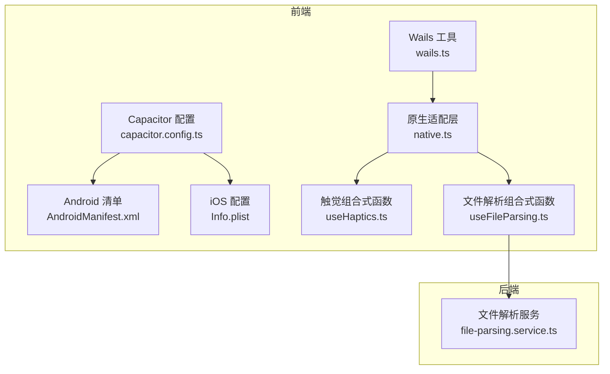
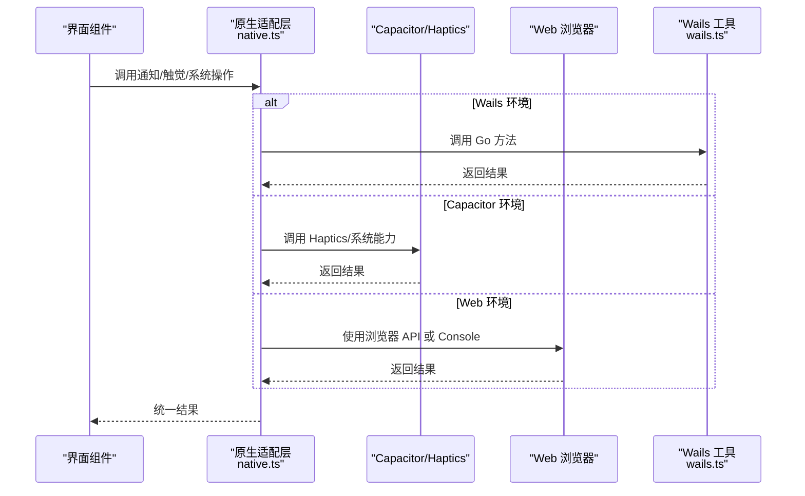
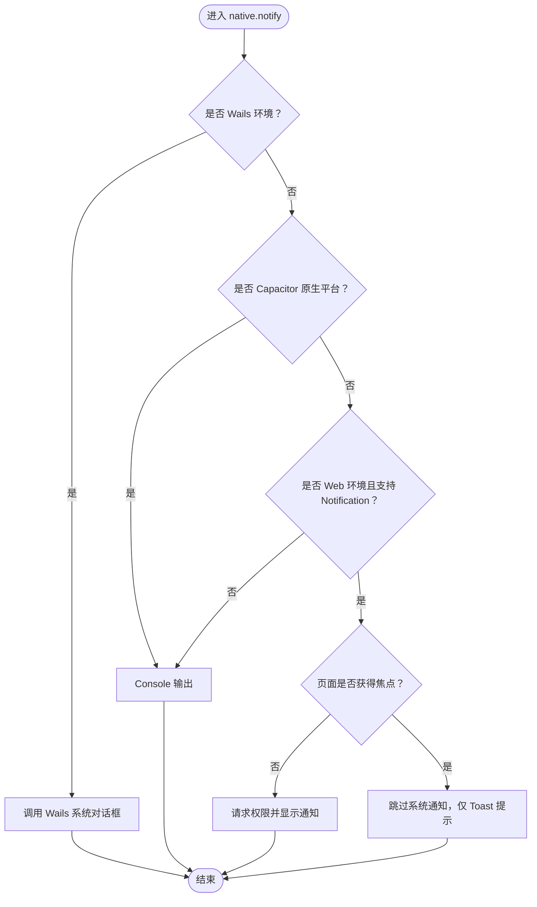
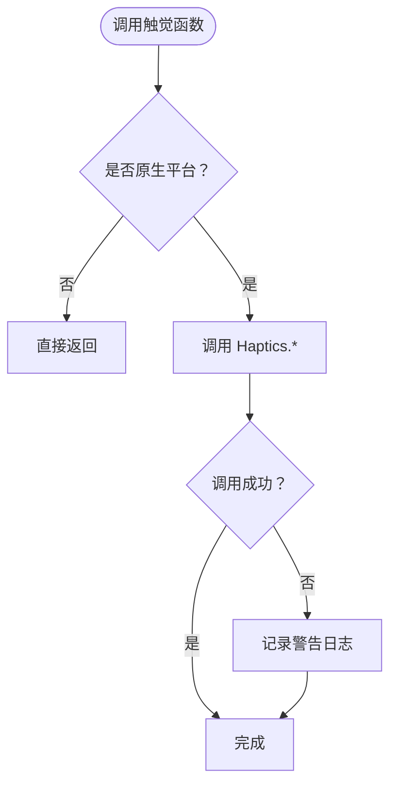
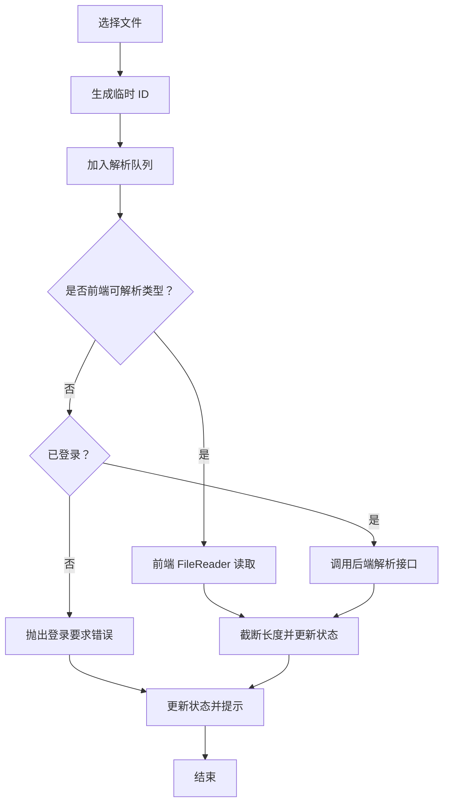
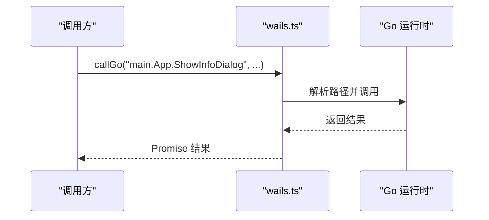
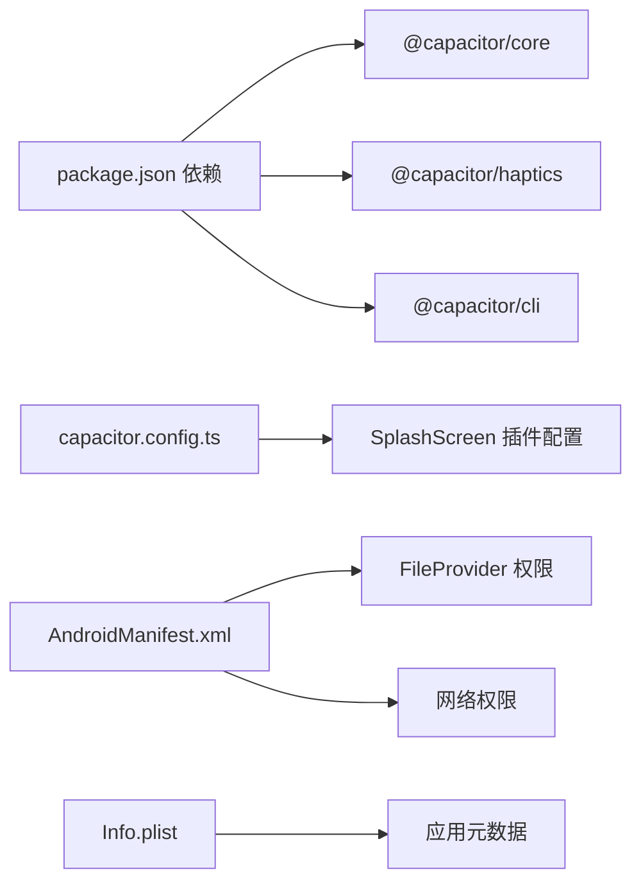

# 原生功能集成

<cite>
**本文引用的文件**
- [apps/frontend/capacitor.config.ts](file://apps/frontend/capacitor.config.ts)
- [apps/frontend/package.json](file://apps/frontend/package.json)
- [apps/frontend/src/services/native.ts](file://apps/frontend/src/services/native.ts)
- [apps/frontend/src/composables/useHaptics.ts](file://apps/frontend/src/composables/useHaptics.ts)
- [apps/frontend/src/composables/useFileParsing.ts](file://apps/frontend/src/composables/useFileParsing.ts)
- [apps/frontend/src/lib/wails.ts](file://apps/frontend/src/lib/wails.ts)
- [apps/frontend/android/app/src/main/AndroidManifest.xml](file://apps/frontend/android/app/src/main/AndroidManifest.xml)
- [apps/frontend/ios/App/App/Info.plist](file://apps/frontend/ios/App/App/Info.plist)
- [apps/backend/src/upload/file-parsing.service.ts](file://apps/backend/src/upload/file-parsing.service.ts)
</cite>

## 目录
1. [简介](#简介)
2. [项目结构](#项目结构)
3. [核心组件](#核心组件)
4. [架构总览](#架构总览)
5. [详细组件分析](#详细组件分析)
6. [依赖关系分析](#依赖关系分析)
7. [性能考量](#性能考量)
8. [故障排查指南](#故障排查指南)
9. [结论](#结论)
10. [附录](#附录)

## 简介
本指南聚焦于混合应用中的原生功能集成，涵盖 Capacitor 插件使用与自定义扩展、文件系统访问、相机集成、推送通知、地理位置、设备信息、触觉反馈与振动、以及文件解析与处理的原生实现。文档同时提供错误处理与兼容性建议、性能优化策略，并给出创建自定义 Capacitor 插件的步骤。

## 项目结构
前端采用 Capacitor 作为跨平台桥接层，结合 Wails 实现桌面原生体验；后端提供复杂文件解析能力。关键目录与文件如下：
- Capacitor 配置与平台清单
  - [apps/frontend/capacitor.config.ts](file://apps/frontend/capacitor.config.ts)
  - [apps/frontend/android/app/src/main/AndroidManifest.xml](file://apps/frontend/android/app/src/main/AndroidManifest.xml)
  - [apps/frontend/ios/App/App/Info.plist](file://apps/frontend/ios/App/App/Info.plist)
- 前端依赖与脚本
  - [apps/frontend/package.json](file://apps/frontend/package.json)
- 原生能力适配层与组合式函数
  - [apps/frontend/src/services/native.ts](file://apps/frontend/src/services/native.ts)
  - [apps/frontend/src/composables/useHaptics.ts](file://apps/frontend/src/composables/useHaptics.ts)
  - [apps/frontend/src/composables/useFileParsing.ts](file://apps/frontend/src/composables/useFileParsing.ts)
  - [apps/frontend/src/lib/wails.ts](file://apps/frontend/src/lib/wails.ts)
- 后端文件解析服务
  - [apps/backend/src/upload/file-parsing.service.ts](file://apps/backend/src/upload/file-parsing.service.ts)

**图表来源**
- [apps/frontend/capacitor.config.ts:1-23](file://apps/frontend/capacitor.config.ts#L1-L23)
- [apps/frontend/android/app/src/main/AndroidManifest.xml:1-42](file://apps/frontend/android/app/src/main/AndroidManifest.xml#L1-L42)
- [apps/frontend/ios/App/App/Info.plist:1-52](file://apps/frontend/ios/App/App/Info.plist#L1-L52)
- [apps/frontend/src/services/native.ts:1-116](file://apps/frontend/src/services/native.ts#L1-L116)
- [apps/frontend/src/composables/useHaptics.ts:1-62](file://apps/frontend/src/composables/useHaptics.ts#L1-L62)
- [apps/frontend/src/composables/useFileParsing.ts:1-122](file://apps/frontend/src/composables/useFileParsing.ts#L1-L122)
- [apps/frontend/src/lib/wails.ts:1-92](file://apps/frontend/src/lib/wails.ts#L1-L92)
- [apps/backend/src/upload/file-parsing.service.ts:1-142](file://apps/backend/src/upload/file-parsing.service.ts#L1-L142)

**章节来源**
- [apps/frontend/capacitor.config.ts:1-23](file://apps/frontend/capacitor.config.ts#L1-L23)
- [apps/frontend/package.json:1-104](file://apps/frontend/package.json#L1-L104)

## 核心组件
- 原生适配层（Bridge Pattern）
  - 统一 Wails、Capacitor 与 Web 的调用接口，自动识别平台并分派到对应实现。
  - 能力覆盖：通知/对话框、触觉反馈、打开浏览器、窗口控制、退出应用等。
- 触觉反馈组合式函数
  - 封装 Capacitor Haptics 插件，提供 impact、selectionStart/Changed/End、vibrate 等能力。
- 文件解析组合式函数
  - 前端直读简单文本/代码文件；复杂文档（PDF/Word/Excel）由后端解析，统一返回文本内容并截断超长文本。
- Wails 工具
  - 类型安全地调用 Go 层方法，提供系统对话框、浏览器打开、窗口切换、迷你模式等桌面能力。

**章节来源**
- [apps/frontend/src/services/native.ts:1-116](file://apps/frontend/src/services/native.ts#L1-L116)
- [apps/frontend/src/composables/useHaptics.ts:1-62](file://apps/frontend/src/composables/useHaptics.ts#L1-L62)
- [apps/frontend/src/composables/useFileParsing.ts:1-122](file://apps/frontend/src/composables/useFileParsing.ts#L1-L122)
- [apps/frontend/src/lib/wails.ts:1-92](file://apps/frontend/src/lib/wails.ts#L1-L92)

## 架构总览
下图展示前端原生能力的调用链路与平台差异：

**图表来源**
- [apps/frontend/src/services/native.ts:1-116](file://apps/frontend/src/services/native.ts#L1-L116)
- [apps/frontend/src/lib/wails.ts:1-92](file://apps/frontend/src/lib/wails.ts#L1-L92)

## 详细组件分析

### 原生适配层（native.ts）
- 平台探测：优先检测 Wails，其次 Capacitor 原生平台，否则回退至 Web。
- 通知/对话框：Wails 使用系统对话框；Web 使用浏览器 Notification API；失败或非强制场景下降级到 Console。
- 触觉反馈：仅在原生平台执行 Capacitor Haptics。
- 系统操作：打开浏览器、窗口切换、迷你模式、退出应用等，按平台分派。

**图表来源**
- [apps/frontend/src/services/native.ts:22-58](file://apps/frontend/src/services/native.ts#L22-L58)

**章节来源**
- [apps/frontend/src/services/native.ts:1-116](file://apps/frontend/src/services/native.ts#L1-L116)

### 触觉反馈（useHaptics.ts）
- 能力清单：impact、selectionStart/Changed/End、vibrate。
- 安全调用：仅在原生平台可用；异常捕获并记录警告日志。
- 使用建议：根据交互阶段选择合适样式，避免过度触发导致体验下降。

**图表来源**
- [apps/frontend/src/composables/useHaptics.ts:6-61](file://apps/frontend/src/composables/useHaptics.ts#L6-L61)

**章节来源**
- [apps/frontend/src/composables/useHaptics.ts:1-62](file://apps/frontend/src/composables/useHaptics.ts#L1-L62)

### 文件解析（useFileParsing.ts）
- 解析策略：
  - 简单文本/代码：前端 FileReader 直读。
  - 复杂文档（PDF/DOCX/XLSX）：后端解析，需登录态。
- 错误处理：统一捕获并提示，更新状态与错误信息。
- 内容截断：超过阈值自动截断并提示用户。

**图表来源**
- [apps/frontend/src/composables/useFileParsing.ts:47-95](file://apps/frontend/src/composables/useFileParsing.ts#L47-L95)
- [apps/backend/src/upload/file-parsing.service.ts:16-72](file://apps/backend/src/upload/file-parsing.service.ts#L16-L72)

**章节来源**
- [apps/frontend/src/composables/useFileParsing.ts:1-122](file://apps/frontend/src/composables/useFileParsing.ts#L1-L122)
- [apps/backend/src/upload/file-parsing.service.ts:1-142](file://apps/backend/src/upload/file-parsing.service.ts#L1-L142)

### Wails 工具（wails.ts）
- 环境检测：通过 window.go 与 window.runtime 判断。
- 方法调用：按点号路径解析并调用 Go 方法，提供类型安全包装。
- 常用系统操作：信息/错误对话框、打开浏览器、退出、窗口切换、迷你模式。

**图表来源**
- [apps/frontend/src/lib/wails.ts:29-52](file://apps/frontend/src/lib/wails.ts#L29-L52)

**章节来源**
- [apps/frontend/src/lib/wails.ts:1-92](file://apps/frontend/src/lib/wails.ts#L1-L92)

## 依赖关系分析
- Capacitor 生态
  - 核心与插件版本在前端依赖中声明，确保与 Capacitor CLI 一致。
  - 配置文件启用启动屏插件，设置服务器参数与应用标识。
- 平台清单
  - Android 清单声明 FileProvider 与网络权限，便于文件分享与网络访问。
  - iOS Info.plist 定义应用元数据与设备能力支持。

**图表来源**
- [apps/frontend/package.json:30-70](file://apps/frontend/package.json#L30-L70)
- [apps/frontend/capacitor.config.ts:13-20](file://apps/frontend/capacitor.config.ts#L13-L20)
- [apps/frontend/android/app/src/main/AndroidManifest.xml:27-41](file://apps/frontend/android/app/src/main/AndroidManifest.xml#L27-L41)
- [apps/frontend/ios/App/App/Info.plist:4-51](file://apps/frontend/ios/App/App/Info.plist#L4-L51)

**章节来源**
- [apps/frontend/package.json:1-104](file://apps/frontend/package.json#L1-L104)
- [apps/frontend/capacitor.config.ts:1-23](file://apps/frontend/capacitor.config.ts#L1-L23)
- [apps/frontend/android/app/src/main/AndroidManifest.xml:1-42](file://apps/frontend/android/app/src/main/AndroidManifest.xml#L1-L42)
- [apps/frontend/ios/App/App/Info.plist:1-52](file://apps/frontend/ios/App/App/Info.plist#L1-L52)

## 性能考量
- 文件解析
  - 前端直读适用于小文件，避免网络往返；大文件或复杂格式走后端，减少前端内存压力。
  - 对超长文本进行截断，避免 UI 卡顿与传输开销。
- 触觉反馈
  - 控制触发频率与时机，避免频繁 impact 导致电池消耗与体验疲劳。
- 平台差异
  - Web 环境尽量使用轻量级通知；仅在必要时请求系统通知权限。
- 缓存与复用
  - 对解析结果进行缓存，避免重复解析同一文件。
- 网络与并发
  - 合理限制并发解析数量，避免阻塞主线程。

## 故障排查指南
- 触觉反馈无效
  - 确认运行在原生平台；检查 Capacitor Haptics 插件是否正确安装与同步。
  - 参考：[apps/frontend/src/composables/useHaptics.ts:6-61](file://apps/frontend/src/composables/useHaptics.ts#L6-L61)
- 通知未显示
  - Web 环境需满足浏览器通知权限与页面焦点条件；Wails 使用系统对话框。
  - 参考：[apps/frontend/src/services/native.ts:22-58](file://apps/frontend/src/services/native.ts#L22-L58)
- 文件解析失败
  - 简单类型前端读取失败：检查文件编码与大小限制。
  - 复杂类型后端解析失败：确认登录态与后端服务可用性。
  - 参考：
    - [apps/frontend/src/composables/useFileParsing.ts:47-95](file://apps/frontend/src/composables/useFileParsing.ts#L47-L95)
    - [apps/backend/src/upload/file-parsing.service.ts:16-72](file://apps/backend/src/upload/file-parsing.service.ts#L16-L72)
- Wails 方法调用报错
  - 确认在 Wails 环境下调用；检查方法路径与签名。
  - 参考：[apps/frontend/src/lib/wails.ts:29-52](file://apps/frontend/src/lib/wails.ts#L29-L52)

**章节来源**
- [apps/frontend/src/composables/useHaptics.ts:1-62](file://apps/frontend/src/composables/useHaptics.ts#L1-L62)
- [apps/frontend/src/services/native.ts:1-116](file://apps/frontend/src/services/native.ts#L1-L116)
- [apps/frontend/src/composables/useFileParsing.ts:1-122](file://apps/frontend/src/composables/useFileParsing.ts#L1-L122)
- [apps/backend/src/upload/file-parsing.service.ts:1-142](file://apps/backend/src/upload/file-parsing.service.ts#L1-L142)
- [apps/frontend/src/lib/wails.ts:1-92](file://apps/frontend/src/lib/wails.ts#L1-L92)

## 结论
通过原生适配层与组合式函数，项目在多平台间实现了统一的原生能力调用；前端直读与后端解析相结合，兼顾性能与准确性；Wails 与 Capacitor 的并行支持，覆盖移动端、桌面端与 Web 环境。遵循本文的错误处理、兼容性与性能建议，可进一步提升稳定性与用户体验。

## 附录

### 原生功能实现要点速查
- 文件系统访问
  - Web：使用标准 File API；注意同源与用户手势触发。
  - Capacitor：使用 Filesystem 插件（需安装与配置）。
  - Wails：通过 Go 层文件系统 API 访问。
- 相机集成
  - Web：navigator.mediaDevices.getUserMedia + video 拍照。
  - Capacitor：使用 Camera 插件。
  - Wails：通过 Go 层摄像头访问。
- 推送通知
  - Web：Service Worker + Push API（需 HTTPS 与权限）。
  - Capacitor：Local Notifications 插件。
  - Wails：桌面系统通知（由 Go 层实现）。
- 地理位置
  - Web：Geolocation API（需用户授权）。
  - Capacitor：Geolocation 插件。
  - Wails：桌面系统定位（由 Go 层实现）。
- 设备信息
  - Web：UA、屏幕尺寸、语言等只读信息。
  - Capacitor：Device 插件。
  - Wails：通过 Go 层查询系统信息。
- 触觉反馈与振动
  - Capacitor：Haptics 插件；仅在原生平台生效。
  - Wails：桌面系统振动（由 Go 层实现）。
- 文件解析与处理
  - 前端直读：文本/代码文件。
  - 后端解析：PDF/DOCX/XLSX 等复杂文档。
  - 截断与提示：避免超长文本影响性能与体验。

### 自定义 Capacitor 插件开发步骤
- 创建插件骨架
  - 使用 Capacitor CLI 初始化插件工程，生成 JS/TS 与原生桥接代码。
- 实现 JS/TS API
  - 定义公共方法与类型声明，封装原生命令。
- 实现原生端逻辑
  - Android：Java/Kotlin 扩展 Capacitor 的 Plugin 类。
  - iOS：Swift/Objective-C 扩展 CAPPlugin。
- 集成与测试
  - 在应用中安装插件并进行端到端测试。
- 发布与维护
  - 通过 npm 发布，保持与 Capacitor 版本兼容。