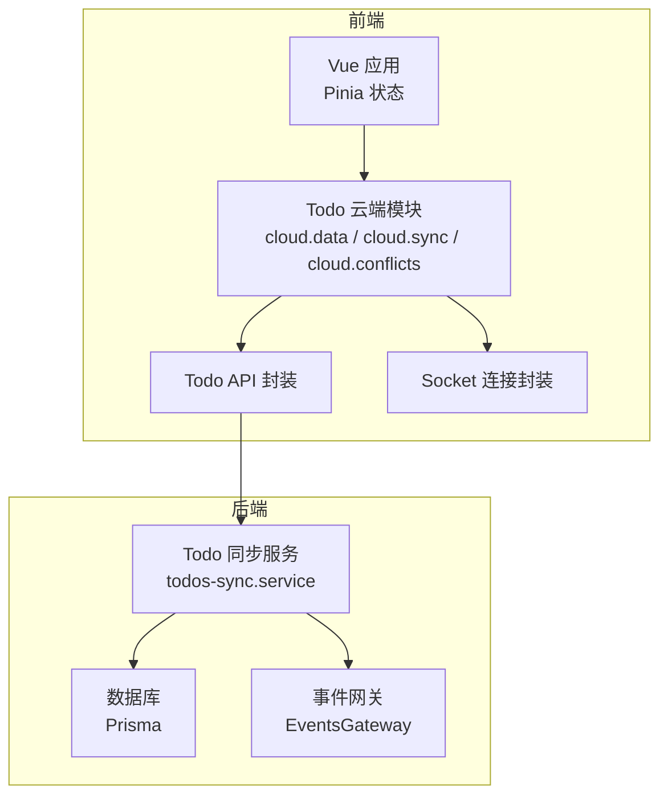
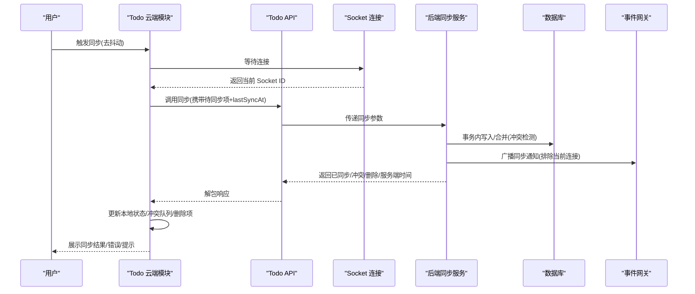
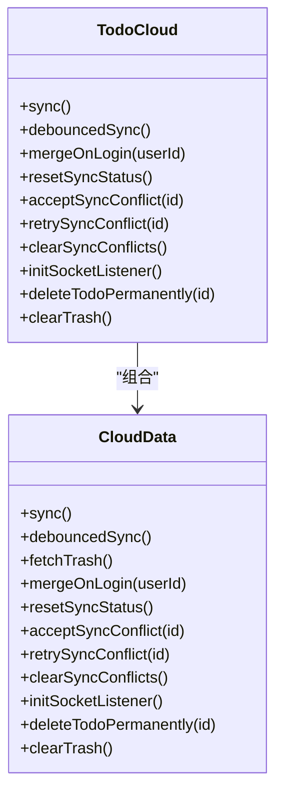
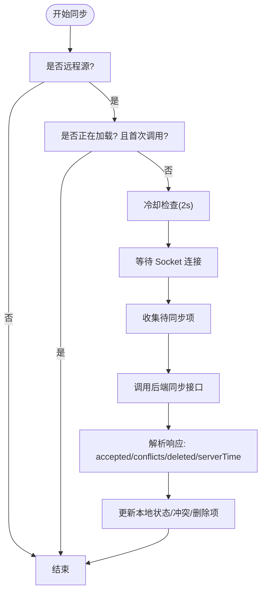
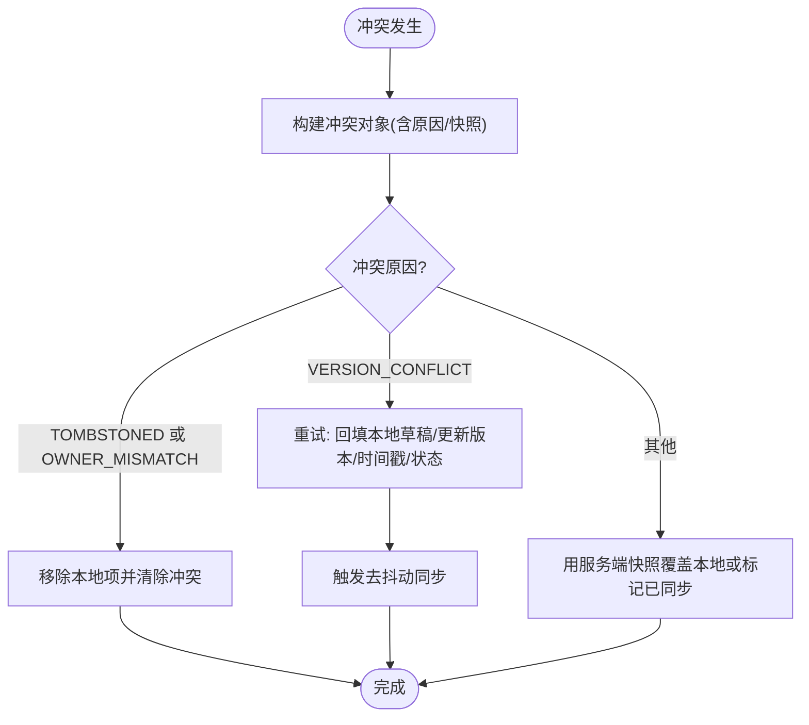
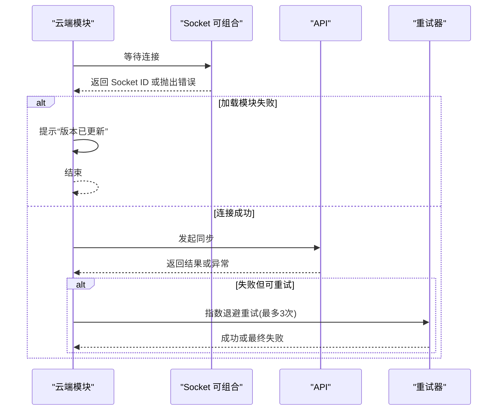
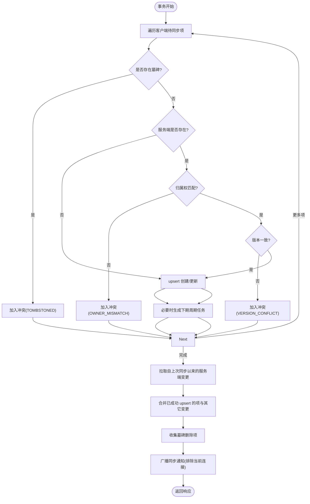
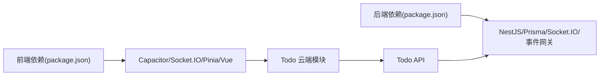

# 离线同步与数据管理

<cite>
**本文引用的文件**
- [apps/frontend/src/features/todo/stores/todo.cloud.ts](file://apps/frontend/src/features/todo/stores/todo.cloud.ts)
- [apps/frontend/src/features/todo/stores/todo.cloud.data.ts](file://apps/frontend/src/features/todo/stores/todo.cloud.data.ts)
- [apps/frontend/src/features/todo/stores/todo.cloud.sync.ts](file://apps/frontend/src/features/todo/stores/todo.cloud.sync.ts)
- [apps/frontend/src/features/todo/stores/todo.cloud.conflicts.ts](file://apps/frontend/src/features/todo/stores/todo.cloud.conflicts.ts)
- [apps/frontend/src/features/todo/stores/todo.cloud.listeners.ts](file://apps/frontend/src/features/todo/stores/todo.cloud.listeners.ts)
- [apps/frontend/src/features/todo/stores/todo.cloud.trash.ts](file://apps/frontend/src/features/todo/stores/todo.cloud.trash.ts)
- [apps/frontend/src/features/todo/stores/todo.cloud.types.ts](file://apps/frontend/src/features/todo/stores/todo.cloud.types.ts)
- [apps/frontend/src/features/todo/stores/todo.types.ts](file://apps/frontend/src/features/todo/stores/todo.types.ts)
- [apps/frontend/src/features/todo/api/index.ts](file://apps/frontend/src/features/todo/api/index.ts)
- [apps/frontend/src/composables/useSocket.ts](file://apps/frontend/src/composables/useSocket.ts)
- [apps/frontend/src/composables/useRequest.ts](file://apps/frontend/src/composables/useRequest.ts)
- [apps/frontend/package.json](file://apps/frontend/package.json)
- [apps/backend/src/todos/todos-sync.service.ts](file://apps/backend/src/todos/todos-sync.service.ts)
- [apps/backend/src/todos/todos-sync.recurrence.ts](file://apps/backend/src/todos/todos-sync.recurrence.ts)
- [apps/backend/src/events/events.gateway.ts](file://apps/backend/src/events/events.gateway.ts)
- [apps/backend/package.json](file://apps/backend/package.json)
</cite>

## 目录
1. [引言](#引言)
2. [项目结构](#项目结构)
3. [核心组件](#核心组件)
4. [架构总览](#架构总览)
5. [详细组件分析](#详细组件分析)
6. [依赖关系分析](#依赖关系分析)
7. [性能考量](#性能考量)
8. [故障排查指南](#故障排查指南)
9. [结论](#结论)
10. [附录](#附录)

## 引言
本文件面向移动端离线同步与数据管理，聚焦 Lumina Todo 在移动端的离线数据存储策略、增量同步、冲突解决、网络状态检测与自动重连、数据一致性与事务处理、移动端特有的压缩与传输优化、离线体验设计与状态提示、数据迁移与版本升级、以及性能监控与故障诊断。文档以代码为依据，结合可视化图示，帮助开发者与产品人员快速理解并优化移动端数据体验。

## 项目结构
移动端前端采用 Capacitor 架构，使用 Vue 3 + Pinia 状态管理；后端基于 NestJS + Prisma，提供增量同步与事件广播能力。Todo 同步相关逻辑集中在前端 Todo Store 的云端模块，后端提供统一的同步服务与事件网关。

图表来源
- [apps/frontend/src/features/todo/stores/todo.cloud.data.ts:1-43](file://apps/frontend/src/features/todo/stores/todo.cloud.data.ts#L1-L43)
- [apps/frontend/src/features/todo/stores/todo.cloud.sync.ts:1-214](file://apps/frontend/src/features/todo/stores/todo.cloud.sync.ts#L1-L214)
- [apps/frontend/src/features/todo/api/index.ts](file://apps/frontend/src/features/todo/api/index.ts)
- [apps/frontend/src/composables/useSocket.ts](file://apps/frontend/src/composables/useSocket.ts)
- [apps/backend/src/todos/todos-sync.service.ts:1-221](file://apps/backend/src/todos/todos-sync.service.ts#L1-L221)
- [apps/backend/src/events/events.gateway.ts](file://apps/backend/src/events/events.gateway.ts)

章节来源
- [apps/frontend/package.json:1-104](file://apps/frontend/package.json#L1-L104)
- [apps/backend/package.json:1-108](file://apps/backend/package.json#L1-L108)

## 核心组件
- 云端聚合器：负责将同步、冲突、监听、回收站等动作聚合到统一入口，便于调用与维护。
- 同步动作：封装增量同步、去抖动触发、失败重试、版本冲突处理、删除项清理等。
- 冲突处理：构建冲突对象、接受冲突、重试冲突、清理冲突。
- 监听器：初始化 Socket 监听，接收服务端广播，触发去抖动同步。
- 回收站：拉取回收站、永久删除、清空回收站。
- 类型与依赖：定义云端模块依赖接口、Todo 类型与冲突类型。

章节来源
- [apps/frontend/src/features/todo/stores/todo.cloud.ts:1-44](file://apps/frontend/src/features/todo/stores/todo.cloud.ts#L1-L44)
- [apps/frontend/src/features/todo/stores/todo.cloud.data.ts:1-43](file://apps/frontend/src/features/todo/stores/todo.cloud.data.ts#L1-L43)
- [apps/frontend/src/features/todo/stores/todo.cloud.sync.ts:1-214](file://apps/frontend/src/features/todo/stores/todo.cloud.sync.ts#L1-L214)
- [apps/frontend/src/features/todo/stores/todo.cloud.conflicts.ts:1-91](file://apps/frontend/src/features/todo/stores/todo.cloud.conflicts.ts#L1-L91)
- [apps/frontend/src/features/todo/stores/todo.cloud.listeners.ts](file://apps/frontend/src/features/todo/stores/todo.cloud.listeners.ts)
- [apps/frontend/src/features/todo/stores/todo.cloud.trash.ts](file://apps/frontend/src/features/todo/stores/todo.cloud.trash.ts)
- [apps/frontend/src/features/todo/stores/todo.cloud.types.ts](file://apps/frontend/src/features/todo/stores/todo.cloud.types.ts)
- [apps/frontend/src/features/todo/stores/todo.types.ts](file://apps/frontend/src/features/todo/stores/todo.types.ts)

## 架构总览
移动端通过 Socket 连接后端，发起增量同步请求；后端在事务中处理客户端推送的变更，检测冲突并返回合并结果；前端根据返回的 accepted/conflicts/deletedIds 更新本地状态，并通过去抖动与重试保障稳定性；同时，后端通过事件网关向其他在线设备广播同步通知，实现多端协同。

图表来源
- [apps/frontend/src/features/todo/stores/todo.cloud.sync.ts:36-181](file://apps/frontend/src/features/todo/stores/todo.cloud.sync.ts#L36-L181)
- [apps/frontend/src/composables/useSocket.ts](file://apps/frontend/src/composables/useSocket.ts)
- [apps/frontend/src/features/todo/api/index.ts](file://apps/frontend/src/features/todo/api/index.ts)
- [apps/backend/src/todos/todos-sync.service.ts:51-219](file://apps/backend/src/todos/todos-sync.service.ts#L51-L219)
- [apps/backend/src/events/events.gateway.ts](file://apps/backend/src/events/events.gateway.ts)

## 详细组件分析

### 云端模块聚合与职责
- 聚合入口：对外暴露 sync、debouncedSync、mergeOnLogin、acceptSyncConflict、retrySyncConflict、clearSyncConflicts、initSocketListener、deleteTodoPermanently、clearTrash 等方法。
- 依赖注入：todos、remoteTodos、loading、error、lastSyncAt、syncOwnerId、syncConflicts、toSharedTodo、isTrashLoaded、isRemoteSource 等。
- 组合子：同步动作、冲突动作、监听动作、回收站动作。

图表来源
- [apps/frontend/src/features/todo/stores/todo.cloud.ts:6-44](file://apps/frontend/src/features/todo/stores/todo.cloud.ts#L6-L44)
- [apps/frontend/src/features/todo/stores/todo.cloud.data.ts:7-42](file://apps/frontend/src/features/todo/stores/todo.cloud.data.ts#L7-L42)

章节来源
- [apps/frontend/src/features/todo/stores/todo.cloud.ts:1-44](file://apps/frontend/src/features/todo/stores/todo.cloud.ts#L1-L44)
- [apps/frontend/src/features/todo/stores/todo.cloud.data.ts:1-43](file://apps/frontend/src/features/todo/stores/todo.cloud.data.ts#L1-L43)

### 增量同步与去抖动
- 去抖动：默认冷却时间为 2 秒，避免频繁触发；支持外部调用立即执行。
- 幂等与节流：记录最近一次同步时间，短时间内重复调用直接返回。
- 认证与连接：登录态校验，等待 Socket 连接稳定后再发起同步。
- 待同步项筛选：仅对非“已同步”的本地任务参与同步。
- 响应处理：解析 acceptedIds、conflicts、deletedIds、serverTime，更新本地状态与冲突队列；若无 accepted 且无冲突，则回退标记为已同步。

图表来源
- [apps/frontend/src/features/todo/stores/todo.cloud.sync.ts:36-181](file://apps/frontend/src/features/todo/stores/todo.cloud.sync.ts#L36-L181)

章节来源
- [apps/frontend/src/features/todo/stores/todo.cloud.sync.ts:1-214](file://apps/frontend/src/features/todo/stores/todo.cloud.sync.ts#L1-L214)

### 冲突检测与解决
- 冲突类型：
  - TOMBSTONED：目标项已被软删除（墓碑），本地应移除。
  - OWNER_MISMATCH：目标项归属权不匹配，本地应移除。
  - VERSION_CONFLICT：版本不一致，需要用户选择或重试。
- 构建冲突：记录冲突原因、服务端版本、本地草稿与服务端快照。
- 接受冲突：
  - TOMBSTONED/OWNER_MISMATCH：从本地移除该项并清除冲突。
  - 其他：用服务端快照覆盖本地，或标记为已同步。
- 重试冲突：将本地草稿回填到本地，更新版本/时间戳/状态，清除冲突并触发去抖动同步。

图表来源
- [apps/frontend/src/features/todo/stores/todo.cloud.conflicts.ts:6-91](file://apps/frontend/src/features/todo/stores/todo.cloud.conflicts.ts#L6-L91)

章节来源
- [apps/frontend/src/features/todo/stores/todo.cloud.conflicts.ts:1-91](file://apps/frontend/src/features/todo/stores/todo.cloud.conflicts.ts#L1-L91)

### 网络状态检测与自动重连
- Socket 连接：通过可组合函数等待连接稳定，返回当前 Socket ID 供同步使用。
- 动态导入兼容：若因部署导致动态模块加载失败，捕获错误并提示“版本已更新”，避免阻塞主流程。
- 失败重试：最多 3 次指数退避重试，每次间隔 1s、2s、4s；超过上限后设置错误状态。

图表来源
- [apps/frontend/src/features/todo/stores/todo.cloud.sync.ts:53-72](file://apps/frontend/src/features/todo/stores/todo.cloud.sync.ts#L53-L72)
- [apps/frontend/src/features/todo/stores/todo.cloud.sync.ts:165-181](file://apps/frontend/src/features/todo/stores/todo.cloud.sync.ts#L165-L181)
- [apps/frontend/src/composables/useSocket.ts](file://apps/frontend/src/composables/useSocket.ts)

章节来源
- [apps/frontend/src/features/todo/stores/todo.cloud.sync.ts:1-214](file://apps/frontend/src/features/todo/stores/todo.cloud.sync.ts#L1-L214)
- [apps/frontend/src/composables/useSocket.ts](file://apps/frontend/src/composables/useSocket.ts)

### 数据一致性与事务处理
- 事务边界：后端在单个事务中处理客户端推送的所有变更，确保原子性。
- 冲突判定：严格基于版本号比对，避免客户端时钟漂移影响。
- 归属校验：若目标项不属于当前用户，标记为 OWNER_MISMATCH。
- 墓碑处理：若目标项存在墓碑，标记为 TOMBSTONED。
- 版本递增：成功 upsert 后，版本号自增；同时处理周期性任务的下次生成。
- 服务端时间：返回 serverTime，用于前端 lastSyncAt 更新与后续增量拉取。

图表来源
- [apps/backend/src/todos/todos-sync.service.ts:66-174](file://apps/backend/src/todos/todos-sync.service.ts#L66-L174)
- [apps/backend/src/todos/todos-sync.service.ts:177-219](file://apps/backend/src/todos/todos-sync.service.ts#L177-L219)
- [apps/backend/src/events/events.gateway.ts](file://apps/backend/src/events/events.gateway.ts)

章节来源
- [apps/backend/src/todos/todos-sync.service.ts:1-221](file://apps/backend/src/todos/todos-sync.service.ts#L1-L221)

### 移动端特有的数据压缩与传输优化
- 压缩库：前端依赖压缩插件，可在构建阶段启用资源压缩，降低包体与传输体积。
- 传输策略：同步接口仅传输变更项与 lastSyncAt，避免全量拉取；服务端按 since 过滤变更，减少网络负载。
- 本地缓存：Pinia 持久化插件用于本地状态持久化，结合去抖动与失败重试，减少无效请求。
- 图标与静态资源：前端 PWA 配置与图标生成工具，提升离线可用性与加载速度。

章节来源
- [apps/frontend/package.json:97-98](file://apps/frontend/package.json#L97-L98)
- [apps/frontend/src/features/todo/stores/todo.cloud.sync.ts:84-90](file://apps/frontend/src/features/todo/stores/todo.cloud.sync.ts#L84-L90)
- [apps/backend/src/todos/todos-sync.service.ts:177-187](file://apps/backend/src/todos/todos-sync.service.ts#L177-L187)

### 离线模式下的用户体验设计与状态提示
- 状态反馈：loading/error 字段驱动 UI 展示加载与错误提示；冲突列表提供“接受/重试/清除”操作。
- 版本更新提示：动态模块加载失败时，toast 提示“版本已更新”，引导刷新页面。
- 自动重试：指数退避重试，避免频繁失败打扰用户。
- 去抖动：减少高频操作带来的多次网络请求，改善交互流畅度。

章节来源
- [apps/frontend/src/features/todo/stores/todo.cloud.sync.ts:32-34](file://apps/frontend/src/features/todo/stores/todo.cloud.sync.ts#L32-L34)
- [apps/frontend/src/features/todo/stores/todo.cloud.sync.ts:62-72](file://apps/frontend/src/features/todo/stores/todo.cloud.sync.ts#L62-L72)
- [apps/frontend/src/features/todo/stores/todo.cloud.sync.ts:172-177](file://apps/frontend/src/features/todo/stores/todo.cloud.sync.ts#L172-L177)

### 数据迁移与版本升级
- 前端版本更新：动态导入模块失败时，提示“版本已更新”，建议用户刷新页面以加载最新资源。
- 后端迁移：后端 Prisma 提供迁移命令，支持数据库结构演进；同步服务保持向后兼容的数据字段与版本语义。
- 升级策略：建议在发布前评估字段变更与冲突规则，确保旧客户端仍能安全同步。

章节来源
- [apps/frontend/src/features/todo/stores/todo.cloud.sync.ts:62-72](file://apps/frontend/src/features/todo/stores/todo.cloud.sync.ts#L62-L72)
- [apps/backend/package.json:25-28](file://apps/backend/package.json#L25-L28)

### 性能监控与故障诊断
- 日志与错误：同步失败时记录尝试次数与错误信息；错误状态码与消息由后端返回，前端统一展示。
- 重试策略：指数退避减少对后端压力，同时提升成功率。
- 诊断建议：
  - 检查 Socket 连接状态与动态模块加载日志。
  - 关注冲突类型分布，定位 OWNER_MISMATCH/TOMBSTONED/VERSION_CONFLICT 的占比。
  - 监控 lastSyncAt 与 serverTime 差值，评估网络延迟与客户端时钟偏差。
  - 使用浏览器/设备开发者工具查看网络请求与重试行为。

章节来源
- [apps/frontend/src/features/todo/stores/todo.cloud.sync.ts:165-181](file://apps/frontend/src/features/todo/stores/todo.cloud.sync.ts#L165-L181)
- [apps/frontend/src/composables/useRequest.ts](file://apps/frontend/src/composables/useRequest.ts)

## 依赖关系分析
- 前端依赖：Capacitor、Socket.IO 客户端、Pinia、Vue Query、压缩插件等。
- 后端依赖：NestJS、Prisma、Redis 缓存、Socket.IO 服务端、事件网关等。
- 通信协议：HTTP API + Socket 广播，同步接口返回结构化响应，包含 accepted/conflicts/deleted/serverTime。

图表来源
- [apps/frontend/package.json:30-69](file://apps/frontend/package.json#L30-L69)
- [apps/backend/package.json:30-85](file://apps/backend/package.json#L30-L85)

章节来源
- [apps/frontend/package.json:1-104](file://apps/frontend/package.json#L1-L104)
- [apps/backend/package.json:1-108](file://apps/backend/package.json#L1-L108)

## 性能考量
- 增量同步：仅传输变更项与时间戳，显著降低带宽占用。
- 事务写入：后端单事务处理多个变更，减少锁竞争与往返开销。
- 去抖动与重试：减少无效请求与抖动，提升用户体验。
- 压缩与缓存：前端构建压缩与 Pinia 持久化，降低加载与存储成本。
- 周期任务：服务端在 upsert 后按需生成下期任务，避免客户端重复计算。

## 故障排查指南
- 同步失败：
  - 检查 Socket 连接状态与动态模块加载日志。
  - 查看错误状态码与消息，确认是否为网络问题或认证失败。
  - 观察冲突类型，针对性处理 TOMBSTONED/OWNER_MISMATCH/VERSION_CONFLICT。
- 多端不同步：
  - 确认事件网关广播是否正常，排除当前连接。
  - 检查 lastSyncAt 是否正确更新，避免重复拉取。
- 性能问题：
  - 监控去抖动与重试频率，调整冷却时间与重试上限。
  - 评估变更批次大小，分批提交以降低事务压力。

章节来源
- [apps/frontend/src/features/todo/stores/todo.cloud.sync.ts:165-181](file://apps/frontend/src/features/todo/stores/todo.cloud.sync.ts#L165-L181)
- [apps/backend/src/todos/todos-sync.service.ts:208-210](file://apps/backend/src/todos/todos-sync.service.ts#L208-L210)

## 结论
Lumina Todo 的移动端离线同步体系以“增量同步 + 事务合并 + 冲突检测 + Socket 广播”为核心，结合去抖动、指数退避与版本更新提示，实现了稳健的离线体验与多端一致性。前端通过云端模块聚合与清晰的状态管理，后端通过 Prisma 事务与事件网关保障数据一致性与实时性。建议在发布前完善冲突场景测试与网络异常模拟，持续优化同步阈值与提示策略。

## 附录
- 关键路径参考：
  - 云端聚合入口：[apps/frontend/src/features/todo/stores/todo.cloud.ts:6-44](file://apps/frontend/src/features/todo/stores/todo.cloud.ts#L6-L44)
  - 同步动作实现：[apps/frontend/src/features/todo/stores/todo.cloud.sync.ts:36-181](file://apps/frontend/src/features/todo/stores/todo.cloud.sync.ts#L36-L181)
  - 冲突处理逻辑：[apps/frontend/src/features/todo/stores/todo.cloud.conflicts.ts:33-83](file://apps/frontend/src/features/todo/stores/todo.cloud.conflicts.ts#L33-L83)
  - 后端同步服务：[apps/backend/src/todos/todos-sync.service.ts:51-219](file://apps/backend/src/todos/todos-sync.service.ts#L51-L219)
  - 事件网关广播：[apps/backend/src/events/events.gateway.ts](file://apps/backend/src/events/events.gateway.ts)