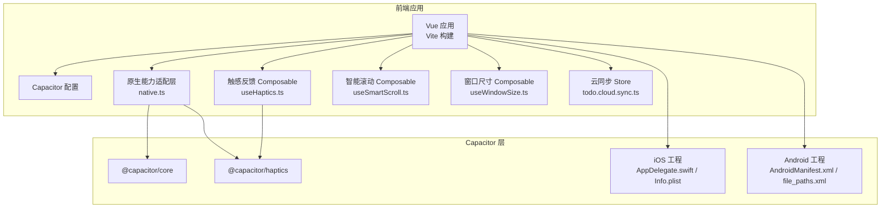
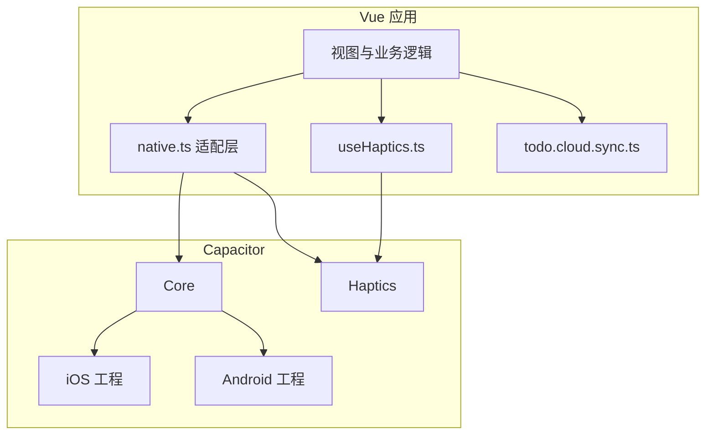
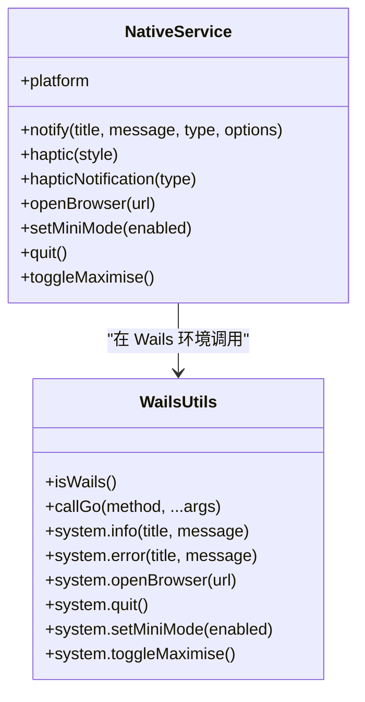
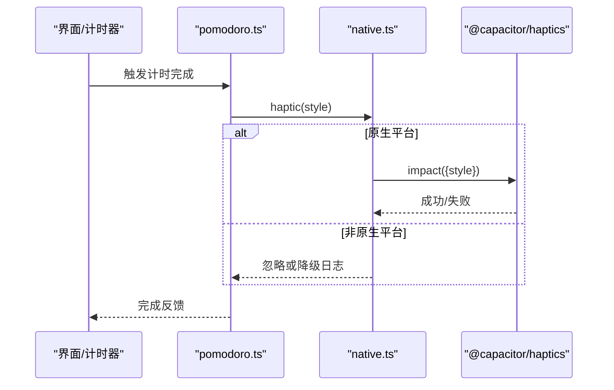
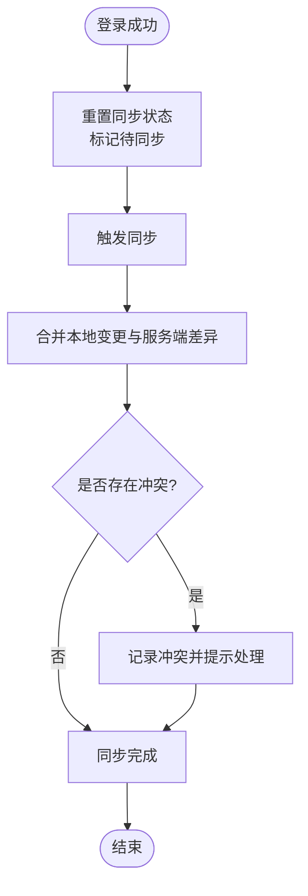
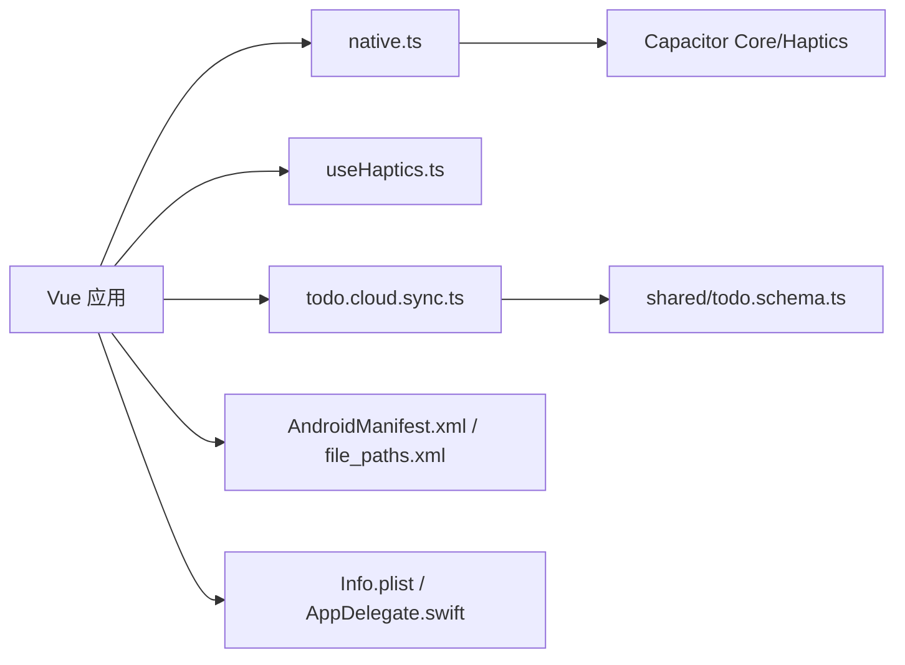

# 移动端开发

<cite>
**本文引用的文件**
- [apps/frontend/capacitor.config.ts](file://apps/frontend/capacitor.config.ts)
- [apps/frontend/package.json](file://apps/frontend/package.json)
- [apps/frontend/android/app/src/main/AndroidManifest.xml](file://apps/frontend/android/app/src/main/AndroidManifest.xml)
- [apps/frontend/android/app/src/main/res/xml/file_paths.xml](file://apps/frontend/android/app/src/main/res/xml/file_paths.xml)
- [apps/frontend/ios/App/App/Info.plist](file://apps/frontend/ios/App/App/Info.plist)
- [apps/frontend/ios/App/App/AppDelegate.swift](file://apps/frontend/ios/App/App/AppDelegate.swift)
- [apps/frontend/src/services/native.ts](file://apps/frontend/src/services/native.ts)
- [apps/frontend/src/lib/wails.ts](file://apps/frontend/src/lib/wails.ts)
- [apps/frontend/src/composables/useHaptics.ts](file://apps/frontend/src/composables/useHaptics.ts)
- [apps/frontend/src/composables/useSmartScroll.ts](file://apps/frontend/src/composables/useSmartScroll.ts)
- [apps/frontend/src/composables/useWindowSize.ts](file://apps/frontend/src/composables/useWindowSize.ts)
- [apps/frontend/src/features/todo/stores/pomodoro.ts](file://apps/frontend/src/features/todo/stores/pomodoro.ts)
- [apps/frontend/src/features/todo/stores/todo.cloud.sync.ts](file://apps/frontend/src/features/todo/stores/todo.cloud.sync.ts)
- [packages/shared/src/schemas/todo.schema.ts](file://packages/shared/src/schemas/todo.schema.ts)
</cite>

## 目录
1. [简介](#简介)
2. [项目结构](#项目结构)
3. [核心组件](#核心组件)
4. [架构总览](#架构总览)
5. [详细组件分析](#详细组件分析)
6. [依赖关系分析](#依赖关系分析)
7. [性能考虑](#性能考虑)
8. [故障排查指南](#故障排查指南)
9. [结论](#结论)
10. [附录](#附录)

## 简介
本指南面向 Lumina Todo 移动端开发，聚焦 Capacitor 混合应用架构与配置、iOS/Android 平台特定设置、原生能力集成（触感反馈、文件访问等）、移动端 UI 适配与交互、离线与数据同步、性能优化与内存管理、打包签名与发布流程、调试技巧与常见问题，以及与原生应用的深度集成可能性。文档基于仓库中的实际源码进行分析，所有技术细节均对应具体文件与实现。

## 项目结构
前端移动端相关的核心位置集中在 apps/frontend 目录，包含：
- Capacitor 配置与构建脚本
- Android 与 iOS 原生工程桥接
- 原生能力适配层与可组合函数
- Todo 业务与云同步逻辑
- 共享 Schema 定义

图表来源
- [apps/frontend/capacitor.config.ts:1-23](file://apps/frontend/capacitor.config.ts#L1-L23)
- [apps/frontend/package.json:1-104](file://apps/frontend/package.json#L1-L104)
- [apps/frontend/src/services/native.ts:1-116](file://apps/frontend/src/services/native.ts#L1-L116)
- [apps/frontend/src/composables/useHaptics.ts:1-62](file://apps/frontend/src/composables/useHaptics.ts#L1-L62)
- [apps/frontend/src/composables/useSmartScroll.ts:1-442](file://apps/frontend/src/composables/useSmartScroll.ts#L1-L442)
- [apps/frontend/src/composables/useWindowSize.ts:1-45](file://apps/frontend/src/composables/useWindowSize.ts#L1-L45)
- [apps/frontend/src/features/todo/stores/todo.cloud.sync.ts:191-213](file://apps/frontend/src/features/todo/stores/todo.cloud.sync.ts#L191-L213)
- [apps/frontend/ios/App/App/AppDelegate.swift:1-22](file://apps/frontend/ios/App/App/AppDelegate.swift#L1-L22)
- [apps/frontend/ios/App/App/Info.plist:1-52](file://apps/frontend/ios/App/App/Info.plist#L1-L52)
- [apps/frontend/android/app/src/main/AndroidManifest.xml:1-42](file://apps/frontend/android/app/src/main/AndroidManifest.xml#L1-L42)
- [apps/frontend/android/app/src/main/res/xml/file_paths.xml:1-5](file://apps/frontend/android/app/src/main/res/xml/file_paths.xml#L1-L5)

章节来源
- [apps/frontend/capacitor.config.ts:1-23](file://apps/frontend/capacitor.config.ts#L1-L23)
- [apps/frontend/package.json:1-104](file://apps/frontend/package.json#L1-L104)

## 核心组件
- Capacitor 配置与构建：集中于 Capacitor 配置文件与前端 package.json 脚本，定义应用 ID、名称、Web 目录、服务器参数与插件（如启动屏）。
- 原生能力适配层：native.ts 将 Wails、Capacitor 与 Web 环境统一抽象，提供通知、触感反馈、浏览器打开、窗口控制等能力。
- 触感反馈：useHaptics.ts 对 Capacitor Haptics 进行封装，提供 Impact、Selection、Vibrate 等能力；pomodoro.ts 中在计时完成时触发触感反馈。
- 文件访问与共享：Android 通过 FileProvider 与 file_paths.xml 暴露外部存储与缓存目录，便于图片等资源访问。
- 云同步：todo.cloud.sync.ts 负责登录后的同步初始化与冲突处理；shared 包中的 todo.schema.ts 定义了同步请求/响应的数据结构。
- 智能滚动与窗口适配：useSmartScroll.ts 提供高性能的智能滚动策略；useWindowSize.ts 提供移动端断点判断。

章节来源
- [apps/frontend/src/services/native.ts:1-116](file://apps/frontend/src/services/native.ts#L1-L116)
- [apps/frontend/src/composables/useHaptics.ts:1-62](file://apps/frontend/src/composables/useHaptics.ts#L1-L62)
- [apps/frontend/src/features/todo/stores/pomodoro.ts:206-245](file://apps/frontend/src/features/todo/stores/pomodoro.ts#L206-L245)
- [apps/frontend/android/app/src/main/res/xml/file_paths.xml:1-5](file://apps/frontend/android/app/src/main/res/xml/file_paths.xml#L1-L5)
- [apps/frontend/src/features/todo/stores/todo.cloud.sync.ts:191-213](file://apps/frontend/src/features/todo/stores/todo.cloud.sync.ts#L191-L213)
- [packages/shared/src/schemas/todo.schema.ts:29-74](file://packages/shared/src/schemas/todo.schema.ts#L29-L74)
- [apps/frontend/src/composables/useSmartScroll.ts:1-442](file://apps/frontend/src/composables/useSmartScroll.ts#L1-L442)
- [apps/frontend/src/composables/useWindowSize.ts:1-45](file://apps/frontend/src/composables/useWindowSize.ts#L1-L45)

## 架构总览
下图展示移动端从 Vue 应用到 Capacitor 原生桥接的整体架构，以及与 iOS/Android 原生工程的交互。

图表来源
- [apps/frontend/src/services/native.ts:1-116](file://apps/frontend/src/services/native.ts#L1-L116)
- [apps/frontend/src/composables/useHaptics.ts:1-62](file://apps/frontend/src/composables/useHaptics.ts#L1-L62)
- [apps/frontend/src/features/todo/stores/todo.cloud.sync.ts:191-213](file://apps/frontend/src/features/todo/stores/todo.cloud.sync.ts#L191-L213)
- [apps/frontend/ios/App/App/AppDelegate.swift:1-22](file://apps/frontend/ios/App/App/AppDelegate.swift#L1-L22)
- [apps/frontend/android/app/src/main/AndroidManifest.xml:1-42](file://apps/frontend/android/app/src/main/AndroidManifest.xml#L1-L42)

## 详细组件分析

### Capacitor 配置与构建
- 应用标识与名称：appId、appName 用于区分应用与包名。
- Web 目录与服务器：webDir 指向构建输出目录；server.cleartext 与 androidScheme 控制开发时网络策略。
- 插件：SplashScreen 启动屏配置，如自动隐藏、时长与背景色。
- 构建脚本：package.json 中提供 dev/build/preview、测试、Capacitor 命令（sync/open/run/build）与 PWA 图标生成。

章节来源
- [apps/frontend/capacitor.config.ts:1-23](file://apps/frontend/capacitor.config.ts#L1-L23)
- [apps/frontend/package.json:9-29](file://apps/frontend/package.json#L9-L29)

### iOS 平台配置与权限
- Info.plist：定义应用显示名、设备能力、方向支持、启动画面等。
- AppDelegate.swift：应用生命周期回调入口，可扩展后台任务、状态保存等。
- 原生工程：通过 Xcode 工程集成 Capacitor，支持 Swift/SwiftUI 与系统能力。

章节来源
- [apps/frontend/ios/App/App/Info.plist:1-52](file://apps/frontend/ios/App/App/Info.plist#L1-L52)
- [apps/frontend/ios/App/App/AppDelegate.swift:1-22](file://apps/frontend/ios/App/App/AppDelegate.swift#L1-L22)

### Android 平台配置与权限
- AndroidManifest.xml：声明 Activity、FileProvider、导出与权限；已声明 INTERNET 权限。
- file_paths.xml：配置 FileProvider 的共享路径，允许应用访问外部与缓存目录，便于文件分享与图片加载。
- Gradle 集成：Capacitor Android 工程通过 Gradle 管理依赖与构建。

章节来源
- [apps/frontend/android/app/src/main/AndroidManifest.xml:1-42](file://apps/frontend/android/app/src/main/AndroidManifest.xml#L1-L42)
- [apps/frontend/android/app/src/main/res/xml/file_paths.xml:1-5](file://apps/frontend/android/app/src/main/res/xml/file_paths.xml#L1-L5)

### 原生能力适配层（Bridge Pattern）
- 平台探测：优先识别 Wails，其次 Capacitor 原生平台，否则为 Web。
- 通知与对话框：在 Web 环境尝试使用浏览器 Notification API；在 Capacitor/Wails 环境分别调用对应能力或降级到控制台。
- 触感反馈：在原生平台调用 Haptics；提供 Impact 与 Notification 类型。
- 浏览器打开、窗口控制：跨平台统一封装，Wails 环境调用系统方法。

图表来源
- [apps/frontend/src/services/native.ts:1-116](file://apps/frontend/src/services/native.ts#L1-L116)
- [apps/frontend/src/lib/wails.ts:1-92](file://apps/frontend/src/lib/wails.ts#L1-L92)

章节来源
- [apps/frontend/src/services/native.ts:1-116](file://apps/frontend/src/services/native.ts#L1-L116)
- [apps/frontend/src/lib/wails.ts:1-92](file://apps/frontend/src/lib/wails.ts#L1-L92)

### 触感反馈集成
- useHaptics.ts：封装 Capacitor Haptics，提供 Impact/Selection/Vibrate 等方法，并在非原生平台安全降级。
- pomodoro.ts：在计时完成时触发触感反馈，提升移动端交互体验。

图表来源
- [apps/frontend/src/features/todo/stores/pomodoro.ts:206-245](file://apps/frontend/src/features/todo/stores/pomodoro.ts#L206-L245)
- [apps/frontend/src/services/native.ts:63-76](file://apps/frontend/src/services/native.ts#L63-L76)
- [apps/frontend/src/composables/useHaptics.ts:1-62](file://apps/frontend/src/composables/useHaptics.ts#L1-L62)

章节来源
- [apps/frontend/src/composables/useHaptics.ts:1-62](file://apps/frontend/src/composables/useHaptics.ts#L1-L62)
- [apps/frontend/src/features/todo/stores/pomodoro.ts:206-245](file://apps/frontend/src/features/todo/stores/pomodoro.ts#L206-L245)

### 文件系统与共享（Android）
- FileProvider：通过 AndroidManifest.xml 声明，结合 file_paths.xml 暴露外部存储与缓存路径，便于图片等资源访问与分享。
- 注意事项：确保 file_paths.xml 中的路径与应用实际写入路径一致，避免访问被拒绝。

章节来源
- [apps/frontend/android/app/src/main/AndroidManifest.xml:27-35](file://apps/frontend/android/app/src/main/AndroidManifest.xml#L27-L35)
- [apps/frontend/android/app/src/main/res/xml/file_paths.xml:1-5](file://apps/frontend/android/app/src/main/res/xml/file_paths.xml#L1-L5)

### 云同步与离线策略
- todo.cloud.sync.ts：负责登录后初始化同步、重置状态、触发同步与获取上次同步时间。
- shared Schema：定义同步请求/响应的数据结构，包括 synced、deletedIds、conflicts 等字段，支撑冲突解决与服务端一致性校验。

图表来源
- [apps/frontend/src/features/todo/stores/todo.cloud.sync.ts:191-213](file://apps/frontend/src/features/todo/stores/todo.cloud.sync.ts#L191-L213)
- [packages/shared/src/schemas/todo.schema.ts:29-74](file://packages/shared/src/schemas/todo.schema.ts#L29-L74)

章节来源
- [apps/frontend/src/features/todo/stores/todo.cloud.sync.ts:191-213](file://apps/frontend/src/features/todo/stores/todo.cloud.sync.ts#L191-L213)
- [packages/shared/src/schemas/todo.schema.ts:29-74](file://packages/shared/src/schemas/todo.schema.ts#L29-L74)

### 移动端 UI 适配与交互
- 智能滚动：useSmartScroll.ts 提供“粘附底部”“自动滚动”“流式更新瞬时滚动”等策略，配合 RAF 批处理与节流，保证列表滚动流畅性。
- 窗口断点：useWindowSize.ts 基于屏幕宽度判断移动端，便于条件渲染与布局切换。

章节来源
- [apps/frontend/src/composables/useSmartScroll.ts:1-442](file://apps/frontend/src/composables/useSmartScroll.ts#L1-L442)
- [apps/frontend/src/composables/useWindowSize.ts:1-45](file://apps/frontend/src/composables/useWindowSize.ts#L1-L45)

## 依赖关系分析
- 前端应用依赖 Capacitor 核心与 Haptics 插件，通过 native.ts 与 useHaptics.ts 实现触感反馈。
- Android 工程通过 FileProvider 与 file_paths.xml 提供文件访问能力。
- iOS 工程通过 Info.plist 与 AppDelegate.swift 配置系统能力与生命周期。
- 云同步依赖 shared 包的 Schema 定义，确保前后端数据结构一致。

图表来源
- [apps/frontend/src/services/native.ts:1-116](file://apps/frontend/src/services/native.ts#L1-L116)
- [apps/frontend/src/composables/useHaptics.ts:1-62](file://apps/frontend/src/composables/useHaptics.ts#L1-L62)
- [apps/frontend/src/features/todo/stores/todo.cloud.sync.ts:191-213](file://apps/frontend/src/features/todo/stores/todo.cloud.sync.ts#L191-L213)
- [packages/shared/src/schemas/todo.schema.ts:29-74](file://packages/shared/src/schemas/todo.schema.ts#L29-L74)
- [apps/frontend/android/app/src/main/AndroidManifest.xml:1-42](file://apps/frontend/android/app/src/main/AndroidManifest.xml#L1-L42)
- [apps/frontend/android/app/src/main/res/xml/file_paths.xml:1-5](file://apps/frontend/android/app/src/main/res/xml/file_paths.xml#L1-L5)
- [apps/frontend/ios/App/App/Info.plist:1-52](file://apps/frontend/ios/App/App/Info.plist#L1-L52)
- [apps/frontend/ios/App/App/AppDelegate.swift:1-22](file://apps/frontend/ios/App/App/AppDelegate.swift#L1-L22)

## 性能考虑
- 滚动性能：useSmartScroll.ts 使用 RAF 批处理与节流，避免频繁 DOM 操作；在流式更新场景采用瞬时滚动，减少动画开销。
- 触感反馈：仅在原生平台启用，避免在 Web 端无效调用导致的性能损耗。
- 构建与内存：前端构建脚本设置了较大的堆内存限制，有助于大型项目的编译稳定性。
- 智能粘附：在内容高度变化时才触发滚动，降低不必要的重排与重绘。

章节来源
- [apps/frontend/src/composables/useSmartScroll.ts:164-195](file://apps/frontend/src/composables/useSmartScroll.ts#L164-L195)
- [apps/frontend/src/composables/useHaptics.ts:7-16](file://apps/frontend/src/composables/useHaptics.ts#L7-L16)
- [apps/frontend/package.json:10-13](file://apps/frontend/package.json#L10-L13)

## 故障排查指南
- 触感反馈无效
  - 确认运行在原生平台（Capacitor.isNativePlatform() 为真）。
  - 检查 Haptics 插件是否正确安装与同步。
- 通知未显示
  - Web 环境需满足浏览器 Notification 权限；若文档有焦点，默认不强制弹出系统通知。
- 文件访问被拒
  - Android 需确认 FileProvider authorities 与 file_paths.xml 路径配置一致。
- 同步冲突
  - 查看 conflicts 字段，按服务端返回的原因进行处理（如版本冲突、墓碑、所有权不匹配）。

章节来源
- [apps/frontend/src/services/native.ts:35-57](file://apps/frontend/src/services/native.ts#L35-L57)
- [apps/frontend/android/app/src/main/AndroidManifest.xml:27-35](file://apps/frontend/android/app/src/main/AndroidManifest.xml#L27-L35)
- [apps/frontend/android/app/src/main/res/xml/file_paths.xml:1-5](file://apps/frontend/android/app/src/main/res/xml/file_paths.xml#L1-L5)
- [packages/shared/src/schemas/todo.schema.ts:52-67](file://packages/shared/src/schemas/todo.schema.ts#L52-L67)

## 结论
本指南基于仓库现有实现，系统梳理了 Lumina Todo 移动端的 Capacitor 架构、平台配置、原生能力集成、UI 适配、云同步与性能优化要点。建议在后续迭代中补充 Push 通知、相机与媒体访问等原生能力的具体接入点，并完善发布流水线与自动化测试覆盖。

## 附录

### 平台特定 UI 与交互建议
- iOS：利用 Info.plist 的方向与启动画面配置，确保首屏体验一致。
- Android：通过 file_paths.xml 与 FileProvider 管理文件访问，注意权限与路径白名单。
- 通用：结合 useWindowSize.ts 的断点，在小屏设备上简化布局与交互层级。

章节来源
- [apps/frontend/ios/App/App/Info.plist:35-47](file://apps/frontend/ios/App/App/Info.plist#L35-L47)
- [apps/frontend/android/app/src/main/AndroidManifest.xml:12-25](file://apps/frontend/android/app/src/main/AndroidManifest.xml#L12-L25)
- [apps/frontend/src/composables/useWindowSize.ts:38-44](file://apps/frontend/src/composables/useWindowSize.ts#L38-L44)

### 离线与数据同步机制
- 登录后初始化同步，标记待同步项，触发合并与冲突处理。
- 服务端返回 synced/deletedIds/conflicts/serverTime，客户端据此更新本地状态。

章节来源
- [apps/frontend/src/features/todo/stores/todo.cloud.sync.ts:191-213](file://apps/frontend/src/features/todo/stores/todo.cloud.sync.ts#L191-L213)
- [packages/shared/src/schemas/todo.schema.ts:61-67](file://packages/shared/src/schemas/todo.schema.ts#L61-L67)

### 打包、签名与发布（流程概述）
- Capacitor 构建：先执行构建，再执行 Capacitor 同步，随后在各平台工程中进行签名与打包。
- iOS：在 Xcode 中配置 Bundle Identifier、证书与描述文件，选择发布目标。
- Android：生成签名密钥，配置 Gradle 签名，生成发布 APK/AAB。
- 发布商店：遵循 Apple App Store 与 Google Play 的审核规范与要求。

章节来源
- [apps/frontend/package.json:21-28](file://apps/frontend/package.json#L21-L28)
- [apps/frontend/capacitor.config.ts:13-19](file://apps/frontend/capacitor.config.ts#L13-L19)

### 与原生应用的深度集成可能性
- Wails 环境：通过 wails.ts 提供 Go 方法调用封装，可在桌面端实现与移动端一致的系统能力。
- Capacitor：通过插件体系扩展相机、文件系统、推送通知等能力，逐步替换 Web API 的不足。

章节来源
- [apps/frontend/src/lib/wails.ts:19-91](file://apps/frontend/src/lib/wails.ts#L19-L91)
- [apps/frontend/src/services/native.ts:13-17](file://apps/frontend/src/services/native.ts#L13-L17)