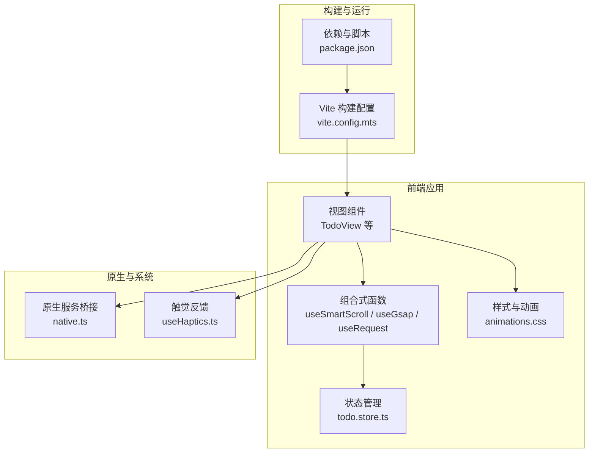
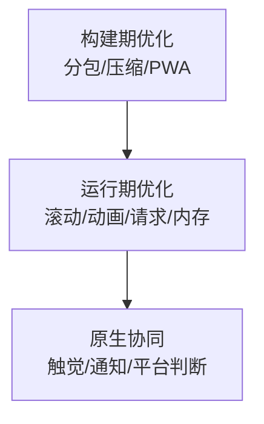
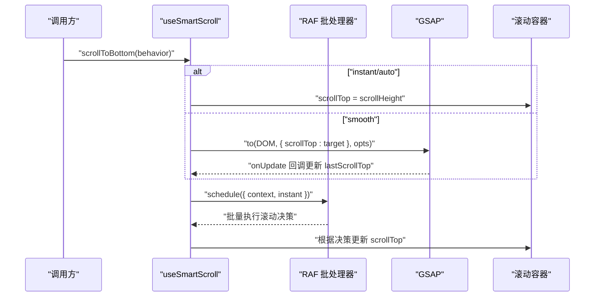
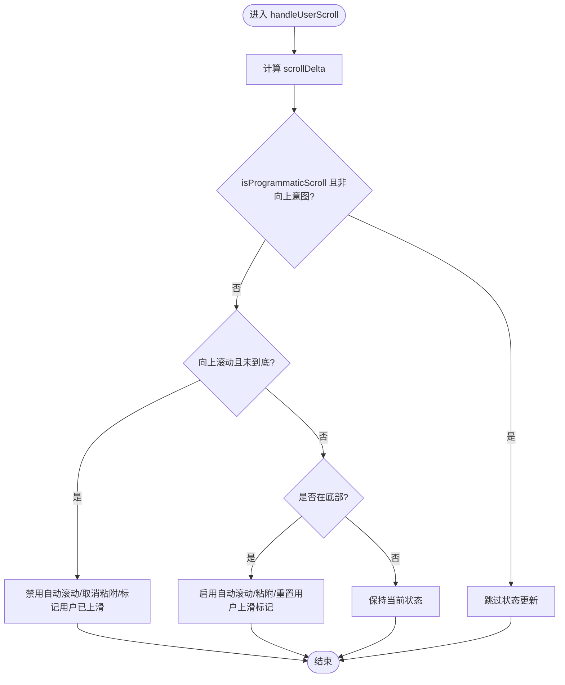
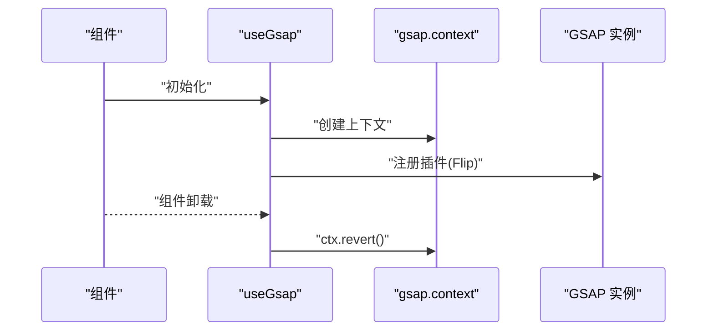
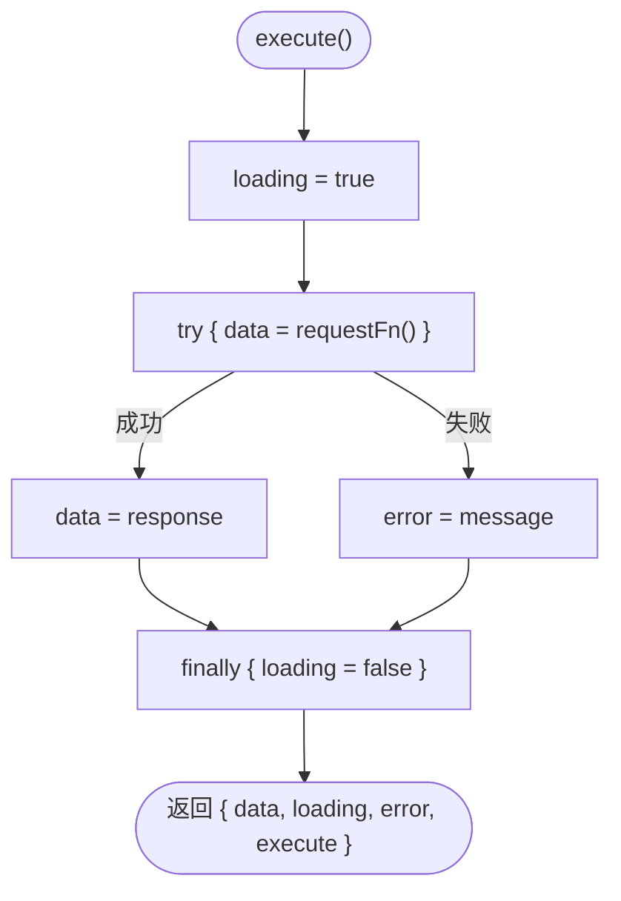
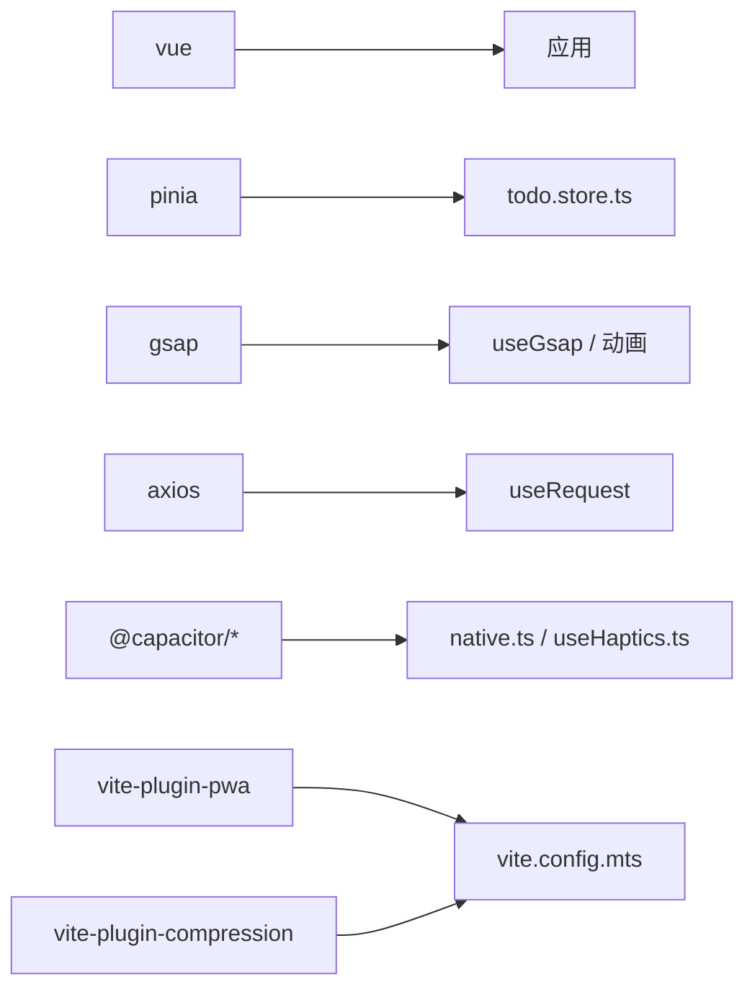

# 移动端性能优化

<cite>
**本文引用的文件**
- [apps/frontend/src/composables/useGsap.ts](file://apps/frontend/src/composables/useGsap.ts)
- [apps/frontend/src/composables/useSmartScroll.ts](file://apps/frontend/src/composables/useSmartScroll.ts)
- [apps/frontend/src/composables/useSmartScroll.internals.ts](file://apps/frontend/src/composables/useSmartScroll.internals.ts)
- [apps/frontend/src/composables/useRequest.ts](file://apps/frontend/src/composables/useRequest.ts)
- [apps/frontend/src/composables/useWindowSize.ts](file://apps/frontend/src/composables/useWindowSize.ts)
- [apps/frontend/src/styles/animations.css](file://apps/frontend/src/styles/animations.css)
- [apps/frontend/vite.config.mts](file://apps/frontend/vite.config.mts)
- [apps/frontend/package.json](file://apps/frontend/package.json)
- [apps/frontend/src/features/todo/stores/todo.store.ts](file://apps/frontend/src/features/todo/stores/todo.store.ts)
- [apps/frontend/src/composables/useHaptics.ts](file://apps/frontend/src/composables/useHaptics.ts)
- [apps/frontend/src/services/native.ts](file://apps/frontend/src/services/native.ts)
- [apps/frontend/tests/composables/useGsap.spec.ts](file://apps/frontend/tests/composables/useGsap.spec.ts)
- [apps/frontend/tests/composables/useSmartScroll.spec.ts](file://apps/frontend/tests/composables/useSmartScroll.spec.ts)
- [apps/frontend/tests/features/todo/TodoView.animation.spec.ts](file://apps/frontend/tests/features/todo/TodoView.animation.spec.ts)
</cite>

## 目录
1. [引言](#引言)
2. [项目结构](#项目结构)
3. [核心组件](#核心组件)
4. [架构总览](#架构总览)
5. [详细组件分析](#详细组件分析)
6. [依赖分析](#依赖分析)
7. [性能考量](#性能考量)
8. [故障排查指南](#故障排查指南)
9. [结论](#结论)
10. [附录](#附录)

## 引言
本指南聚焦移动端性能优化，结合仓库中已有的滚动、动画、网络与构建配置等实现，系统阐述移动端特有的性能瓶颈与优化策略，覆盖内存管理、CPU 使用率控制、电池续航优化、滚动性能、动画性能、图片与媒体资源优化、网络请求与缓存策略、性能监控与分析方法，并提供移动端调试技巧与最佳实践。

## 项目结构
前端采用 Vite + Vue 3 + Pinia 架构，配合 Capacitor/Wails 原生桥接与 PWA 能力；移动端性能优化相关的关键实现集中在以下模块：
- 滚动与交互：useSmartScroll 及其内部批处理与节流工具
- 动画与过渡：GSAP 组合与样式动画
- 网络请求：useRequest Hook
- 构建与体积：Vite 分包与压缩插件
- 原生能力：触觉反馈与跨平台桥接
- 状态管理：Pinia Todo Store（含持久化）

图表来源
- [apps/frontend/vite.config.mts:80-184](file://apps/frontend/vite.config.mts#L80-L184)
- [apps/frontend/package.json:1-104](file://apps/frontend/package.json#L1-L104)
- [apps/frontend/src/features/todo/stores/todo.store.ts:21-335](file://apps/frontend/src/features/todo/stores/todo.store.ts#L21-L335)

章节来源
- [apps/frontend/vite.config.mts:1-185](file://apps/frontend/vite.config.mts#L1-L185)
- [apps/frontend/package.json:1-104](file://apps/frontend/package.json#L1-L104)

## 核心组件
- 智能滚动 useSmartScroll：基于 RAF 批处理、节流与 GSAP 平滑滚动，解决移动端滚动抖动与卡顿
- 动画组合 useGsap：注册 GSAP 插件并在组件卸载时清理上下文，避免内存泄漏
- 请求 Hook useRequest：封装加载/错误状态，减少重复渲染与无效请求
- 窗口尺寸 Hook useWindowSize：移动端自适应与媒体查询基础
- 样式动画 animations.css：轻量 CSS 动画，避免复杂 JS 动画带来的 CPU/GPU 压力
- 构建配置 vite.config.mts：分包、压缩、PWA 与代理，提升首屏与缓存命中
- 原生服务 native.ts 与触觉 useHaptics.ts：跨平台原生能力接入，降低不必要的系统调用

章节来源
- [apps/frontend/src/composables/useSmartScroll.ts:33-442](file://apps/frontend/src/composables/useSmartScroll.ts#L33-L442)
- [apps/frontend/src/composables/useSmartScroll.internals.ts:66-109](file://apps/frontend/src/composables/useSmartScroll.internals.ts#L66-L109)
- [apps/frontend/src/composables/useGsap.ts:1-20](file://apps/frontend/src/composables/useGsap.ts#L1-L20)
- [apps/frontend/src/composables/useRequest.ts:17-45](file://apps/frontend/src/composables/useRequest.ts#L17-L45)
- [apps/frontend/src/composables/useWindowSize.ts:6-45](file://apps/frontend/src/composables/useWindowSize.ts#L6-L45)
- [apps/frontend/src/styles/animations.css:1-159](file://apps/frontend/src/styles/animations.css#L1-L159)
- [apps/frontend/vite.config.mts:80-184](file://apps/frontend/vite.config.mts#L80-L184)
- [apps/frontend/src/services/native.ts:9-116](file://apps/frontend/src/services/native.ts#L9-L116)
- [apps/frontend/src/composables/useHaptics.ts:6-62](file://apps/frontend/src/composables/useHaptics.ts#L6-L62)

## 架构总览
移动端性能优化贯穿“构建期优化 + 运行期优化 + 原生能力协同”三条主线：
- 构建期：按需拆分 vendor 包、开启 gzip/brotli 压缩、PWA 缓存与离线资源
- 运行期：滚动与动画优化、请求与状态管理优化、内存与生命周期管理
- 原生协同：触觉反馈与系统通知按需触发，避免无谓开销

图表来源
- [apps/frontend/vite.config.mts:23-78](file://apps/frontend/vite.config.mts#L23-L78)
- [apps/frontend/vite.config.mts:89-103](file://apps/frontend/vite.config.mts#L89-L103)
- [apps/frontend/src/services/native.ts:13-17](file://apps/frontend/src/services/native.ts#L13-L17)
- [apps/frontend/src/composables/useHaptics.ts:6-62](file://apps/frontend/src/composables/useHaptics.ts#L6-L62)

## 详细组件分析

### 智能滚动组件 useSmartScroll
该组件通过 RAF 批处理与节流、GSAP 平滑滚动、ResizeObserver/MutationObserver 监听，以及“程序化滚动标记”机制，有效避免移动端滚动抖动与卡顿。

图表来源
- [apps/frontend/src/composables/useSmartScroll.ts:100-160](file://apps/frontend/src/composables/useSmartScroll.ts#L100-L160)
- [apps/frontend/src/composables/useSmartScroll.ts:164-195](file://apps/frontend/src/composables/useSmartScroll.ts#L164-L195)
- [apps/frontend/src/composables/useSmartScroll.internals.ts:66-94](file://apps/frontend/src/composables/useSmartScroll.internals.ts#L66-L94)

图表来源
- [apps/frontend/src/composables/useSmartScroll.ts:209-240](file://apps/frontend/src/composables/useSmartScroll.ts#L209-L240)

章节来源
- [apps/frontend/src/composables/useSmartScroll.ts:33-442](file://apps/frontend/src/composables/useSmartScroll.ts#L33-L442)
- [apps/frontend/src/composables/useSmartScroll.internals.ts:1-109](file://apps/frontend/src/composables/useSmartScroll.internals.ts#L1-L109)

### 动画与过渡组件 useGsap
- 注册 Flip 插件并使用 gsap.context 管理作用域，在组件卸载时调用 ctx.revert，避免全局动画残留
- 在 TodoView 动画测试中，对 GSAP API 进行打桩，验证动画时机与清理逻辑

图表来源
- [apps/frontend/src/composables/useGsap.ts:7-19](file://apps/frontend/src/composables/useGsap.ts#L7-L19)
- [apps/frontend/tests/composables/useGsap.spec.ts:23-42](file://apps/frontend/tests/composables/useGsap.spec.ts#L23-L42)

章节来源
- [apps/frontend/src/composables/useGsap.ts:1-20](file://apps/frontend/src/composables/useGsap.ts#L1-L20)
- [apps/frontend/tests/composables/useGsap.spec.ts:1-44](file://apps/frontend/tests/composables/useGsap.spec.ts#L1-L44)

### 请求与状态管理 useRequest 与 Pinia Todo Store
- useRequest 将加载/错误状态与业务请求解耦，避免重复渲染与无效请求
- Pinia Todo Store 使用持久化策略与深度监听，减少不必要计算与同步

图表来源
- [apps/frontend/src/composables/useRequest.ts:24-36](file://apps/frontend/src/composables/useRequest.ts#L24-L36)

章节来源
- [apps/frontend/src/composables/useRequest.ts:1-45](file://apps/frontend/src/composables/useRequest.ts#L1-L45)
- [apps/frontend/src/features/todo/stores/todo.store.ts:21-335](file://apps/frontend/src/features/todo/stores/todo.store.ts#L21-L335)

### 样式动画与 GPU 加速建议
- animations.css 提供轻量 CSS 动画类，适合移动端低功耗场景
- 建议优先使用 transform/opacity 等可由合成线程处理的属性，避免触发布局与重绘

章节来源
- [apps/frontend/src/styles/animations.css:1-159](file://apps/frontend/src/styles/animations.css#L1-L159)

### 构建与体积优化
- 按依赖类型手动分包，分离 vue-vendor/ui-vendor/utils-vendor 等，提升缓存命中与并行加载
- 启用 gzip 与 brotli 压缩，减小传输体积
- PWA Manifest 与静态资源缓存，改善离线与二次打开体验

章节来源
- [apps/frontend/vite.config.mts:23-78](file://apps/frontend/vite.config.mts#L23-L78)
- [apps/frontend/vite.config.mts:89-103](file://apps/frontend/vite.config.mts#L89-L103)
- [apps/frontend/vite.config.mts:104-147](file://apps/frontend/vite.config.mts#L104-L147)
- [apps/frontend/package.json:30-69](file://apps/frontend/package.json#L30-L69)

### 原生能力与电池续航
- native.ts 统一平台判断与能力调用，避免在 Web 平台进行无意义的原生操作
- useHaptics.ts 仅在原生平台启用触觉反馈，降低非必要系统调用

章节来源
- [apps/frontend/src/services/native.ts:9-116](file://apps/frontend/src/services/native.ts#L9-L116)
- [apps/frontend/src/composables/useHaptics.ts:6-62](file://apps/frontend/src/composables/useHaptics.ts#L6-L62)

## 依赖分析
- 第三方库与性能相关：GSAP、VueUse、Axios、Pinia、Tailwind 等
- 构建插件：@vitejs/plugin-vue、vite-plugin-compression、vite-plugin-pwa
- 依赖关系通过 package.json 声明，构建配置通过 vite.config.mts 组织

图表来源
- [apps/frontend/package.json:30-69](file://apps/frontend/package.json#L30-L69)
- [apps/frontend/vite.config.mts:86-147](file://apps/frontend/vite.config.mts#L86-L147)

章节来源
- [apps/frontend/package.json:1-104](file://apps/frontend/package.json#L1-L104)
- [apps/frontend/vite.config.mts:1-185](file://apps/frontend/vite.config.mts#L1-L185)

## 性能考量
- 内存管理
  - 使用 gsap.context 管理动画上下文，组件卸载时调用 ctx.revert，避免内存泄漏
  - Pinia Store 使用持久化与深监听，避免冗余计算与频繁序列化
- CPU 使用率控制
  - useSmartScroll 使用 RAF 批处理与节流，减少滚动事件回调频率
  - CSS 动画优先于 JS 动画，减少主线程压力
- 电池续航优化
  - 原生平台才启用触觉反馈与系统通知，避免在 Web 平台进行无意义调用
  - 合理使用 ResizeObserver/MutationObserver，避免高频观测导致的主线程占用
- 滚动性能优化
  - 平滑滚动使用 GSAP，瞬时滚动直接设置 scrollTop，兼顾体验与性能
  - 程序化滚动期间屏蔽用户上滑误判，提升交互稳定性
- 动画性能优化（GSAP）
  - 在组件卸载时清理动画，避免后台动画持续消耗资源
  - 对高频动画进行批处理与合并，减少帧内多次重排
- 图片与媒体资源优化
  - 建议采用现代格式（WebP/AVIF）、按设备像素比选择尺寸、懒加载与占位图
  - 使用 CSS 动画替代复杂 JS 动画，优先使用 transform/opacity
- 网络请求与缓存策略
  - 使用 useRequest 统一封装加载/错误状态，避免重复请求
  - 构建期启用压缩与 PWA 缓存，运行期结合 HTTP 缓存头与本地存储
- 性能监控与分析
  - 使用浏览器开发者工具的 Performance/Rendering 面板观察滚动掉帧与布局
  - 结合 Lighthouse/Bundle Analyzer 分析体积与交互性能
- 移动端调试技巧
  - 使用 React DevTools/Vue Devtools（如适用）定位重渲染热点
  - 在 iOS Safari/Android Chrome 中启用“绘制边界”与“强制重排”辅助分析

## 故障排查指南
- 滚动抖动或卡顿
  - 检查是否在滚动事件中执行昂贵操作，确认已使用 RAF 节流与批处理
  - 确认程序化滚动标记逻辑正确，避免用户上滑被误判
- 动画残留或内存泄漏
  - 确保组件卸载时调用 ctx.revert，或在测试中验证 revert 调用
- 请求状态异常
  - 检查 useRequest 的 loading/error 状态更新顺序，避免竞态
- 原生能力失效
  - 确认平台判断逻辑与 Capacitor/Web 切换，避免在 Web 平台调用原生接口
- PWA 缓存问题
  - 检查 Manifest 与 Service Worker 注册，确认静态资源缓存策略

章节来源
- [apps/frontend/tests/composables/useGsap.spec.ts:23-42](file://apps/frontend/tests/composables/useGsap.spec.ts#L23-L42)
- [apps/frontend/tests/composables/useSmartScroll.spec.ts:184-233](file://apps/frontend/tests/composables/useSmartScroll.spec.ts#L184-L233)
- [apps/frontend/src/composables/useRequest.ts:24-36](file://apps/frontend/src/composables/useRequest.ts#L24-L36)
- [apps/frontend/src/services/native.ts:13-17](file://apps/frontend/src/services/native.ts#L13-L17)

## 结论
通过在构建期分包与压缩、运行期滚动与动画优化、请求与状态管理规范化、原生能力按需启用等多维度协同，可在移动端获得更流畅、省电与稳定的用户体验。建议在后续迭代中持续关注体积与交互性能指标，结合测试用例保障关键路径的稳定性。

## 附录
- 测试参考
  - useGsap 单元测试验证上下文清理
  - useSmartScroll 单元测试覆盖滚动行为与状态切换
  - TodoView 动画测试验证动画时机与清理

章节来源
- [apps/frontend/tests/composables/useGsap.spec.ts:1-44](file://apps/frontend/tests/composables/useGsap.spec.ts#L1-L44)
- [apps/frontend/tests/composables/useSmartScroll.spec.ts:1-281](file://apps/frontend/tests/composables/useSmartScroll.spec.ts#L1-L281)
- [apps/frontend/tests/features/todo/TodoView.animation.spec.ts:1-151](file://apps/frontend/tests/features/todo/TodoView.animation.spec.ts#L1-L151)