# 共享包架构

<cite>
**本文档引用的文件**
- [packages/shared/src/index.ts](file://packages/shared/src/index.ts)
- [packages/shared/package.json](file://packages/shared/package.json)
- [packages/shared/tsconfig.json](file://packages/shared/tsconfig.json)
- [packages/shared/src/agent/index.ts](file://packages/shared/src/agent/index.ts)
- [packages/shared/src/dto/common.dto.ts](file://packages/shared/src/dto/common.dto.ts)
- [packages/shared/src/schemas/auth.schema.ts](file://packages/shared/src/schemas/auth.schema.ts)
- [packages/shared/src/schemas/todo.schema.ts](file://packages/shared/src/schemas/todo.schema.ts)
- [packages/shared/src/schemas/mcp.schema.ts](file://packages/shared/src/schemas/mcp.schema.ts)
- [packages/shared/src/agent/agent-tool.types.ts](file://packages/shared/src/agent/agent-tool.types.ts)
- [packages/shared/src/agent/agent-tool.schema.ts](file://packages/shared/src/agent/agent-tool.schema.ts)
- [packages/shared/src/utils/user.utils.ts](file://packages/shared/src/utils/user.utils.ts)
- [packages/shared/src/schemas/i18n-keys.ts](file://packages/shared/src/schemas/i18n-keys.ts)
- [packages/shared/src/schemas/ai-sync.schema.ts](file://packages/shared/src/schemas/ai-sync.schema.ts)
- [packages/shared/src/schemas/teaching.schema.ts](file://packages/shared/src/schemas/teaching.schema.ts)
- [turbo.json](file://turbo.json)
</cite>

## 目录

1. [简介](#简介)
2. [项目结构](#项目结构)
3. [核心组件](#核心组件)
4. [架构概览](#架构概览)
5. [详细组件分析](#详细组件分析)
6. [依赖关系分析](#依赖关系分析)
7. [性能考虑](#性能考虑)
8. [故障排除指南](#故障排除指南)
9. [结论](#结论)

## 简介

@lumina/shared 是一个专门设计的 TypeScript 共享包，为整个 Lumina 项目提供统一的数据验证、类型定义和业务模型。该包采用 Zod 作为主要的运行时验证库，确保前后端数据传输的一致性和安全性。

该共享包的核心目标是实现"单一真相源"（Single Source of Truth），通过集中管理所有共享的 Zod Schema、类型定义和工具函数，消除重复代码，提高开发效率，并确保跨应用组件间的数据一致性。

## 项目结构

共享包采用模块化的目录结构，按照功能领域进行组织：

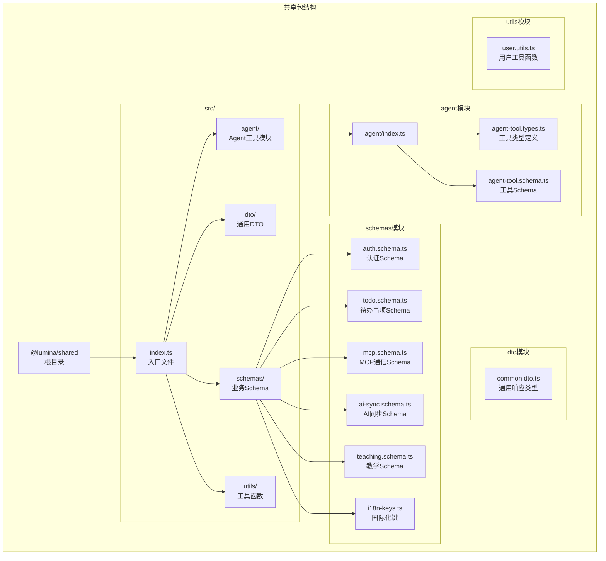

**图表来源**

- [packages/shared/src/index.ts:1-27](file://packages/shared/src/index.ts#L1-L27)
- [packages/shared/src/agent/index.ts:1-3](file://packages/shared/src/agent/index.ts#L1-L3)

**章节来源**

- [packages/shared/src/index.ts:1-27](file://packages/shared/src/index.ts#L1-L27)
- [packages/shared/package.json:1-51](file://packages/shared/package.json#L1-L51)
- [packages/shared/tsconfig.json:1-13](file://packages/shared/tsconfig.json#L1-L13)

## 核心组件

### Zod Schema 系统

共享包的核心是基于 Zod 的类型安全验证系统。所有 Schema 都遵循统一的命名约定和验证规则：

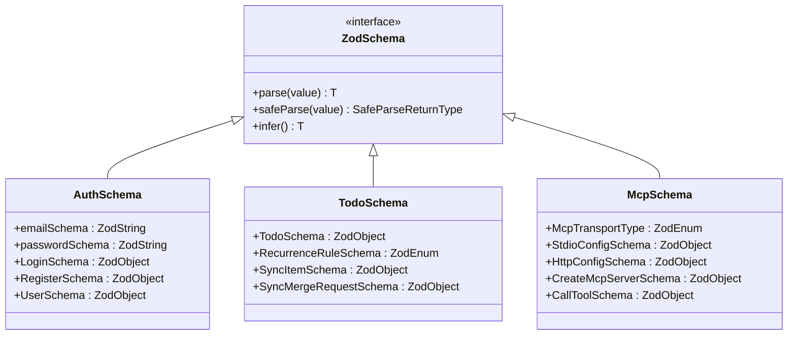

**图表来源**

- [packages/shared/src/schemas/auth.schema.ts:1-121](file://packages/shared/src/schemas/auth.schema.ts#L1-L121)
- [packages/shared/src/schemas/todo.schema.ts:1-76](file://packages/shared/src/schemas/todo.schema.ts#L1-L76)
- [packages/shared/src/schemas/mcp.schema.ts:1-304](file://packages/shared/src/schemas/mcp.schema.ts#L1-L304)

### 通用响应类型系统

共享包提供了统一的 API 响应格式，确保前后端交互的一致性：

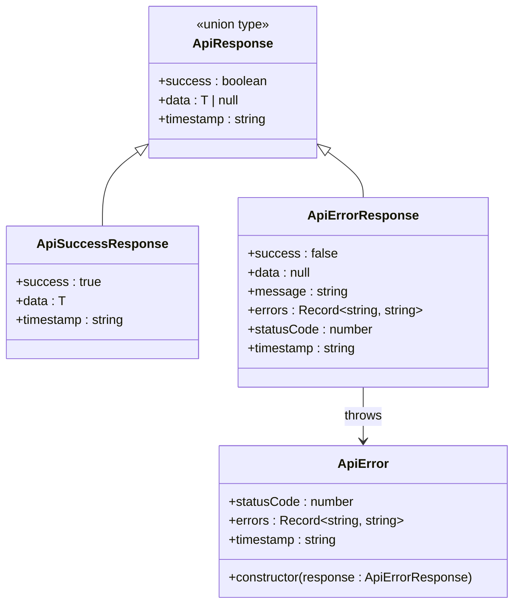

**图表来源**

- [packages/shared/src/dto/common.dto.ts:1-99](file://packages/shared/src/dto/common.dto.ts#L1-L99)

**章节来源**

- [packages/shared/src/dto/common.dto.ts:1-99](file://packages/shared/src/dto/common.dto.ts#L1-L99)
- [packages/shared/src/schemas/auth.schema.ts:1-121](file://packages/shared/src/schemas/auth.schema.ts#L1-L121)

## 架构概览

### 数据流架构

共享包采用"Schema 驱动"的架构模式，所有数据验证和转换都通过 Zod Schema 完成：

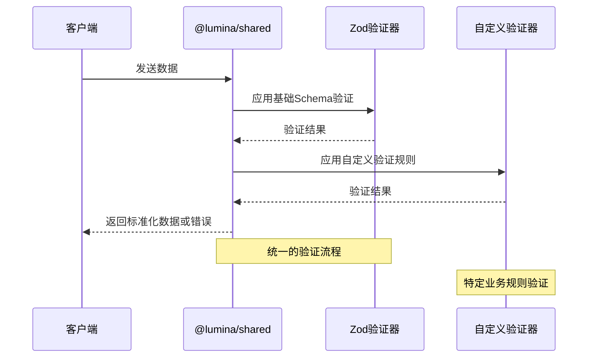

**图表来源**

- [packages/shared/src/schemas/mcp.schema.ts:13-74](file://packages/shared/src/schemas/mcp.schema.ts#L13-L74)
- [packages/shared/src/schemas/auth.schema.ts:7-12](file://packages/shared/src/schemas/auth.schema.ts#L7-L12)

### 模块化导入系统

共享包通过中心化的 index.ts 文件管理所有导出，确保导入的一致性和可维护性：

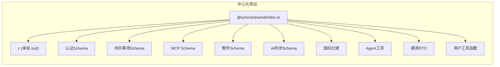

**图表来源**

- [packages/shared/src/index.ts:10-27](file://packages/shared/src/index.ts#L10-L27)

**章节来源**

- [packages/shared/src/index.ts:1-27](file://packages/shared/src/index.ts#L1-L27)
- [turbo.json:181-191](file://turbo.json#L181-L191)

## 详细组件分析

### 认证 Schema 模块

认证模块提供了完整的用户身份验证和授权相关的数据验证：

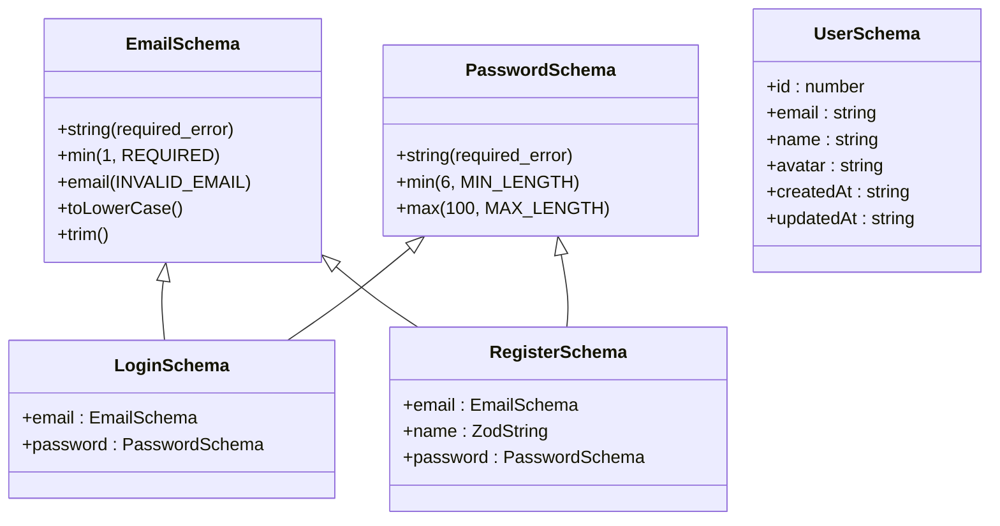

**图表来源**

- [packages/shared/src/schemas/auth.schema.ts:7-66](file://packages/shared/src/schemas/auth.schema.ts#L7-L66)

#### 验证规则特点

认证 Schema 采用了渐进式的验证策略：

1. **基础验证**：必填检查和基本格式验证
2. **业务验证**：长度限制和格式约束
3. **国际化支持**：通过 ValidationKeys 提供本地化错误消息
4. **数据标准化**：自动转换和清理输入数据

**章节来源**

- [packages/shared/src/schemas/auth.schema.ts:1-121](file://packages/shared/src/schemas/auth.schema.ts#L1-L121)
- [packages/shared/src/schemas/i18n-keys.ts:1-13](file://packages/shared/src/schemas/i18n-keys.ts#L1-L13)

### 待办事项 Schema 模块

待办事项模块实现了复杂的时间管理和同步机制：

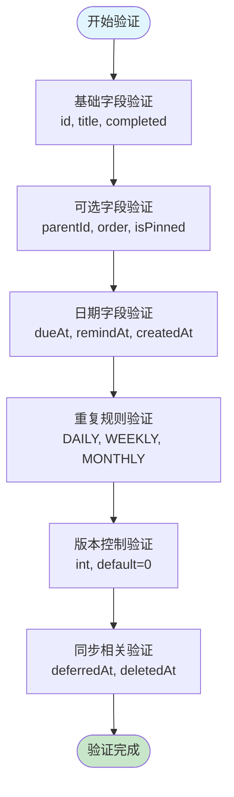

**图表来源**

- [packages/shared/src/schemas/todo.schema.ts:8-28](file://packages/shared/src/schemas/todo.schema.ts#L8-L28)

#### 同步机制设计

待办事项系统支持多端同步，采用"基于 updatedAt 的冲突仲裁"策略：

1. **冲突检测**：通过版本号和时间戳识别冲突
2. **数据合并**：智能合并不同客户端的修改
3. **状态同步**：保持删除标记和完成状态的一致性

**章节来源**

- [packages/shared/src/schemas/todo.schema.ts:1-76](file://packages/shared/src/schemas/todo.schema.ts#L1-L76)

### MCP 通信 Schema 模块

MCP（Model Context Protocol）模块提供了安全的外部工具调用机制：

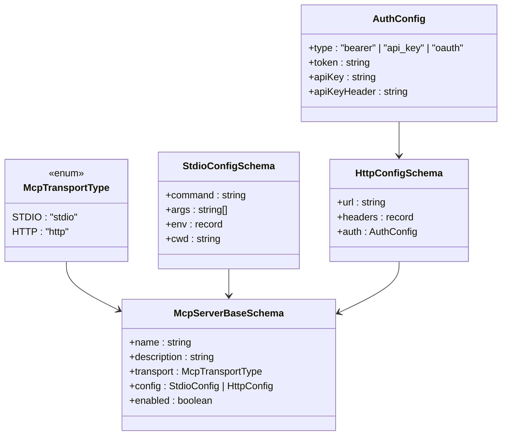

**图表来源**

- [packages/shared/src/schemas/mcp.schema.ts:6-156](file://packages/shared/src/schemas/mcp.schema.ts#L6-L156)

#### 安全验证机制

MCP Schema 实现了多层次的安全验证：

1. **传输类型验证**：确保配置与传输方式匹配
2. **URL 安全校验**：阻止私有网络地址访问
3. **主机名过滤**：拒绝 localhost 和私有 IP 地址
4. **认证配置验证**：确保凭据的完整性和正确性

**章节来源**

- [packages/shared/src/schemas/mcp.schema.ts:1-304](file://packages/shared/src/schemas/mcp.schema.ts#L1-L304)

### Agent 工具模块

Agent 工具模块定义了标准化的工具接口和参数验证：

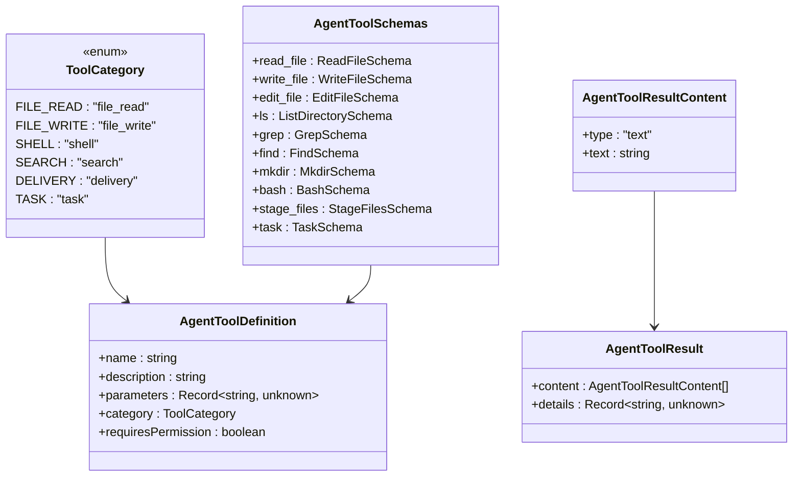

**图表来源**

- [packages/shared/src/agent/agent-tool.types.ts:7-39](file://packages/shared/src/agent/agent-tool.types.ts#L7-L39)
- [packages/shared/src/agent/agent-tool.schema.ts:82-96](file://packages/shared/src/agent/agent-tool.schema.ts#L82-L96)

#### 工具分类和权限管理

Agent 工具根据操作风险分为不同的类别：

1. **只读工具**：file_read, search 等
2. **写入工具**：file_write, edit_file 等
3. **高风险工具**：shell, delivery 等，默认需要用户确认

**章节来源**

- [packages/shared/src/agent/agent-tool.types.ts:1-40](file://packages/shared/src/agent/agent-tool.types.ts#L1-L40)
- [packages/shared/src/agent/agent-tool.schema.ts:1-96](file://packages/shared/src/agent/agent-tool.schema.ts#L1-L96)

### AI 同步 Schema 模块

AI 同步模块实现了安全的数据同步机制：

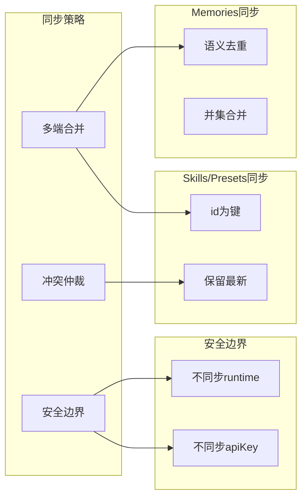

**图表来源**

- [packages/shared/src/schemas/ai-sync.schema.ts:16-65](file://packages/shared/src/schemas/ai-sync.schema.ts#L16-L65)

#### 数据同步策略

AI 同步采用"多端合并 + 冲突仲裁"的策略：

1. **Memories**：使用语义相似度进行去重，然后进行并集合并
2. **Skills/Presets**：以 ID 为键进行并集合并，保留 updatedAt 最新的版本
3. **安全隔离**：敏感的 runtime 配置和 API 密钥不参与同步

**章节来源**

- [packages/shared/src/schemas/ai-sync.schema.ts:1-70](file://packages/shared/src/schemas/ai-sync.schema.ts#L1-L70)

### 教学 Schema 模块

教学模块提供了学习进度跟踪和评估系统：

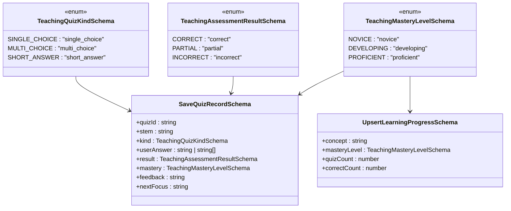

**图表来源**

- [packages/shared/src/schemas/teaching.schema.ts:6-46](file://packages/shared/src/schemas/teaching.schema.ts#L6-L46)

#### 学习进度管理

教学模块实现了完整的 LMS（学习管理系统）功能：

1. **多类型测验**：支持选择题、多选题和简答题
2. **智能评估**：自动评分和部分正确处理
3. **掌握度跟踪**：从新手到熟练的三个等级
4. **个性化反馈**：基于学习表现提供针对性建议

**章节来源**

- [packages/shared/src/schemas/teaching.schema.ts:1-97](file://packages/shared/src/schemas/teaching.schema.ts#L1-L97)

## 依赖关系分析

### 包依赖图

```mermaid
graph TB
subgraph "外部依赖"
Zod[zod 3.25.76]
Vitest[vitest 4.1.0]
TsUp[tsup 8.5.1]
TypeScript[typescript 5.9.3]
end
subgraph "内部模块"
Shared[@lumina/shared]
Backend[@lumina/backend]
Frontend[@lumina/frontend]
Sidecar[@lumina/sidecar]
end
Zod --> Shared
Vitest --> Shared
TsUp --> Shared
TypeScript --> Shared
Shared --> Backend
Shared --> Frontend
Shared --> Sidecar
```

**图表来源**

- [packages/shared/package.json:41-49](file://packages/shared/package.json#L41-L49)

### 构建和开发配置

共享包采用现代化的构建工具链：

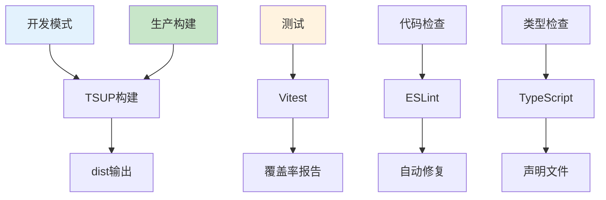

**图表来源**

- [packages/shared/package.json:28-40](file://packages/shared/package.json#L28-L40)
- [packages/shared/tsconfig.json:3-9](file://packages/shared/tsconfig.json#L3-L9)

**章节来源**

- [packages/shared/package.json:1-51](file://packages/shared/package.json#L1-L51)
- [packages/shared/tsconfig.json:1-13](file://packages/shared/tsconfig.json#L1-L13)
- [turbo.json:181-191](file://turbo.json#L181-L191)

## 性能考虑

### 构建优化

共享包在构建阶段采用了多项优化措施：

1. **增量构建**：利用 Turbo 的缓存机制，实现快速增量编译
2. **并行处理**：支持多任务并行执行，提高构建效率
3. **产物优化**：生成多种模块格式（ESM、CommonJS）以适应不同环境

### 运行时性能

1. **Schema 编译**：Zod Schema 在首次使用时编译，后续使用具有缓存效果
2. **验证优化**：采用短路验证策略，避免不必要的验证开销
3. **内存管理**：合理使用类型推断，减少运行时内存占用

## 故障排除指南

### 常见问题和解决方案

#### Schema 验证失败

当遇到 Schema 验证失败时，可以按照以下步骤排查：

1. **检查输入数据格式**：确保数据类型与 Schema 定义一致
2. **查看错误消息**：利用 ValidationKeys 获取本地化的错误描述
3. **启用调试模式**：在开发环境中启用详细的验证日志

#### 类型推断问题

如果遇到 TypeScript 类型推断错误：

1. **检查导出声明**：确保所有类型都正确导出
2. **验证类型兼容性**：检查不同模块间的类型兼容性
3. **重新生成声明文件**：清理并重新生成 .d.ts 文件

#### 构建问题

构建过程中可能遇到的问题：

1. **依赖版本冲突**：检查 package.json 中的依赖版本
2. **类型检查失败**：运行 `npm run type-check` 获取详细错误信息
3. **缓存问题**：清理 node_modules 和 dist 目录后重新安装依赖

**章节来源**

- [packages/shared/src/schemas/i18n-keys.ts:1-13](file://packages/shared/src/schemas/i18n-keys.ts#L1-L13)
- [packages/shared/src/dto/common.dto.ts:40-72](file://packages/shared/src/dto/common.dto.ts#L40-L72)

## 结论

@lumina/shared 共享包通过精心设计的架构和严格的类型系统，为整个 Lumina 项目提供了坚实的基础。其核心优势包括：

1. **统一的数据验证**：通过 Zod 实现跨模块的一致性验证
2. **模块化的架构设计**：清晰的功能分离和职责划分
3. **强大的类型系统**：完整的 TypeScript 支持和类型推断
4. **安全的通信协议**：MCP 协议的安全实现和验证
5. **高效的构建系统**：现代化的工具链和优化策略

该共享包不仅提高了开发效率，还确保了系统的可维护性和扩展性，为未来的功能扩展奠定了良好的基础。通过持续的优化和改进，@lumina/shared 将继续发挥其在整体架构中的核心作用。
