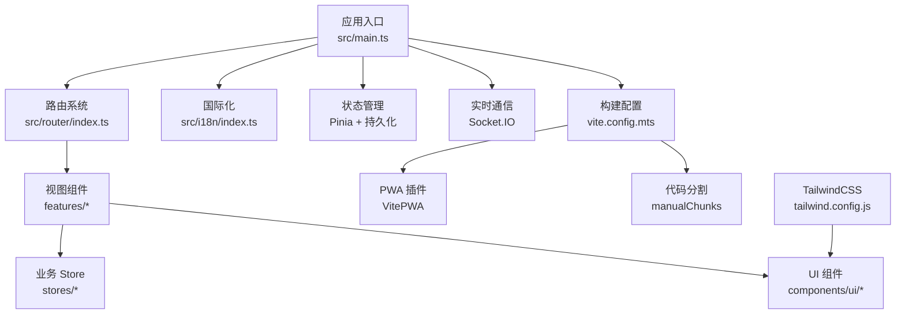
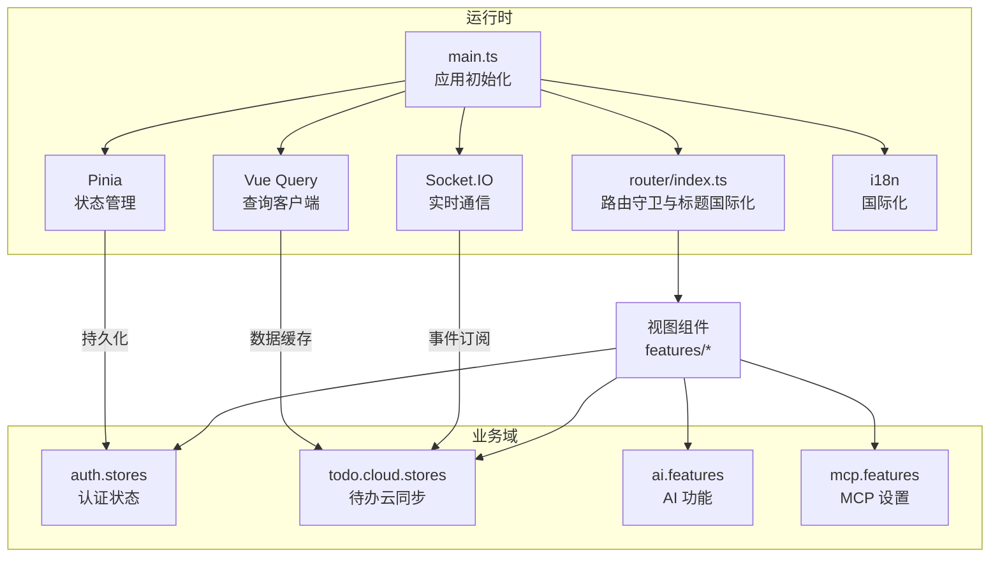
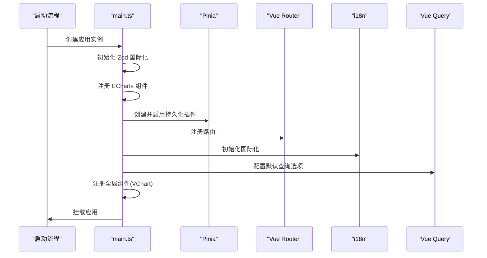
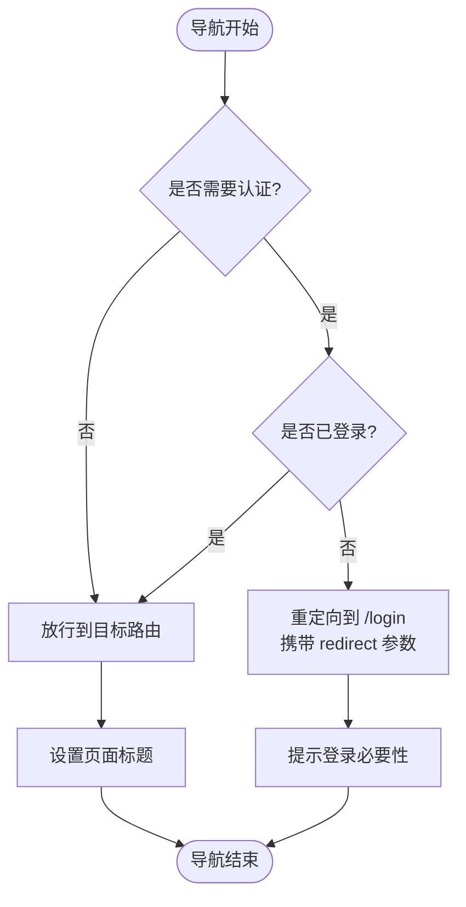
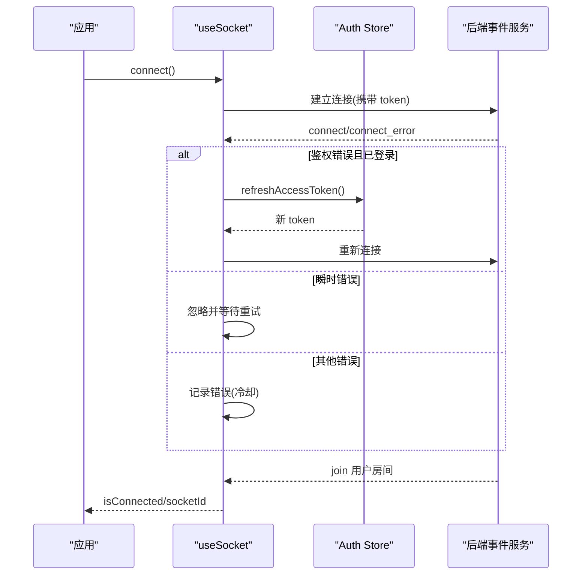
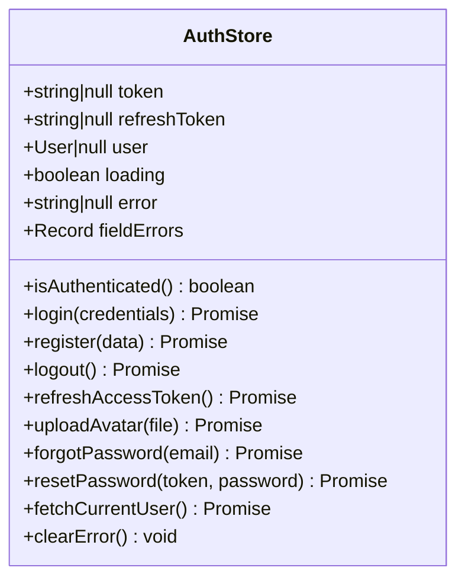
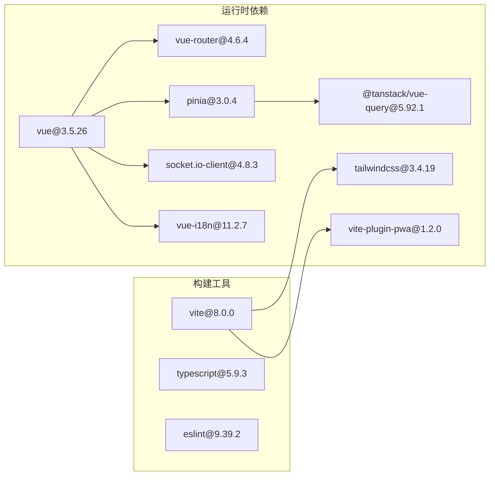

# 前端架构

<cite>
**本文档引用的文件**
- [apps/frontend/package.json](file://apps/frontend/package.json)
- [apps/frontend/src/main.ts](file://apps/frontend/src/main.ts)
- [apps/frontend/src/router/index.ts](file://apps/frontend/src/router/index.ts)
- [apps/frontend/vite.config.mts](file://apps/frontend/vite.config.mts)
- [apps/frontend/tailwind.config.js](file://apps/frontend/tailwind.config.js)
- [apps/frontend/src/App.vue](file://apps/frontend/src/App.vue)
- [apps/frontend/src/i18n/index.ts](file://apps/frontend/src/i18n/index.ts)
- [apps/frontend/tsconfig.json](file://apps/frontend/tsconfig.json)
- [apps/frontend/src/features/todo/stores/todo.cloud.ts](file://apps/frontend/src/features/todo/stores/todo.cloud.ts)
- [apps/frontend/src/features/auth/stores/auth.ts](file://apps/frontend/src/features/auth/stores/auth.ts)
- [apps/frontend/src/composables/useSocket.ts](file://apps/frontend/src/composables/useSocket.ts)
- [apps/frontend/src/composables/useRequest.ts](file://apps/frontend/src/composables/useRequest.ts)
- [apps/frontend/src/api/config.ts](file://apps/frontend/src/api/config.ts)
</cite>

## 目录

1. [简介](#简介)
2. [项目结构](#项目结构)
3. [核心组件](#核心组件)
4. [架构总览](#架构总览)
5. [详细组件分析](#详细组件分析)
6. [依赖关系分析](#依赖关系分析)
7. [性能考虑](#性能考虑)
8. [故障排除指南](#故障排除指南)
9. [结论](#结论)

## 简介

本项目是一个基于 Vue 3 的现代化前端应用，采用模块化架构设计，集成了多平台支持（Web、PWA、桌面应用）、国际化、状态管理、实时通信与构建优化。前端通过 Vite 进行构建，TailwindCSS 提供样式体系，Pinia 实现状态管理，Vue Router 管理路由，Socket.IO 实现实时事件推送，并通过 PWA 插件提供离线能力与渐进式体验。

## 项目结构

前端项目位于 apps/frontend 目录，采用按功能域划分的目录结构，主要包含以下层次：

- 应用入口与配置：main.ts、router、i18n、vite.config、tailwind.config、tsconfig
- 功能域模块：features 下按业务拆分（auth、todo、ai、mcp 等）
- 组件库：components 下提供 UI 组件与可复用组合式函数（composables）
- 服务层：api、services、lib 等
- 样式与主题：styles、tailwind.config
- 测试：tests 目录下的单元测试与集成测试

**图表来源**

- [apps/frontend/src/main.ts:1-138](file://apps/frontend/src/main.ts#L1-L138)
- [apps/frontend/src/router/index.ts:1-98](file://apps/frontend/src/router/index.ts#L1-L98)
- [apps/frontend/vite.config.mts:1-267](file://apps/frontend/vite.config.mts#L1-L267)
- [apps/frontend/tailwind.config.js:1-303](file://apps/frontend/tailwind.config.js#L1-L303)

**章节来源**

- [apps/frontend/package.json:1-104](file://apps/frontend/package.json#L1-L104)
- [apps/frontend/src/main.ts:1-138](file://apps/frontend/src/main.ts#L1-L138)
- [apps/frontend/src/router/index.ts:1-98](file://apps/frontend/src/router/index.ts#L1-L98)
- [apps/frontend/vite.config.mts:1-267](file://apps/frontend/vite.config.mts#L1-L267)
- [apps/frontend/tailwind.config.js:1-303](file://apps/frontend/tailwind.config.js#L1-L303)
- [apps/frontend/tsconfig.json:1-28](file://apps/frontend/tsconfig.json#L1-L28)

## 核心组件

- 应用入口与初始化：在 main.ts 中完成 Vue 应用创建、插件注册（Pinia、Vue Router、i18n、Vue Query）、全局错误处理、ECharts 组件注册与 PWA 相关初始化。
- 路由系统：基于 Vue Router，支持历史模式与哈希模式（Wails 桌面模式），实现页面标题国际化与认证守卫。
- 国际化：基于 vue-i18n，支持中英双语，自动检测浏览器语言并持久化用户选择。
- 状态管理：Pinia + pinia-plugin-persistedstate，结合 @tanstack/vue-query 实现数据缓存与并发控制。
- 实时通信：Socket.IO 客户端封装，自动重连、鉴权透传、连接状态管理与错误降噪。
- 构建与打包：Vite 配置，支持 Gzip/Brotli 压缩、PWA 缓存策略、代码分割与代理配置。
- 样式系统：TailwindCSS，基于 CSS 变量的主题系统，支持暗色模式与丰富的动画与阴影效果。

**章节来源**

- [apps/frontend/src/main.ts:10-138](file://apps/frontend/src/main.ts#L10-L138)
- [apps/frontend/src/router/index.ts:10-98](file://apps/frontend/src/router/index.ts#L10-L98)
- [apps/frontend/src/i18n/index.ts:1-37](file://apps/frontend/src/i18n/index.ts#L1-L37)
- [apps/frontend/src/composables/useSocket.ts:1-190](file://apps/frontend/src/composables/useSocket.ts#L1-L190)
- [apps/frontend/vite.config.mts:80-267](file://apps/frontend/vite.config.mts#L80-L267)
- [apps/frontend/tailwind.config.js:4-303](file://apps/frontend/tailwind.config.js#L4-L303)

## 架构总览

前端采用“入口 -> 路由 -> 视图 -> 业务 Store -> 服务层”的分层架构，配合实时通信与缓存策略，形成完整的用户体验闭环。

**图表来源**

- [apps/frontend/src/main.ts:54-138](file://apps/frontend/src/main.ts#L54-L138)
- [apps/frontend/src/router/index.ts:60-95](file://apps/frontend/src/router/index.ts#L60-L95)
- [apps/frontend/src/features/auth/stores/auth.ts:24-439](file://apps/frontend/src/features/auth/stores/auth.ts#L24-L439)
- [apps/frontend/src/features/todo/stores/todo.cloud.ts:6-44](file://apps/frontend/src/features/todo/stores/todo.cloud.ts#L6-L44)

## 详细组件分析

### 应用入口与初始化（main.ts）

- 初始化顺序：Zod 国际化、ECharts 组件注册、Pinia 与持久化插件、Vue Query、i18n、全局组件注册。
- 全局错误处理：动态导入 Chunk 加载失败检测与刷新保护；忽略 ResizeObserver 相关的良性错误；统一记录未捕获异常。
- 性能与可用性：Vue Query 默认缓存策略与重试次数；全局 VChart 注册简化图表组件使用。

**图表来源**

- [apps/frontend/src/main.ts:32-138](file://apps/frontend/src/main.ts#L32-L138)

**章节来源**

- [apps/frontend/src/main.ts:32-138](file://apps/frontend/src/main.ts#L32-L138)

### 路由系统与守卫（router/index.ts）

- 路由模式：根据 IS_WAILS 环境变量选择 history 或 hash 模式。
- 页面标题：通过 i18n 动态设置 document.title，支持通用应用名与子页面标题。
- 认证守卫：对需要登录的路由进行拦截，未登录跳转到登录页并携带重定向参数。

**图表来源**

- [apps/frontend/src/router/index.ts:81-95](file://apps/frontend/src/router/index.ts#L81-L95)

**章节来源**

- [apps/frontend/src/router/index.ts:10-98](file://apps/frontend/src/router/index.ts#L10-L98)

### 国际化（i18n/index.ts）

- 自动语言检测：优先读取本地存储，其次浏览器语言，最后回退到 zh-CN。
- 类型安全：通过 DeepStringify 确保消息键值为字符串类型。
- 回退机制：fallbackLocale 保证缺失翻译时的显示稳定性。

**章节来源**

- [apps/frontend/src/i18n/index.ts:1-37](file://apps/frontend/src/i18n/index.ts#L1-L37)

### 实时通信（composables/useSocket.ts）

- 单例管理：全局 Socket 实例，避免重复连接。
- 自动重连：指数退避与随机抖动，最大重连时间限制。
- 鉴权透传：连接时附带 token，鉴权失败自动刷新 token 并重连。
- 连接等待：提供 waitForConnection 能力，支持超时与回调清理。
- 错误降噪：对重复错误进行冷却日志，避免刷屏。

**图表来源**

- [apps/frontend/src/composables/useSocket.ts:55-190](file://apps/frontend/src/composables/useSocket.ts#L55-L190)

**章节来源**

- [apps/frontend/src/composables/useSocket.ts:1-190](file://apps/frontend/src/composables/useSocket.ts#L1-L190)

### API 配置与基础路径（api/config.ts）

- 基础路径解析：优先 VITE_API_BASE_URL，其次 Wails 模式下的 VITE_SERVER_URL，最后 Web 模式的相对路径。
- 服务器源地址：用于静态资源拼接与 WebSocket 地址推导。
- 环境变量注入：通过 Vite define 与 .env 文件注入，适配不同部署场景。

**章节来源**

- [apps/frontend/src/api/config.ts:1-47](file://apps/frontend/src/api/config.ts#L1-L47)

### 状态管理与持久化（features/auth/stores/auth.ts）

- 认证状态：token、refreshToken、user、loading、error、fieldErrors。
- 计算属性：isAuthenticated 基于 token 判断。
- 错误处理：统一处理 API 错误与字段错误，区分瞬时错误与未授权错误。
- 生命周期：hydrateFromStorage 从本地恢复状态；persistAuthState 持久化；clearPersistedAuth 清理。
- 登录后同步：登录/注册成功后触发待办合并与 AI 数据同步（fire-and-forget）。
- 刷新策略：最多两次重试，延迟递增，区分瞬时与未授权错误。

**图表来源**

- [apps/frontend/src/features/auth/stores/auth.ts:24-439](file://apps/frontend/src/features/auth/stores/auth.ts#L24-L439)

**章节来源**

- [apps/frontend/src/features/auth/stores/auth.ts:1-439](file://apps/frontend/src/features/auth/stores/auth.ts#L1-L439)

### 待办云同步（features/todo/stores/todo.cloud.ts）

- 云同步抽象：通过 createTodoCloud 包装 cloudData，暴露 sync、debouncedSync、mergeOnLogin、initSocketListener 等方法。
- 冲突处理：acceptSyncConflict、retrySyncConflict、clearSyncConflicts。
- 清理操作：deleteTodoPermanently、clearTrash。
- 远程状态：remoteTodos、lastSyncAt、syncOwnerId、isRemoteSource、isTrashLoaded。

**章节来源**

- [apps/frontend/src/features/todo/stores/todo.cloud.ts:1-44](file://apps/frontend/src/features/todo/stores/todo.cloud.ts#L1-L44)

### 通用请求 Hook（composables/useRequest.ts）

- 统一状态：data、loading、error 三元组。
- 执行流程：execute 包装异步请求，自动设置 loading 与 error，错误通过 i18n 国际化提示。
- 返回值：返回 data、loading、error 与 execute 函数，便于在组件中直接使用。

**章节来源**

- [apps/frontend/src/composables/useRequest.ts:1-46](file://apps/frontend/src/composables/useRequest.ts#L1-L46)

### 构建与打包（vite.config.mts）

- 基础路径：根据 IS_WAILS 与 VITE_API_BASE_URL 动态设置 base。
- 代码分割：按依赖库类型手动拆分 vendor chunk（vue-vendor、ui-vendor、chart-vendor 等）。
- 压缩策略：Gzip 与 Brotli 双通道压缩，降低传输体积。
- PWA：Workbox 运行时缓存策略（CDN、API、图片、字体），离线页面与清单配置。
- 开发代理：/api 与 /socket.io 代理到后端，支持长连接与超时配置。
- 环境变量：IS_WAILS 注入，用于运行时行为切换。

**章节来源**

- [apps/frontend/vite.config.mts:15-267](file://apps/frontend/vite.config.mts#L15-L267)

### 样式与主题（tailwind.config.js）

- 暗色模式：基于 class 控制。
- 响应式断点：xs 到 3xl，适配移动端与桌面端。
- 颜色系统：基于 CSS 变量，支持主题色、语义色、AI 特定色板与语言标签色。
- 字体与阴影：自定义字体族与阴影层级，提升视觉层次。
- 动画：内置多种动画关键帧与过渡曲线，增强交互体验。

**章节来源**

- [apps/frontend/tailwind.config.js:4-303](file://apps/frontend/tailwind.config.js#L4-L303)

### 应用根组件（App.vue）

- 主题初始化：useTheme() 应用 CSS 变量主题。
- 平台适配：检测 Wails 平台并在 body 添加类名以启用拖拽区域样式。
- 全局事件：挂载时初始化全局 WebSocket 监听（todoStore.initSocketListener）。
- 结构：RouterView 容器、ToastProvider 与 AI 匿名迁移对话框。

**章节来源**

- [apps/frontend/src/App.vue:1-77](file://apps/frontend/src/App.vue#L1-L77)

## 依赖关系分析

**图表来源**

- [apps/frontend/package.json:31-102](file://apps/frontend/package.json#L31-L102)
- [apps/frontend/vite.config.mts:5-8](file://apps/frontend/vite.config.mts#L5-L8)

**章节来源**

- [apps/frontend/package.json:1-104](file://apps/frontend/package.json#L1-L104)

## 性能考虑

- 代码分割：通过 manualChunks 将第三方库按功能域拆分，减少首屏体积并提升缓存命中率。
- 缓存策略：PWA Workbox 对 CDN、API、图片、字体分别设置缓存策略，离线页面与导航预加载优化可用性。
- 请求缓存：Vue Query 默认 1 分钟新鲜度与 1 次重试，平衡实时性与网络稳定性。
- 图表渲染：ECharts 按需注册组件，避免全量引入造成体积膨胀。
- 构建优化：Gzip/Brotli 压缩与 chunkSizeWarningLimit 调整，降低传输与加载压力。

## 故障排除指南

- 动态导入错误：当部署更新导致 Chunk 404 时，入口会检测并自动刷新页面（限制 10 秒内仅刷新一次）。
- ResizeObserver 错误：忽略“循环限制”与“未交付通知”的良性错误，避免控制台刷屏。
- 未捕获异常：统一记录全局错误与 Promise 拒绝，便于定位问题。
- Socket 连接错误：区分鉴权错误与瞬时错误，鉴权错误自动刷新 token 并重连，瞬时错误等待重试。
- 路由守卫：未登录访问受保护路由会提示并重定向到登录页，携带原路径以便登录后跳转。

**章节来源**

- [apps/frontend/src/main.ts:59-113](file://apps/frontend/src/main.ts#L59-L113)
- [apps/frontend/src/composables/useSocket.ts:92-107](file://apps/frontend/src/composables/useSocket.ts#L92-L107)
- [apps/frontend/src/router/index.ts:81-95](file://apps/frontend/src/router/index.ts#L81-L95)

## 结论

该前端架构以模块化、可维护性与高性能为核心目标，通过清晰的分层设计与完善的基础设施（路由、状态、实时通信、构建与样式），为多平台应用提供了稳定可靠的用户体验。建议在后续迭代中持续关注缓存策略与错误监控，进一步优化首屏性能与异常恢复能力。
