# 后端架构

<cite>
**本文档引用的文件**
- [apps/backend/src/app.module.ts](file://apps/backend/src/app.module.ts)
- [apps/backend/src/main.ts](file://apps/backend/src/main.ts)
- [apps/backend/package.json](file://apps/backend/package.json)
- [apps/backend/nest-cli.json](file://apps/backend/nest-cli.json)
- [apps/backend/src/auth/auth.module.ts](file://apps/backend/src/auth/auth.module.ts)
- [apps/backend/src/todos/todos.module.ts](file://apps/backend/src/todos/todos.module.ts)
- [apps/backend/src/prisma/prisma.module.ts](file://apps/backend/src/prisma/prisma.module.ts)
- [apps/backend/src/redis/redis.module.ts](file://apps/backend/src/redis/redis.module.ts)
- [apps/backend/src/auth/auth.service.ts](file://apps/backend/src/auth/auth.service.ts)
- [apps/backend/src/todos/todos.service.ts](file://apps/backend/src/todos/todos.service.ts)
- [apps/backend/src/prisma/prisma.service.ts](file://apps/backend/src/prisma/prisma.service.ts)
- [apps/backend/src/redis/redis.service.ts](file://apps/backend/src/redis/redis.service.ts)
- [apps/backend/src/events/events.module.ts](file://apps/backend/src/events/events.module.ts)
- [apps/backend/src/health/health.module.ts](file://apps/backend/src/health/health.module.ts)
- [apps/backend/src/common/index.ts](file://apps/backend/src/common/index.ts)
- [apps/backend/tsconfig.json](file://apps/backend/tsconfig.json)
</cite>

## 目录

1. [项目概述](#项目概述)
2. [项目结构](#项目结构)
3. [核心组件](#核心组件)
4. [架构概览](#架构概览)
5. [详细组件分析](#详细组件分析)
6. [依赖关系分析](#依赖关系分析)
7. [性能考虑](#性能考虑)
8. [故障排除指南](#故障排除指南)
9. [结论](#结论)

## 项目概述

Lumina 是一个基于 NestJS 的现代化后端架构，采用 TypeScript 构建，专注于提供高效的 AI 驱动个人待办应用。该系统采用了模块化的架构设计，集成了多种现代 Web 技术栈，包括 Fastify 服务器、Prisma ORM、Redis 缓存、BullMQ 任务队列等。

### 主要特性

- **高性能 Web 服务器**: 基于 Fastify，提供比 Express 更高的性能表现
- **模块化架构**: 采用 NestJS 的模块化设计，支持功能解耦和可维护性
- **现代化数据库**: 使用 Prisma ORM 提供类型安全的数据库操作
- **分布式缓存**: 集成 Redis 提供高速缓存和会话存储
- **异步任务处理**: 使用 BullMQ 实现可靠的后台任务队列
- **实时通信**: 支持 WebSocket 实时事件推送
- **国际化支持**: 内置多语言支持框架
- **安全防护**: 集成多种安全中间件和防护机制

## 项目结构

后端项目采用标准的 NestJS 项目结构，主要分为以下层次：

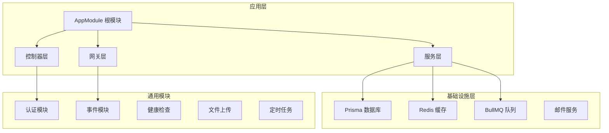

**图表来源**

- [apps/backend/src/app.module.ts:1-170](file://apps/backend/src/app.module.ts#L1-L170)
- [apps/backend/src/main.ts:1-217](file://apps/backend/src/main.ts#L1-L217)

### 核心目录结构

| 目录          | 功能描述     | 主要文件           |
| ------------- | ------------ | ------------------ |
| `src/`        | 源代码目录   | 主要业务逻辑       |
| `src/auth/`   | 认证授权模块 | 用户认证、JWT 处理 |
| `src/todos/`  | 待办事项模块 | 任务管理、同步逻辑 |
| `src/prisma/` | 数据库模块   | Prisma 配置、服务  |
| `src/redis/`  | 缓存模块     | Redis 配置、服务   |
| `src/events/` | 实时通信     | WebSocket 网关     |
| `src/health/` | 健康检查     | 应用状态监控       |
| `src/common/` | 通用工具     | 过滤器、拦截器     |

**章节来源**

- [apps/backend/src/app.module.ts:1-170](file://apps/backend/src/app.module.ts#L1-L170)
- [apps/backend/nest-cli.json:1-11](file://apps/backend/nest-cli.json#L1-L11)

## 核心组件

### 应用启动器

应用通过 `main.ts` 启动，配置了完整的中间件栈和全局配置：

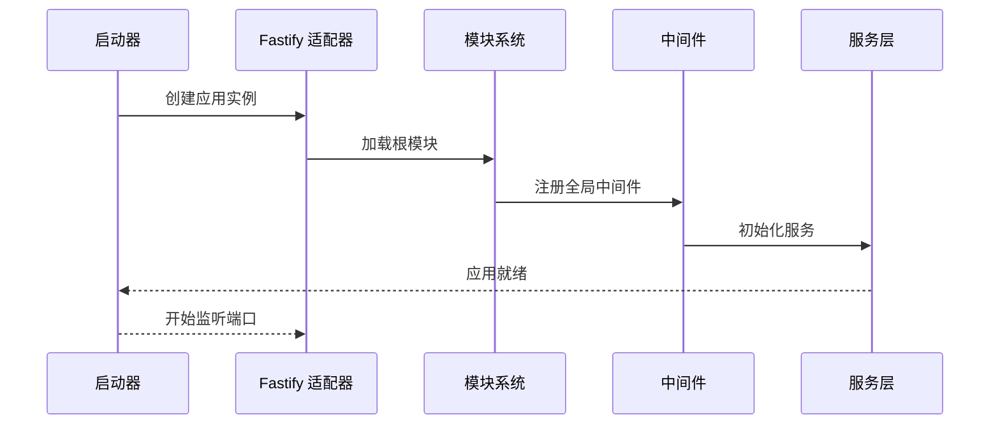

**图表来源**

- [apps/backend/src/main.ts:35-217](file://apps/backend/src/main.ts#L35-L217)

### 根模块配置

`AppModule` 作为应用的根模块，整合了所有功能模块：

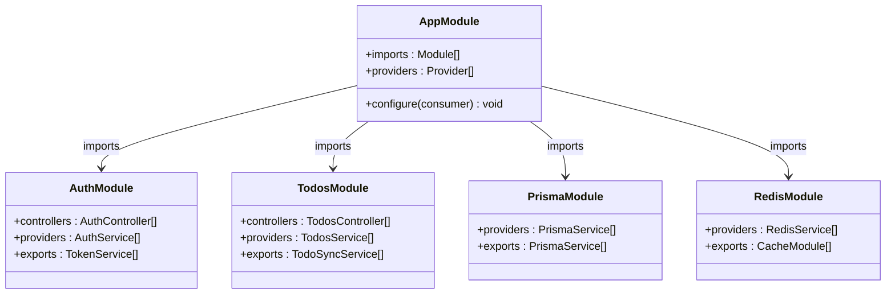

**图表来源**

- [apps/backend/src/app.module.ts:33-165](file://apps/backend/src/app.module.ts#L33-L165)

**章节来源**

- [apps/backend/src/main.ts:1-217](file://apps/backend/src/main.ts#L1-L217)
- [apps/backend/src/app.module.ts:1-170](file://apps/backend/src/app.module.ts#L1-L170)

## 架构概览

系统采用分层架构设计，结合微服务理念的功能模块化：

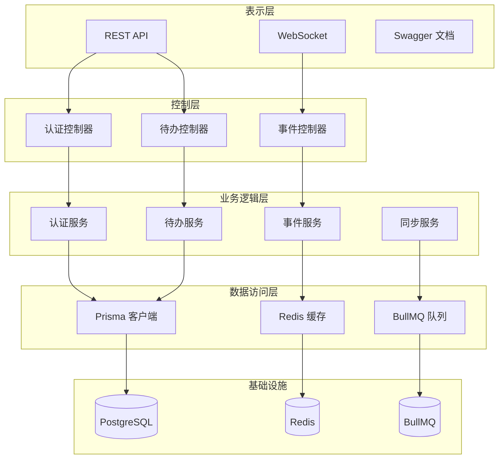

**图表来源**

- [apps/backend/src/app.module.ts:14-156](file://apps/backend/src/app.module.ts#L14-L156)
- [apps/backend/src/main.ts:188-197](file://apps/backend/src/main.ts#L188-L197)

### 安全架构

系统实现了多层次的安全防护机制：

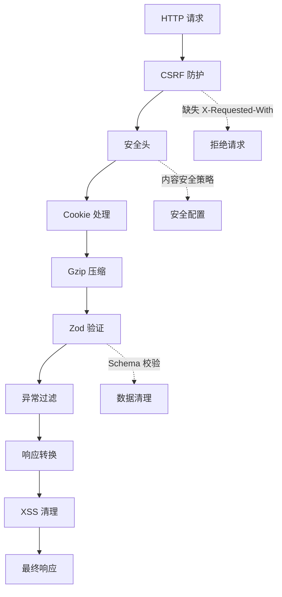

**图表来源**

- [apps/backend/src/main.ts:131-186](file://apps/backend/src/main.ts#L131-L186)

**章节来源**

- [apps/backend/src/main.ts:49-186](file://apps/backend/src/main.ts#L49-L186)

## 详细组件分析

### 认证模块

认证模块提供了完整的用户身份验证和授权功能：

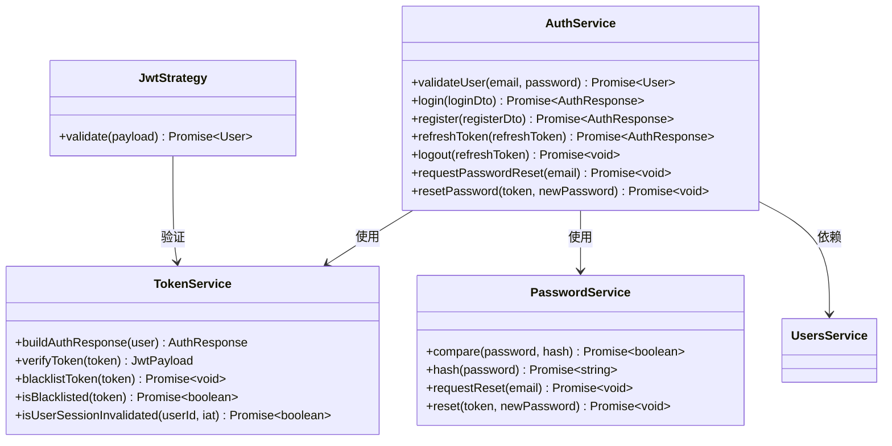

**图表来源**

- [apps/backend/src/auth/auth.service.ts:12-127](file://apps/backend/src/auth/auth.service.ts#L12-L127)

#### 认证流程

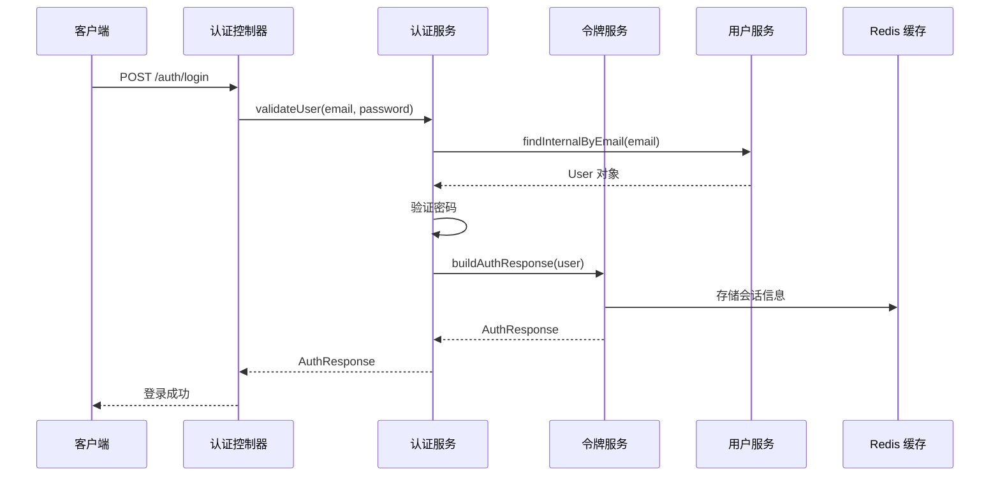

**图表来源**

- [apps/backend/src/auth/auth.service.ts:26-49](file://apps/backend/src/auth/auth.service.ts#L26-L49)

**章节来源**

- [apps/backend/src/auth/auth.module.ts:1-41](file://apps/backend/src/auth/auth.module.ts#L1-L41)
- [apps/backend/src/auth/auth.service.ts:1-127](file://apps/backend/src/auth/auth.service.ts#L1-L127)

### 待办事项模块

待办事项模块提供了完整的任务管理功能：

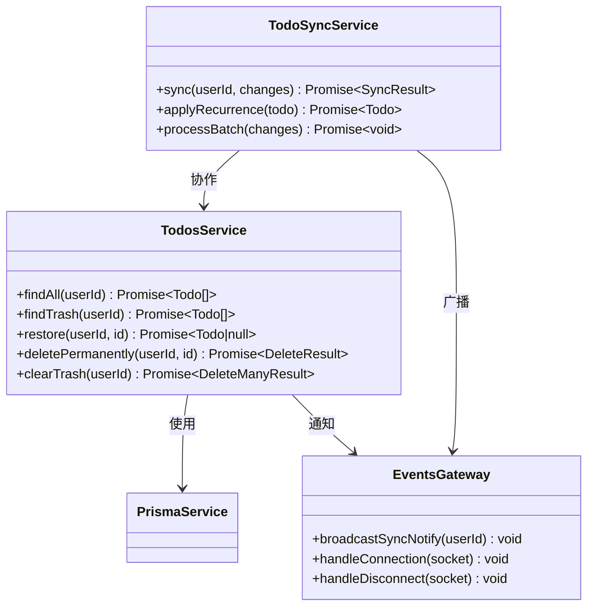

**图表来源**

- [apps/backend/src/todos/todos.service.ts:27-147](file://apps/backend/src/todos/todos.service.ts#L27-L147)

#### 数据库事务处理

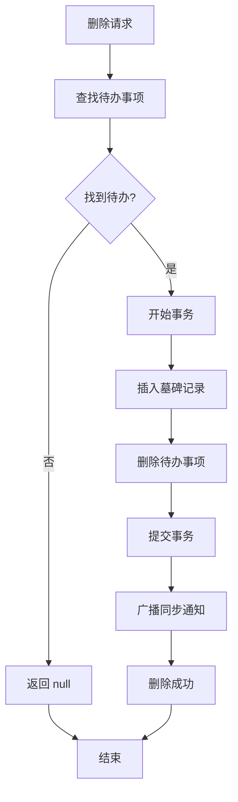

**图表来源**

- [apps/backend/src/todos/todos.service.ts:90-111](file://apps/backend/src/todos/todos.service.ts#L90-L111)

**章节来源**

- [apps/backend/src/todos/todos.module.ts:1-15](file://apps/backend/src/todos/todos.module.ts#L1-L15)
- [apps/backend/src/todos/todos.service.ts:1-147](file://apps/backend/src/todos/todos.service.ts#L1-L147)

### 数据库层

Prisma 作为 ORM 层，提供了类型安全的数据库操作：

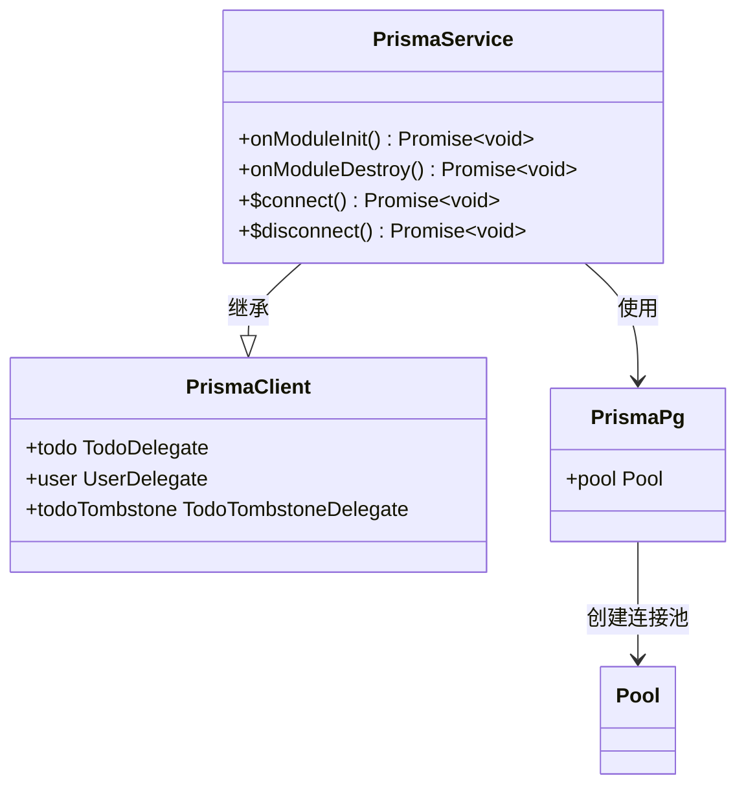

**图表来源**

- [apps/backend/src/prisma/prisma.service.ts:6-34](file://apps/backend/src/prisma/prisma.service.ts#L6-L34)

#### 连接池配置

系统使用 PostgreSQL 作为主数据库，通过连接池实现高性能访问：

| 配置项                | 默认值 | 描述                   |
| --------------------- | ------ | ---------------------- |
| DATABASE_URL          | 必需   | 数据库连接字符串       |
| PG_CONNECTION_TIMEOUT | 5      | 连接超时时间（秒）     |
| PG_STATEMENT_TIMEOUT  | 30     | SQL 语句超时时间（秒） |
| PG_IDLE_TIMEOUT       | 60     | 空闲连接超时时间（秒） |
| MAX_POOL_SIZE         | 10     | 最大连接数             |

**章节来源**

- [apps/backend/src/prisma/prisma.module.ts:1-10](file://apps/backend/src/prisma/prisma.module.ts#L1-L10)
- [apps/backend/src/prisma/prisma.service.ts:1-34](file://apps/backend/src/prisma/prisma.service.ts#L1-L34)

### 缓存层

Redis 缓存层提供了高性能的数据缓存和会话存储：

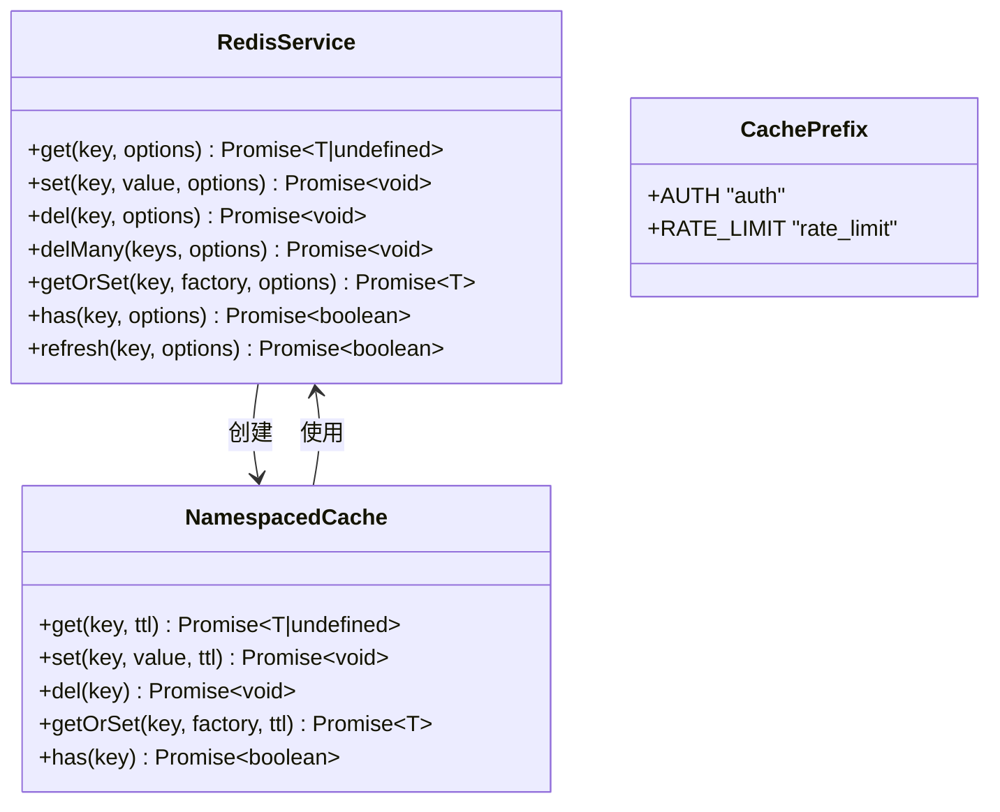

**图表来源**

- [apps/backend/src/redis/redis.service.ts:57-251](file://apps/backend/src/redis/redis.service.ts#L57-L251)

#### 缓存策略

系统实现了多种缓存策略以优化性能：

| 缓存类型 | 前缀       | TTL     | 用途                 |
| -------- | ---------- | ------- | -------------------- |
| 认证缓存 | auth       | 5 分钟  | JWT 黑名单、会话状态 |
| 速率限制 | rate_limit | 1 分钟  | API 限流控制         |
| 用户数据 | user       | 15 分钟 | 用户信息缓存         |
| 会话数据 | session    | 1 小时  | 用户会话信息         |

**章节来源**

- [apps/backend/src/redis/redis.module.ts:1-84](file://apps/backend/src/redis/redis.module.ts#L1-L84)
- [apps/backend/src/redis/redis.service.ts:1-251](file://apps/backend/src/redis/redis.service.ts#L1-L251)

### 实时通信

WebSocket 网关提供了实时事件推送功能：

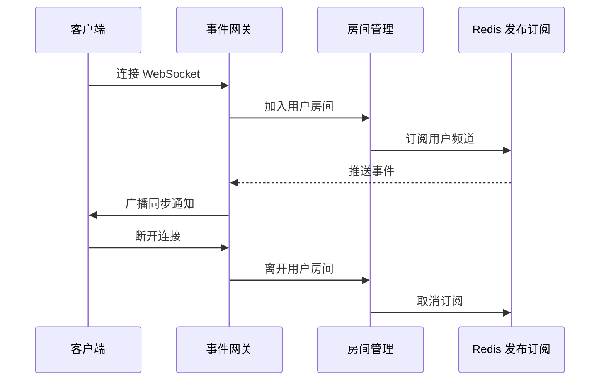

**图表来源**

- [apps/backend/src/events/events.module.ts:1-15](file://apps/backend/src/events/events.module.ts#L1-L15)

**章节来源**

- [apps/backend/src/events/events.module.ts:1-15](file://apps/backend/src/events/events.module.ts#L1-L15)

## 依赖关系分析

### 外部依赖

系统依赖的主要第三方库：

```mermaid
graph TB
subgraph "Web 框架"
NestJS[@nestjs/core]
Fastify[@nestjs/platform-fastify]
Swagger[@nestjs/swagger]
end
subgraph "数据库相关"
Prisma[@prisma/client]
Pg[pg]
PrismaAdapter[@prisma/adapter-pg]
end
subgraph "缓存相关"
Redis[ioredis]
CacheManager[cache-manager]
RedisYet[cache-manager-ioredis-yet]
end
subgraph "队列相关"
BullMQ[bullmq]
SocketIO[socket.io]
end
subgraph "安全相关"
JWT[@nestjs/jwt]
Passport[@nestjs/passport]
Helmet[@fastify/helmet]
Cookie[@fastify/cookie]
end
subgraph "工具库"
Lodash[lodash]
DayJS[dayjs]
Bcrypt[bcryptjs]
end
```

**图表来源**

- [apps/backend/package.json:31-87](file://apps/backend/package.json#L31-L87)

### 内部模块依赖

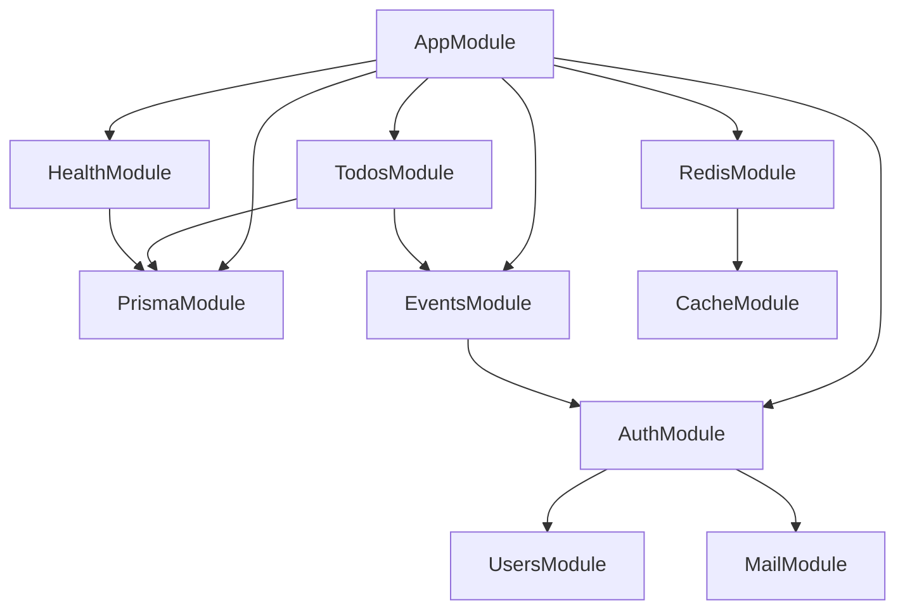

**图表来源**

- [apps/backend/src/app.module.ts:13-27](file://apps/backend/src/app.module.ts#L13-L27)

**章节来源**

- [apps/backend/package.json:1-107](file://apps/backend/package.json#L1-L107)
- [apps/backend/src/app.module.ts:1-170](file://apps/backend/src/app.module.ts#L1-L170)

## 性能考虑

### 启动性能优化

系统在启动阶段进行了多项性能优化：

1. **延迟连接**: Redis 连接采用懒加载策略，减少启动时间
2. **连接池**: PostgreSQL 使用连接池，避免频繁建立连接
3. **模块预加载**: 关键模块在应用启动时预热

### 运行时性能

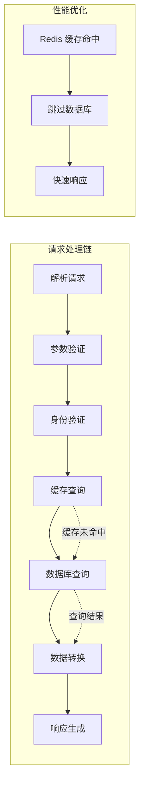

### 缓存策略

系统实现了智能的缓存策略来提升性能：

| 场景     | 缓存策略 | TTL    | 命中率 |
| -------- | -------- | ------ | ------ |
| 用户信息 | 读多写少 | 15分钟 | 高     |
| 认证令牌 | 严格时效 | 5分钟  | 中     |
| 配置数据 | 静态数据 | 1小时  | 非常高 |
| 会话状态 | 动态更新 | 1小时  | 中     |

## 故障排除指南

### 常见问题诊断

#### 数据库连接问题

**症状**: 应用启动时报数据库连接错误

**解决方案**:

1. 检查 `DATABASE_URL` 环境变量配置
2. 验证数据库服务是否正常运行
3. 检查网络连接和防火墙设置

#### Redis 连接问题

**症状**: 缓存功能异常，应用报 Redis 连接失败

**解决方案**:

1. 检查 Redis 服务器状态
2. 验证连接参数配置
3. 查看 Redis 日志获取详细错误信息

#### 认证失败问题

**症状**: 用户无法登录，返回认证错误

**解决方案**:

1. 检查 JWT 密钥配置
2. 验证用户密码哈希
3. 检查 Redis 中的令牌黑名单

### 监控和日志

系统提供了完善的监控和日志机制：

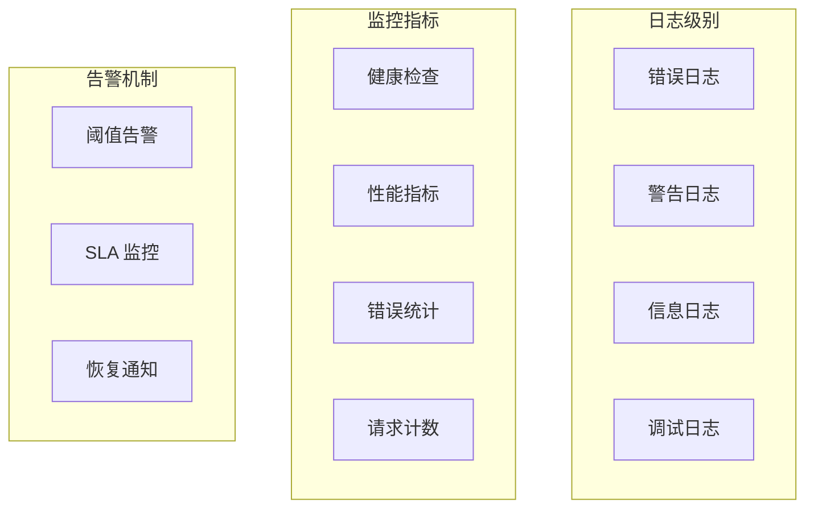

**章节来源**

- [apps/backend/src/main.ts:41-44](file://apps/backend/src/main.ts#L41-L44)
- [apps/backend/src/health/health.module.ts:1-14](file://apps/backend/src/health/health.module.ts#L1-L14)

## 结论

Lumina 后端架构展现了现代 Web 应用的最佳实践，通过模块化设计、性能优化和安全保障，构建了一个可扩展、可维护的企业级应用平台。

### 架构优势

1. **模块化设计**: 清晰的功能分离，便于维护和测试
2. **性能优化**: 多层缓存、连接池和异步处理
3. **安全性强**: 多层次安全防护和数据验证
4. **可扩展性**: 插件化架构支持功能扩展
5. **可观测性**: 完善的日志和监控体系

### 技术选型总结

- **Web 框架**: NestJS + Fastify 提供高性能和类型安全
- **数据库**: Prisma ORM + PostgreSQL 确保数据一致性
- **缓存**: Redis 提供高速缓存和会话存储
- **实时通信**: Socket.IO + BullMQ 实现实时事件推送
- **安全**: 多层安全防护确保应用安全

该架构为后续的功能扩展和技术演进奠定了坚实的基础，能够支持从个人应用到企业级应用的各种场景需求。
