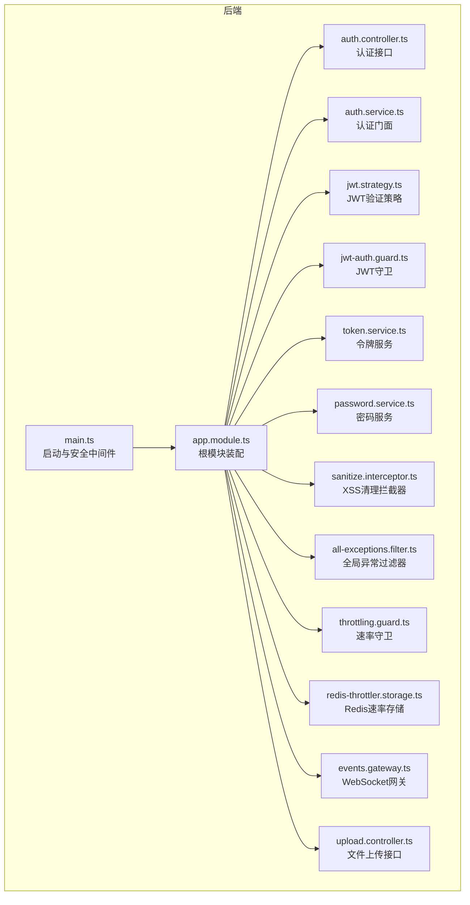
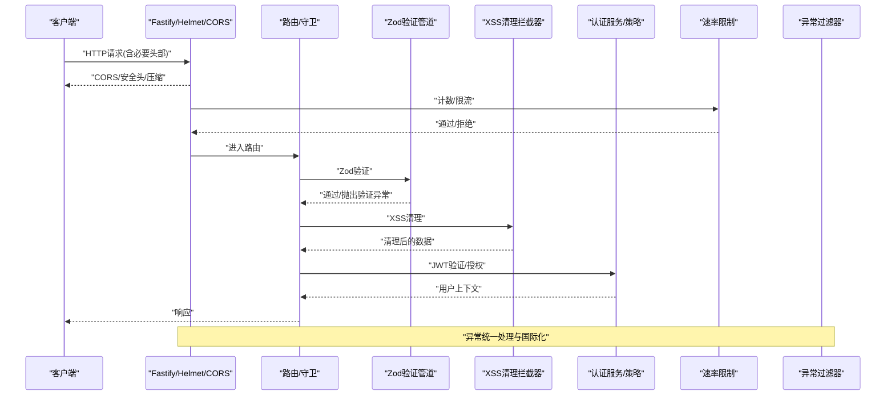
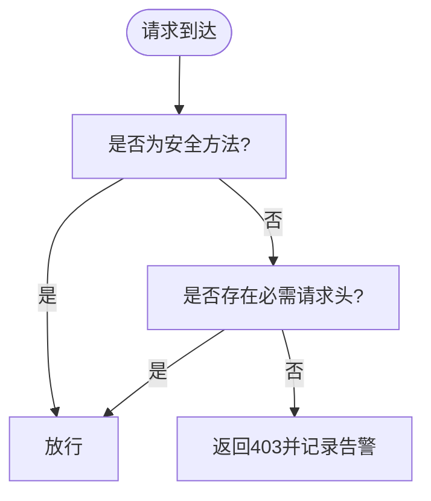
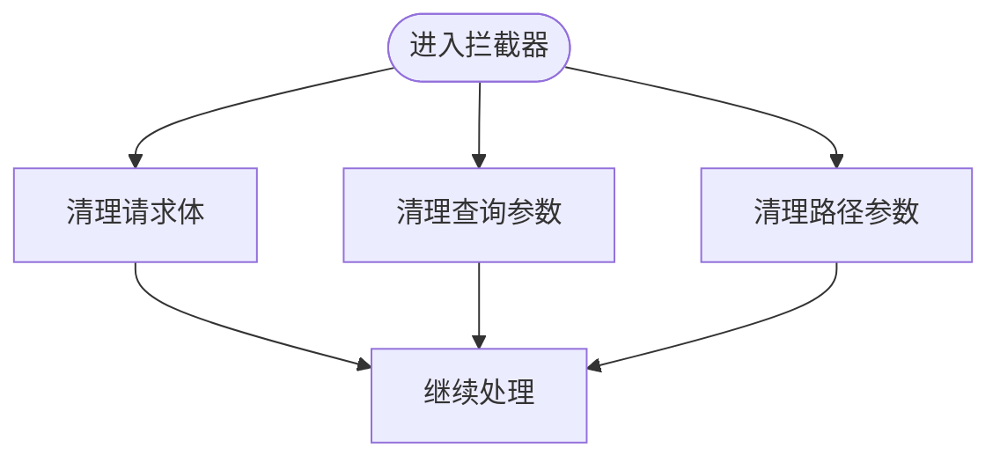
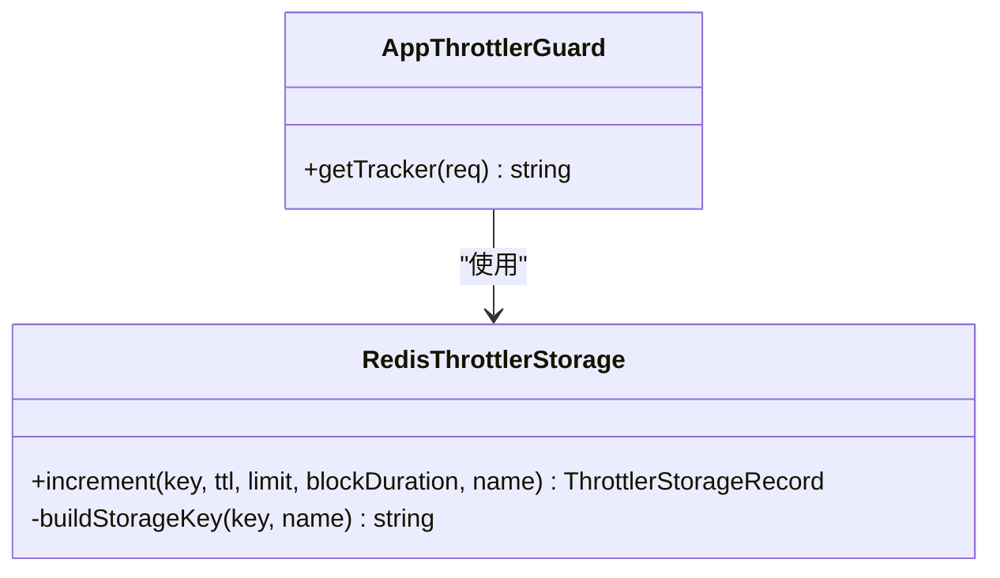
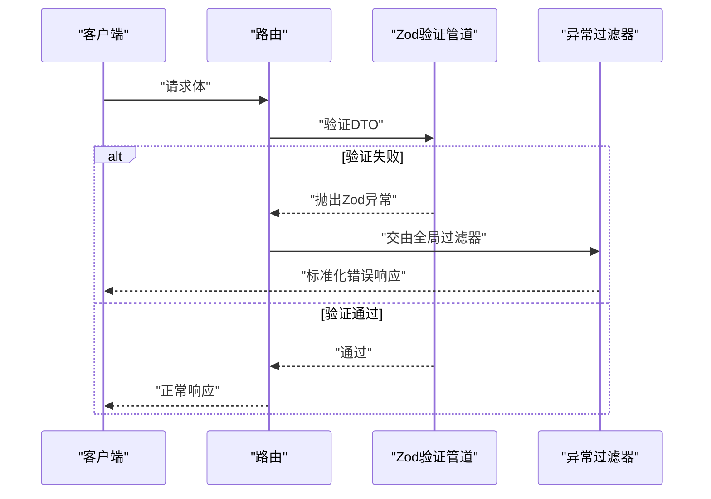
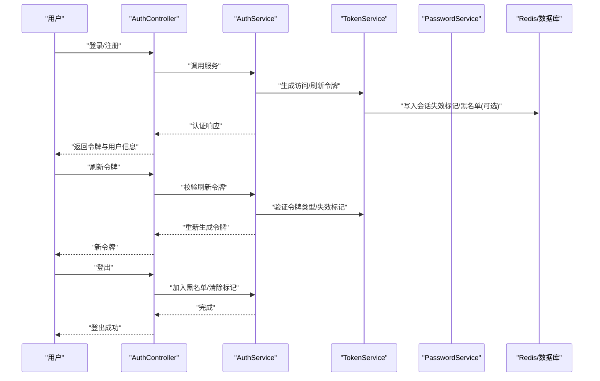
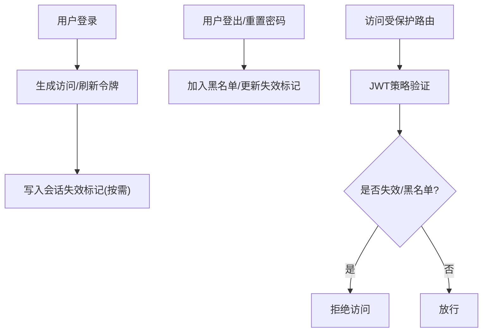
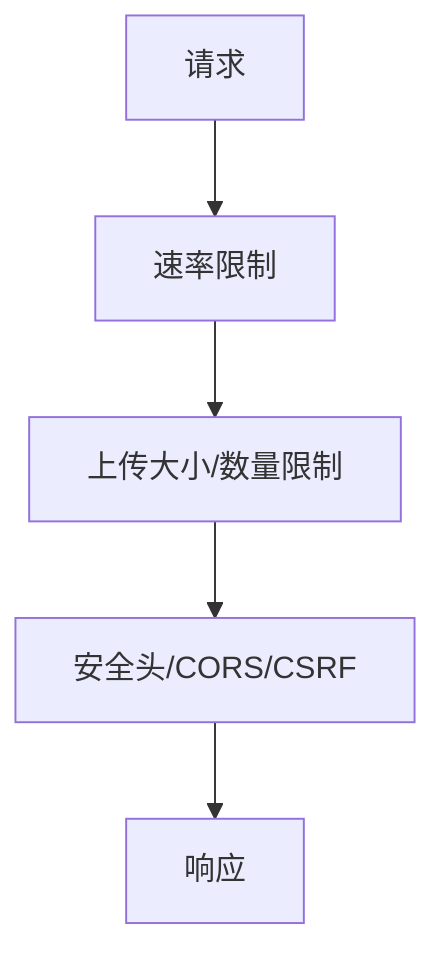
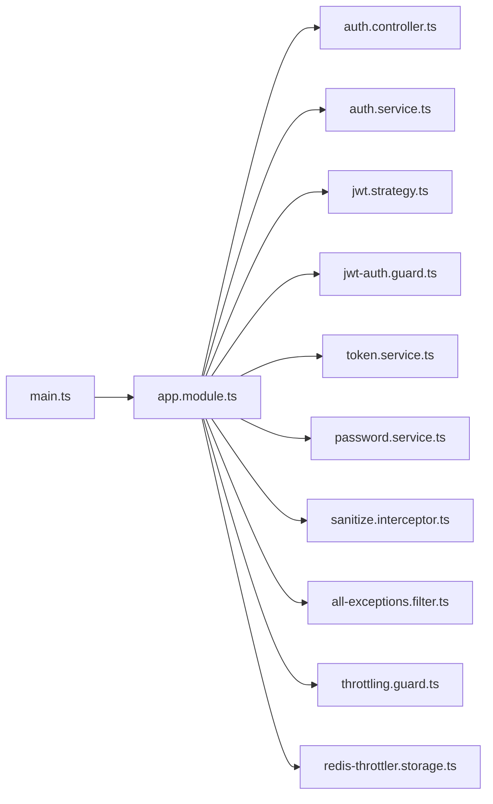

# 安全架构

<cite>
**本文引用的文件**
- [apps/backend/src/main.ts](file://apps/backend/src/main.ts)
- [apps/backend/src/app.module.ts](file://apps/backend/src/app.module.ts)
- [apps/backend/src/auth/auth.controller.ts](file://apps/backend/src/auth/auth.controller.ts)
- [apps/backend/src/auth/auth.service.ts](file://apps/backend/src/auth/auth.service.ts)
- [apps/backend/src/auth/jwt-auth.guard.ts](file://apps/backend/src/auth/jwt-auth.guard.ts)
- [apps/backend/src/auth/jwt.strategy.ts](file://apps/backend/src/auth/jwt.strategy.ts)
- [apps/backend/src/auth/token.service.ts](file://apps/backend/src/auth/token.service.ts)
- [apps/backend/src/auth/password.service.ts](file://apps/backend/src/auth/password.service.ts)
- [apps/backend/src/common/interceptors/sanitize.interceptor.ts](file://apps/backend/src/common/interceptors/sanitize.interceptor.ts)
- [apps/backend/src/common/filters/all-exceptions.filter.ts](file://apps/backend/src/common/filters/all-exceptions.filter.ts)
- [apps/backend/src/common/throttling/throttling.guard.ts](file://apps/backend/src/common/throttling/throttling.guard.ts)
- [apps/backend/src/common/throttling/redis-throttler.storage.ts](file://apps/backend/src/common/throttling/redis-throttler.storage.ts)
- [apps/backend/src/events/events.gateway.ts](file://apps/backend/src/events/events.gateway.ts)
- [apps/backend/src/upload/upload.controller.ts](file://apps/backend/src/upload/upload.controller.ts)
- [SECURITY.md](file://SECURITY.md)
</cite>

## 目录

1. [引言](#引言)
2. [项目结构](#项目结构)
3. [核心组件](#核心组件)
4. [架构总览](#架构总览)
5. [详细组件分析](#详细组件分析)
6. [依赖关系分析](#依赖关系分析)
7. [性能考量](#性能考量)
8. [故障排除指南](#故障排除指南)
9. [结论](#结论)
10. [附录](#附录)

## 引言

本文件面向Lumina Todo系统的安全架构，系统采用前后端分离设计，后端基于NestJS/Fastify，前端基于Vite/Vue。安全体系涵盖多层防护：CORS与CSRF防护、XSS清理、安全头部、速率限制、输入验证与清理、JWT认证与会话管理、API与文件上传安全、WebSocket安全以及威胁模型与应急响应。

## 项目结构

后端通过主引导文件集中启用安全中间件与全局拦截器/过滤器，并在根模块装配认证、速率限制、国际化、队列、缓存等模块。认证模块提供JWT策略、守卫与令牌服务；通用模块提供XSS清理拦截器、全局异常过滤器与Redis速率限制存储；事件模块提供WebSocket网关；上传模块提供文件上传能力。

图表来源

- [apps/backend/src/main.ts:34-211](file://apps/backend/src/main.ts#L34-L211)
- [apps/backend/src/app.module.ts:28-156](file://apps/backend/src/app.module.ts#L28-L156)

章节来源

- [apps/backend/src/main.ts:34-211](file://apps/backend/src/main.ts#L34-L211)
- [apps/backend/src/app.module.ts:28-156](file://apps/backend/src/app.module.ts#L28-L156)

## 核心组件

- CORS与CSRF防护：在启动阶段启用CORS并显式声明允许的请求头；对非安全方法增加CSRF校验钩子，要求携带特定请求头以降低跨站请求伪造风险。
- 安全头部：通过Helmet中间件设置内容安全策略、跨源策略等，减少XSS与点击劫持等风险。
- XSS清理：全局XSS清理拦截器对请求体、查询参数与路径参数进行原地递归清理，禁止HTML标签。
- 速率限制：基于Redis的分布式速率限制，支持按IP或转发链路追踪，具备降级回退机制。
- 输入验证：全局Zod验证管道替代class-validator，统一生成OpenAPI文档，保障入参合法性。
- 异常过滤：全局异常过滤器统一错误响应格式，支持国际化与结构化错误对象。
- 认证与会话：JWT访问令牌+刷新令牌双令牌模型，支持令牌黑名单、会话失效标记与刷新校验。
- WebSocket：事件网关提供实时通信，结合认证与授权策略。
- 文件上传：上传接口限制单文件与总数大小，结合后端清理与存储策略。

章节来源

- [apps/backend/src/main.ts:48-167](file://apps/backend/src/main.ts#L48-L167)
- [apps/backend/src/common/interceptors/sanitize.interceptor.ts:1-64](file://apps/backend/src/common/interceptors/sanitize.interceptor.ts#L1-L64)
- [apps/backend/src/common/throttling/throttling.guard.ts:1-34](file://apps/backend/src/common/throttling/throttling.guard.ts#L1-L34)
- [apps/backend/src/common/throttling/redis-throttler.storage.ts:1-173](file://apps/backend/src/common/throttling/redis-throttler.storage.ts#L1-L173)
- [apps/backend/src/common/filters/all-exceptions.filter.ts:1-137](file://apps/backend/src/common/filters/all-exceptions.filter.ts#L1-L137)
- [apps/backend/src/auth/token.service.ts:1-187](file://apps/backend/src/auth/token.service.ts#L1-L187)
- [apps/backend/src/auth/auth.service.ts:1-127](file://apps/backend/src/auth/auth.service.ts#L1-L127)
- [apps/backend/src/events/events.gateway.ts](file://apps/backend/src/events/events.gateway.ts)
- [apps/backend/src/upload/upload.controller.ts](file://apps/backend/src/upload/upload.controller.ts)

## 架构总览

下图展示从客户端到后端各层安全控制点的交互流程，包括CORS/CSRF、安全头部、速率限制、输入验证、XSS清理、认证与授权、异常处理以及WebSocket与文件上传。

图表来源

- [apps/backend/src/main.ts:48-179](file://apps/backend/src/main.ts#L48-L179)
- [apps/backend/src/common/interceptors/sanitize.interceptor.ts:17-36](file://apps/backend/src/common/interceptors/sanitize.interceptor.ts#L17-L36)
- [apps/backend/src/common/filters/all-exceptions.filter.ts:27-135](file://apps/backend/src/common/filters/all-exceptions.filter.ts#L27-L135)
- [apps/backend/src/auth/jwt-auth.guard.ts:8-9](file://apps/backend/src/auth/jwt-auth.guard.ts#L8-L9)
- [apps/backend/src/auth/jwt.strategy.ts:41-66](file://apps/backend/src/auth/jwt.strategy.ts#L41-L66)

## 详细组件分析

### CORS与CSRF防护

- CORS启用：允许指定来源、凭证、方法与显式允许的请求头，避免通配符导致的安全隐患。
- CSRF校验：对非安全方法增加请求钩子，要求存在特定请求头，否则直接返回403并记录告警。
- 安全头：Helmet设置内容安全策略与跨源策略，增强抗XSS与点击劫持能力。

图表来源

- [apps/backend/src/main.ts:133-167](file://apps/backend/src/main.ts#L133-L167)

章节来源

- [apps/backend/src/main.ts:48-107](file://apps/backend/src/main.ts#L48-L107)
- [apps/backend/src/main.ts:133-167](file://apps/backend/src/main.ts#L133-L167)

### XSS清理拦截器

- 对请求体、查询参数与路径参数进行原地递归清理，禁用所有HTML标签，防止脚本注入。
- 适用于所有路由，确保下游处理逻辑无需重复清理。

图表来源

- [apps/backend/src/common/interceptors/sanitize.interceptor.ts:17-36](file://apps/backend/src/common/interceptors/sanitize.interceptor.ts#L17-L36)

章节来源

- [apps/backend/src/common/interceptors/sanitize.interceptor.ts:1-64](file://apps/backend/src/common/interceptors/sanitize.interceptor.ts#L1-L64)

### 速率限制（Throttler）

- 全局守卫：基于请求IP或转发链路追踪，支持Redis分布式计数与阻塞。
- 存储实现：Lua脚本原子性维护命中计数、过期时间与阻塞状态，异常时回退至内存存储。
- 配置：在根模块注入Redis并创建全局速率限制选项。

图表来源

- [apps/backend/src/common/throttling/throttling.guard.ts:29-33](file://apps/backend/src/common/throttling/throttling.guard.ts#L29-L33)
- [apps/backend/src/common/throttling/redis-throttler.storage.ts:107-156](file://apps/backend/src/common/throttling/redis-throttler.storage.ts#L107-L156)

章节来源

- [apps/backend/src/common/throttling/throttling.guard.ts:1-34](file://apps/backend/src/common/throttling/throttling.guard.ts#L1-L34)
- [apps/backend/src/common/throttling/redis-throttler.storage.ts:1-173](file://apps/backend/src/common/throttling/redis-throttler.storage.ts#L1-L173)
- [apps/backend/src/app.module.ts:117-123](file://apps/backend/src/app.module.ts#L117-L123)

### 输入验证与数据清理（Zod）

- 全局Zod验证管道替代class-validator，统一生成OpenAPI文档，自动处理国际化错误消息与结构化错误对象。
- 异常过滤器识别Zod验证异常并转换为标准响应格式。

图表来源

- [apps/backend/src/main.ts:169-170](file://apps/backend/src/main.ts#L169-L170)
- [apps/backend/src/common/filters/all-exceptions.filter.ts:52-84](file://apps/backend/src/common/filters/all-exceptions.filter.ts#L52-L84)

章节来源

- [apps/backend/src/main.ts:169-170](file://apps/backend/src/main.ts#L169-L170)
- [apps/backend/src/common/filters/all-exceptions.filter.ts:1-137](file://apps/backend/src/common/filters/all-exceptions.filter.ts#L1-L137)

### JWT认证机制

- 策略与守卫：JWT策略验证访问令牌类型与签发时间，结合Redis会话失效标记；JWT守卫保护受保护路由。
- 令牌服务：生成短期访问令牌与长期刷新令牌，支持令牌黑名单、会话失效标记与刷新校验。
- 认证服务：整合登录、注册、刷新、登出与密码重置流程，统一构建认证响应。

图表来源

- [apps/backend/src/auth/auth.controller.ts:23-79](file://apps/backend/src/auth/auth.controller.ts#L23-L79)
- [apps/backend/src/auth/auth.service.ts:41-101](file://apps/backend/src/auth/auth.service.ts#L41-L101)
- [apps/backend/src/auth/token.service.ts:78-185](file://apps/backend/src/auth/token.service.ts#L78-L185)
- [apps/backend/src/auth/password.service.ts:39-89](file://apps/backend/src/auth/password.service.ts#L39-L89)
- [apps/backend/src/auth/jwt.strategy.ts:41-66](file://apps/backend/src/auth/jwt.strategy.ts#L41-L66)
- [apps/backend/src/auth/jwt-auth.guard.ts:8-9](file://apps/backend/src/auth/jwt-auth.guard.ts#L8-L9)

章节来源

- [apps/backend/src/auth/auth.controller.ts:1-81](file://apps/backend/src/auth/auth.controller.ts#L1-L81)
- [apps/backend/src/auth/auth.service.ts:1-127](file://apps/backend/src/auth/auth.service.ts#L1-L127)
- [apps/backend/src/auth/token.service.ts:1-187](file://apps/backend/src/auth/token.service.ts#L1-L187)
- [apps/backend/src/auth/password.service.ts:1-100](file://apps/backend/src/auth/password.service.ts#L1-L100)
- [apps/backend/src/auth/jwt-auth.guard.ts:1-10](file://apps/backend/src/auth/jwt-auth.guard.ts#L1-L10)
- [apps/backend/src/auth/jwt.strategy.ts:1-68](file://apps/backend/src/auth/jwt.strategy.ts#L1-L68)

### 会话管理与权限控制

- 会话失效：通过Redis记录用户会话失效时间戳，访问令牌签发时间早于该时间戳即视为失效。
- 令牌黑名单：登出或重置密码时将刷新令牌加入黑名单，刷新流程校验黑名单。
- 路由保护：JWT守卫保护受保护路由，仅持有有效访问令牌的用户可访问。

图表来源

- [apps/backend/src/auth/token.service.ts:47-76](file://apps/backend/src/auth/token.service.ts#L47-L76)
- [apps/backend/src/auth/auth.service.ts:95-101](file://apps/backend/src/auth/auth.service.ts#L95-L101)
- [apps/backend/src/auth/jwt.strategy.ts:54-57](file://apps/backend/src/auth/jwt.strategy.ts#L54-L57)

章节来源

- [apps/backend/src/auth/token.service.ts:1-187](file://apps/backend/src/auth/token.service.ts#L1-L187)
- [apps/backend/src/auth/auth.service.ts:1-127](file://apps/backend/src/auth/auth.service.ts#L1-L127)
- [apps/backend/src/auth/jwt.strategy.ts:1-68](file://apps/backend/src/auth/jwt.strategy.ts#L1-L68)

### API安全设计

- 速率限制：针对登录、注册、刷新等高频接口分别配置阈值，结合Redis实现分布式限流。
- 请求大小限制：上传插件限制单文件与文件总数，防止滥用与资源耗尽。
- 敏感信息保护：异常过滤器统一输出结构化错误，不泄露内部堆栈细节；Helmet设置安全头，CORS显式白名单。

图表来源

- [apps/backend/src/common/throttling/redis-throttler.storage.ts:114-156](file://apps/backend/src/common/throttling/redis-throttler.storage.ts#L114-L156)
- [apps/backend/src/main.ts:116-123](file://apps/backend/src/main.ts#L116-L123)
- [apps/backend/src/main.ts:94-107](file://apps/backend/src/main.ts#L94-L107)
- [apps/backend/src/main.ts:48-63](file://apps/backend/src/main.ts#L48-L63)

章节来源

- [apps/backend/src/common/throttling/redis-throttler.storage.ts:1-173](file://apps/backend/src/common/throttling/redis-throttler.storage.ts#L1-L173)
- [apps/backend/src/main.ts:94-131](file://apps/backend/src/main.ts#L94-L131)

### WebSocket连接安全

- 事件网关：提供实时通信能力，结合认证守卫与授权策略，确保只有认证用户可接入。
- 建议：在网关层实现用户鉴权与频道授权，避免未授权订阅与消息泄露。

章节来源

- [apps/backend/src/events/events.gateway.ts](file://apps/backend/src/events/events.gateway.ts)

### 文件上传安全

- 上传接口：限制单文件大小与文件数量，防止滥用。
- 建议：结合文件类型校验、病毒扫描、存储隔离与访问控制进一步加固。

章节来源

- [apps/backend/src/main.ts:116-123](file://apps/backend/src/main.ts#L116-L123)
- [apps/backend/src/upload/upload.controller.ts](file://apps/backend/src/upload/upload.controller.ts)

## 依赖关系分析

- 组件耦合：认证模块通过服务与策略解耦，令牌服务与密码服务被认证服务聚合；全局拦截器与过滤器贯穿所有路由。
- 外部依赖：Redis用于速率限制与会话失效标记；Prisma用于数据持久化；BullMQ用于后台任务；Pino用于日志。

图表来源

- [apps/backend/src/main.ts:34-211](file://apps/backend/src/main.ts#L34-L211)
- [apps/backend/src/app.module.ts:28-156](file://apps/backend/src/app.module.ts#L28-L156)

章节来源

- [apps/backend/src/main.ts:34-211](file://apps/backend/src/main.ts#L34-L211)
- [apps/backend/src/app.module.ts:28-156](file://apps/backend/src/app.module.ts#L28-L156)

## 性能考量

- 压缩：开启Gzip压缩，提升传输效率。
- 速率限制：Redis脚本原子计数，避免竞态；异常回退至内存存储，保证可用性。
- 日志：生产环境使用JSON日志，开发环境美化输出，自定义日志级别与序列化器，兼顾可观测性与性能。

章节来源

- [apps/backend/src/main.ts:111-114](file://apps/backend/src/main.ts#L111-L114)
- [apps/backend/src/common/throttling/redis-throttler.storage.ts:127-156](file://apps/backend/src/common/throttling/redis-throttler.storage.ts#L127-L156)
- [apps/backend/src/app.module.ts:35-89](file://apps/backend/src/app.module.ts#L35-L89)

## 故障排除指南

- CSRF告警：若出现缺失请求头导致的403，请确认客户端正确携带必需请求头。
- 速率限制：若频繁被限流，检查Redis连通性与阈值配置，关注守卫的IP追踪逻辑。
- XSS清理：如出现字段丢失或格式异常，请检查输入是否包含HTML标签，清理后重试。
- 认证失败：检查令牌类型、有效期与黑名单状态，确认会话失效标记是否生效。
- 异常响应：统一错误格式包含结构化错误对象，便于定位问题。

章节来源

- [apps/backend/src/main.ts:152-166](file://apps/backend/src/main.ts#L152-L166)
- [apps/backend/src/common/throttling/throttling.guard.ts:29-32](file://apps/backend/src/common/throttling/throttling.guard.ts#L29-L32)
- [apps/backend/src/common/interceptors/sanitize.interceptor.ts:17-36](file://apps/backend/src/common/interceptors/sanitize.interceptor.ts#L17-L36)
- [apps/backend/src/common/filters/all-exceptions.filter.ts:27-135](file://apps/backend/src/common/filters/all-exceptions.filter.ts#L27-L135)

## 结论

Lumina Todo系统通过CORS/CSRF、安全头部、XSS清理、Zod验证、速率限制、JWT双令牌模型与会话失效标记等多层安全措施，构建了较为完善的后端安全架构。建议在文件上传、WebSocket鉴权与数据库访问控制方面持续完善，配合应急响应机制与漏洞披露流程，持续提升整体安全性。

## 附录

- 安全政策与漏洞披露：遵循项目安全策略，通过私有渠道报告漏洞并配合修复。

章节来源

- [SECURITY.md:1-40](file://SECURITY.md#L1-L40)
