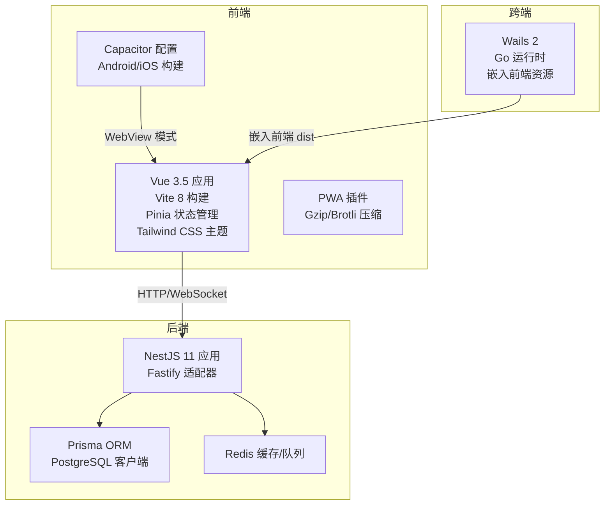
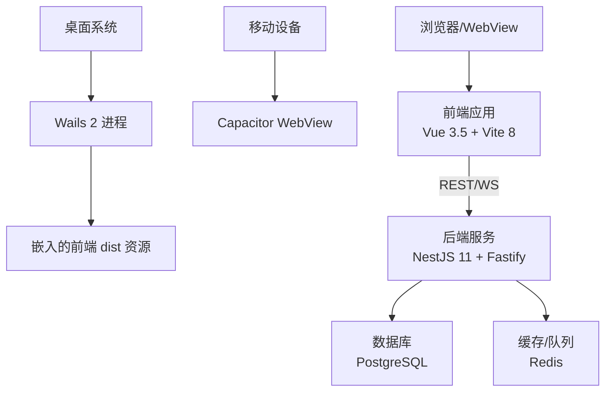
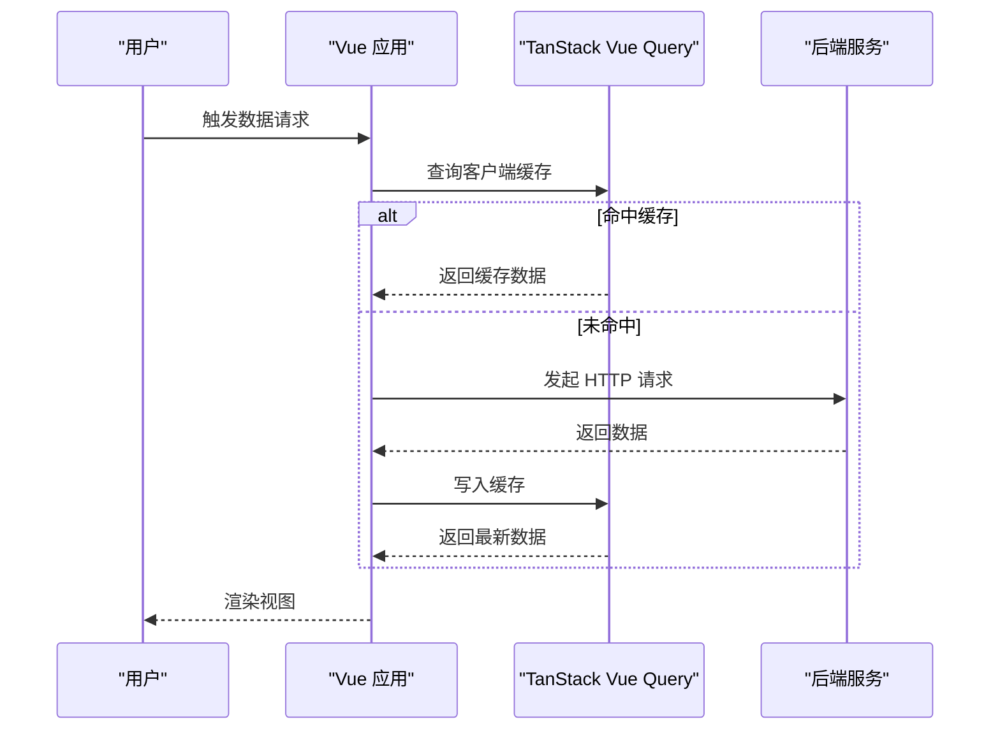
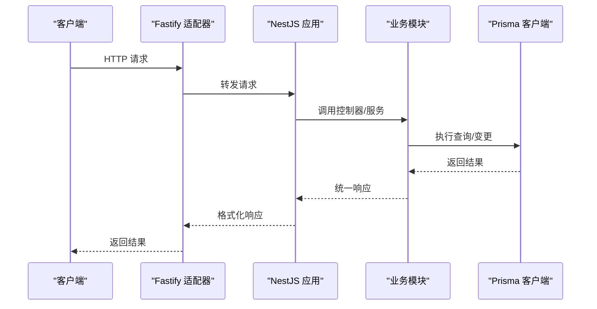
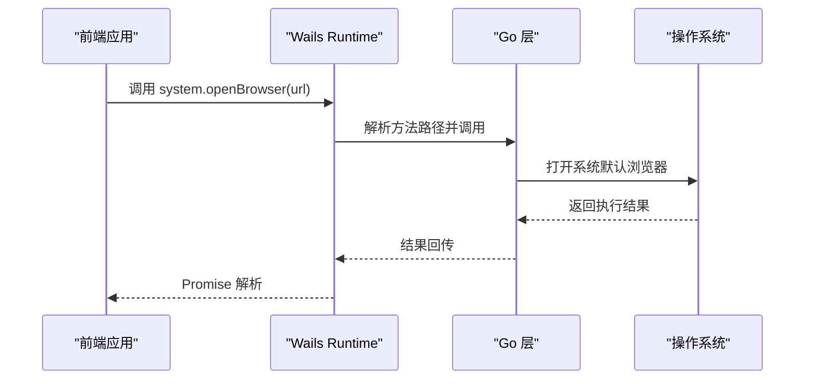
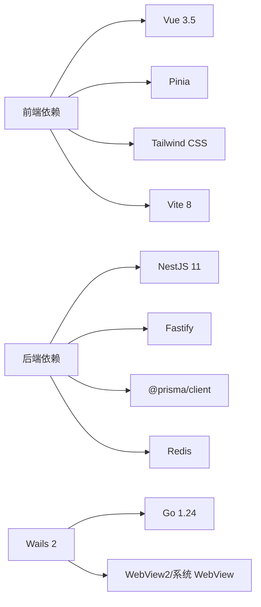

# 技术选型

<cite>
**本文引用的文件**
- [apps/frontend/package.json](file://apps/frontend/package.json)
- [apps/frontend/vite.config.mts](file://apps/frontend/vite.config.mts)
- [apps/frontend/tailwind.config.js](file://apps/frontend/tailwind.config.js)
- [apps/frontend/tsconfig.json](file://apps/frontend/tsconfig.json)
- [apps/frontend/src/main.ts](file://apps/frontend/src/main.ts)
- [apps/frontend/src/lib/wails.ts](file://apps/frontend/src/lib/wails.ts)
- [apps/frontend/capacitor.config.ts](file://apps/frontend/capacitor.config.ts)
- [apps/backend/package.json](file://apps/backend/package.json)
- [apps/backend/nest-cli.json](file://apps/backend/nest-cli.json)
- [apps/backend/tsconfig.json](file://apps/backend/tsconfig.json)
- [apps/backend/src/app.module.ts](file://apps/backend/src/app.module.ts)
- [apps/backend/src/main.ts](file://apps/backend/src/main.ts)
- [apps/backend/prisma/schema/todo.prisma](file://apps/backend/prisma/schema/todo.prisma)
- [apps/wails/go.mod](file://apps/wails/go.mod)
- [apps/wails/main.go](file://apps/wails/main.go)
</cite>

## 目录
1. [引言](#引言)
2. [项目结构](#项目结构)
3. [核心组件](#核心组件)
4. [架构总览](#架构总览)
5. [详细组件分析](#详细组件分析)
6. [依赖关系分析](#依赖关系分析)
7. [性能考量](#性能考量)
8. [故障排查指南](#故障排查指南)
9. [结论](#结论)
10. [附录](#附录)

## 引言
本技术选型文档面向 Lumina Todo 系统，系统采用前后端分离与跨端融合的多栈协同方案：前端以 Vue 3.5 + Vite 8 + Pinia + Tailwind CSS 为核心，后端以 NestJS 11 + Fastify + Prisma 为基础，跨端通过 Wails 提供原生桌面体验，并以 Capacitor 实现混合移动应用。本文从技术选型动机、架构协同、性能表现与最佳实践等方面进行系统化说明。

## 项目结构
系统采用多包工作区组织，包含：
- 前端应用：基于 Vite 的单页应用，支持 PWA、Capacitor 移动端与 Wails 桌面端打包
- 后端应用：NestJS 11 + Fastify 适配器，模块化架构，Prisma ORM 管理数据库
- 跨端应用：Wails 2 将前端资源嵌入 Go 运行时，提供原生窗口与系统交互
- 共享包：@lumina/shared 提供跨端共享的 DTO 与工具

图表来源
- [apps/frontend/package.json:31-71](file://apps/frontend/package.json#L31-L71)
- [apps/backend/package.json:31-87](file://apps/backend/package.json#L31-L87)
- [apps/wails/go.mod:1-38](file://apps/wails/go.mod#L1-L38)

章节来源
- [apps/frontend/package.json:1-105](file://apps/frontend/package.json#L1-L105)
- [apps/backend/package.json:1-109](file://apps/backend/package.json#L1-L109)
- [apps/wails/go.mod:1-38](file://apps/wails/go.mod#L1-L38)

## 核心组件
- 前端技术栈
  - Vue 3.5：组合式 API、响应式系统、性能优化（Tree-shaking、按需渲染）
  - Vite 8：快速冷启、热更新、多插件生态（PWA、压缩、别名）
  - Pinia：轻量状态管理，支持持久化插件
  - Tailwind CSS：原子类与主题变量，实现一致的视觉与交互体验
- 后端技术栈
  - NestJS 11：模块化架构、依赖注入、TypeScript 原生支持
  - Fastify：高性能 HTTP 服务器，内置压缩、CORS、安全头
  - Prisma：强类型 ORM，支持 PostgreSQL、Schema 管理与迁移
- 跨端技术栈
  - Wails 2：Go 运行时 + WebView，嵌入前端资源，提供原生菜单、窗口与系统交互
  - Capacitor：移动端 WebView 模式，统一 Web 技术栈与原生能力

章节来源
- [apps/frontend/package.json:31-71](file://apps/frontend/package.json#L31-L71)
- [apps/frontend/vite.config.mts:80-185](file://apps/frontend/vite.config.mts#L80-L185)
- [apps/frontend/tailwind.config.js:4-303](file://apps/frontend/tailwind.config.js#L4-L303)
- [apps/backend/package.json:31-87](file://apps/backend/package.json#L31-L87)
- [apps/backend/src/app.module.ts:28-160](file://apps/backend/src/app.module.ts#L28-L160)
- [apps/backend/src/main.ts:34-211](file://apps/backend/src/main.ts#L34-L211)
- [apps/wails/go.mod:1-38](file://apps/wails/go.mod#L1-L38)
- [apps/wails/main.go:20-95](file://apps/wails/main.go#L20-L95)

## 架构总览
系统整体采用“前端单页应用 + 后端微服务 + 跨端嵌入”的架构。前端通过 HTTP/WebSocket 与后端通信；后端以 Fastify 为传输层，NestJS 提供业务模块；Prisma 负责数据建模与访问；Wails 将前端资源打包为原生桌面应用；Capacitor 将前端资源打包为移动应用。

图表来源
- [apps/frontend/src/main.ts:10-138](file://apps/frontend/src/main.ts#L10-L138)
- [apps/backend/src/main.ts:34-211](file://apps/backend/src/main.ts#L34-L211)
- [apps/wails/main.go:20-95](file://apps/wails/main.go#L20-L95)
- [apps/frontend/capacitor.config.ts:1-23](file://apps/frontend/capacitor.config.ts#L1-L23)

## 详细组件分析

### 前端：Vue 3.5 + Vite 8 + Pinia + Tailwind CSS
- 响应式系统与组合式 API
  - 使用组合式 API 进行逻辑复用与状态抽取，提升可维护性与测试友好度
  - 借助 VueUse、TanStack Vue Query 实现通用能力（手势、滚动、查询缓存）
- 性能优化
  - Vite 8 提供快速冷启动与热更新；多插件组合（PWA、Gzip/Brotli）降低首屏与传输成本
  - 代码分割策略按功能与第三方库分包，减少初始包体积
- 状态管理
  - Pinia 轻量且类型安全，结合持久化插件实现跨会话状态恢复
- 主题与样式
  - Tailwind CSS 以原子类与 CSS 变量实现主题一致性，支持暗色模式与动画扩展

图表来源
- [apps/frontend/src/main.ts:115-133](file://apps/frontend/src/main.ts#L115-L133)
- [apps/frontend/vite.config.mts:80-185](file://apps/frontend/vite.config.mts#L80-L185)

章节来源
- [apps/frontend/src/main.ts:10-138](file://apps/frontend/src/main.ts#L10-L138)
- [apps/frontend/vite.config.mts:80-185](file://apps/frontend/vite.config.mts#L80-L185)
- [apps/frontend/tailwind.config.js:4-303](file://apps/frontend/tailwind.config.js#L4-L303)
- [apps/frontend/package.json:31-71](file://apps/frontend/package.json#L31-L71)

### 后端：NestJS 11 + Fastify + Prisma
- 模块化与依赖注入
  - AppModule 导入多个领域模块（认证、用户、待办、邮件、定时任务等），统一配置与守卫
  - 全局守卫、过滤器、拦截器与管道集中管理，保证一致的安全与数据流
- 高性能传输层
  - Fastify 适配器提供高性能 HTTP/WS 服务，内置压缩、CORS、安全头与静态资源
- 数据建模与访问
  - Prisma 提供强类型模型与索引，配合迁移与 Studio 管理数据演进

图表来源
- [apps/backend/src/main.ts:34-211](file://apps/backend/src/main.ts#L34-L211)
- [apps/backend/src/app.module.ts:28-160](file://apps/backend/src/app.module.ts#L28-L160)
- [apps/backend/prisma/schema/todo.prisma:1-40](file://apps/backend/prisma/schema/todo.prisma#L1-L40)

章节来源
- [apps/backend/src/app.module.ts:28-160](file://apps/backend/src/app.module.ts#L28-L160)
- [apps/backend/src/main.ts:34-211](file://apps/backend/src/main.ts#L34-L211)
- [apps/backend/prisma/schema/todo.prisma:1-40](file://apps/backend/prisma/schema/todo.prisma#L1-L40)

### 跨端：Wails 2（桌面）+ Capacitor（移动端）
- Wails 2
  - Go 进程负责系统级交互（菜单、窗口、透明背景、平台特性），前端资源以嵌入方式提供
  - 通过 window.go 与 window.runtime 暴露系统方法，前端以类型安全封装调用
- Capacitor
  - 以 WebView 承载前端应用，统一开发体验；支持启动屏、HTTPS scheme 等配置

图表来源
- [apps/frontend/src/lib/wails.ts:29-52](file://apps/frontend/src/lib/wails.ts#L29-L52)
- [apps/wails/main.go:51-89](file://apps/wails/main.go#L51-L89)

章节来源
- [apps/frontend/src/lib/wails.ts:1-92](file://apps/frontend/src/lib/wails.ts#L1-L92)
- [apps/wails/main.go:20-95](file://apps/wails/main.go#L20-L95)
- [apps/frontend/capacitor.config.ts:1-23](file://apps/frontend/capacitor.config.ts#L1-L23)

### Go 在 Wails 中的作用与优势
- 语言与生态
  - Go 1.24 提供稳定性能与跨平台编译；Wails v2 提供 WebView、菜单、窗口与系统交互能力
- 与前端协作
  - 通过 window.go 暴露方法，前端以 callGo 统一封装调用，具备环境检测与类型安全
- 优势
  - 低耦合：前端专注 UI 与交互，Go 专注系统能力
  - 高性能：Go 的并发与编译期优化带来更好的桌面体验

章节来源
- [apps/wails/go.mod:1-38](file://apps/wails/go.mod#L1-L38)
- [apps/wails/main.go:20-95](file://apps/wails/main.go#L20-L95)
- [apps/frontend/src/lib/wails.ts:19-52](file://apps/frontend/src/lib/wails.ts#L19-L52)

## 依赖关系分析
- 前端
  - 依赖 Vue 3.5、Vite 8、Pinia、Tailwind CSS、Axios、Socket.IO、Vue Router 等
  - 构建配置通过 vite.config.mts 实现别名、PWA、压缩与代理
- 后端
  - 依赖 NestJS 11、Fastify、Prisma、BullMQ、Redis、Passport、Swagger 等
  - 通过 AppModule 组织模块与全局中间件，main.ts 配置安全头、压缩与静态资源
- 跨端
  - Wails 2 依赖 Go 运行时与 WebView 组件，main.go 负责菜单、窗口与资源嵌入

图表来源
- [apps/frontend/package.json:31-71](file://apps/frontend/package.json#L31-L71)
- [apps/backend/package.json:31-87](file://apps/backend/package.json#L31-L87)
- [apps/wails/go.mod:1-38](file://apps/wails/go.mod#L1-L38)

章节来源
- [apps/frontend/package.json:31-71](file://apps/frontend/package.json#L31-L71)
- [apps/backend/package.json:31-87](file://apps/backend/package.json#L31-L87)
- [apps/wails/go.mod:1-38](file://apps/wails/go.mod#L1-L38)

## 性能考量
- 前端
  - Vite 8 的多插件压缩与 PWA 缓存显著降低加载时间；手动分包策略减少首屏体积
  - Pinia 持久化与 TanStack Vue Query 的缓存策略降低重复请求
- 后端
  - Fastify 的零反射与事件循环优化带来更低延迟；Gzip/Brotli 压缩与静态资源托管减少带宽
  - Prisma 的索引与查询优化（见模型索引）提升读写效率
- 跨端
  - Wails 嵌入前端资源避免二次下载；Capacitor WebView 与 PWA 结合实现离线体验

章节来源
- [apps/frontend/vite.config.mts:80-185](file://apps/frontend/vite.config.mts#L80-L185)
- [apps/frontend/src/main.ts:115-133](file://apps/frontend/src/main.ts#L115-L133)
- [apps/backend/src/main.ts:111-124](file://apps/backend/src/main.ts#L111-L124)
- [apps/backend/prisma/schema/todo.prisma:24-28](file://apps/backend/prisma/schema/todo.prisma#L24-L28)

## 故障排查指南
- 前端
  - 动态导入失败（Chunk 加载错误）：应用内置全局错误处理器自动检测并刷新页面
  - ResizeObserver 相关错误：忽略良性错误，避免控制台噪音
- 后端
  - CSRF 防护：缺失 X-Requested-With 头将被拦截并返回 403
  - 全局异常过滤器与响应拦截器：统一错误格式与输出
  - Swagger 文档：通过 /api/docs 查看接口规范
- 跨端
  - Wails 环境检测：非 Wails 环境下调用系统方法将返回错误提示
  - 资源嵌入：确认前端构建产物已复制到 Wails 嵌入目录

章节来源
- [apps/frontend/src/main.ts:56-114](file://apps/frontend/src/main.ts#L56-L114)
- [apps/backend/src/main.ts:125-167](file://apps/backend/src/main.ts#L125-L167)
- [apps/frontend/src/lib/wails.ts:19-52](file://apps/frontend/src/lib/wails.ts#L19-L52)
- [apps/wails/main.go:24-29](file://apps/wails/main.go#L24-L29)

## 结论
Lumina Todo 的技术选型围绕“高性能、可维护、可扩展”展开：前端以 Vue 3.5 + Vite 8 + Pinia + Tailwind CSS 构建现代化 SPA；后端以 NestJS 11 + Fastify + Prisma 提供模块化与高吞吐的服务层；跨端通过 Wails 与 Capacitor 实现原生体验与统一开发。该组合在开发效率、用户体验与部署灵活性之间取得良好平衡。

## 附录
- TypeScript 配置
  - 前端与后端均使用严格路径别名与 bundler/moduleResolution，确保类型安全与模块解析一致性
- 构建脚本
  - 前端提供 Capacitor 同步与运行脚本、Wails 构建脚本；后端提供 Nest 构建与 Prisma 管理脚本

章节来源
- [apps/frontend/tsconfig.json:1-28](file://apps/frontend/tsconfig.json#L1-L28)
- [apps/backend/tsconfig.json:1-30](file://apps/backend/tsconfig.json#L1-L30)
- [apps/frontend/package.json:9-30](file://apps/frontend/package.json#L9-L30)
- [apps/backend/package.json:7-30](file://apps/backend/package.json#L7-L30)