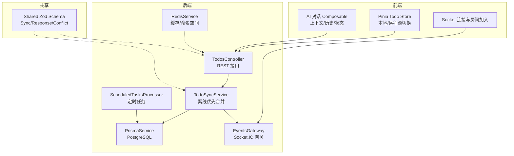
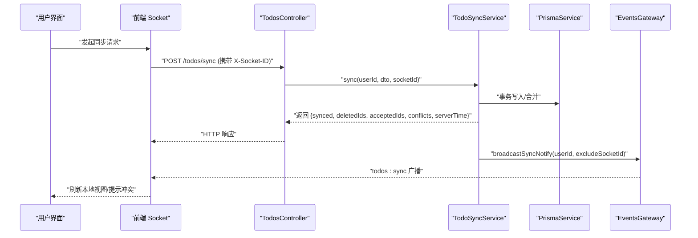
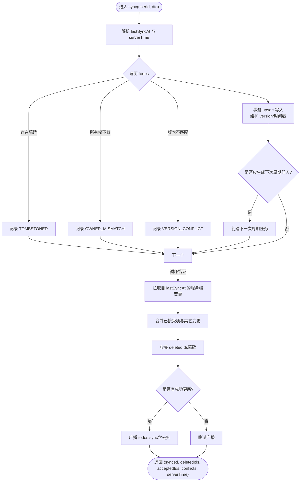
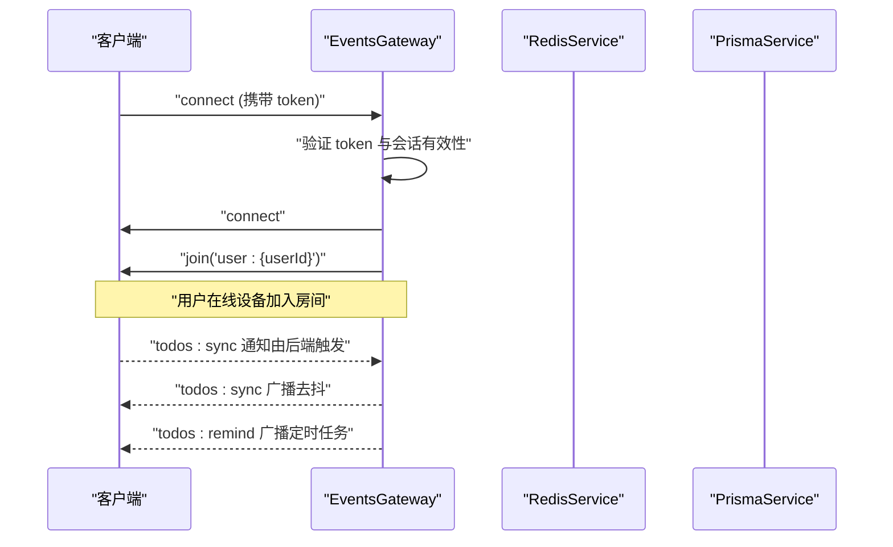
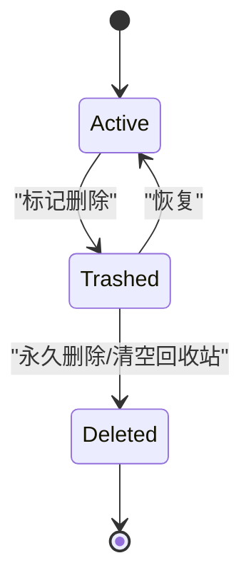
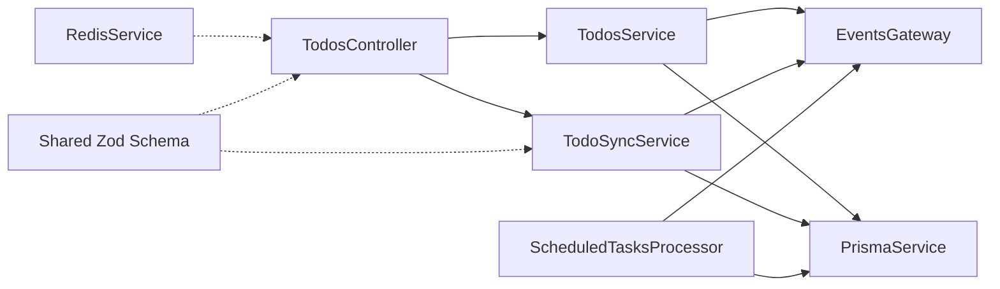

# 数据流设计

<cite>
**本文档引用的文件**
- [apps/backend/src/todos/todos.controller.ts](file://apps/backend/src/todos/todos.controller.ts)
- [apps/backend/src/todos/todos.service.ts](file://apps/backend/src/todos/todos.service.ts)
- [apps/backend/src/todos/todos-sync.service.ts](file://apps/backend/src/todos/todos-sync.service.ts)
- [apps/backend/src/todos/todos-sync.recurrence.ts](file://apps/backend/src/todos/todos-sync.recurrence.ts)
- [apps/backend/src/todos/todos.dto.ts](file://apps/backend/src/todos/todos.dto.ts)
- [apps/backend/src/events/events.gateway.ts](file://apps/backend/src/events/events.gateway.ts)
- [apps/backend/src/redis/redis.service.ts](file://apps/backend/src/redis/redis.service.ts)
- [apps/backend/src/scheduled-tasks/scheduled-tasks.processor.ts](file://apps/backend/src/scheduled-tasks/scheduled-tasks.processor.ts)
- [apps/backend/src/prisma/prisma.service.ts](file://apps/backend/src/prisma/prisma.service.ts)
- [packages/shared/src/schemas/todo.schema.ts](file://packages/shared/src/schemas/todo.schema.ts)
- [apps/frontend/src/composables/useSocket.ts](file://apps/frontend/src/composables/useSocket.ts)
- [apps/frontend/src/features/todo/stores/todo.store.ts](file://apps/frontend/src/features/todo/stores/todo.store.ts)
- [apps/frontend/src/features/ai/composables/useChat.ts](file://apps/frontend/src/features/ai/composables/useChat.ts)
</cite>

## 目录

1. [引言](#引言)
2. [项目结构](#项目结构)
3. [核心组件](#核心组件)
4. [架构总览](#架构总览)
5. [详细组件分析](#详细组件分析)
6. [依赖关系分析](#依赖关系分析)
7. [性能考量](#性能考量)
8. [故障排查指南](#故障排查指南)
9. [结论](#结论)
10. [附录](#附录)

## 引言

本文件面向 Lumina Todo 系统，聚焦“数据流设计”。目标是：

- 全链路梳理：从用户操作到数据持久化、再到实时同步与离线优先合并的完整流程
- 实时同步机制：WebSocket 连接管理、房间权限、广播策略与去抖
- 前后端交互：RESTful API 调用、参数校验、响应格式标准化
- 缓存与一致性：缓存策略、TTL、缓存穿透保护、冲突检测与版本控制
- 生命周期管理：任务的创建、更新、删除、恢复、回收站与物理删除
- AI 对话数据：上下文管理、历史记录、状态保持与结构化块解析
- 图示化表达：关键业务场景的数据处理时序与数据流图

## 项目结构

系统采用前后端分离的多包工作区：

- 后端 NestJS 应用，包含 todos、events、scheduled-tasks、redis、prisma 等模块
- 前端 Vue 应用，包含 todo store、socket 连接、AI 对话 composable 等
- 共享包 shared，定义 Zod 校验 Schema（前后端共享）

图表来源

- [apps/frontend/src/features/todo/stores/todo.store.ts:1-389](file://apps/frontend/src/features/todo/stores/todo.store.ts#L1-L389)
- [apps/frontend/src/composables/useSocket.ts:1-191](file://apps/frontend/src/composables/useSocket.ts#L1-L191)
- [apps/frontend/src/features/ai/composables/useChat.ts:1-136](file://apps/frontend/src/features/ai/composables/useChat.ts#L1-L136)
- [apps/backend/src/todos/todos.controller.ts:1-70](file://apps/backend/src/todos/todos.controller.ts#L1-L70)
- [apps/backend/src/todos/todos-sync.service.ts:1-226](file://apps/backend/src/todos/todos-sync.service.ts#L1-L226)
- [apps/backend/src/events/events.gateway.ts:1-266](file://apps/backend/src/events/events.gateway.ts#L1-L266)
- [apps/backend/src/redis/redis.service.ts:1-255](file://apps/backend/src/redis/redis.service.ts#L1-L255)
- [apps/backend/src/scheduled-tasks/scheduled-tasks.processor.ts:1-290](file://apps/backend/src/scheduled-tasks/scheduled-tasks.processor.ts#L1-L290)
- [apps/backend/src/prisma/prisma.service.ts:1-34](file://apps/backend/src/prisma/prisma.service.ts#L1-L34)
- [packages/shared/src/schemas/todo.schema.ts:1-76](file://packages/shared/src/schemas/todo.schema.ts#L1-L76)

章节来源

- [apps/backend/src/todos/todos.controller.ts:1-70](file://apps/backend/src/todos/todos.controller.ts#L1-L70)
- [apps/backend/src/todos/todos.service.ts:1-147](file://apps/backend/src/todos/todos.service.ts#L1-L147)
- [apps/backend/src/todos/todos-sync.service.ts:1-226](file://apps/backend/src/todos/todos-sync.service.ts#L1-L226)
- [apps/backend/src/events/events.gateway.ts:1-266](file://apps/backend/src/events/events.gateway.ts#L1-L266)
- [apps/backend/src/redis/redis.service.ts:1-255](file://apps/backend/src/redis/redis.service.ts#L1-L255)
- [apps/backend/src/scheduled-tasks/scheduled-tasks.processor.ts:1-290](file://apps/backend/src/scheduled-tasks/scheduled-tasks.processor.ts#L1-L290)
- [apps/backend/src/prisma/prisma.service.ts:1-34](file://apps/backend/src/prisma/prisma.service.ts#L1-L34)
- [packages/shared/src/schemas/todo.schema.ts:1-76](file://packages/shared/src/schemas/todo.schema.ts#L1-L76)
- [apps/frontend/src/composables/useSocket.ts:1-191](file://apps/frontend/src/composables/useSocket.ts#L1-L191)
- [apps/frontend/src/features/todo/stores/todo.store.ts:1-389](file://apps/frontend/src/features/todo/stores/todo.store.ts#L1-L389)
- [apps/frontend/src/features/ai/composables/useChat.ts:1-136](file://apps/frontend/src/features/ai/composables/useChat.ts#L1-L136)

## 核心组件

- TodosController：提供 REST 接口，包括同步、查询、回收站、恢复、永久删除、清空回收站
- TodoSyncService：离线优先增量合并，冲突检测与版本控制，周期性任务触发
- TodosService：基础 CRUD 与回收站管理，触发同步广播
- EventsGateway：WebSocket 网关，CORS/鉴权、房间加入/离开、广播、todos:sync 通知
- ScheduledTasksProcessor：定时任务（健康检查、清理过期、待办提醒、每日统计）
- RedisService：统一缓存接口、命名空间、TTL、穿透保护
- PrismaService：PostgreSQL 客户端封装
- Shared Zod Schema：前后端共享的同步/冲突/响应模型
- 前端 Todo Store：本地/远程双源、提议变更、合并策略、持久化
- 前端 Socket：连接管理、重连、鉴权透传、房间加入
- 前端 AI Chat：上下文/历史/状态聚合，结构化块解析与任务动作

章节来源

- [apps/backend/src/todos/todos.controller.ts:1-70](file://apps/backend/src/todos/todos.controller.ts#L1-L70)
- [apps/backend/src/todos/todos-sync.service.ts:1-226](file://apps/backend/src/todos/todos-sync.service.ts#L1-L226)
- [apps/backend/src/todos/todos.service.ts:1-147](file://apps/backend/src/todos/todos.service.ts#L1-L147)
- [apps/backend/src/events/events.gateway.ts:1-266](file://apps/backend/src/events/events.gateway.ts#L1-L266)
- [apps/backend/src/scheduled-tasks/scheduled-tasks.processor.ts:1-290](file://apps/backend/src/scheduled-tasks/scheduled-tasks.processor.ts#L1-L290)
- [apps/backend/src/redis/redis.service.ts:1-255](file://apps/backend/src/redis/redis.service.ts#L1-L255)
- [apps/backend/src/prisma/prisma.service.ts:1-34](file://apps/backend/src/prisma/prisma.service.ts#L1-L34)
- [packages/shared/src/schemas/todo.schema.ts:1-76](file://packages/shared/src/schemas/todo.schema.ts#L1-L76)
- [apps/frontend/src/features/todo/stores/todo.store.ts:1-389](file://apps/frontend/src/features/todo/stores/todo.store.ts#L1-L389)
- [apps/frontend/src/composables/useSocket.ts:1-191](file://apps/frontend/src/composables/useSocket.ts#L1-L191)
- [apps/frontend/src/features/ai/composables/useChat.ts:1-136](file://apps/frontend/src/features/ai/composables/useChat.ts#L1-L136)

## 架构总览

系统采用“REST + WebSocket”的混合数据通道：

- REST：用户操作（增删改查、同步）通过 JWT 认证的 HTTP 接口
- WebSocket：实时同步通知、房间广播、提醒推送
- 数据库：PostgreSQL（Prisma）
- 缓存：Redis（cache-manager），提供 TTL、命名空间、穿透保护
- 定时任务：BullMQ，负责健康检查、清理、提醒、统计

图表来源

- [apps/backend/src/todos/todos.controller.ts:30-38](file://apps/backend/src/todos/todos.controller.ts#L30-L38)
- [apps/backend/src/todos/todos-sync.service.ts:52-224](file://apps/backend/src/todos/todos-sync.service.ts#L52-L224)
- [apps/backend/src/events/events.gateway.ts:180-202](file://apps/backend/src/events/events.gateway.ts#L180-L202)
- [apps/frontend/src/composables/useSocket.ts:113-161](file://apps/frontend/src/composables/useSocket.ts#L113-L161)

## 详细组件分析

### 同步与合并（离线优先）

- 输入：客户端提交的 SyncMergeDto（包含 todos 列表、lastSyncAt）
- 流程：
  1. 事务内逐条处理客户端推送变更，检测墓碑（TOMBSTONED）、所有权（OWNER_MISMATCH）、版本冲突（VERSION_CONFLICT）
  2. upsert 写入，维护版本号与时间戳；根据周期规则生成下一次任务
  3. 查询自 lastSyncAt 以来的服务端变更，合并客户端已接受项与服务端其他变更
  4. 返回 acceptedIds、conflicts、deletedIds、serverTime
  5. 若有成功更新，向用户房间广播 todos:sync（带去抖）
- 关键点：严格版本匹配避免时钟漂移；初次同步排除回收站；周期规则解析与生成

图表来源

- [apps/backend/src/todos/todos-sync.service.ts:52-224](file://apps/backend/src/todos/todos-sync.service.ts#L52-L224)
- [apps/backend/src/todos/todos-sync.recurrence.ts:87-151](file://apps/backend/src/todos/todos-sync.recurrence.ts#L87-L151)
- [apps/backend/src/events/events.gateway.ts:180-202](file://apps/backend/src/events/events.gateway.ts#L180-L202)

章节来源

- [apps/backend/src/todos/todos-sync.service.ts:1-226](file://apps/backend/src/todos/todos-sync.service.ts#L1-L226)
- [apps/backend/src/todos/todos-sync.recurrence.ts:1-210](file://apps/backend/src/todos/todos-sync.recurrence.ts#L1-L210)
- [apps/backend/src/todos/todos.dto.ts:1-5](file://apps/backend/src/todos/todos.dto.ts#L1-L5)
- [packages/shared/src/schemas/todo.schema.ts:40-76](file://packages/shared/src/schemas/todo.schema.ts#L40-L76)

### 实时同步与广播

- 连接与鉴权：Socket.IO 网关在握手阶段读取 Authorization 或 handshake.auth.token，验证后注入 socket.data.user
- 房间权限：仅允许加入 user:{userId} 房间；订阅消息时强制校验
- 广播策略：todos:sync 事件，后端对同一用户使用 500ms 去抖定时器，避免频繁广播
- 提醒推送：定时任务扫描到期未提醒任务，广播 todos:remind 并更新版本号

图表来源

- [apps/backend/src/events/events.gateway.ts:86-145](file://apps/backend/src/events/events.gateway.ts#L86-L145)
- [apps/backend/src/events/events.gateway.ts:180-202](file://apps/backend/src/events/events.gateway.ts#L180-L202)
- [apps/backend/src/scheduled-tasks/scheduled-tasks.processor.ts:147-190](file://apps/backend/src/scheduled-tasks/scheduled-tasks.processor.ts#L147-L190)
- [apps/backend/src/redis/redis.service.ts:1-255](file://apps/backend/src/redis/redis.service.ts#L1-L255)
- [apps/backend/src/prisma/prisma.service.ts:1-34](file://apps/backend/src/prisma/prisma.service.ts#L1-L34)

章节来源

- [apps/backend/src/events/events.gateway.ts:1-266](file://apps/backend/src/events/events.gateway.ts#L1-L266)
- [apps/backend/src/scheduled-tasks/scheduled-tasks.processor.ts:1-290](file://apps/backend/src/scheduled-tasks/scheduled-tasks.processor.ts#L1-L290)
- [apps/backend/src/redis/redis.service.ts:1-255](file://apps/backend/src/redis/redis.service.ts#L1-L255)
- [apps/backend/src/prisma/prisma.service.ts:1-34](file://apps/backend/src/prisma/prisma.service.ts#L1-L34)

### 前后端交互与参数校验

- REST 接口：TodosController 提供 /todos/sync、/todos、/todos/trash、/todos/:id/restore、/todos/:id/permanent、/todos/trash/clear
- 参数校验：TodosDto 基于 Zod Schema（SyncMergeRequestSchema），确保 todos 数组、lastSyncAt 格式正确
- 响应格式：SyncResponseSchema 规范化返回字段（synced、deletedIds、acceptedIds、conflicts、serverTime）
- 认证：JwtAuthGuard + ApiBearerAuth，确保接口安全
- 前端调用：携带 X-Socket-ID，便于后端在广播时排除自身

章节来源

- [apps/backend/src/todos/todos.controller.ts:1-70](file://apps/backend/src/todos/todos.controller.ts#L1-L70)
- [apps/backend/src/todos/todos.dto.ts:1-5](file://apps/backend/src/todos/todos.dto.ts#L1-L5)
- [packages/shared/src/schemas/todo.schema.ts:40-76](file://packages/shared/src/schemas/todo.schema.ts#L40-L76)

### 缓存策略与一致性

- 命名空间：CachePrefix 枚举 + NamespacedCache，统一键前缀管理
- TTL：默认 5 分钟，可按需覆盖；refresh 用于延长过期时间
- 穿透保护：getOrSet 在缓存缺失时回源获取并写入
- 场景建议：用户会话、速率限制、配置、临时数据可使用缓存；敏感强一致数据（如同步状态）建议直连数据库

章节来源

- [apps/backend/src/redis/redis.service.ts:1-255](file://apps/backend/src/redis/redis.service.ts#L1-L255)

### 任务生命周期管理

- 创建：客户端 upsert 写入，服务端维护版本与时间戳
- 更新：严格版本匹配，冲突即拒绝；周期任务生成下一次任务
- 删除：软删除（deletedAt + tombstone），支持恢复与清空回收站
- 恢复：取消 deletedAt，版本递增
- 永久删除：事务写入 tombstone 并删除记录，广播同步
- 清空回收站：批量写入 tombstone 并删除，广播同步

图表来源

- [apps/backend/src/todos/todos.service.ts:66-145](file://apps/backend/src/todos/todos.service.ts#L66-L145)
- [apps/backend/src/todos/todos-sync.service.ts:149-177](file://apps/backend/src/todos/todos-sync.service.ts#L149-L177)

章节来源

- [apps/backend/src/todos/todos.service.ts:1-147](file://apps/backend/src/todos/todos.service.ts#L1-L147)
- [apps/backend/src/todos/todos-sync.service.ts:1-226](file://apps/backend/src/todos/todos-sync.service.ts#L1-L226)

### AI 对话数据特殊处理

- 上下文管理：useChat 聚合 chatHistory、流式响应、推理细节、讨论步骤、待办动作
- 历史记录：消息列表包含用户/助手消息，支持删除助手消息并联动清除提议的待办动作
- 状态保持：isGenerating、currentAIResponse、currentThinkingContent 等响应式状态
- 结构化块：parseAssistantBlocks 解析 todoActions、teachingQuizzes、teachingAssessments 等，支持流式完成后的最终态

章节来源

- [apps/frontend/src/features/ai/composables/useChat.ts:1-136](file://apps/frontend/src/features/ai/composables/useChat.ts#L1-L136)

### 前端数据交互模式

- Socket 连接：自动连接、重连、鉴权透传、房间加入；支持等待连接超时
- Todo Store：本地/远程双源切换、提议变更集、快照对比、过滤排序、持久化
- 同步流程：mergeOnLogin、debouncedSync、accept/retry/clearSyncConflict

章节来源

- [apps/frontend/src/composables/useSocket.ts:1-191](file://apps/frontend/src/composables/useSocket.ts#L1-L191)
- [apps/frontend/src/features/todo/stores/todo.store.ts:1-389](file://apps/frontend/src/features/todo/stores/todo.store.ts#L1-L389)

## 依赖关系分析

- 控制器依赖服务：TodosController -> TodosService、TodoSyncService
- 服务依赖网关：TodosService -> EventsGateway；TodoSyncService -> EventsGateway
- 数据访问：TodosService/TodoSyncService -> PrismaService
- 缓存：RedisService 作为通用缓存层
- 定时任务：ScheduledTasksProcessor -> PrismaService/EventsGateway
- 前后端共享：Shared Zod Schema 保障输入输出一致性

图表来源

- [apps/backend/src/todos/todos.controller.ts:25-28](file://apps/backend/src/todos/todos.controller.ts#L25-L28)
- [apps/backend/src/todos/todos.service.ts:29-33](file://apps/backend/src/todos/todos.service.ts#L29-L33)
- [apps/backend/src/todos/todos-sync.service.ts:43-47](file://apps/backend/src/todos/todos-sync.service.ts#L43-L47)
- [apps/backend/src/events/events.gateway.ts:1-266](file://apps/backend/src/events/events.gateway.ts#L1-L266)
- [apps/backend/src/scheduled-tasks/scheduled-tasks.processor.ts:40-47](file://apps/backend/src/scheduled-tasks/scheduled-tasks.processor.ts#L40-L47)
- [apps/backend/src/redis/redis.service.ts:1-255](file://apps/backend/src/redis/redis.service.ts#L1-L255)
- [apps/backend/src/prisma/prisma.service.ts:1-34](file://apps/backend/src/prisma/prisma.service.ts#L1-L34)
- [packages/shared/src/schemas/todo.schema.ts:1-76](file://packages/shared/src/schemas/todo.schema.ts#L1-L76)

章节来源

- [apps/backend/src/todos/todos.controller.ts:1-70](file://apps/backend/src/todos/todos.controller.ts#L1-L70)
- [apps/backend/src/todos/todos.service.ts:1-147](file://apps/backend/src/todos/todos.service.ts#L1-L147)
- [apps/backend/src/todos/todos-sync.service.ts:1-226](file://apps/backend/src/todos/todos-sync.service.ts#L1-L226)
- [apps/backend/src/events/events.gateway.ts:1-266](file://apps/backend/src/events/events.gateway.ts#L1-L266)
- [apps/backend/src/scheduled-tasks/scheduled-tasks.processor.ts:1-290](file://apps/backend/src/scheduled-tasks/scheduled-tasks.processor.ts#L1-L290)
- [apps/backend/src/redis/redis.service.ts:1-255](file://apps/backend/src/redis/redis.service.ts#L1-L255)
- [apps/backend/src/prisma/prisma.service.ts:1-34](file://apps/backend/src/prisma/prisma.service.ts#L1-L34)
- [packages/shared/src/schemas/todo.schema.ts:1-76](file://packages/shared/src/schemas/todo.schema.ts#L1-L76)

## 性能考量

- 广播去抖：同一用户 500ms 内仅广播一次 todos:sync，降低网络与渲染压力
- 事务合并：同步写入使用事务，减少锁竞争与不一致风险
- 定时任务批处理：提醒推送限制每次数量，避免瞬时风暴
- 缓存命中：合理设置 TTL 与命名空间，穿透保护减少数据库压力
- 前端快照与过滤：本地/远程源切换与过滤排序在 Pinia 中计算，避免重复网络请求

## 故障排查指南

- WebSocket 认证失败：检查 token 是否有效、是否被撤销、握手头是否正确传递
- 房间访问被拒：确认房间名 user:{userId} 与 token 中 sub 匹配
- 同步冲突：VERSION_CONFLICT 表示版本不一致，建议重试或手动解决；TOMBSTONED 表示已被逻辑删除
- 广播无响应：确认 excludeSocketId 是否正确传递，去抖定时器是否被提前清理
- 定时任务异常：查看健康检查与清理任务日志，确认数据库连接与队列状态

章节来源

- [apps/backend/src/events/events.gateway.ts:68-116](file://apps/backend/src/events/events.gateway.ts#L68-L116)
- [apps/backend/src/events/events.gateway.ts:180-202](file://apps/backend/src/events/events.gateway.ts#L180-L202)
- [apps/backend/src/todos/todos-sync.service.ts:115-126](file://apps/backend/src/todos/todos-sync.service.ts#L115-L126)
- [apps/backend/src/scheduled-tasks/scheduled-tasks.processor.ts:73-77](file://apps/backend/src/scheduled-tasks/scheduled-tasks.processor.ts#L73-L77)

## 结论

本设计以“离线优先、版本控制、严格冲突检测”为核心，结合 WebSocket 实时广播与定时任务，实现了高可用、低耦合的 Todo 数据流。通过共享 Schema 与统一缓存策略，前后端协作清晰、扩展性强。AI 对话与任务数据的解耦设计，使系统具备良好的演进空间。

## 附录

- 关键字段与类型参考：见共享 Schema（SyncMergeRequest、SyncResponse、SyncConflict、Todo）
- 前端 Socket 行为：自动连接、鉴权透传、房间加入、等待连接超时
- 前端 Todo Store：本地/远程双源、提议变更、持久化与快照对比
