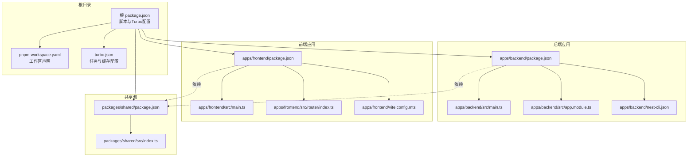
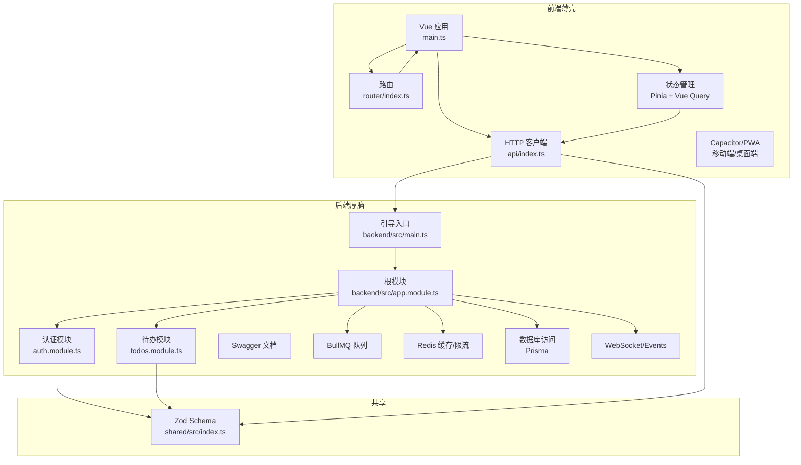
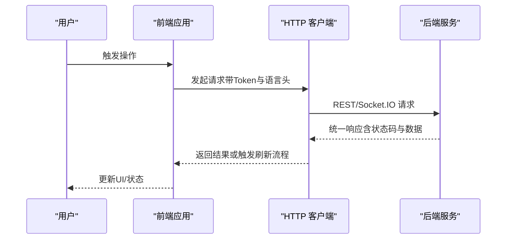
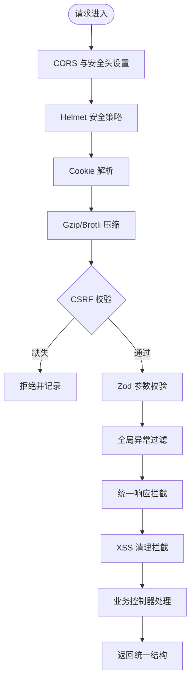
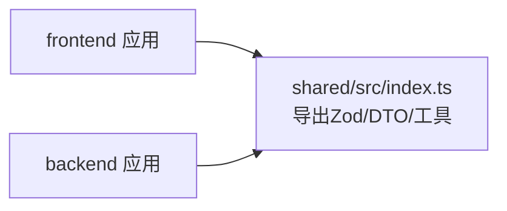
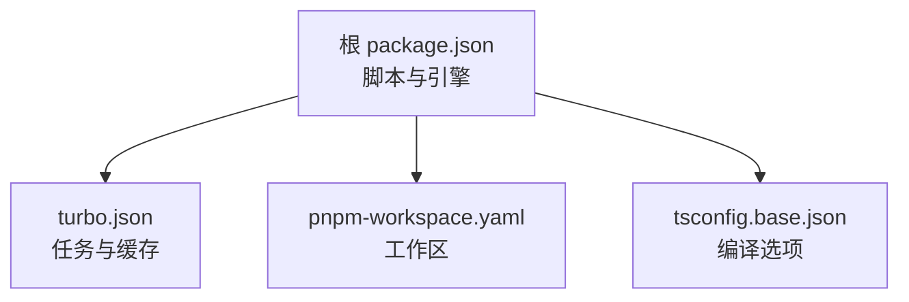

# 整体架构设计

<cite>
**本文引用的文件**
- [package.json](file://package.json)
- [pnpm-workspace.yaml](file://pnpm-workspace.yaml)
- [turbo.json](file://turbo.json)
- [apps/backend/package.json](file://apps/backend/package.json)
- [apps/frontend/package.json](file://apps/frontend/package.json)
- [packages/shared/package.json](file://packages/shared/package.json)
- [apps/backend/src/main.ts](file://apps/backend/src/main.ts)
- [apps/backend/src/app.module.ts](file://apps/backend/src/app.module.ts)
- [apps/backend/nest-cli.json](file://apps/backend/nest-cli.json)
- [apps/frontend/src/main.ts](file://apps/frontend/src/main.ts)
- [apps/frontend/src/router/index.ts](file://apps/frontend/src/router/index.ts)
- [apps/frontend/vite.config.mts](file://apps/frontend/vite.config.mts)
- [apps/backend/src/auth/auth.module.ts](file://apps/backend/src/auth/auth.module.ts)
- [apps/backend/src/todos/todos.module.ts](file://apps/backend/src/todos/todos.module.ts)
- [apps/frontend/src/api/index.ts](file://apps/frontend/src/api/index.ts)
- [packages/shared/src/index.ts](file://packages/shared/src/index.ts)
- [apps/backend/src/common/index.ts](file://apps/backend/src/common/index.ts)
- [tsconfig.base.json](file://tsconfig.base.json)
</cite>

## 目录

1. [引言](#引言)
2. [项目结构](#项目结构)
3. [核心组件](#核心组件)
4. [架构总览](#架构总览)
5. [详细组件分析](#详细组件分析)
6. [依赖分析](#依赖分析)
7. [性能考虑](#性能考虑)
8. [故障排除指南](#故障排除指南)
9. [结论](#结论)
10. [附录](#附录)

## 引言

本文件面向Lumina Todo系统的整体架构设计，围绕Thin Shell（前端薄壳）与Thick Brain（后端厚脑）的分层思想，系统性阐述：

- Thin Shell与Thick Brain的实现原理与优势
- Monorepo架构下的pnpm workspace与Turborepo工作机制
- 前后端分离的API设计、跨域与安全策略
- 模块化组织原则、依赖管理与接口设计
- 系统拓扑与组件关系图
- 跨端一致性方案（Web、移动端、桌面端）

## 项目结构

Lumina采用Monorepo组织方式，以pnpm workspace管理多包，结合Turborepo进行任务编排与缓存加速。根目录通过脚本与工作区配置统一调度各应用与共享包。

**图表来源**

- [package.json:1-139](file://package.json#L1-L139)
- [pnpm-workspace.yaml:1-4](file://pnpm-workspace.yaml#L1-L4)
- [turbo.json:1-202](file://turbo.json#L1-L202)
- [apps/backend/package.json:1-109](file://apps/backend/package.json#L1-L109)
- [apps/frontend/package.json:1-105](file://apps/frontend/package.json#L1-L105)
- [packages/shared/package.json:1-52](file://packages/shared/package.json#L1-L52)

**章节来源**

- [package.json:31-77](file://package.json#L31-L77)
- [pnpm-workspace.yaml:1-4](file://pnpm-workspace.yaml#L1-L4)
- [turbo.json:5-200](file://turbo.json#L5-L200)

## 核心组件

- 前端薄壳（Thin Shell）
  - 职责：UI渲染、用户交互、状态管理、网络请求、国际化、PWA与跨端适配
  - 关键技术：Vue 3、Pinia、Vue Router、TanStack Vue Query、Axios、Capacitor（移动端）、Wails（桌面端）
- 后端厚脑（Thick Brain）
  - 职责：业务逻辑、认证授权、数据访问、队列与定时任务、WebSocket、邮件、国际化、健康检查、安全中间件
  - 关键技术：NestJS、Fastify、Prisma、BullMQ、Redis、Passport/JWT、Swagger、Helmet、CSRF/XSS防护
- 共享包（Shared）
  - 职责：统一Schema（Zod）、通用DTO、工具函数，作为前后端契约的单一事实来源

**章节来源**

- [apps/frontend/package.json:31-71](file://apps/frontend/package.json#L31-L71)
- [apps/backend/package.json:31-87](file://apps/backend/package.json#L31-L87)
- [packages/shared/package.json:41-50](file://packages/shared/package.json#L41-L50)

## 架构总览

Thin Shell与Thick Brain通过REST/Socket.IO API通信，前端负责用户体验与状态，后端提供强健的业务能力与安全边界；共享包确保前后端契约一致。

**图表来源**

- [apps/frontend/src/main.ts:10-138](file://apps/frontend/src/main.ts#L10-L138)
- [apps/frontend/src/router/index.ts:7-73](file://apps/frontend/src/router/index.ts#L7-L73)
- [apps/frontend/src/api/index.ts:8-199](file://apps/frontend/src/api/index.ts#L8-L199)
- [apps/backend/src/main.ts:34-211](file://apps/backend/src/main.ts#L34-L211)
- [apps/backend/src/app.module.ts:28-160](file://apps/backend/src/app.module.ts#L28-L160)
- [apps/backend/src/auth/auth.module.ts:19-41](file://apps/backend/src/auth/auth.module.ts#L19-L41)
- [apps/backend/src/todos/todos.module.ts:8-15](file://apps/backend/src/todos/todos.module.ts#L8-L15)
- [packages/shared/src/index.ts:10-22](file://packages/shared/src/index.ts#L10-L22)

## 详细组件分析

### Thin Shell（前端薄壳）

- 应用入口与错误处理
  - 全局错误捕获与动态Chunk加载失败的自动刷新策略，提升部署后的稳定性
- 状态与查询
  - Pinia + 持久化插件；TanStack Vue Query统一缓存与重试策略
- 路由与国际化
  - 动态路由懒加载；路由守卫统一设置页面标题；i18n按需加载
- 网络层
  - Axios客户端封装，自动注入Authorization与语言头；统一401刷新流程；并发刷新去重
- 跨端适配
  - Vite配置支持Wails（桌面端）与PWA；Capacitor桥接移动端能力；代理配置支持Socket.IO长连接

**图表来源**

- [apps/frontend/src/main.ts:54-138](file://apps/frontend/src/main.ts#L54-L138)
- [apps/frontend/src/api/index.ts:8-199](file://apps/frontend/src/api/index.ts#L8-L199)
- [apps/backend/src/main.ts:181-205](file://apps/backend/src/main.ts#L181-L205)

**章节来源**

- [apps/frontend/src/main.ts:54-138](file://apps/frontend/src/main.ts#L54-L138)
- [apps/frontend/src/router/index.ts:7-73](file://apps/frontend/src/router/index.ts#L7-L73)
- [apps/frontend/src/api/index.ts:8-199](file://apps/frontend/src/api/index.ts#L8-L199)
- [apps/frontend/vite.config.mts:154-184](file://apps/frontend/vite.config.mts#L154-L184)

### Thick Brain（后端厚脑）

- 安全与中间件
  - CORS、Helmet、Cookie、压缩、CSRF校验（X-Requested-With）、XSS清理、Gzip压缩
- 全局管道与过滤
  - Zod验证管道、统一响应拦截器、异常过滤器
- 模块化与扩展
  - 根模块聚合配置、日志、事件、队列、国际化、认证、用户、邮件、上传、待办、定时任务、MCP等
- API与文档
  - 全局前缀/api；Swagger文档自动生成与清理

**图表来源**

- [apps/backend/src/main.ts:48-180](file://apps/backend/src/main.ts#L48-L180)
- [apps/backend/src/common/index.ts:1-15](file://apps/backend/src/common/index.ts#L1-L15)

**章节来源**

- [apps/backend/src/main.ts:34-211](file://apps/backend/src/main.ts#L34-L211)
- [apps/backend/src/app.module.ts:28-160](file://apps/backend/src/app.module.ts#L28-L160)

### 共享包（单源事实）

- 提供Zod Schema、通用DTO与工具函数，确保前后端契约一致，减少重复与不一致风险
- 前端通过别名映射直接消费共享包，后端通过workspace依赖复用

**图表来源**

- [packages/shared/src/index.ts:10-22](file://packages/shared/src/index.ts#L10-L22)
- [apps/frontend/vite.config.mts:151](file://apps/frontend/vite.config.mts#L151)
- [apps/backend/package.json:40](file://apps/backend/package.json#L40)

**章节来源**

- [packages/shared/src/index.ts:10-22](file://packages/shared/src/index.ts#L10-L22)
- [apps/frontend/vite.config.mts:151](file://apps/frontend/vite.config.mts#L151)
- [apps/backend/package.json:40](file://apps/backend/package.json#L40)

### 模块化组织与接口设计

- 功能模块划分
  - 认证模块、用户模块、待办模块、上传模块、邮件模块、事件模块、定时任务模块、MCP模块等
- 依赖管理
  - 前后端均通过workspace依赖共享包；后端模块间通过NestJS模块聚合；前端通过Vite别名与插件优化
- 接口设计
  - 统一响应结构、Zod参数校验、Swagger文档生成、CSRF/XSS安全头、语言头传递

**章节来源**

- [apps/backend/src/auth/auth.module.ts:19-41](file://apps/backend/src/auth/auth.module.ts#L19-L41)
- [apps/backend/src/todos/todos.module.ts:8-15](file://apps/backend/src/todos/todos.module.ts#L8-L15)
- [apps/backend/src/app.module.ts:134-146](file://apps/backend/src/app.module.ts#L134-L146)

## 依赖分析

- Monorepo与任务编排
  - pnpm workspace声明工作区；Turborepo定义任务依赖、输入输出与缓存；根脚本统一触发各应用构建/测试/类型检查
- TypeScript基础配置
  - 基础tsconfig统一严格模式与模块解析策略，保障跨包一致性

**图表来源**

- [package.json:26-30](file://package.json#L26-L30)
- [turbo.json:3-4](file://turbo.json#L3-L4)
- [tsconfig.base.json:2-15](file://tsconfig.base.json#L2-L15)
- [pnpm-workspace.yaml:1-4](file://pnpm-workspace.yaml#L1-4)

**章节来源**

- [package.json:31-77](file://package.json#L31-L77)
- [turbo.json:5-200](file://turbo.json#L5-L200)
- [tsconfig.base.json:2-15](file://tsconfig.base.json#L2-L15)

## 性能考虑

- 前端
  - Vite多格式压缩（Gzip/Brotli）、手动分包策略、PWA缓存与自动更新、路由懒加载
- 后端
  - Fastify高性能适配器、Redis缓存与限流、BullMQ队列与指数退避、Prisma连接池与迁移
- Monorepo
  - Turborepo增量构建与缓存、并行任务、依赖图优化

**章节来源**

- [apps/frontend/vite.config.mts:86-184](file://apps/frontend/vite.config.mts#L86-L184)
- [apps/backend/src/app.module.ts:98-123](file://apps/backend/src/app.module.ts#L98-L123)
- [apps/backend/package.json:61-86](file://apps/backend/package.json#L61-L86)
- [turbo.json:5-200](file://turbo.json#L5-L200)

## 故障排除指南

- 前端
  - 动态Chunk加载失败：自动刷新；忽略ResizeObserver良性错误；未捕获Promise拒绝统一上报
- 后端
  - CSRF拦截：缺失X-Requested-With头会被拒绝；统一异常过滤与日志级别区分
  - Swagger文档：生成后清理冗余字段，确保OpenAPI一致性
- 通用
  - 401自动刷新：并发刷新去重；刷新失败回退至错误处理

**章节来源**

- [apps/frontend/src/main.ts:58-113](file://apps/frontend/src/main.ts#L58-L113)
- [apps/backend/src/main.ts:125-167](file://apps/backend/src/main.ts#L125-L167)
- [apps/backend/src/main.ts:181-190](file://apps/backend/src/main.ts#L181-L190)
- [apps/frontend/src/api/index.ts:93-196](file://apps/frontend/src/api/index.ts#L93-L196)

## 结论

Lumina Todo通过Thin Shell与Thick Brain的清晰分工，结合Monorepo与共享包，实现了高内聚、低耦合、可扩展的工程体系。前端专注体验与一致性，后端专注业务与安全，配合完善的跨域、安全与任务处理机制，支撑Web、移动端与桌面端的统一交付。

## 附录

- 跨端一致性策略
  - Web：标准浏览器与PWA；代理与Socket.IO长连接
  - 移动端：Capacitor桥接原生能力，静态资源与后端API同源策略
  - 桌面端：Wails打包，前端资源通过相对路径访问后端API
- 开发与运维
  - 根脚本统一开发、构建、测试、类型检查与Docker编排；Turborepo加速迭代

**章节来源**

- [apps/frontend/vite.config.mts:12-21](file://apps/frontend/vite.config.mts#L12-L21)
- [apps/frontend/vite.config.mts:154-174](file://apps/frontend/vite.config.mts#L154-L174)
- [apps/backend/src/main.ts:196-204](file://apps/backend/src/main.ts#L196-L204)
- [package.json:31-77](file://package.json#L31-L77)
