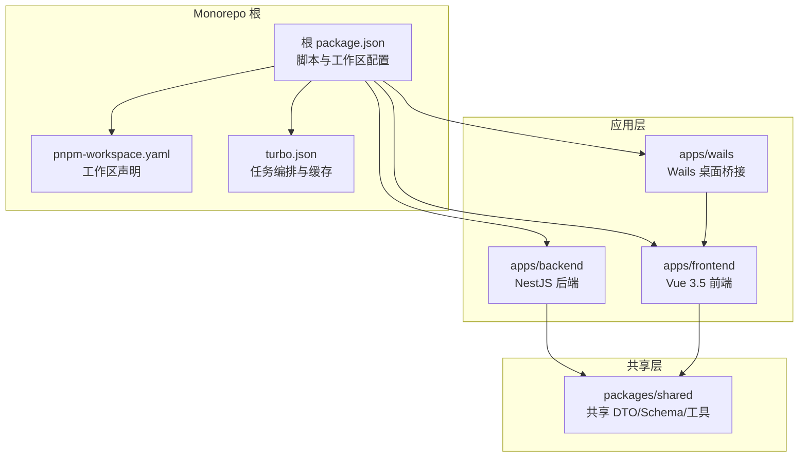
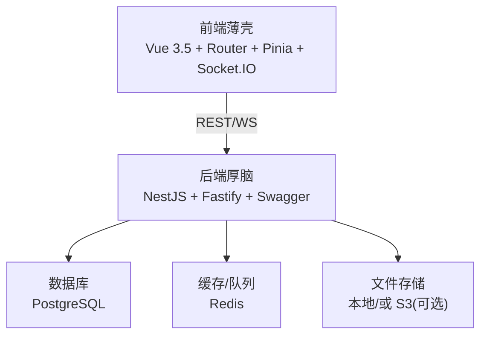
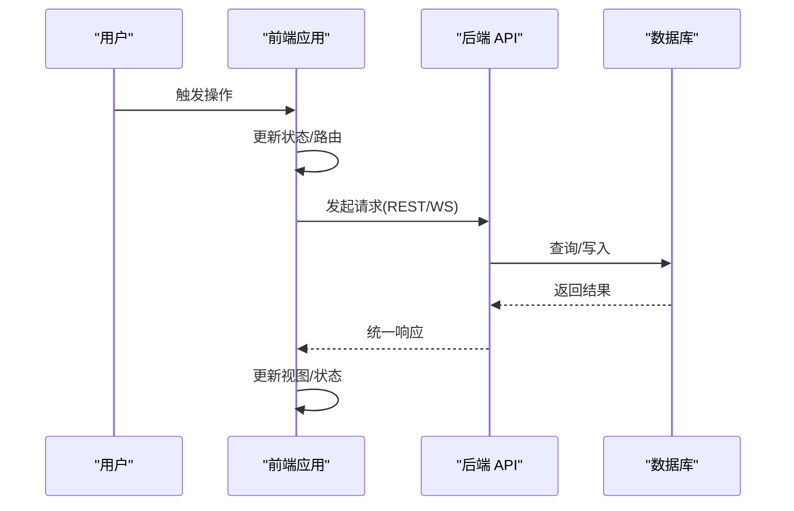
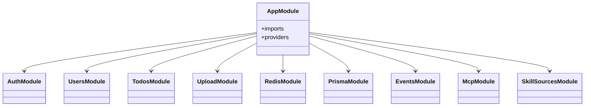
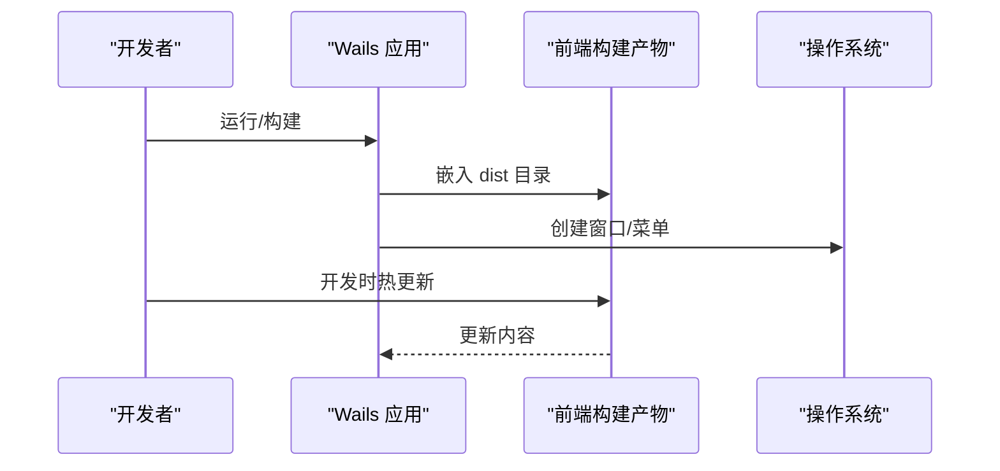
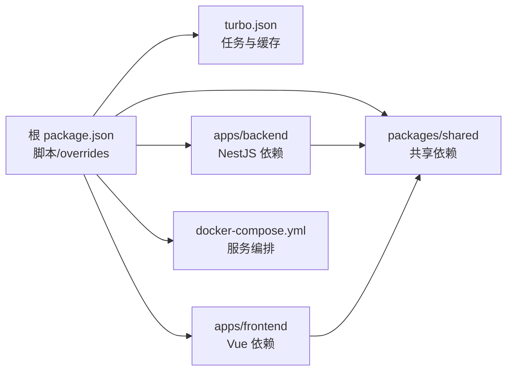

# 系统架构

<cite>
**本文引用的文件**   
- [apps/backend/src/main.ts](file://apps/backend/src/main.ts)
- [apps/backend/src/app.module.ts](file://apps/backend/src/app.module.ts)
- [apps/backend/nest-cli.json](file://apps/backend/nest-cli.json)
- [apps/backend/package.json](file://apps/backend/package.json)
- [apps/frontend/src/main.ts](file://apps/frontend/src/main.ts)
- [apps/frontend/src/router/index.ts](file://apps/frontend/src/router/index.ts)
- [apps/frontend/vite.config.mts](file://apps/frontend/vite.config.mts)
- [apps/frontend/capacitor.config.ts](file://apps/frontend/capacitor.config.ts)
- [apps/frontend/package.json](file://apps/frontend/package.json)
- [apps/wails/main.go](file://apps/wails/main.go)
- [apps/wails/wails.json](file://apps/wails/wails.json)
- [packages/shared/src/index.ts](file://packages/shared/src/index.ts)
- [packages/shared/src/schemas/todo.schema.ts](file://packages/shared/src/schemas/todo.schema.ts)
- [packages/shared/src/utils/user.utils.ts](file://packages/shared/src/utils/user.utils.ts)
- [turbo.json](file://turbo.json)
- [pnpm-workspace.yaml](file://pnpm-workspace.yaml)
- [package.json](file://package.json)
- [docker-compose.yml](file://docker-compose.yml)
</cite>

## 目录

1. [简介](#简介)
2. [项目结构](#项目结构)
3. [核心组件](#核心组件)
4. [架构总览](#架构总览)
5. [详细组件分析](#详细组件分析)
6. [依赖分析](#依赖分析)
7. [性能考虑](#性能考虑)
8. [故障排查指南](#故障排查指南)
9. [结论](#结论)
10. [附录](#附录)

## 简介

Lumina Todo 是一个以“极简交互体验”和“严谨工程实践”为核心的 AI 驱动个人待办应用。系统采用 monorepo 架构，通过 Thin Shell（薄壳）与 Thick Brain（厚脑）相结合的模式实现前后端分离与跨端一致性：前端以 Vue 3.5 为核心，结合 Capacitor 实现 Web 与移动端原生能力；后端以 NestJS 提供 REST/WS 能力，并通过 Wails 将前端打包为桌面原生应用；共享包提供跨端共享的数据模型与工具。系统支持多端部署（Web、Android、iOS、桌面），并通过 Docker Compose 提供生产级部署与可观测性。

## 项目结构

系统采用 pnpm workspace + Turbo 的 monorepo 管理方式，按功能域拆分为 apps 与 packages：

- apps/backend：NestJS 后端，提供认证、用户、待办、文件上传、定时任务、WebSocket、健康检查、国际化、缓存与队列等模块。
- apps/frontend：Vue 3.5 前端，包含路由、Pinia、Vue Query、国际化、UI 组件库、图表与 Markdown 渲染等。
- apps/wails：Wails 桌面应用桥接层，嵌入前端产物并提供原生菜单与窗口控制。
- packages/shared：跨端共享的数据传输对象（DTO）、Schema 与通用工具。

**图表来源**

- [package.json:1-139](file://package.json#L1-L139)
- [pnpm-workspace.yaml:1-4](file://pnpm-workspace.yaml#L1-L4)
- [turbo.json:1-202](file://turbo.json#L1-L202)

**章节来源**

- [package.json:1-139](file://package.json#L1-L139)
- [pnpm-workspace.yaml:1-4](file://pnpm-workspace.yaml#L1-L4)
- [turbo.json:1-202](file://turbo.json#L1-L202)

## 核心组件

- Thin Shell（薄壳）：前端（Vue 3.5 + Capacitor + Vite）负责用户界面、路由、状态管理、实时通信与本地渲染，通过 API 与后端交互。
- Thick Brain（厚脑）：后端（NestJS + Fastify）提供统一的业务逻辑、认证授权、数据持久化、缓存与队列、国际化、健康检查与安全中间件。
- 跨端桥接：Wails 将前端产物嵌入桌面应用，提供原生菜单、窗口与透明背景等特性。
- 共享契约：packages/shared 提供跨端一致的 DTO 与 Schema，确保前后端/跨端数据结构统一。

**章节来源**

- [apps/frontend/src/main.ts:1-138](file://apps/frontend/src/main.ts#L1-L138)
- [apps/backend/src/main.ts:1-211](file://apps/backend/src/main.ts#L1-L211)
- [apps/wails/main.go:1-95](file://apps/wails/main.go#L1-L95)
- [packages/shared/src/index.ts](file://packages/shared/src/index.ts)

## 架构总览

系统采用 Thin Shell + Thick Brain 的分层模式：

- 前端薄壳：负责 UI、路由、状态、实时交互与本地渲染，通过 Axios/Socket.IO 与后端通信。
- 后端厚脑：集中处理业务规则、数据模型、缓存、队列、邮件、国际化与安全策略。
- 跨端一致性：通过 Capacitor 与 Wails，Web、移动端与桌面端共享同一套前端代码与后端 API。
- 数据流：前端发起请求 → 后端校验与处理 → 缓存/数据库 → 返回统一响应格式 → 前端更新状态与视图。

**图表来源**

- [apps/backend/src/main.ts:1-211](file://apps/backend/src/main.ts#L1-L211)
- [apps/frontend/vite.config.mts:154-174](file://apps/frontend/vite.config.mts#L154-L174)
- [docker-compose.yml:23-120](file://docker-compose.yml#L23-L120)

## 详细组件分析

### Thin Shell（前端薄壳）

- 应用入口与错误处理：初始化 Pinia、Vue Query、国际化与图表库，统一处理动态模块加载错误与全局异常。
- 路由与标题：基于 Vue Router 动态导入页面，按路由元信息更新页面标题。
- 构建与代理：Vite 配置多 vendor 分包、Gzip/Brotli 压缩与 PWA；开发时通过代理转发到后端。
- 跨端适配：通过环境变量区分 Wails 模式，使用 HashHistory 保证桌面端路由稳定。

**图表来源**

- [apps/frontend/src/main.ts:1-138](file://apps/frontend/src/main.ts#L1-L138)
- [apps/frontend/src/router/index.ts:1-73](file://apps/frontend/src/router/index.ts#L1-L73)
- [apps/frontend/vite.config.mts:154-174](file://apps/frontend/vite.config.mts#L154-L174)

**章节来源**

- [apps/frontend/src/main.ts:1-138](file://apps/frontend/src/main.ts#L1-L138)
- [apps/frontend/src/router/index.ts:1-73](file://apps/frontend/src/router/index.ts#L1-L73)
- [apps/frontend/vite.config.mts:1-185](file://apps/frontend/vite.config.mts#L1-L185)

### Thick Brain（后端厚脑）

- 启动与中间件：使用 Fastify Adapter，集成 Helmet、Cookie、压缩、静态资源与 CSRF 校验；全局 Zod 校验、异常过滤与响应拦截。
- 模块化：通过 AppModule 组织认证、用户、待办、上传、定时任务、MCP、技能源等模块；引入 Redis、BullMQ、I18n、Prisma 等基础设施。
- 安全与合规：CORS 策略、XSS 清理、权限策略、速率限制与健康检查端点。
- 文档与可观测：Swagger 文档自动生成与清理，Pino 日志按环境输出。

**图表来源**

- [apps/backend/src/app.module.ts:1-160](file://apps/backend/src/app.module.ts#L1-L160)

**章节来源**

- [apps/backend/src/main.ts:1-211](file://apps/backend/src/main.ts#L1-L211)
- [apps/backend/src/app.module.ts:1-160](file://apps/backend/src/app.module.ts#L1-L160)

### 跨端桥接（Wails）

- 嵌入前端产物：将前端构建目录嵌入桌面应用，提供菜单、窗口与平台特性（透明、隐藏标题栏等）。
- 开发与构建：通过 wails.json 配置前端构建命令与开发服务器地址，支持热重载与安装部署。

**图表来源**

- [apps/wails/main.go:1-95](file://apps/wails/main.go#L1-L95)
- [apps/wails/wails.json:1-22](file://apps/wails/wails.json#L1-L22)

**章节来源**

- [apps/wails/main.go:1-95](file://apps/wails/main.go#L1-L95)
- [apps/wails/wails.json:1-22](file://apps/wails/wails.json#L1-L22)

### 共享契约（packages/shared）

- 数据模型：提供跨端一致的 DTO 与 Schema，减少重复定义与不一致风险。
- 工具函数：封装通用工具方法，便于前后端复用。

**章节来源**

- [packages/shared/src/index.ts](file://packages/shared/src/index.ts)
- [packages/shared/src/schemas/todo.schema.ts](file://packages/shared/src/schemas/todo.schema.ts)
- [packages/shared/src/utils/user.utils.ts](file://packages/shared/src/utils/user.utils.ts)

## 依赖分析

- 工作区与任务编排：Turbo 管理构建顺序、缓存与并发，根 package.json 提供统一脚本。
- 依赖覆盖：根 package.json 对关键依赖进行 overrides，统一安全版本。
- Docker Compose：后端、前端、数据库、缓存与反向代理的生产级编排，含健康检查与日志轮转。

**图表来源**

- [package.json:1-139](file://package.json#L1-L139)
- [turbo.json:1-202](file://turbo.json#L1-L202)
- [apps/backend/package.json:1-109](file://apps/backend/package.json#L1-L109)
- [apps/frontend/package.json:1-105](file://apps/frontend/package.json#L1-L105)
- [docker-compose.yml:1-240](file://docker-compose.yml#L1-L240)

**章节来源**

- [package.json:1-139](file://package.json#L1-L139)
- [turbo.json:1-202](file://turbo.json#L1-L202)
- [apps/backend/package.json:1-109](file://apps/backend/package.json#L1-L109)
- [apps/frontend/package.json:1-105](file://apps/frontend/package.json#L1-L105)
- [docker-compose.yml:1-240](file://docker-compose.yml#L1-L240)

## 性能考虑

- 前端性能
  - 多 vendor 分包与按需加载，降低首屏体积与提升缓存命中率。
  - Gzip/Brotli 压缩与 PWA 缓存策略，缩短加载时间。
  - Vue Query 缓存与重试策略，减少重复请求与提升稳定性。
- 后端性能
  - Fastify 适配器与 Helmet、压缩中间件减少网络开销。
  - Redis 缓存与 BullMQ 队列异步化，降低数据库压力。
  - Prisma 与连接池配置，结合 PostgreSQL 参数优化。
- 跨端一致性
  - Capacitor 与 Wails 统一前端代码，减少维护成本。
  - 环境变量与构建配置区分 Web/Wails 模式，避免运行时差异。

**章节来源**

- [apps/frontend/vite.config.mts:1-185](file://apps/frontend/vite.config.mts#L1-L185)
- [apps/backend/src/main.ts:1-211](file://apps/backend/src/main.ts#L1-L211)
- [docker-compose.yml:23-120](file://docker-compose.yml#L23-L120)

## 故障排查指南

- 启动与中间件
  - 若出现 CSRF 拦截错误，检查请求是否携带 X-Requested-With 头。
  - Helmet 与压缩中间件导致的兼容问题，可通过环境变量调整。
- 前端错误
  - 动态模块加载失败时自动刷新，若频繁触发需检查部署版本与缓存。
  - 忽略 ResizeObserver 的良性错误，关注真实异常堆栈。
- Docker 与服务
  - 通过健康检查端点确认后端/前端可用性，查看容器日志定位问题。
  - Nginx Proxy Manager 与 GoAccess 可辅助分析访问日志与可视化。

**章节来源**

- [apps/backend/src/main.ts:152-167](file://apps/backend/src/main.ts#L152-L167)
- [apps/frontend/src/main.ts:58-113](file://apps/frontend/src/main.ts#L58-L113)
- [docker-compose.yml:128-137](file://docker-compose.yml#L128-L137)

## 结论

Lumina Todo 通过 Thin Shell + Thick Brain 的架构实现了清晰的职责分离与跨端一致性：前端专注于用户体验与交互，后端专注业务与数据治理；共享包确保契约一致；Docker Compose 提供生产级部署与可观测性。该架构在保证工程可维护性的同时，兼顾了性能与安全性，适合长期演进与规模化扩展。

## 附录

- 技术选型说明
  - Vue 3.5：现代化响应式框架，生态丰富，利于组件化与状态管理。
  - NestJS：企业级 Node 框架，模块化与依赖注入便于大型应用组织。
  - Wails：将 Web 前端打包为原生桌面应用，降低跨端开发成本。
  - Capacitor：Web 与移动端原生能力桥接，统一代码库。
  - Turbo + pnpm：Monorepo 工作区与任务编排，提升构建效率与一致性。
  - Docker Compose：标准化生产部署，配合 NPM 与 GoAccess 实现可观测性。
