# 部署拓扑

<cite>
**本文引用的文件**
- [docker-compose.yml](file://docker-compose.yml)
- [docker-compose.dev.yml](file://docker-compose.dev.yml)
- [apps/backend/Dockerfile](file://apps/backend/Dockerfile)
- [apps/frontend/Dockerfile](file://apps/frontend/Dockerfile)
- [apps/frontend/nginx.conf](file://apps/frontend/nginx.conf)
- [apps/frontend/nginx.main.conf](file://apps/frontend/nginx.main.conf)
- [ecosystem.config.js](file://ecosystem.config.js)
- [deploy.sh](file://deploy.sh)
- [scripts/deploy-app.sh](file://scripts/deploy-app.sh)
- [package.json](file://package.json)
- [apps/backend/package.json](file://apps/backend/package.json)
- [apps/frontend/package.json](file://apps/frontend/package.json)
- [turbo.json](file://turbo.json)
</cite>

## 目录

1. [简介](#简介)
2. [项目结构](#项目结构)
3. [核心组件](#核心组件)
4. [架构总览](#架构总览)
5. [详细组件分析](#详细组件分析)
6. [依赖关系分析](#依赖关系分析)
7. [性能考量](#性能考量)
8. [故障排查指南](#故障排查指南)
9. [结论](#结论)
10. [附录](#附录)

## 简介

本文件面向Lumina Todo系统，提供从单机到容器化再到生产级部署的完整拓扑说明。内容涵盖：

- 多种部署模式：单机、容器化、集群化（基于Compose的多实例扩展思路）
- Docker容器化策略：镜像构建、容器编排、网络与存储卷管理
- 反向代理与高可用：Nginx Proxy Manager、健康检查、故障转移
- 数据库与缓存：PostgreSQL与Redis的部署要点与优化
- 静态资源与CDN：Nginx配置、缓存策略、版本化
- 部署流程图与配置清单：生产环境一键部署脚本与最佳实践
- 监控与运维：GoAccess访问统计、日志轮转、磁盘清理策略

## 项目结构

Lumina采用Monorepo组织，后端为NestJS，前端为Vue + Vite，同时提供Wails桌面应用打包能力。容器化通过Docker Compose统一编排，支持开发与生产两种Compose配置。

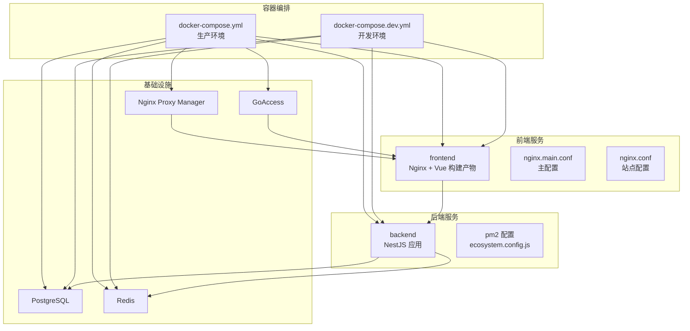

图表来源

- [docker-compose.yml:19-240](file://docker-compose.yml#L19-L240)
- [docker-compose.dev.yml:13-192](file://docker-compose.dev.yml#L13-L192)
- [apps/frontend/nginx.main.conf:1-51](file://apps/frontend/nginx.main.conf#L1-L51)
- [apps/frontend/nginx.conf:1-203](file://apps/frontend/nginx.conf#L1-L203)
- [ecosystem.config.js:5-33](file://ecosystem.config.js#L5-L33)

章节来源

- [docker-compose.yml:19-240](file://docker-compose.yml#L19-L240)
- [docker-compose.dev.yml:13-192](file://docker-compose.dev.yml#L13-L192)
- [apps/frontend/nginx.main.conf:1-51](file://apps/frontend/nginx.main.conf#L1-L51)
- [apps/frontend/nginx.conf:1-203](file://apps/frontend/nginx.conf#L1-L203)
- [ecosystem.config.js:5-33](file://ecosystem.config.js#L5-L33)

## 核心组件

- 后端（NestJS）
  - 镜像构建：分阶段构建，最终以精简Node镜像运行，非root用户，健康检查，暴露3000端口
  - 运行方式：Docker内单实例（避免Socket.IO粘性会话问题），PM2配置用于本地开发/非Docker场景
  - 环境变量：数据库、Redis、JWT、CORS、邮件、S3等
- 前端（Nginx + Vue）
  - 镜像构建：Nginx镜像，复制Vue构建产物，配置Gzip/Brotli、缓存、安全头、WebSocket代理
  - 站点配置：/api代理到后端，/socket.io透传升级头，静态资源长期缓存
- 数据库（PostgreSQL）
  - 参数调优：shared_buffers、effective_cache_size、work_mem、max_connections等
  - 健康检查：pg_isready
- 缓存（Redis）
  - AOF持久化、内存上限与淘汰策略、密码认证
  - 健康检查：redis-cli ping
- 反向代理（Nginx Proxy Manager）
  - 端口映射：80/443/81，Let’s Encrypt证书，数据与证书卷
- 访问统计（GoAccess）
  - 实时HTML报告，绑定到固定端口，挂载前端日志卷

章节来源

- [apps/backend/Dockerfile:1-103](file://apps/backend/Dockerfile#L1-L103)
- [apps/frontend/Dockerfile:1-94](file://apps/frontend/Dockerfile#L1-L94)
- [apps/frontend/nginx.conf:1-203](file://apps/frontend/nginx.conf#L1-L203)
- [apps/frontend/nginx.main.conf:1-51](file://apps/frontend/nginx.main.conf#L1-L51)
- [docker-compose.yml:23-240](file://docker-compose.yml#L23-L240)
- [ecosystem.config.js:5-33](file://ecosystem.config.js#L5-L33)

## 架构总览

生产环境采用“反向代理 + Nginx + NestJS + Nginx（前端）+ PostgreSQL + Redis”的标准三层架构。NPM负责域名与HTTPS，前端Nginx提供静态资源与API代理，后端NestJS提供业务与WebSocket，PG与Redis分别承担数据与缓存。

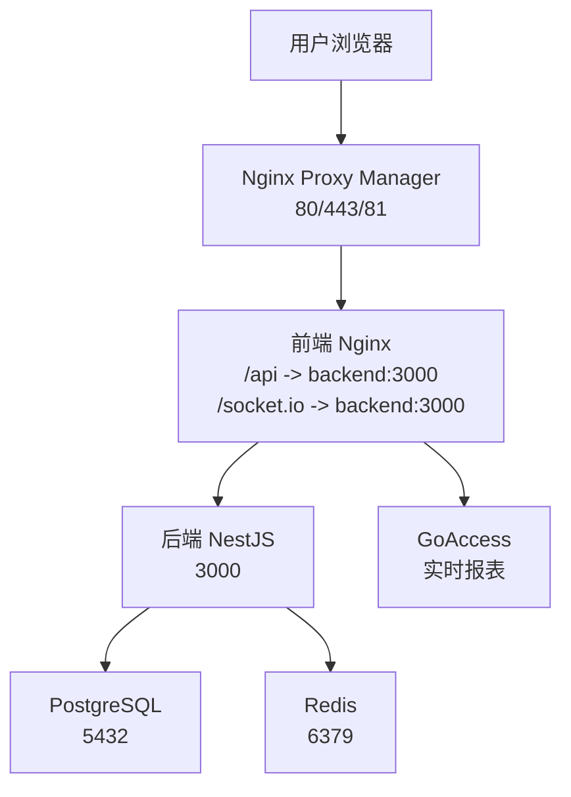

图表来源

- [docker-compose.yml:210-227](file://docker-compose.yml#L210-L227)
- [apps/frontend/nginx.conf:127-180](file://apps/frontend/nginx.conf#L127-L180)
- [apps/frontend/nginx.main.conf:15-50](file://apps/frontend/nginx.main.conf#L15-L50)
- [docker-compose.yml:23-51](file://docker-compose.yml#L23-L51)
- [docker-compose.yml:55-69](file://docker-compose.yml#L55-L69)

## 详细组件分析

### 后端容器（NestJS）

- 镜像分阶段构建，最终以非root用户运行，具备健康检查
- 环境变量集中于Compose，涵盖数据库、Redis、JWT、CORS、邮件与S3
- 依赖于PostgreSQL与Redis健康就绪后才启动
- Docker内单实例运行，避免Socket.IO粘性会话问题

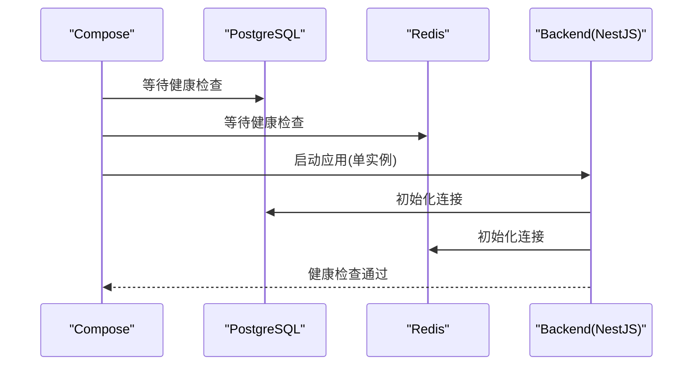

图表来源

- [docker-compose.yml:84-139](file://docker-compose.yml#L84-L139)
- [apps/backend/Dockerfile:97-103](file://apps/backend/Dockerfile#L97-L103)

章节来源

- [apps/backend/Dockerfile:1-103](file://apps/backend/Dockerfile#L1-L103)
- [docker-compose.yml:74-139](file://docker-compose.yml#L74-L139)

### 前端容器（Nginx + Vue）

- 使用Nginx镜像，复制Vue构建产物，启用Gzip/Brotli、缓存与安全头
- /api代理到后端，/socket.io透传Upgrade头，禁用代理缓冲保证实时性
- 对静态资源设置一年缓存，禁止访问隐藏与敏感文件

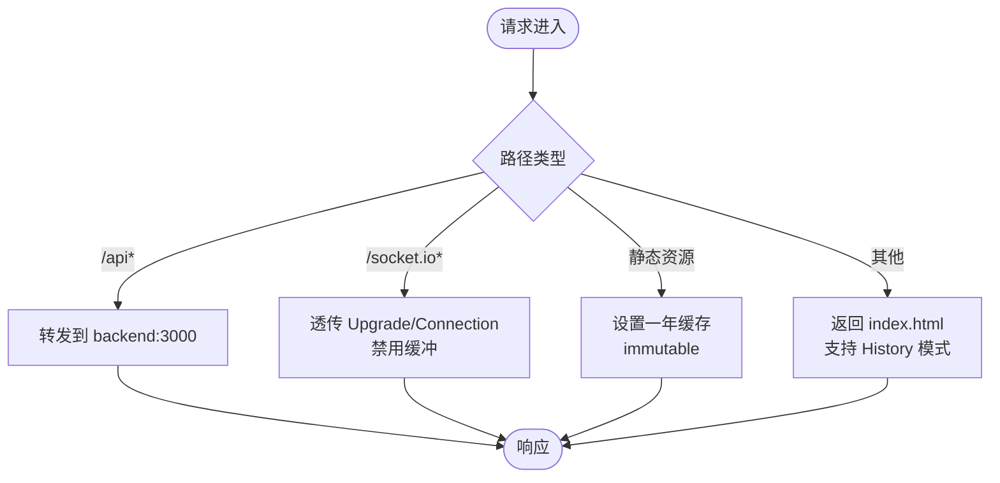

图表来源

- [apps/frontend/nginx.conf:108-187](file://apps/frontend/nginx.conf#L108-L187)

章节来源

- [apps/frontend/Dockerfile:1-94](file://apps/frontend/Dockerfile#L1-L94)
- [apps/frontend/nginx.conf:1-203](file://apps/frontend/nginx.conf#L1-L203)
- [apps/frontend/nginx.main.conf:1-51](file://apps/frontend/nginx.main.conf#L1-L51)

### 数据库（PostgreSQL）

- 通过命令参数设置共享缓冲、有效缓存、工作内存、维护内存、随机页成本与最大连接数
- 仅本机映射5432端口，使用命名卷持久化数据
- 健康检查使用pg_isready

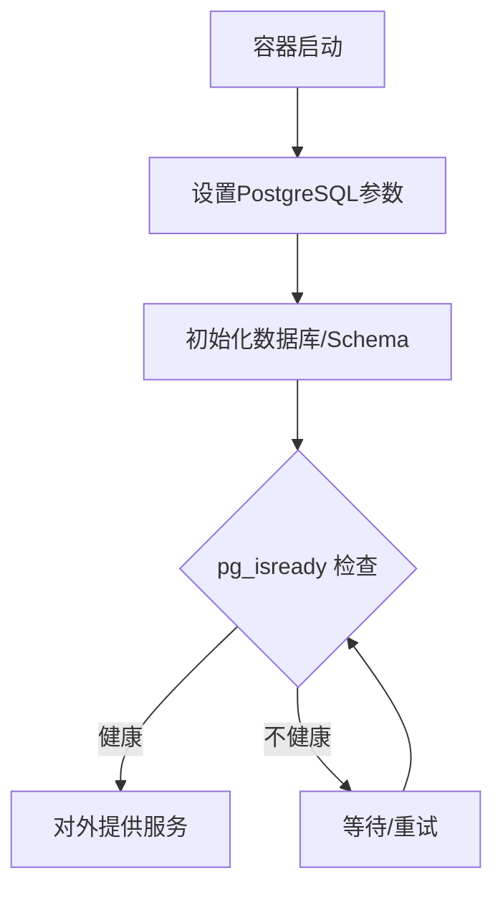

图表来源

- [docker-compose.yml:28-48](file://docker-compose.yml#L28-L48)

章节来源

- [docker-compose.yml:23-51](file://docker-compose.yml#L23-L51)

### 缓存（Redis）

- 启用AOF持久化，设置最大内存与LRU淘汰策略，开启密码认证
- 健康检查使用redis-cli ping

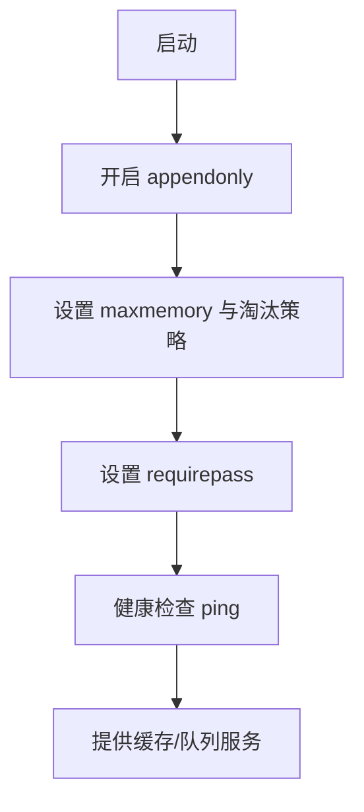

图表来源

- [docker-compose.yml:60-67](file://docker-compose.yml#L60-L67)

章节来源

- [docker-compose.yml:55-69](file://docker-compose.yml#L55-L69)

### 反向代理与高可用（Nginx Proxy Manager）

- 暴露80/443/81端口，数据与证书卷分离
- 建议生产环境仅本机监听81管理端口，通过SSH隧道或防火墙限制访问
- 与前端Nginx配合实现HTTPS与域名解析

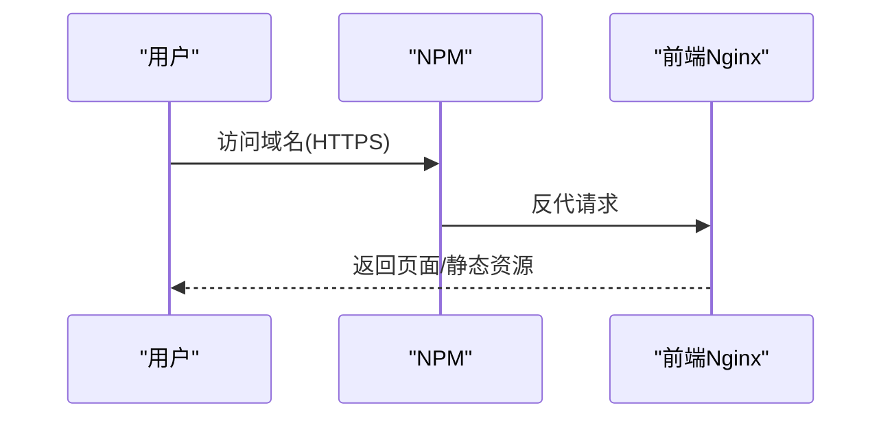

图表来源

- [docker-compose.yml:211-227](file://docker-compose.yml#L211-L227)

章节来源

- [docker-compose.yml:210-227](file://docker-compose.yml#L210-L227)

### 访问统计（GoAccess）

- 读取前端Nginx日志，生成实时HTML报表，默认仅本机监听
- 生产环境建议通过NPM或防火墙限制访问

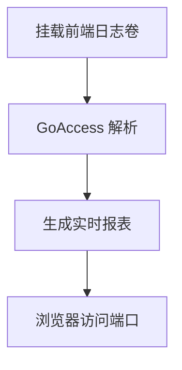

图表来源

- [docker-compose.yml:179-206](file://docker-compose.yml#L179-L206)

章节来源

- [docker-compose.yml:176-206](file://docker-compose.yml#L176-L206)

### 开发与生产差异

- 开发环境：后端/前端均使用Node镜像，挂载项目目录实现热更新，端口映射到本机
- 生产环境：后端/前端分别构建专用镜像，使用健康检查与只读文件系统，NPM与GoAccess参与

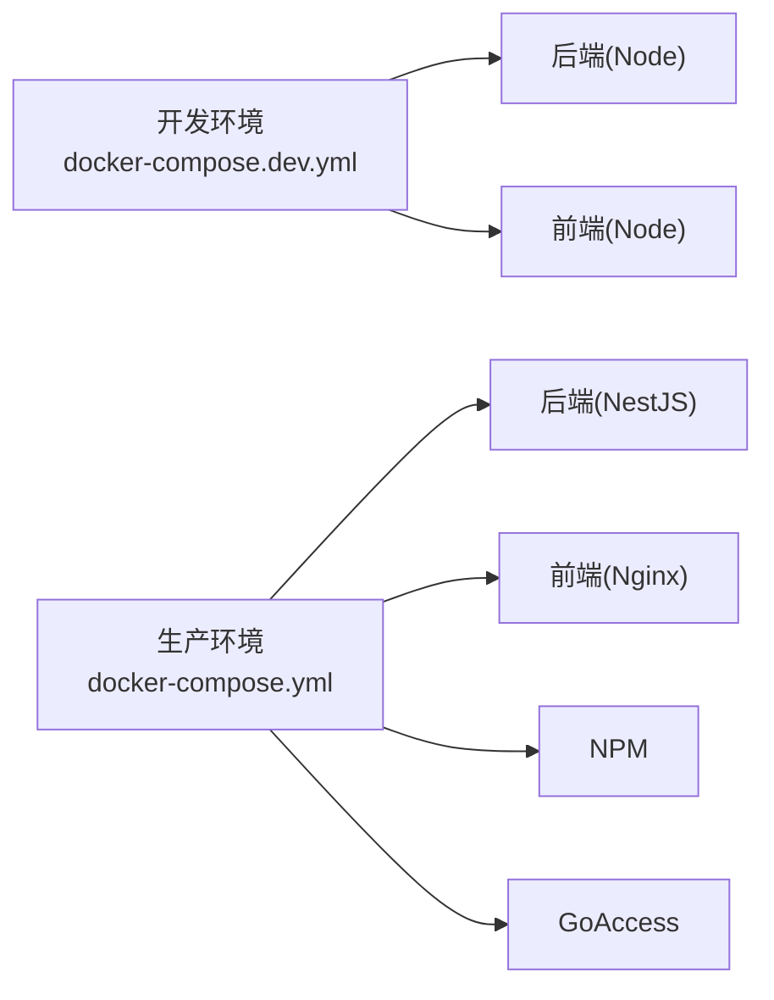

图表来源

- [docker-compose.dev.yml:13-192](file://docker-compose.dev.yml#L13-L192)
- [docker-compose.yml:19-240](file://docker-compose.yml#L19-L240)

章节来源

- [docker-compose.dev.yml:13-192](file://docker-compose.dev.yml#L13-L192)
- [docker-compose.yml:19-240](file://docker-compose.yml#L19-L240)

## 依赖关系分析

- Monorepo工具链：Turbo驱动构建与测试缓存，pnpm管理依赖
- 后端依赖：NestJS、Prisma、Redis、Socket.IO、Fastify、BullMQ等
- 前端依赖：Vue3、Pinia、Tailwind、Vite、PWA插件等
- 部署脚本：一键拉取代码、校验环境、构建镜像、健康检查、迁移Schema、清理磁盘

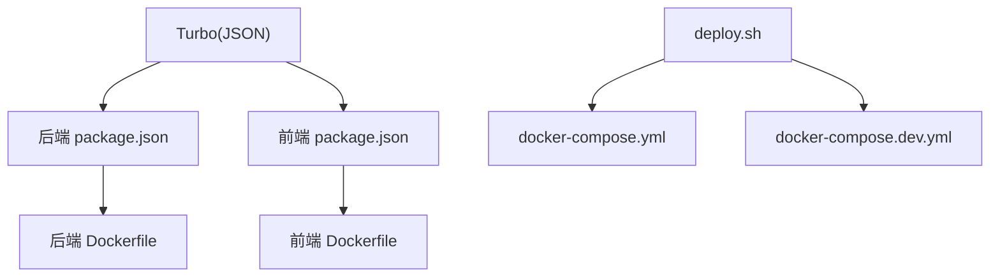

图表来源

- [turbo.json:1-202](file://turbo.json#L1-L202)
- [apps/backend/package.json:1-109](file://apps/backend/package.json#L1-L109)
- [apps/frontend/package.json:1-105](file://apps/frontend/package.json#L1-L105)
- [apps/backend/Dockerfile:1-103](file://apps/backend/Dockerfile#L1-L103)
- [apps/frontend/Dockerfile:1-94](file://apps/frontend/Dockerfile#L1-L94)
- [deploy.sh:261-295](file://deploy.sh#L261-L295)

章节来源

- [turbo.json:1-202](file://turbo.json#L1-L202)
- [apps/backend/package.json:1-109](file://apps/backend/package.json#L1-L109)
- [apps/frontend/package.json:1-105](file://apps/frontend/package.json#L1-L105)
- [apps/backend/Dockerfile:1-103](file://apps/backend/Dockerfile#L1-L103)
- [apps/frontend/Dockerfile:1-94](file://apps/frontend/Dockerfile#L1-L94)
- [deploy.sh:261-295](file://deploy.sh#L261-L295)

## 性能考量

- Nginx性能与安全
  - 启用Gzip/Brotli、sendfile、tcp_nopush/nodelay、open_file_cache
  - 设置Content-Security-Policy、X-Frame-Options等安全头
  - 静态资源一年缓存，index.html禁用缓存
- PostgreSQL参数
  - 调整shared_buffers、effective_cache_size、work_mem、maintenance_work_mem、random_page_cost、max_connections
- Redis内存与持久化
  - AOF持久化、maxmemory与LRU策略、requirepass
- 健康检查与启动延迟
  - 后端健康检查增加start_period，前端健康检查间隔较长
- 日志与磁盘
  - json-file日志轮转，部署脚本内置磁盘清理策略

章节来源

- [apps/frontend/nginx.conf:11-96](file://apps/frontend/nginx.conf#L11-L96)
- [docker-compose.yml:28-48](file://docker-compose.yml#L28-L48)
- [docker-compose.yml:60-67](file://docker-compose.yml#L60-L67)
- [docker-compose.yml:128-139](file://docker-compose.yml#L128-L139)
- [docker-compose.yml:163-170](file://docker-compose.yml#L163-L170)

## 故障排查指南

- 部署脚本
  - 检查Docker与Compose可用性、.env变量完整性、Compose配置有效性
  - 支持Git仓库更新、镜像版本一致性校验、增量/全量构建决策
  - 部署前后磁盘占用阈值判断与清理策略
  - 等待后端健康检查，执行Prisma迁移或db push
  - 修正上传目录权限，打印访问地址与管理后台提示
- 健康检查失败
  - 查看后端日志与容器状态，确认数据库/Redis可达
  - 检查NPM端口映射与证书状态
- GoAccess访问统计不可见
  - 默认仅本机监听，可通过SSH隧道或NPM限制访问
- Wails桌面应用
  - macOS平台一键部署脚本，自动关闭旧版本、复制到/Applications并启动

章节来源

- [deploy.sh:241-487](file://deploy.sh#L241-L487)
- [scripts/deploy-app.sh:1-66](file://scripts/deploy-app.sh#L1-L66)

## 结论

Lumina Todo提供了从开发到生产的完整容器化方案：以Docker Compose统一编排，结合NPM与前端Nginx实现反向代理与静态资源优化，后端NestJS通过健康检查与PM2配置保障稳定性，PG与Redis提供可靠的数据与缓存支撑。部署脚本自动化程度高，具备磁盘清理与Schema迁移能力，适合快速落地生产环境。

## 附录

### 部署流程图（生产环境）

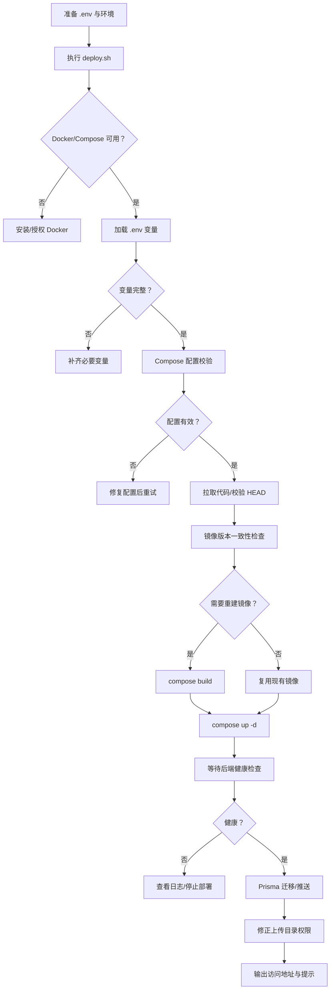

图表来源

- [deploy.sh:261-487](file://deploy.sh#L261-L487)
- [docker-compose.yml:84-139](file://docker-compose.yml#L84-L139)

### 配置清单（关键环境变量）

- 数据库
  - POSTGRES_USER
  - POSTGRES_PASSWORD
  - POSTGRES_DB
- 缓存
  - REDIS_PASSWORD
- 安全
  - JWT_SECRET
  - JWT_REFRESH_SECRET
  - CORS_ORIGIN
- 邮件
  - MAIL_HOST
  - MAIL_PORT
  - MAIL_USER
  - MAIL_PASSWORD
- 对象存储
  - S3_BUCKET
  - S3_REGION
  - S3_ACCESS_KEY_ID
  - S3_SECRET_ACCESS_KEY
  - S3_ENDPOINT
- 其他
  - LOG_LEVEL
  - JWT_ACCESS_EXPIRES_IN
  - JWT_REFRESH_EXPIRES_IN
  - THROTTLE\_\*（短/中/长周期与限额）

章节来源

- [docker-compose.yml:93-125](file://docker-compose.yml#L93-L125)

### 集群化与高可用建议

- 多实例扩展
  - 在Compose中为后端设置多个副本，结合NPM进行健康检查与负载均衡
  - 使用外部负载均衡器（如HAProxy/Nginx）分发流量
- 故障转移
  - 健康检查失败自动摘除节点，结合重启策略与日志轮转
- 数据与缓存高可用
  - PostgreSQL主从复制与备份策略（建议在独立主机/托管服务）
  - Redis Sentinel或集群（建议在独立主机/托管服务）

[本节为概念性建议，不直接对应具体源码文件]
