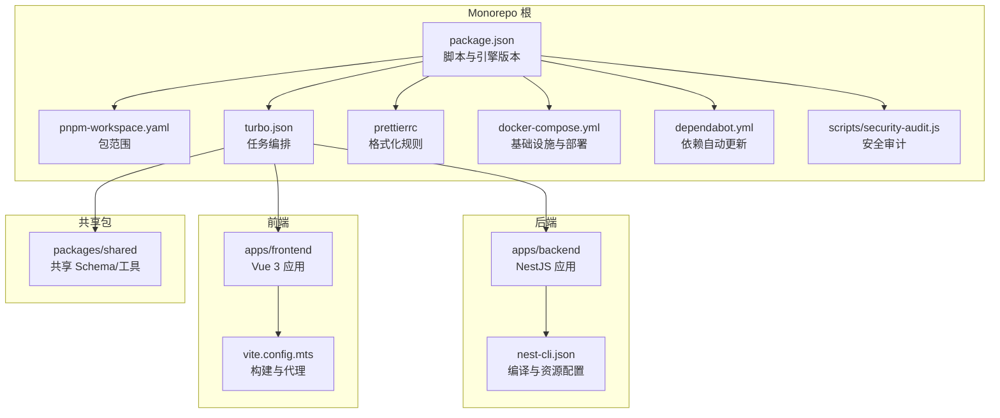
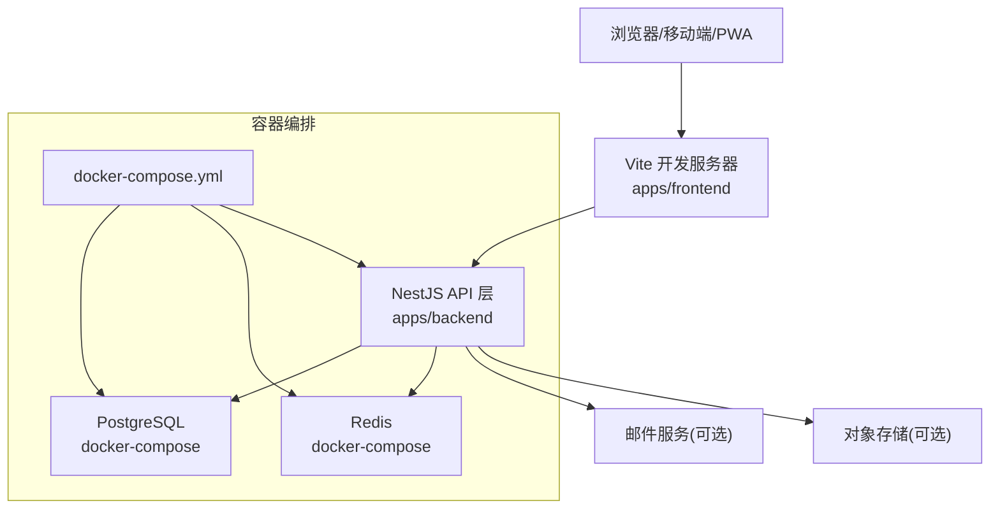
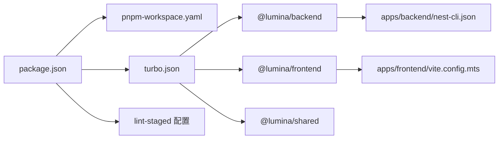

# 贡献指南

<cite>
**本文引用的文件**
- [CONTRIBUTING.md](file://CONTRIBUTING.md)
- [CODE_OF_CONDUCT.md](file://CODE_OF_CONDUCT.md)
- [SECURITY.md](file://SECURITY.md)
- [package.json](file://package.json)
- [turbo.json](file://turbo.json)
- [.prettierrc](file://.prettierrc)
- [docker-compose.yml](file://docker-compose.yml)
- [pnpm-workspace.yaml](file://pnpm-workspace.yaml)
- [.github/dependabot.yml](file://.github/dependabot.yml)
- [scripts/security-audit.js](file://scripts/security-audit.js)
- [apps/backend/nest-cli.json](file://apps/backend/nest-cli.json)
- [apps/frontend/vite.config.mts](file://apps/frontend/vite.config.mts)
</cite>

## 目录
1. [简介](#简介)
2. [项目结构](#项目结构)
3. [核心组件](#核心组件)
4. [架构总览](#架构总览)
5. [详细组件分析](#详细组件分析)
6. [依赖关系分析](#依赖关系分析)
7. [性能考量](#性能考量)
8. [故障排查指南](#故障排查指南)
9. [结论](#结论)
10. [附录](#附录)

## 简介
本指南面向所有希望参与 Lumina Todo（简思）项目的贡献者，涵盖开发环境搭建、提交流程、分支策略、代码审查标准、行为准则与安全披露流程，以及文档与翻译贡献方式。项目采用 Monorepo 架构，后端基于 NestJS，前端基于 Vue 3，共享包通过 pnpm workspace 管理，使用 Turborepo 进行任务编排。

## 项目结构
Lumina 采用 pnpm workspace 组织多包结构，核心模块如下：
- apps/backend：NestJS 后端应用，包含认证、用户、任务、邮件、缓存、定时任务、技能源、MCP 等模块。
- apps/frontend：Vue 3 前端应用，包含认证、AI 助手、任务管理等特性模块。
- apps/wails：Go 桌面壳层（仅桌面开发需要 Go）。
- packages/shared：共享的 Zod Schema 与工具函数。
- scripts：本地脚本，如安全审计、部署与关闭应用等。
- .github：CI 工作流与依赖更新配置（dependabot）。

图表来源
- [package.json:1-139](file://package.json#L1-L139)
- [pnpm-workspace.yaml:1-4](file://pnpm-workspace.yaml#L1-L4)
- [turbo.json:1-202](file://turbo.json#L1-L202)
- [.prettierrc:1-12](file://.prettierrc#L1-L12)
- [docker-compose.yml:1-240](file://docker-compose.yml#L1-L240)
- [.github/dependabot.yml:1-22](file://.github/dependabot.yml#L1-L22)
- [scripts/security-audit.js:1-53](file://scripts/security-audit.js#L1-L53)
- [apps/backend/nest-cli.json:1-11](file://apps/backend/nest-cli.json#L1-L11)
- [apps/frontend/vite.config.mts:1-185](file://apps/frontend/vite.config.mts#L1-L185)

章节来源
- [package.json:31-77](file://package.json#L31-L77)
- [pnpm-workspace.yaml:1-4](file://pnpm-workspace.yaml#L1-L4)
- [turbo.json:43-104](file://turbo.json#L43-L104)

## 核心组件
- 开发脚本与质量门禁
  - 开发：一键启动后端、前端与共享包，支持按需过滤。
  - 质量检查：lint、类型检查、测试覆盖率、格式化检查、安全审计。
  - 数据库：Prisma 生成/推送/迁移命令。
  - Docker：一键拉起 PostgreSQL、Redis、Nginx 反代与前端健康检查。
- 代码风格与格式化
  - Prettier 规则统一，husky + lint-staged 在提交前自动格式化与 ESLint 修复。
- 依赖管理与自动更新
  - pnpm workspace 管理多包；dependabot 定期扫描并创建 PR。
- 安全审计
  - 自定义安全审计脚本，过滤已忽略的告警，确保生产依赖安全。

章节来源
- [package.json:31-77](file://package.json#L31-L77)
- [.prettierrc:1-12](file://.prettierrc#L1-L12)
- [scripts/security-audit.js:1-53](file://scripts/security-audit.js#L1-L53)
- [.github/dependabot.yml:1-22](file://.github/dependabot.yml#L1-L22)

## 架构总览
Lumina 的整体运行链路包括：前端通过 Vite 开发服务器与后端 API 交互，后端通过 Prisma 访问 PostgreSQL，使用 Redis 缓存与队列，邮件与对象存储可选配置，最终通过 Nginx 反向代理对外提供服务。

图表来源
- [apps/frontend/vite.config.mts:154-174](file://apps/frontend/vite.config.mts#L154-L174)
- [apps/backend/nest-cli.json:1-11](file://apps/backend/nest-cli.json#L1-11)
- [docker-compose.yml:19-240](file://docker-compose.yml#L19-L240)

## 详细组件分析

### 开发环境搭建与首次运行
- 环境要求
  - Node.js 与 pnpm 版本要求见根目录 package.json 的 engines 字段。
  - Docker 用于基础设施（PostgreSQL、Redis）。
  - 桌面开发需要 Go（仅 apps/wails）。
- 步骤
  1) 克隆仓库并安装依赖。
  2) 复制并填写 .env 示例为 .env。
  3) 启动基础设施（compose）。
  4) 执行数据库迁移或推送。
  5) 启动开发模式（Turbo 并行）。
- 关键脚本
  - 开发：dev、dev:backend、dev:frontend、dev:all。
  - 数据库：db:generate、db:push、db:migrate、db:studio。
  - Docker：docker:build、docker:up、docker:down、docker:logs、docker:dev 系列。
  - 质量：lint、lint:strict、lint:fix、test、test:watch、test:coverage、type-check、format、format:check、security-audit。

章节来源
- [CONTRIBUTING.md:13-54](file://CONTRIBUTING.md#L13-L54)
- [package.json:31-77](file://package.json#L31-L77)
- [docker-compose.yml:19-240](file://docker-compose.yml#L19-L240)

### 提交流程与分支策略
- 分支策略
  - 基于 main 分支创建功能分支，完成开发后发起 PR。
- 提交规范
  - 使用 Conventional Commits，确保变更可追踪与自动生成变更日志。
- PR 流程
  - 描述清晰、覆盖测试、通过 lint/type-check/test。
  - 等待维护者评审并处理反馈。

章节来源
- [CONTRIBUTING.md:72-79](file://CONTRIBUTING.md#L72-L79)

### 代码审查标准
- 质量门禁
  - 必须通过：lint、类型检查、测试、格式化检查、安全审计（CI 中执行）。
- 文档与注释
  - 新增功能需补充必要注释与文档片段。
- 性能与安全性
  - 避免引入重大性能退化；注意输入校验、速率限制与敏感信息处理。

章节来源
- [CONTRIBUTING.md:55-64](file://CONTRIBUTING.md#L55-L64)
- [package.json:46-51](file://package.json#L46-L51)
- [scripts/security-audit.js:1-53](file://scripts/security-audit.js#L1-L53)

### 行为准则与沟通礼仪
- 遵守 Contributor Covenant 行为准则，倡导尊重、包容与专业。
- 举报渠道：yunmucoder@163.com。
- 影响等级与处置流程详见行为准则文档。

章节来源
- [CODE_OF_CONDUCT.md:1-79](file://CODE_OF_CONDUCT.md#L1-L79)

### 安全漏洞报告与负责任披露
- 支持版本与范围：参见安全策略。
- 披露方式：优先使用 GitHub 私密漏洞上报；或邮件联系维护者。
- 响应时间：48 小时内确认收到报告，并尽快协同修复。
- 最佳实践：保持系统更新、强密码轮换、避免将数据库/Redis 暴露公网。

章节来源
- [SECURITY.md:1-40](file://SECURITY.md#L1-L40)

### 文档贡献与翻译
- 文档与翻译位置
  - i18n 词条位于 apps/frontend/src/i18n/locales/{语言}/。
  - 后端国际化位于 apps/backend/src/i18n/{语言}/。
- 贡献方式
  - 新增/修改词条时，确保前后端对应语言目录同步。
  - 保持键名一致，避免硬编码文本，统一通过 i18n 注入。

章节来源
- [apps/frontend/vite.config.mts:148-153](file://apps/frontend/vite.config.mts#L148-L153)

### 社区建设与沟通
- 问题与讨论：通过 GitHub Issues/PR 讨论。
- 依赖更新：dependabot 按月自动创建 PR，建议及时审阅与合并。
- CI 与发布：结合脚本与 compose 文件进行本地验证与部署。

章节来源
- [.github/dependabot.yml:1-22](file://.github/dependabot.yml#L1-L22)
- [docker-compose.yml:19-240](file://docker-compose.yml#L19-L240)

## 依赖关系分析
- 包管理与任务编排
  - pnpm workspace 定义包范围，turbo.json 明确各包任务输入输出与缓存策略。
  - package.json 定义全局脚本与 lint-staged 配置，husky 在提交前触发。
- 前端构建与别名
  - Vite 配置中设置 @ 别名与 @lumina/shared 别名，便于跨包引用。
- 后端编译与资源
  - nest-cli.json 指定源码目录与 i18n 资源打包。

图表来源
- [package.json:111-137](file://package.json#L111-L137)
- [pnpm-workspace.yaml:1-4](file://pnpm-workspace.yaml#L1-4)
- [turbo.json:1-202](file://turbo.json#L1-L202)
- [apps/frontend/vite.config.mts:148-153](file://apps/frontend/vite.config.mts#L148-L153)
- [apps/backend/nest-cli.json:1-11](file://apps/backend/nest-cli.json#L1-L11)

章节来源
- [package.json:94-110](file://package.json#L94-L110)
- [turbo.json:1-202](file://turbo.json#L1-L202)

## 性能考量
- 构建优化
  - Vite 侧启用 gzip/brotli 压缩与手动分包策略，降低首屏体积。
  - 前端构建产物警告阈值调优，避免大体积包影响加载。
- 运行时优化
  - Docker 中 PostgreSQL/Redis 参数已做基础优化，建议在生产环境根据负载调整。
  - 后端使用 Redis 缓存与限流，注意合理配置阈值与过期策略。

章节来源
- [apps/frontend/vite.config.mts:86-103](file://apps/frontend/vite.config.mts#L86-L103)
- [apps/frontend/vite.config.mts:175-182](file://apps/frontend/vite.config.mts#L175-L182)
- [docker-compose.yml:28-35](file://docker-compose.yml#L28-L35)
- [docker-compose.yml:60-67](file://docker-compose.yml#L60-L67)

## 故障排查指南
- 环境变量缺失
  - .env 未正确复制或字段为空会导致数据库/缓存/邮件初始化失败。
- 数据库异常
  - 使用 db:push 或 db:migrate 同步模型；若 schema 不一致，先清理再重建。
- Docker 服务不可用
  - 检查 compose 日志；确认端口占用与网络连通性。
- 提交被拒绝
  - lint/类型检查/测试/格式化/安全审计任一失败都会阻塞 CI，按提示修复。
- 安全审计失败
  - 审计脚本会过滤已忽略项；若存在真实漏洞，按提示升级依赖或回滚。

章节来源
- [CONTRIBUTING.md:37-54](file://CONTRIBUTING.md#L37-L54)
- [package.json:51-51](file://package.json#L51-L51)
- [scripts/security-audit.js:1-53](file://scripts/security-audit.js#L1-L53)

## 结论
本指南提供了从环境搭建到代码贡献、从行为准则到安全披露的完整路径。请严格遵循质量门禁与分支策略，保持良好的沟通礼仪，共同维护开放、包容、专业的社区生态。

## 附录
- 许可证
  - 贡献默认以 AGPL-3.0 许可证开源，详情见贡献指南末尾说明。

章节来源
- [CONTRIBUTING.md:80-87](file://CONTRIBUTING.md#L80-L87)