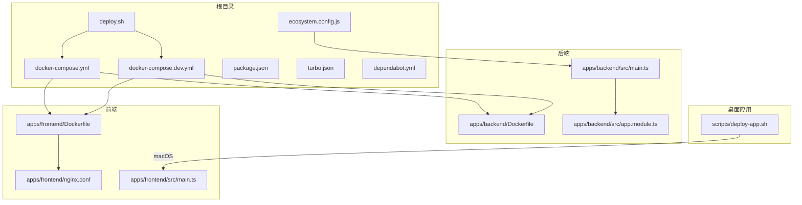
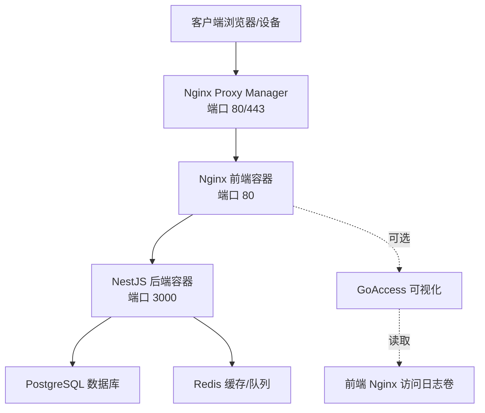
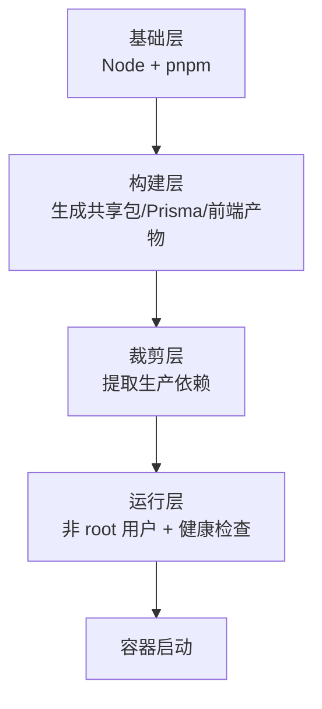
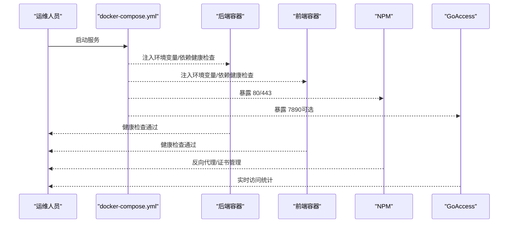
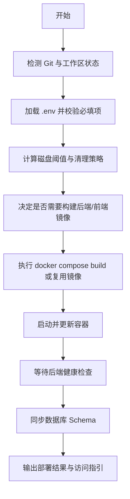
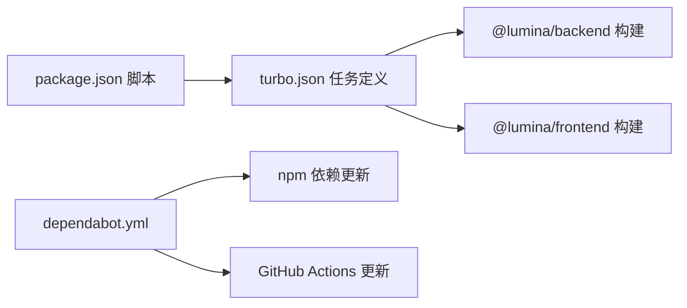

# 部署指南

<cite>
**本文引用的文件**
- [docker-compose.yml](file://docker-compose.yml)
- [docker-compose.dev.yml](file://docker-compose.dev.yml)
- [apps/backend/Dockerfile](file://apps/backend/Dockerfile)
- [apps/frontend/Dockerfile](file://apps/frontend/Dockerfile)
- [deploy.sh](file://deploy.sh)
- [scripts/deploy-app.sh](file://scripts/deploy-app.sh)
- [ecosystem.config.js](file://ecosystem.config.js)
- [apps/frontend/nginx.conf](file://apps/frontend/nginx.conf)
- [apps/backend/src/app.module.ts](file://apps/backend/src/app.module.ts)
- [apps/backend/src/main.ts](file://apps/backend/src/main.ts)
- [apps/frontend/src/main.ts](file://apps/frontend/src/main.ts)
- [.github/dependabot.yml](file://.github/dependabot.yml)
- [package.json](file://package.json)
- [turbo.json](file://turbo.json)
</cite>

## 目录
1. [简介](#简介)
2. [项目结构](#项目结构)
3. [核心组件](#核心组件)
4. [架构总览](#架构总览)
5. [详细组件分析](#详细组件分析)
6. [依赖分析](#依赖分析)
7. [性能考虑](#性能考虑)
8. [故障排除指南](#故障排除指南)
9. [结论](#结论)
10. [附录](#附录)

## 简介
本指南面向运维与开发团队，提供 Lumina 项目的完整部署方案，涵盖：
- Docker 容器化与镜像构建策略
- 生产与开发环境的 Compose 配置
- 反向代理与负载均衡思路
- 环境变量与密钥管理最佳实践
- CI/CD 流水线与自动化部署流程
- 监控告警、日志与性能指标
- 域名、SSL 与 CDN 加速
- 备份恢复与灾难恢复
- 成本优化与安全加固

## 项目结构
Lumina 采用 Monorepo 结构，包含后端（NestJS）、前端（Vue + Vite）、共享包、Wails 桌面应用以及脚本工具。部署相关的关键文件集中在根目录与各应用目录。

图表来源
- [docker-compose.yml:1-237](file://docker-compose.yml#L1-L237)
- [docker-compose.dev.yml:1-192](file://docker-compose.dev.yml#L1-L192)
- [apps/backend/Dockerfile:1-103](file://apps/backend/Dockerfile#L1-L103)
- [apps/frontend/Dockerfile:1-94](file://apps/frontend/Dockerfile#L1-L94)
- [apps/frontend/nginx.conf:1-203](file://apps/frontend/nginx.conf#L1-L203)
- [apps/backend/src/main.ts:1-201](file://apps/backend/src/main.ts#L1-L201)
- [apps/backend/src/app.module.ts:1-175](file://apps/backend/src/app.module.ts#L1-L175)
- [deploy.sh:1-481](file://deploy.sh#L1-L481)
- [ecosystem.config.js:1-33](file://ecosystem.config.js#L1-L33)
- [scripts/deploy-app.sh:1-66](file://scripts/deploy-app.sh#L1-L66)

章节来源
- [docker-compose.yml:1-237](file://docker-compose.yml#L1-L237)
- [docker-compose.dev.yml:1-192](file://docker-compose.dev.yml#L1-L192)
- [apps/backend/Dockerfile:1-103](file://apps/backend/Dockerfile#L1-L103)
- [apps/frontend/Dockerfile:1-94](file://apps/frontend/Dockerfile#L1-L94)
- [apps/frontend/nginx.conf:1-203](file://apps/frontend/nginx.conf#L1-L203)
- [apps/backend/src/app.module.ts:1-175](file://apps/backend/src/app.module.ts#L1-L175)
- [apps/backend/src/main.ts:1-201](file://apps/backend/src/main.ts#L1-L201)
- [apps/frontend/src/main.ts:1-138](file://apps/frontend/src/main.ts#L1-L138)
- [deploy.sh:1-481](file://deploy.sh#L1-L481)
- [ecosystem.config.js:1-33](file://ecosystem.config.js#L1-L33)
- [scripts/deploy-app.sh:1-66](file://scripts/deploy-app.sh#L1-L66)
- [.github/dependabot.yml:1-22](file://.github/dependabot.yml#L1-L22)
- [package.json:1-133](file://package.json#L1-L133)
- [turbo.json:1-186](file://turbo.json#L1-L186)

## 核心组件
- 数据库：PostgreSQL（生产与开发均使用官方镜像）
- 缓存与队列：Redis（持久化 AOF，内存上限与淘汰策略）
- 后端：NestJS（Fastify 适配器，Pino 日志，BullMQ 队列，Throttler 速率限制）
- 前端：Nginx + Vue 应用（静态资源与 API 代理）
- 反向代理与证书：Nginx Proxy Manager（NPM）
- 日志与可视化：GoAccess（基于前端 Nginx 访问日志）
- 桌面应用：Wails（macOS 部署脚本）

章节来源
- [docker-compose.yml:23-50](file://docker-compose.yml#L23-L50)
- [docker-compose.yml:55-69](file://docker-compose.yml#L55-L69)
- [apps/backend/src/app.module.ts:28-161](file://apps/backend/src/app.module.ts#L28-L161)
- [apps/backend/src/main.ts:34-195](file://apps/backend/src/main.ts#L34-L195)
- [apps/frontend/nginx.conf:1-203](file://apps/frontend/nginx.conf#L1-L203)
- [docker-compose.yml:209-224](file://docker-compose.yml#L209-L224)
- [docker-compose.yml:177-204](file://docker-compose.yml#L177-L204)
- [scripts/deploy-app.sh:1-66](file://scripts/deploy-app.sh#L1-L66)

## 架构总览
Lumina 的生产部署由 Compose 编排，后端与前端分别构建为独立镜像，通过 NPM 实现 HTTPS 与反向代理，Redis 提供缓存与队列，PostgreSQL 存储业务数据。GoAccess 可选地对前端访问日志进行实时可视化。

图表来源
- [docker-compose.yml:209-224](file://docker-compose.yml#L209-L224)
- [docker-compose.yml:142-172](file://docker-compose.yml#L142-L172)
- [docker-compose.yml:74-137](file://docker-compose.yml#L74-L137)
- [docker-compose.yml:23-50](file://docker-compose.yml#L23-L50)
- [docker-compose.yml:55-69](file://docker-compose.yml#L55-L69)
- [docker-compose.yml:177-204](file://docker-compose.yml#L177-L204)
- [apps/frontend/nginx.conf:128-142](file://apps/frontend/nginx.conf#L128-L142)

## 详细组件分析

### Docker 镜像与构建策略
- 后端镜像采用多阶段构建：基础层安装 pnpm，构建层生成共享包与 Prisma 客户端，裁剪层提取生产依赖，最终运行层以非 root 用户运行。
- 前端镜像同样多阶段：构建共享包与前端产物，最终以 Nginx 运行静态资源，配置 Gzip、缓存与安全头。
- 运行时健康检查：后端与前端均配置健康检查，确保容器就绪后再对外提供服务。

图表来源
- [apps/backend/Dockerfile:25-58](file://apps/backend/Dockerfile#L25-L58)
- [apps/backend/Dockerfile:63-102](file://apps/backend/Dockerfile#L63-L102)
- [apps/frontend/Dockerfile:34-45](file://apps/frontend/Dockerfile#L34-L45)
- [apps/frontend/Dockerfile:50-93](file://apps/frontend/Dockerfile#L50-L93)

章节来源
- [apps/backend/Dockerfile:1-103](file://apps/backend/Dockerfile#L1-L103)
- [apps/frontend/Dockerfile:1-94](file://apps/frontend/Dockerfile#L1-L94)

### 生产环境 Compose 配置
- 服务编排：postgres、redis、backend、frontend、npm、goaccess。
- 环境变量：数据库、Redis、JWT、CORS、邮件与对象存储等参数通过环境变量注入。
- 健康检查：数据库与 Redis 使用内置命令探测，后端与前端使用 HTTP 探针。
- 网络与卷：使用自定义桥接网络与命名卷，保障数据持久化与服务间通信。

图表来源
- [docker-compose.yml:74-137](file://docker-compose.yml#L74-L137)
- [docker-compose.yml:142-172](file://docker-compose.yml#L142-L172)
- [docker-compose.yml:209-224](file://docker-compose.yml#L209-L224)
- [docker-compose.yml:177-204](file://docker-compose.yml#L177-L204)

章节来源
- [docker-compose.yml:1-237](file://docker-compose.yml#L1-L237)

### 开发环境 Compose 配置
- 支持代码热更新：挂载项目目录与共享依赖卷，后端与前端分别启动开发服务器。
- 环境变量：默认值便于本地快速启动，生产环境务必覆盖。
- 端口映射：后端 3000、前端 5173、NPM 管理后台 81。

章节来源
- [docker-compose.dev.yml:1-192](file://docker-compose.dev.yml#L1-L192)

### 自动化部署脚本
- deploy.sh：Git 拉取、环境校验、镜像构建决策、Docker 清理策略、Schema 同步、健康检查等待与部署后提示。
- 脚本特性：磁盘阈值控制、镜像版本一致性检查、增量构建判断、日志与状态输出。

图表来源
- [deploy.sh:185-481](file://deploy.sh#L185-L481)

章节来源
- [deploy.sh:1-481](file://deploy.sh#L1-L481)

### PM2 进程管理（Docker 环境）
- ecosystem.config.js：在 Docker 环境下以单实例运行后端，日志输出至标准流，便于容器日志聚合。

章节来源
- [ecosystem.config.js:1-33](file://ecosystem.config.js#L1-L33)

### 前端 Nginx 配置要点
- 性能：Gzip 预压缩、sendfile/tcp_nopush、文件缓存。
- 安全：X-Frame-Options、X-Content-Type-Options、X-XSS-Protection、Referrer-Policy、Content-Security-Policy、Permissions-Policy。
- 路由：Vue Router history 模式回退、API 代理到后端、WebSocket 代理与超时配置。
- 缓存：静态资源一年缓存、禁止访问隐藏与敏感文件。

章节来源
- [apps/frontend/nginx.conf:1-203](file://apps/frontend/nginx.conf#L1-L203)

### 后端安全与中间件
- CORS：基于环境变量灵活配置，支持多源与凭据。
- Helmet：内容安全策略、跨源嵌入策略等安全头。
- CSRF 防护：拦截缺失 X-Requested-With 的非 GET 请求。
- 压缩与上传：Gzip 压缩与上传大小/数量限制。
- 全局管道与拦截器：Zod 验证、统一响应格式、XSS 清理。

章节来源
- [apps/backend/src/main.ts:48-170](file://apps/backend/src/main.ts#L48-L170)
- [apps/backend/src/app.module.ts:117-138](file://apps/backend/src/app.module.ts#L117-L138)

### 桌面应用部署（macOS）
- deploy-app.sh：将 Wails 构建产物复制到 /Applications 并启动，支持关闭旧版本与权限检查。

章节来源
- [scripts/deploy-app.sh:1-66](file://scripts/deploy-app.sh#L1-L66)

## 依赖分析
- 包管理与任务编排：Turbo 管理 monorepo 构建与测试，package.json 定义脚本与引擎要求。
- 依赖更新：Dependabot 定期扫描 npm 与 GitHub Actions 依赖，按组策略合并更新。

图表来源
- [package.json:31-76](file://package.json#L31-L76)
- [turbo.json:40-101](file://turbo.json#L40-L101)
- [.github/dependabot.yml:1-22](file://.github/dependabot.yml#L1-L22)

章节来源
- [package.json:1-133](file://package.json#L1-L133)
- [turbo.json:1-186](file://turbo.json#L1-L186)
- [.github/dependabot.yml:1-22](file://.github/dependabot.yml#L1-L22)

## 性能考虑
- 健康检查与启动缓冲：后端与前端健康检查配置了启动缓冲时间，避免早期探针失败导致重启风暴。
- 缓存与压缩：前端 Nginx 启用 Gzip 与静态资源长期缓存；后端启用 Fastify 压缩。
- 数据库与 Redis 参数：PostgreSQL 与 Redis 在 Compose 中设置了连接数、内存与淘汰策略，建议结合实际负载调优。
- Docker 清理策略：部署脚本内置磁盘阈值与清理逻辑，降低镜像膨胀对宿主机的影响。

章节来源
- [docker-compose.yml:28-35](file://docker-compose.yml#L28-L35)
- [docker-compose.yml:60-67](file://docker-compose.yml#L60-L67)
- [apps/frontend/nginx.conf:11-72](file://apps/frontend/nginx.conf#L11-L72)
- [apps/backend/src/main.ts:101-104](file://apps/backend/src/main.ts#L101-L104)
- [deploy.sh:317-437](file://deploy.sh#L317-L437)

## 故障排除指南
- 磁盘空间不足：部署脚本会在达到阈值时自动清理镜像与构建缓存，必要时可开启激进清理。
- 容器未就绪：检查后端健康检查日志，确认数据库与 Redis 已健康；查看 Compose 日志定位问题。
- 端口冲突：确认宿主机端口映射与防火墙规则，NPM 默认监听 80/443，管理后台 81。
- 环境变量缺失：确保 .env 中包含数据库密码、Redis 密码、JWT 密钥与 CORS 来源等必填项。
- 前端 Chunk 加载失败：前端已内置动态导入失败处理，若频繁出现需检查部署版本与缓存策略。

章节来源
- [deploy.sh:15-54](file://deploy.sh#L15-L54)
- [deploy.sh:440-446](file://deploy.sh#L440-L446)
- [docker-compose.yml:213-217](file://docker-compose.yml#L213-L217)
- [apps/frontend/src/main.ts:58-79](file://apps/frontend/src/main.ts#L58-L79)

## 结论
Lumina 提供了从开发到生产的完整容器化部署方案。通过 Compose 编排、多阶段构建与严格的环境变量管理，可在不同环境中稳定运行。建议在生产中结合 NPM 的 HTTPS 与反向代理、GoAccess 的访问统计、完善的监控与日志体系，持续优化性能与安全。

## 附录

### 环境变量清单（生产）
- 数据库：POSTGRES_USER、POSTGRES_PASSWORD、POSTGRES_DB、DATABASE_URL
- 缓存与队列：REDIS_HOST、REDIS_PORT、REDIS_PASSWORD、REDIS_DB
- 安全与认证：JWT_SECRET、JWT_REFRESH_SECRET、JWT_ACCESS_EXPIRES_IN、JWT_REFRESH_EXPIRES_IN、CORS_ORIGIN
- 日志与限流：LOG_LEVEL、THROTTLE_SHORT_TTL/LIMIT、THROTTLE_MEDIUM_TTL/LIMIT、THROTTLE_LONG_TTL/LIMIT
- 邮件与存储：MAIL_HOST、MAIL_PORT、MAIL_USER、MAIL_PASSWORD、S3_*（桶、区域、密钥、端点）
- 其他：PORT、NODE_ENV、UPLOAD_MAX_SIZE、UPLOAD_MAX_FILES

章节来源
- [docker-compose.yml:93-125](file://docker-compose.yml#L93-L125)
- [apps/backend/src/app.module.ts:117-138](file://apps/backend/src/app.module.ts#L117-L138)

### CI/CD 与自动化
- 依赖更新：Dependabot 定期扫描并创建 PR，建议开启自动合并策略。
- 本地脚本：package.json 中提供 docker:build、docker:up、docker:down、docker:logs 等常用命令。
- 部署脚本：deploy.sh 支持 Git 拉取、增量构建、Schema 同步与健康检查等待。

章节来源
- [.github/dependabot.yml:1-22](file://.github/dependabot.yml#L1-L22)
- [package.json:57-76](file://package.json#L57-L76)
- [deploy.sh:191-239](file://deploy.sh#L191-L239)

### 监控与日志
- 后端日志：Pino 输出，生产环境为 JSON，便于集中采集；Docker 环境下输出到标准流。
- 前端日志：Nginx 访问日志，可接入 GoAccess 实时可视化。
- 健康检查：后端与前端均配置健康探针，便于编排与外部监控系统集成。

章节来源
- [apps/backend/src/app.module.ts:34-88](file://apps/backend/src/app.module.ts#L34-L88)
- [apps/frontend/nginx.conf:108-113](file://apps/frontend/nginx.conf#L108-L113)
- [docker-compose.yml:126-135](file://docker-compose.yml#L126-L135)
- [docker-compose.yml:161-167](file://docker-compose.yml#L161-L167)
- [docker-compose.yml:177-194](file://docker-compose.yml#L177-L194)

### 域名、SSL 与 CDN
- 域名与 SSL：通过 NPM 管理证书申请与续期，建议将管理后台绑定到内网或限制来源 IP。
- CDN：静态资源由前端 Nginx 提供，可结合 CDN 加速与缓存策略提升全球访问性能。

章节来源
- [docker-compose.yml:209-224](file://docker-compose.yml#L209-L224)
- [apps/frontend/nginx.conf:182-187](file://apps/frontend/nginx.conf#L182-L187)

### 备份与灾难恢复
- 数据持久化：PostgreSQL 与 Redis 使用命名卷，建议定期备份卷数据。
- Schema 管理：部署脚本在有迁移文件时执行迁移，在无迁移时执行 db push，确保生产 Schema 与代码一致。
- 恢复演练：制定卷快照与离线备份策略，验证恢复流程与数据一致性。

章节来源
- [docker-compose.yml:231-236](file://docker-compose.yml#L231-L236)
- [deploy.sh:448-452](file://deploy.sh#L448-L452)

### 成本优化与安全加固
- 成本优化：合理设置 Redis 内存上限与淘汰策略；启用镜像与构建缓存清理；按需扩展副本数。
- 安全加固：使用强密钥与轮换；限制 NPM 管理后台访问；启用 HTTPS 与安全头；定期扫描依赖漏洞。

章节来源
- [docker-compose.yml:60-67](file://docker-compose.yml#L60-L67)
- [apps/frontend/nginx.conf:74-96](file://apps/frontend/nginx.conf#L74-L96)
- [apps/backend/src/main.ts:84-97](file://apps/backend/src/main.ts#L84-L97)