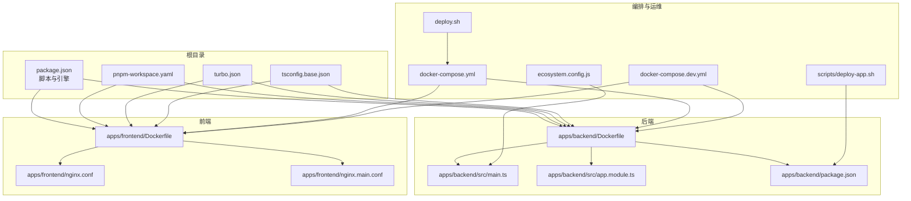
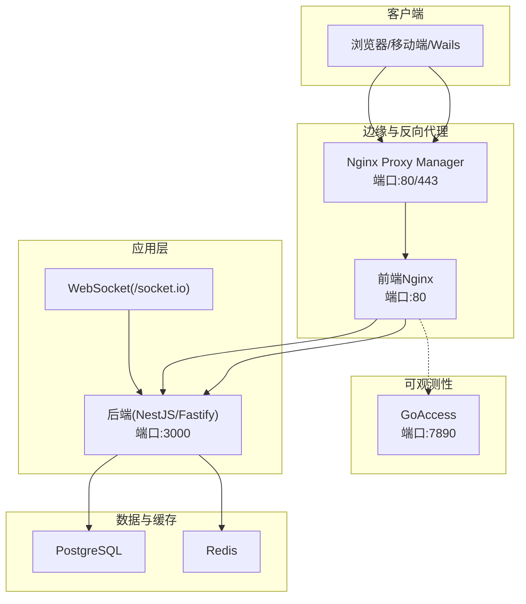
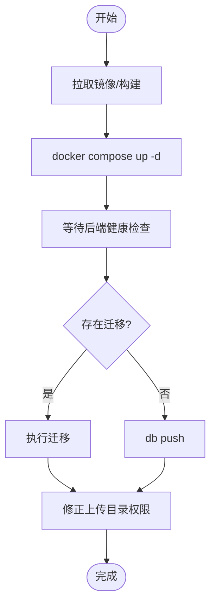
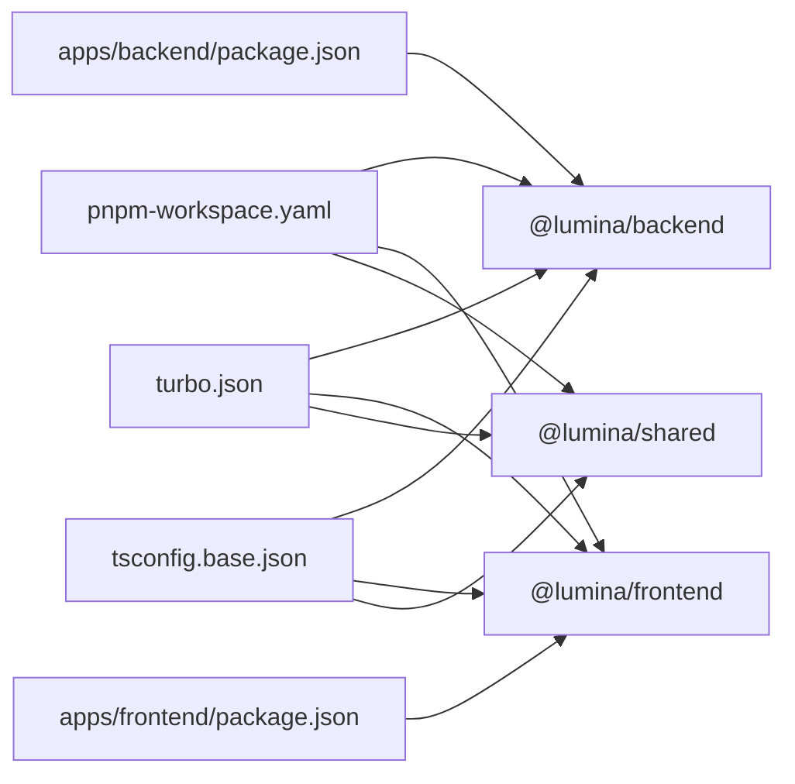

# 部署指南

<cite>
**本文引用的文件**
- [apps/backend/Dockerfile](file://apps/backend/Dockerfile)
- [apps/frontend/Dockerfile](file://apps/frontend/Dockerfile)
- [docker-compose.yml](file://docker-compose.yml)
- [docker-compose.dev.yml](file://docker-compose.dev.yml)
- [deploy.sh](file://deploy.sh)
- [scripts/deploy-app.sh](file://scripts/deploy-app.sh)
- [ecosystem.config.js](file://ecosystem.config.js)
- [apps/frontend/nginx.conf](file://apps/frontend/nginx.conf)
- [apps/frontend/nginx.main.conf](file://apps/frontend/nginx.main.conf)
- [apps/backend/src/main.ts](file://apps/backend/src/main.ts)
- [apps/backend/src/app.module.ts](file://apps/backend/src/app.module.ts)
- [apps/backend/package.json](file://apps/backend/package.json)
- [.github/dependabot.yml](file://.github/dependabot.yml)
- [turbo.json](file://turbo.json)
- [pnpm-workspace.yaml](file://pnpm-workspace.yaml)
- [tsconfig.base.json](file://tsconfig.base.json)
- [package.json](file://package.json)
</cite>

## 目录

1. [简介](#简介)
2. [项目结构](#项目结构)
3. [核心组件](#核心组件)
4. [架构总览](#架构总览)
5. [详细组件分析](#详细组件分析)
6. [依赖分析](#依赖分析)
7. [性能考虑](#性能考虑)
8. [故障排除指南](#故障排除指南)
9. [结论](#结论)
10. [附录](#附录)

## 简介

本指南面向Lumina Todo项目的生产部署，提供多套部署方案：Docker容器化部署、Kubernetes集群部署思路、传统服务器部署与Wails原生应用部署。内容涵盖环境变量配置、数据库与缓存连接、第三方服务集成（邮件、对象存储）、负载均衡与反向代理、SSL证书、监控与日志、性能优化、CI/CD流水线与自动化部署、备份恢复与高可用设计、以及生产安全加固与合规检查清单。

## 项目结构

Lumina Todo采用Monorepo结构，后端基于NestJS/Fastify，前端基于Vue/Vite，共享包通过pnpm workspace管理，使用Turbo进行增量构建与缓存。部署相关的关键文件集中在根目录与各应用目录的Dockerfile、Compose配置、Nginx配置与启动脚本中。

**图表来源**

- [package.json:31-76](file://package.json#L31-L76)
- [pnpm-workspace.yaml:1-4](file://pnpm-workspace.yaml#L1-L4)
- [turbo.json:1-202](file://turbo.json#L1-L202)
- [tsconfig.base.json:1-17](file://tsconfig.base.json#L1-L17)
- [apps/backend/Dockerfile:1-103](file://apps/backend/Dockerfile#L1-L103)
- [apps/frontend/Dockerfile:1-94](file://apps/frontend/Dockerfile#L1-L94)
- [apps/backend/src/main.ts:1-211](file://apps/backend/src/main.ts#L1-L211)
- [apps/backend/src/app.module.ts:1-160](file://apps/backend/src/app.module.ts#L1-L160)
- [apps/frontend/nginx.conf:1-203](file://apps/frontend/nginx.conf#L1-L203)
- [apps/frontend/nginx.main.conf:1-51](file://apps/frontend/nginx.main.conf#L1-L51)
- [docker-compose.yml:1-240](file://docker-compose.yml#L1-L240)
- [docker-compose.dev.yml:1-192](file://docker-compose.dev.yml#L1-L192)
- [deploy.sh:1-487](file://deploy.sh#L1-L487)
- [ecosystem.config.js:1-33](file://ecosystem.config.js#L1-L33)
- [scripts/deploy-app.sh:1-66](file://scripts/deploy-app.sh#L1-L66)

**章节来源**

- [package.json:31-76](file://package.json#L31-L76)
- [pnpm-workspace.yaml:1-4](file://pnpm-workspace.yaml#L1-L4)
- [turbo.json:1-202](file://turbo.json#L1-L202)
- [tsconfig.base.json:1-17](file://tsconfig.base.json#L1-L17)

## 核心组件

- 后端服务（NestJS/Fastify）
  - 安全中间件：Helmet、CSRF/XSS防护、Gzip压缩、静态资源托管
  - 全局管道与拦截器：Zod验证、统一响应、XSS清理
  - 速率限制：基于Redis的分布式存储
  - 健康检查：/api/health系列端点
  - 日志：Pino（生产JSON，开发pino-pretty）
- 前端服务（Nginx静态）
  - 压缩与缓存：Gzip、静态资源1年缓存
  - 安全头：X-Frame-Options、X-Content-Type-Options、Referrer-Policy、Content-Security-Policy、Permissions-Policy
  - 代理：/api -> backend:3000，/socket.io -> backend:3000（WebSocket）
- 数据与缓存
  - PostgreSQL：Prisma客户端与迁移
  - Redis：队列、缓存、速率限制
- 运维工具
  - Nginx Proxy Manager：反向代理与Let’s Encrypt证书
  - GoAccess：访问日志可视化
  - PM2（可选）：进程守护（非Docker场景）

**章节来源**

- [apps/backend/src/main.ts:48-205](file://apps/backend/src/main.ts#L48-L205)
- [apps/backend/src/app.module.ts:28-159](file://apps/backend/src/app.module.ts#L28-L159)
- [apps/frontend/nginx.conf:11-97](file://apps/frontend/nginx.conf#L11-L97)
- [apps/frontend/nginx.main.conf:15-50](file://apps/frontend/nginx.main.conf#L15-L50)
- [docker-compose.yml:23-240](file://docker-compose.yml#L23-L240)

## 架构总览

Lumina Todo的生产部署由Compose编排，包含PostgreSQL、Redis、后端、前端Nginx、NPM反代与证书、GoAccess日志可视化。后端在Docker中监听0.0.0.0，前端Nginx负责静态资源与API代理，NPM提供HTTPS与反代。

**图表来源**

- [docker-compose.yml:210-227](file://docker-compose.yml#L210-L227)
- [apps/frontend/nginx.conf:127-181](file://apps/frontend/nginx.conf#L127-L181)
- [apps/backend/src/main.ts:192-198](file://apps/backend/src/main.ts#L192-L198)

## 详细组件分析

### Docker容器化部署

- 后端镜像
  - 多阶段构建：基础、构建、裁剪、最终生产镜像
  - 非root用户运行，健康检查，暴露3000端口，设置IS_DOCKER=true
  - Prisma客户端在生产环境重新生成
- 前端镜像
  - 基于nginx:alpine，非root用户，移除默认配置与IPv6脚本
  - 复用构建产物，健康检查，暴露80端口
- Compose编排
  - PostgreSQL：共享缓冲、有效缓存、最大连接数、健康检查
  - Redis：AOF持久化、内存上限与淘汰策略、密码认证
  - 后端：依赖健康检查、环境变量（数据库URL、Redis、JWT、CORS、邮件、S3、速率限制、日志级别）
  - 前端：只读文件系统、tmpfs、健康检查、依赖后端
  - GoAccess：挂载前端日志卷，输出HTML报告
  - NPM：端口映射、证书卷、依赖前端

**图表来源**

- [deploy.sh:439-466](file://deploy.sh#L439-L466)
- [docker-compose.yml:84-138](file://docker-compose.yml#L84-L138)

**章节来源**

- [apps/backend/Dockerfile:1-103](file://apps/backend/Dockerfile#L1-L103)
- [apps/frontend/Dockerfile:1-94](file://apps/frontend/Dockerfile#L1-L94)
- [docker-compose.yml:19-240](file://docker-compose.yml#L19-L240)
- [deploy.sh:1-487](file://deploy.sh#L1-L487)

### Kubernetes集群部署（思路）

- 资源类型
  - Deployment：后端（副本数、探针、环境变量）、前端（副本数、探针）
  - Service：ClusterIP/LoadBalancer（后端3000、前端80）
  - ConfigMap：环境变量（数据库URL、Redis、JWT、CORS、日志级别）
  - Secret：POSTGRES_PASSWORD、REDIS_PASSWORD、JWT_SECRET、JWT_REFRESH_SECRET
  - PersistentVolumeClaim：PostgreSQL数据、Redis AOF、后端上传目录
  - Ingress/NLB：反向代理与TLS终止（对接NPM或Cert-Manager）
- 策略
  - PodDisruptionBudget：保证可用性
  - HPA：CPU/自定义指标扩缩容
  - InitContainer：数据库迁移（或Job）
  - Sidecar：日志收集（Fluent Bit/Vector）、健康检查（kube-probe）
- 证书
  - cert-manager + ACME（Let’s Encrypt）或自管CA
  - Ingress TLS或Service Mesh（Istio/Linkerd）终止TLS

[本节为概念性部署思路，不直接分析具体文件，故无“章节来源”]

### 传统服务器部署

- 运行时要求
  - Node.js 20.19+、pnpm 9.15+、PostgreSQL 16+、Redis 7+
- 部署步骤
  - 安装依赖与构建：pnpm install、pnpm build
  - 数据库迁移：pnpm db:migrate 或 db:push
  - 启动后端：pm2（参考ecosystem.config.js）或systemd
  - 启动前端：Nginx（参考nginx.conf/nginx.main.conf）
  - 反向代理：NPM或自建Nginx/HAProxy
- 监控与日志
  - PM2日志轮转、系统日志聚合（rsyslog/Fluent Bit）
  - GoAccess（可选）或ELK/EFK

**章节来源**

- [ecosystem.config.js:1-33](file://ecosystem.config.js#L1-L33)
- [apps/frontend/nginx.conf:1-203](file://apps/frontend/nginx.conf#L1-L203)
- [apps/frontend/nginx.main.conf:1-51](file://apps/frontend/nginx.main.conf#L1-L51)

### Wails原生应用部署（macOS）

- 构建与安装
  - pnpm wails:build 生成.app
  - pnpm wails:deploy 自动关闭旧版本并安装新版本至/Applications
- 注意
  - 仅支持macOS；Windows/Linux需使用Web版或另行打包

**章节来源**

- [scripts/deploy-app.sh:1-66](file://scripts/deploy-app.sh#L1-L66)
- [package.json:70-76](file://package.json#L70-L76)

### 环境变量配置

- 必填项（生产）
  - POSTGRES_PASSWORD、REDIS_PASSWORD、JWT_SECRET、JWT_REFRESH_SECRET、CORS_ORIGIN
- 常用项
  - DATABASE_URL（PostgreSQL）、REDIS_HOST/PORT/PASSWORD/DB
  - JWT_ACCESS_EXPIRES_IN/JWT_REFRESH_EXPIRES_IN、LOG_LEVEL
  - THROTTLE_SHORT_TTL/LIMIT、THROTTLE_MEDIUM_TTL/LIMIT、THROTTLE_LONG_TTL/LIMIT
  - MAIL*HOST/PORT/USER/PASSWORD、S3*\*（桶、区域、密钥、端点）
  - VITE_PROXY_TARGET（开发模式下后端代理）
- 示例与加载
  - .env示例文件用于初始复制；部署脚本会校验必填项并加载

**章节来源**

- [deploy.sh:266-290](file://deploy.sh#L266-L290)
- [docker-compose.yml:93-125](file://docker-compose.yml#L93-L125)
- [docker-compose.dev.yml:77-118](file://docker-compose.dev.yml#L77-L118)

### 数据库连接设置

- 连接字符串
  - DATABASE_URL由Compose注入，包含用户名、密码、主机、端口、数据库名与模式
- 初始化
  - 迁移：存在迁移目录时执行迁移；否则执行db push
- 性能参数
  - PostgreSQL启动参数包含shared_buffers、effective_cache_size、work_mem、max_connections等

**章节来源**

- [docker-compose.yml:96-35](file://docker-compose.yml#L96-L35)
- [deploy.sh:448-452](file://deploy.sh#L448-L452)

### 第三方服务集成

- 邮件
  - SMTP配置：MAIL_HOST/PORT/USER/PASSWORD；后端使用NestJS Mail模块
- 对象存储（S3兼容）
  - S3_BUCKET/REGION/ACCESS_KEY_ID/SECRET_ACCESS_KEY/ENDPOINT
  - 后端使用AWS SDK进行上传与签名
- WebSocket与事件
  - Socket.IO用于实时通信，Nginx配置升级头与禁用缓冲

**章节来源**

- [apps/backend/src/app.module.ts:13-19](file://apps/backend/src/app.module.ts#L13-L19)
- [apps/backend/package.json:32-33](file://apps/backend/package.json#L32-L33)
- [apps/frontend/nginx.conf:144-181](file://apps/frontend/nginx.conf#L144-L181)

### 负载均衡、反向代理与SSL证书

- NPM（Nginx Proxy Manager）
  - 端口映射：80/443；证书卷：/etc/letsencrypt
  - 管理后台：81（可绑定0.0.0.0或仅本机）
- 前端Nginx
  - /api代理到后端3000；/socket.io透传升级头
  - 压缩、缓存、安全头、隐藏版本号
- 建议
  - 生产环境将GoAccess与NPM管理后台限制在内网或鉴权
  - 使用强加密套件与HSTS（可在上游NPM或自建Nginx配置）

**章节来源**

- [docker-compose.yml:210-227](file://docker-compose.yml#L210-L227)
- [apps/frontend/nginx.conf:127-181](file://apps/frontend/nginx.conf#L127-L181)
- [apps/frontend/nginx.main.conf:19-49](file://apps/frontend/nginx.main.conf#L19-L49)

### 监控告警、日志收集与性能优化

- 日志
  - 后端：Pino（生产JSON，开发pino-pretty）；Docker中输出到stdout/stderr
  - 前端：Nginx access/error日志；GoAccess实时HTML报表
- 监控
  - 健康检查：后端/前端/数据库/Redis健康探针
  - GoAccess：访问统计与实时报告
- 性能
  - 前端：Gzip静态、1年缓存、sendfile、open_file_cache
  - 后端：Helmet、CSRF/XSS防护、Gzip压缩、静态资源托管
  - 数据库：合理work_mem、max_connections、AOF持久化Redis

**章节来源**

- [apps/backend/src/main.ts:40-131](file://apps/backend/src/main.ts#L40-L131)
- [apps/frontend/nginx.conf:11-97](file://apps/frontend/nginx.conf#L11-L97)
- [docker-compose.yml:44-48](file://docker-compose.yml#L44-L48)
- [docker-compose.yml:126-137](file://docker-compose.yml#L126-L137)

### CI/CD流水线与自动化部署

- 依赖更新
  - Dependabot：npm与GitHub Actions月度策略
- 构建与测试
  - Turbo：增量构建、缓存、并发控制
  - ESLint、TypeScript、Vitest：严格检查与覆盖率
- 自动化部署
  - deploy.sh：Git仓库检测、环境变量校验、镜像构建与复用、健康检查等待、数据库迁移、权限修正、部署后清理
  - docker-compose脚本：一键up/down/logs/clean
- 建议
  - GitHub Actions：触发条件（分支/PR）、缓存pnpm store、安全审计、镜像推送、Compose部署

**章节来源**

- [.github/dependabot.yml:1-22](file://.github/dependabot.yml#L1-L22)
- [turbo.json:1-202](file://turbo.json#L1-L202)
- [deploy.sh:1-487](file://deploy.sh#L1-L487)
- [package.json:58-76](file://package.json#L58-L76)

### 备份恢复与高可用设计

- 备份
  - PostgreSQL：逻辑备份（pg_dump）与物理备份（数据卷快照）
  - Redis：AOF持久化与周期性RDB快照
  - 上传目录：后端public目录（Compose卷）定期快照
- 恢复
  - 数据库：停止服务、恢复数据、启动并执行迁移
  - Redis：恢复AOF/RDB、启动服务
- 高可用
  - PostgreSQL：主从复制（至少一备库）
  - Redis：哨兵或集群（Sentinel/Cluster）
  - 应用：多副本Deployment + PodDisruptionBudget
  - 负载均衡：Ingress/NLB + 健康检查

[本节为通用实践说明，不直接分析具体文件，故无“章节来源”]

### 安全加固与合规检查清单

- 容器安全
  - 非root用户运行、只读文件系统、drop capabilities、no-new-privileges
  - 健康检查与最小权限网络
- 网络与证书
  - NPM管理HTTPS与证书；限制管理后台访问
- 应用安全
  - Helmet、CSP、X-Frame-Options、X-Content-Type-Options、X-XSS-Protection、Referrer-Policy、Permissions-Policy
  - CSRF防护（X-Requested-With）、XSS清理、Zod验证
- 密钥与配置
  - 敏感变量使用Secrets；禁止硬编码；最小权限访问数据库与对象存储
- 合规
  - 数据最小化、日志脱敏、访问审计、备份加密

**章节来源**

- [apps/backend/src/main.ts:94-131](file://apps/backend/src/main.ts#L94-L131)
- [apps/frontend/nginx.conf:74-97](file://apps/frontend/nginx.conf#L74-L97)
- [docker-compose.yml:89-92](file://docker-compose.yml#L89-L92)

## 依赖分析

- Monorepo与构建
  - pnpm workspace组织后端、前端、共享包
  - Turbo管理增量构建与缓存，tsconfig.base.json统一编译选项
- 后端依赖
  - Fastify生态、Prisma、Redis/BullMQ、Pino、Swagger、Throttler、I18n
- 前端依赖
  - Nginx静态服务、gzip、缓存、安全头、代理后端API与WebSocket

**图表来源**

- [pnpm-workspace.yaml:1-4](file://pnpm-workspace.yaml#L1-L4)
- [turbo.json:1-202](file://turbo.json#L1-L202)
- [tsconfig.base.json:1-17](file://tsconfig.base.json#L1-L17)
- [apps/backend/package.json:1-109](file://apps/backend/package.json#L1-L109)

**章节来源**

- [pnpm-workspace.yaml:1-4](file://pnpm-workspace.yaml#L1-L4)
- [turbo.json:1-202](file://turbo.json#L1-L202)
- [tsconfig.base.json:1-17](file://tsconfig.base.json#L1-L17)
- [apps/backend/package.json:31-87](file://apps/backend/package.json#L31-L87)

## 性能考虑

- 前端Nginx
  - Gzip静态、sendfile、open_file_cache、1年缓存静态资源
- 后端
  - Pino生产JSON日志、Gzip压缩、Helmet安全头、CSRF/XSS防护
- 数据库
  - PostgreSQL参数调优（shared_buffers、effective_cache_size、work_mem、max_connections）
- 缓存与队列
  - Redis AOF、LRU淘汰策略、BullMQ任务重试与指数退避

**章节来源**

- [apps/frontend/nginx.conf:11-97](file://apps/frontend/nginx.conf#L11-L97)
- [apps/backend/src/main.ts:94-131](file://apps/backend/src/main.ts#L94-L131)
- [docker-compose.yml:28-35](file://docker-compose.yml#L28-L35)
- [apps/backend/src/app.module.ts:98-116](file://apps/backend/src/app.module.ts#L98-L116)

## 故障排除指南

- 部署脚本
  - 磁盘阈值与清理策略、镜像版本一致性检查、健康检查等待、数据库迁移
- 常见问题
  - 端口冲突：检查NPM/80/443与本地占用
  - CORS错误：核对CORS_ORIGIN配置
  - JWT过期：调整JWT_ACCESS_EXPIRES_IN/JWT_REFRESH_EXPIRES_IN
  - 上传失败：检查S3配置与权限、上传目录权限修正
  - WebSocket断连：确认Nginx升级头与禁用缓冲配置

**章节来源**

- [deploy.sh:15-487](file://deploy.sh#L15-L487)
- [docker-compose.yml:93-125](file://docker-compose.yml#L93-L125)
- [apps/frontend/nginx.conf:144-181](file://apps/frontend/nginx.conf#L144-L181)

## 结论

Lumina Todo提供了完整的容器化与运维工具链，结合NPM反代、GoAccess可视化与严格的环境变量与安全配置，能够快速在生产环境中落地。通过Kubernetes编排与CI/CD流水线，可进一步实现弹性伸缩、自动化发布与高可用保障。

## 附录

- 开发环境Compose
  - 支持热更新与共享依赖卷，便于前后端联调
- 命令速查
  - docker compose：up/down/logs/clean
  - pnpm：dev/build/test/lint/type-check
  - deploy.sh：自动化部署与清理

**章节来源**

- [docker-compose.dev.yml:13-192](file://docker-compose.dev.yml#L13-L192)
- [package.json:31-76](file://package.json#L31-L76)
