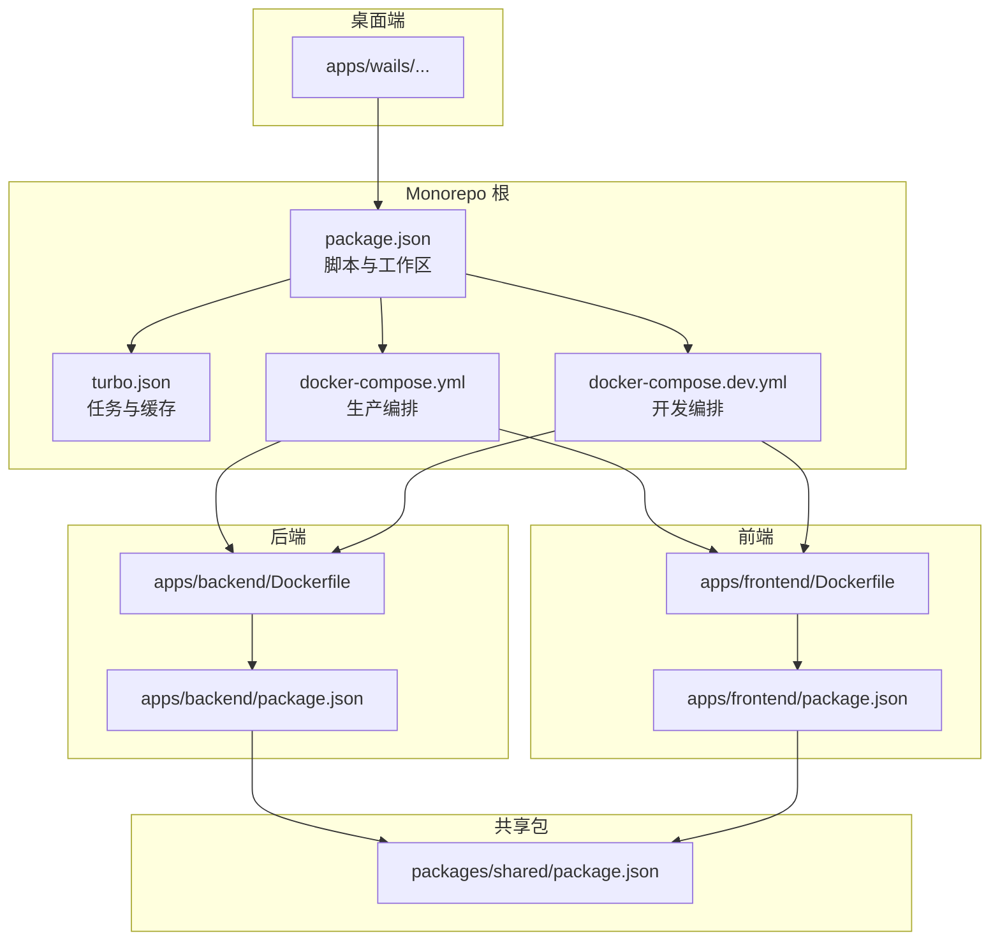
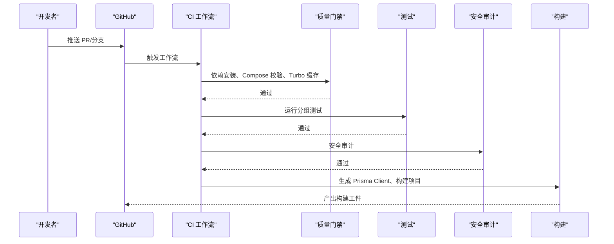
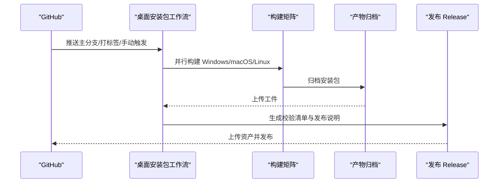
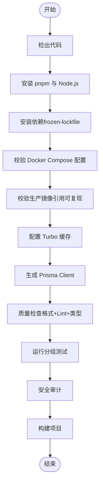
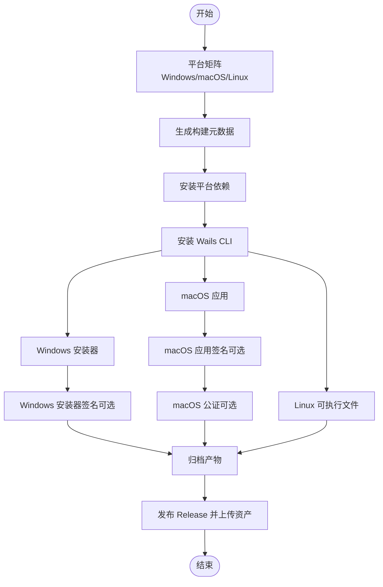
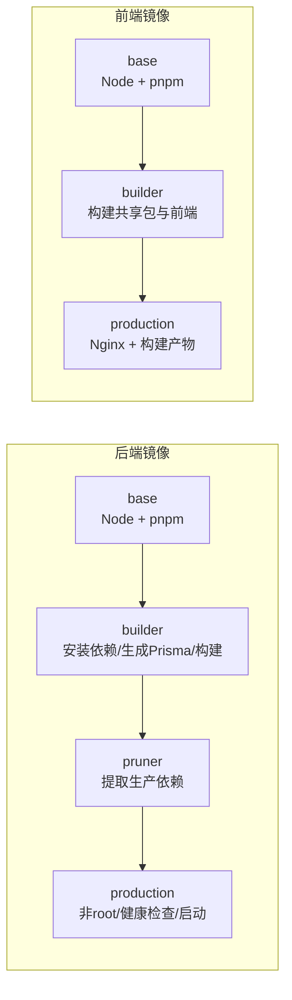
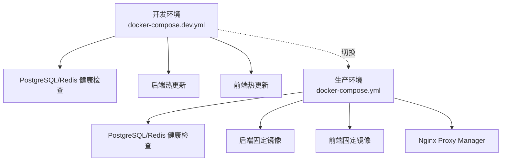
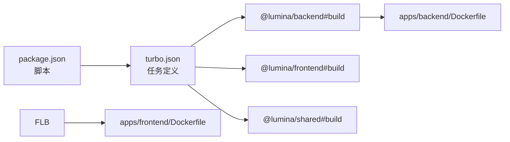

# CI/CD 流水线

<cite>
**本文引用的文件**
- [.github/workflows/ci.yml](file://.github/workflows/ci.yml)
- [.github/workflows/desktop-packages.yml](file://.github/workflows/desktop-packages.yml)
- [package.json](file://package.json)
- [turbo.json](file://turbo.json)
- [docker-compose.yml](file://docker-compose.yml)
- [docker-compose.dev.yml](file://docker-compose.dev.yml)
- [apps/backend/Dockerfile](file://apps/backend/Dockerfile)
- [apps/frontend/Dockerfile](file://apps/frontend/Dockerfile)
- [scripts/security-audit.js](file://scripts/security-audit.js)
- [scripts/deploy-app.sh](file://scripts/deploy-app.sh)
- [.github/dependabot.yml](file://.github/dependabot.yml)
</cite>

## 目录
1. [简介](#简介)
2. [项目结构](#项目结构)
3. [核心组件](#核心组件)
4. [架构总览](#架构总览)
5. [详细组件分析](#详细组件分析)
6. [依赖关系分析](#依赖关系分析)
7. [性能考量](#性能考量)
8. [故障排查指南](#故障排查指南)
9. [结论](#结论)
10. [附录](#附录)

## 简介
本指南面向 Lumina Todo 的持续集成与持续部署（CI/CD）流水线，覆盖以下内容：
- GitHub Actions 工作流配置与自动化构建流程
- 代码质量检查、单元测试与集成测试的自动化执行
- Docker 镜像构建、推送与版本管理策略
- 生产环境自动化部署与回滚机制
- 多环境部署策略（开发、测试、生产）
- 环境变量与 Secrets 管理最佳实践
- 部署前健康检查与部署后验证步骤
- 手动部署与紧急修复操作指南
- 监控与告警在 CI/CD 流程中的集成建议

## 项目结构
Lumina Todo 采用 Monorepo 结构，包含后端（NestJS）、前端（Vue + Vite）、桌面端（Wails）与共享包（shared），并通过 Docker Compose 进行本地与生产环境编排。

图表来源
- [package.json:31-76](file://package.json#L31-L76)
- [turbo.json:1-186](file://turbo.json#L1-L186)
- [docker-compose.yml:1-237](file://docker-compose.yml#L1-L237)
- [docker-compose.dev.yml:1-192](file://docker-compose.dev.yml#L1-L192)
- [apps/backend/Dockerfile:1-103](file://apps/backend/Dockerfile#L1-L103)
- [apps/frontend/Dockerfile:1-94](file://apps/frontend/Dockerfile#L1-L94)

章节来源
- [package.json:1-133](file://package.json#L1-L133)
- [turbo.json:1-186](file://turbo.json#L1-L186)
- [docker-compose.yml:1-237](file://docker-compose.yml#L1-L237)
- [docker-compose.dev.yml:1-192](file://docker-compose.dev.yml#L1-L192)

## 核心组件
- GitHub Actions 工作流
  - CI 工作流：质量门禁、测试与安全审计、构建
  - 桌面安装包工作流：跨平台打包、签名与发布
- 构建与缓存
  - pnpm + Turbo：加速构建与缓存
  - Docker 多阶段构建：后端与前端镜像
- 环境与安全
  - Docker Compose 环境变量与健康检查
  - Secrets 管理与依赖审计

章节来源
- [.github/workflows/ci.yml:1-139](file://.github/workflows/ci.yml#L1-L139)
- [.github/workflows/desktop-packages.yml:1-354](file://.github/workflows/desktop-packages.yml#L1-L354)
- [apps/backend/Dockerfile:1-103](file://apps/backend/Dockerfile#L1-L103)
- [apps/frontend/Dockerfile:1-94](file://apps/frontend/Dockerfile#L1-L94)

## 架构总览
CI/CD 流程分为两条主线：
- 通用流水线（CI 工作流）：拉取请求与分支推送触发，执行质量门禁、测试、安全审计与构建
- 桌面安装包流水线（desktop-packages 工作流）：主分支打标签或手动触发，跨平台构建、签名与发布

图表来源
- [.github/workflows/ci.yml:25-82](file://.github/workflows/ci.yml#L25-L82)
- [package.json:43-44](file://package.json#L43-L44)
- [scripts/security-audit.js:1-53](file://scripts/security-audit.js#L1-L53)

图表来源
- [.github/workflows/desktop-packages.yml:32-354](file://.github/workflows/desktop-packages.yml#L32-L354)

## 详细组件分析

### CI 工作流（质量门禁、测试、安全与构建）
- 触发条件
  - 拉取请求：main、develop，事件类型包含 opened、synchronize、reopened、ready_for_review
  - 分支推送：main、develop
- 关键步骤
  - 代码检出与 Node.js/pnpm 环境准备
  - 依赖安装（frozen lockfile）
  - Compose 配置校验与生产镜像可复现性检查
  - Turbo 缓存配置
  - 生成 Prisma Client
  - 代码质量检查（格式化、Lint、类型检查）
  - 单元与集成测试
  - 安全审计
  - 构建（生产镜像）

图表来源
- [.github/workflows/ci.yml:25-82](file://.github/workflows/ci.yml#L25-L82)

章节来源
- [.github/workflows/ci.yml:1-139](file://.github/workflows/ci.yml#L1-L139)
- [package.json:43-44](file://package.json#L43-L44)
- [scripts/security-audit.js:1-53](file://scripts/security-audit.js#L1-L53)

### 桌面安装包工作流（跨平台打包、签名与发布）
- 触发条件
  - 主分支推送、打标签、路径变更（桌面端与前端等）
  - workflow_dispatch 手动触发
- 关键步骤
  - 并行矩阵：Windows/macOS/Linux
  - 安装 pnpm、Node.js、Go
  - 生成构建元数据（版本号、包名）
  - 安装平台依赖（Linux 构建依赖、Windows NSIS）
  - 安装 Wails CLI
  - 构建安装器（Windows NSIS、macOS DMG、Linux tar.gz）
  - macOS 签名与公证（可选，需 Secrets）
  - Windows 安装器签名（可选，需 Secrets）
  - 归档产物并上传工件
  - 发布 Release（生成校验清单与发布说明）

图表来源
- [.github/workflows/desktop-packages.yml:32-354](file://.github/workflows/desktop-packages.yml#L32-L354)

章节来源
- [.github/workflows/desktop-packages.yml:1-354](file://.github/workflows/desktop-packages.yml#L1-L354)

### Docker 镜像构建与版本管理
- 后端镜像（NestJS）
  - 多阶段构建：base → builder（安装依赖、生成 Prisma Client、构建）→ pruner（提取生产依赖）→ production（最终镜像）
  - 非 root 用户运行，健康检查，暴露 3000 端口
- 前端镜像（Nginx）
  - 基于 Nginx，复制构建产物，非 root 用户运行，健康检查，暴露 80 端口
- 版本管理策略
  - 生产镜像使用固定 digest 引用（sha256），确保可复现
  - 通过环境变量控制镜像标签（BACKEND_IMAGE_TAG、FRONTEND_IMAGE_TAG、IMAGE_TAG）

图表来源
- [apps/backend/Dockerfile:1-103](file://apps/backend/Dockerfile#L1-L103)
- [apps/frontend/Dockerfile:1-94](file://apps/frontend/Dockerfile#L1-L94)
- [docker-compose.yml:74-172](file://docker-compose.yml#L74-L172)

章节来源
- [apps/backend/Dockerfile:1-103](file://apps/backend/Dockerfile#L1-L103)
- [apps/frontend/Dockerfile:1-94](file://apps/frontend/Dockerfile#L1-L94)
- [docker-compose.yml:74-172](file://docker-compose.yml#L74-L172)

### 多环境部署策略（开发、测试、生产）
- 开发环境（docker-compose.dev.yml）
  - 后端/前端均挂载源码实现热更新
  - 默认开发凭据与较低速率限制
  - 通过脚本一键启动/日志/重启/清理
- 测试/生产环境（docker-compose.yml）
  - 固定镜像版本（sha256）与可配置环境变量
  - 健康检查保障服务可用性
  - Nginx Proxy Manager 作为反向代理与 HTTPS 终端

图表来源
- [docker-compose.dev.yml:13-181](file://docker-compose.dev.yml#L13-L181)
- [docker-compose.yml:19-225](file://docker-compose.yml#L19-L225)

章节来源
- [docker-compose.dev.yml:1-192](file://docker-compose.dev.yml#L1-L192)
- [docker-compose.yml:1-237](file://docker-compose.yml#L1-L237)

### 环境变量与 Secrets 管理最佳实践
- 生产环境关键变量（示例）
  - 数据库：POSTGRES_USER/PASSWORD/DB
  - 缓存：REDIS_PASSWORD
  - 安全：JWT_SECRET/JWT_REFRESH_SECRET/CORS_ORIGIN
  - 存储与邮件：S3_*、MAIL_*
  - 反向代理：NPM_*（HTTP/HTTPS/管理端口绑定）
- Secrets 建议
  - 机密值通过 GitHub Secrets 注入（如 macOS/Windows 签名证书、Apple ID 等）
  - 避免硬编码在仓库中，使用条件检查与警告提示
- 依赖与漏洞管理
  - 依赖自动更新：Dependabot（npm 与 GitHub Actions）
  - 安全审计：pnpm audit（受控忽略列表）

章节来源
- [docker-compose.yml:38-125](file://docker-compose.yml#L38-L125)
- [.github/dependabot.yml:1-22](file://.github/dependabot.yml#L1-L22)
- [scripts/security-audit.js:1-53](file://scripts/security-audit.js#L1-L53)

### 部署前健康检查与部署后验证
- 部署前
  - Compose 配置校验与镜像可复现性检查
  - 数据库与缓存健康检查
- 部署后
  - 后端/前端健康检查（liveness/readiness）
  - 访问日志可视化（GoAccess）
  - 反向代理可用性验证

章节来源
- [.github/workflows/ci.yml:52-64](file://.github/workflows/ci.yml#L52-L64)
- [docker-compose.yml:44-135](file://docker-compose.yml#L44-L135)

### 手动部署与紧急修复操作
- 桌面端手动安装
  - 在 macOS 上运行部署脚本，将构建产物复制到 /Applications 并启动
- 紧急修复
  - 通过 GitHub Releases 回滚至上一个稳定版本
  - 临时调整环境变量或降级依赖（结合 Dependabot 与锁定文件）

章节来源
- [scripts/deploy-app.sh:1-66](file://scripts/deploy-app.sh#L1-L66)
- [.github/workflows/desktop-packages.yml:288-354](file://.github/workflows/desktop-packages.yml#L288-L354)

### 监控与告警在 CI/CD 流程中的集成
- 建议集成点
  - 在 CI 工作流中增加指标上报（如构建时长、成功率）
  - 将测试覆盖率与安全审计结果作为质量指标
  - 在发布后对健康检查失败进行告警
- 实施要点
  - 使用 GitHub Actions Outputs 传递关键指标
  - 结合外部监控平台（如 Prometheus/Grafana 或云厂商监控）进行可视化

## 依赖关系分析
- 任务编排
  - Turbo 管理 monorepo 内部任务依赖与缓存
  - package.json 脚本串联质量检查、测试与构建
- 构建链路
  - 后端：共享包 → Prisma Client → 后端应用
  - 前端：共享包 → 前端应用 → Nginx
- 外部依赖
  - pnpm（frozen-lockfile）、Docker（多阶段构建）、Go（Wails CLI）

图表来源
- [package.json:31-76](file://package.json#L31-L76)
- [turbo.json:40-101](file://turbo.json#L40-L101)
- [apps/backend/Dockerfile:1-103](file://apps/backend/Dockerfile#L1-L103)
- [apps/frontend/Dockerfile:1-94](file://apps/frontend/Dockerfile#L1-L94)

章节来源
- [package.json:1-133](file://package.json#L1-L133)
- [turbo.json:1-186](file://turbo.json#L1-L186)

## 性能考量
- 缓存优化
  - Turbo 缓存基于 pnpm-lock.yaml 与 turbo.json 的哈希
  - Docker 层缓存利用 pnpm store 与依赖安装
- 并行与并发
  - Turbo 任务并发与限流（如 build:ci 使用 50% 并发）
  - GitHub Actions 并行矩阵（桌面安装包）
- 构建体积
  - 多阶段构建与 pruner 提取生产依赖，减少镜像体积

章节来源
- [.github/workflows/ci.yml:65-72](file://.github/workflows/ci.yml#L65-L72)
- [apps/backend/Dockerfile:55-58](file://apps/backend/Dockerfile#L55-L58)
- [package.json:37-37](file://package.json#L37-L37)

## 故障排查指南
- 依赖安装失败
  - 检查 frozen-lockfile 是否一致，确认 pnpm 与 Node 版本
- Compose 校验失败
  - 检查环境变量是否齐全，镜像引用是否为 sha256
- 健康检查失败
  - 查看数据库/缓存健康状态，确认服务启动顺序与超时参数
- 安全审计失败
  - 检查被忽略的 advisories 与模块列表，必要时升级依赖
- 桌面安装包签名/公证问题
  - 确认 Secrets 是否配置完整，平台依赖是否正确安装

章节来源
- [.github/workflows/ci.yml:52-64](file://.github/workflows/ci.yml#L52-L64)
- [scripts/security-audit.js:1-53](file://scripts/security-audit.js#L1-L53)
- [.github/workflows/desktop-packages.yml:163-280](file://.github/workflows/desktop-packages.yml#L163-L280)

## 结论
本指南提供了 Lumina Todo 的完整 CI/CD 实践蓝图：以 GitHub Actions 为核心，结合 Turbo 与 Docker 多阶段构建，实现高质量、可复现且可回滚的交付流程。通过严格的环境变量与 Secrets 管理、健康检查与发布后验证，以及桌面端的跨平台打包与签名，确保产品在多环境下稳定交付。

## 附录
- 常用命令参考
  - 开发：pnpm dev / pnpm docker:dev
  - 构建：pnpm build / pnpm build:ci
  - 测试：pnpm test / pnpm ci:test
  - 质量：pnpm ci:check / pnpm format:check
  - 安全：pnpm security-audit
  - Docker：pnpm docker:build / pnpm docker:up / pnpm docker:down
- 发布与回滚
  - 打标签触发桌面安装包发布
  - 通过 GitHub Releases 回滚至历史版本