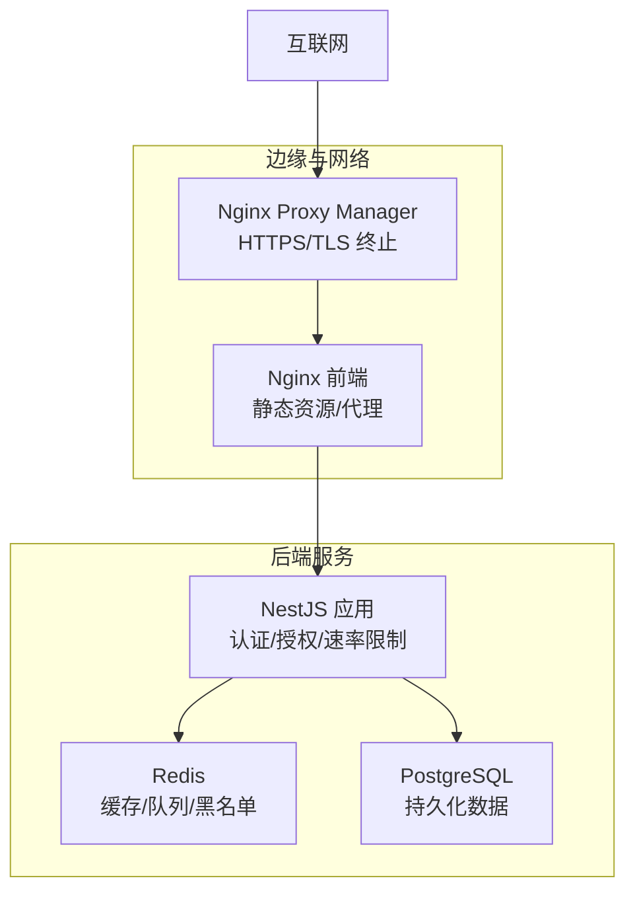
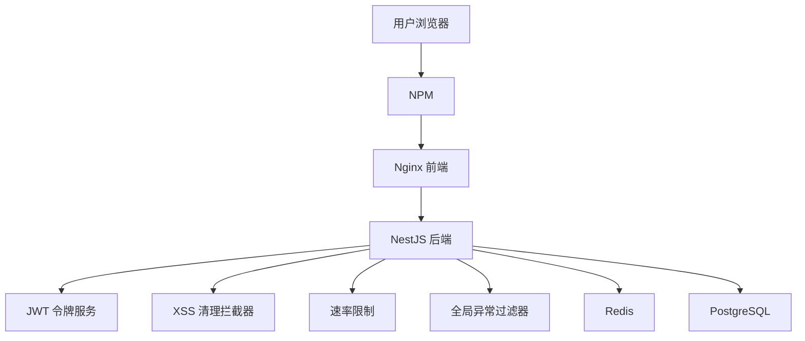
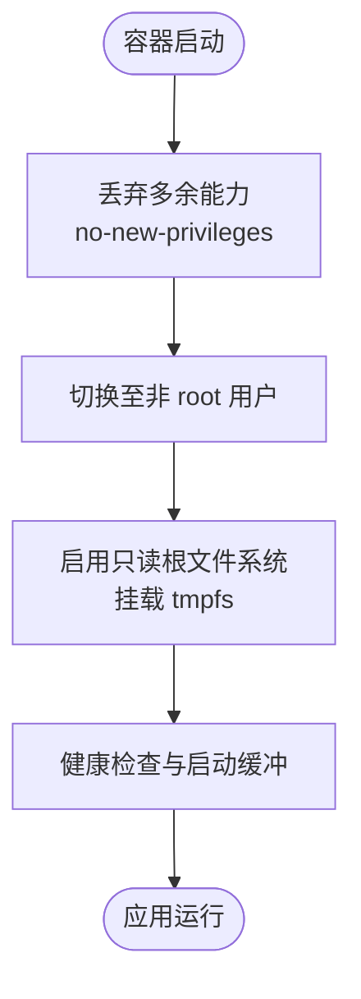
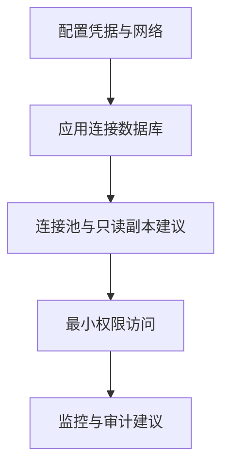
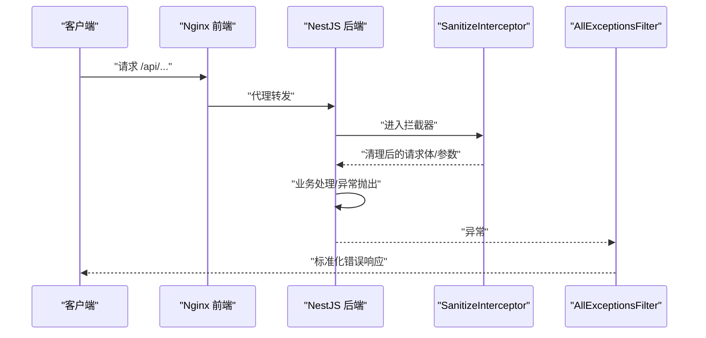
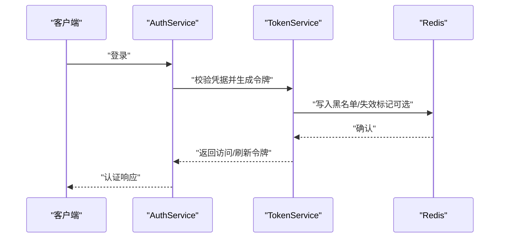
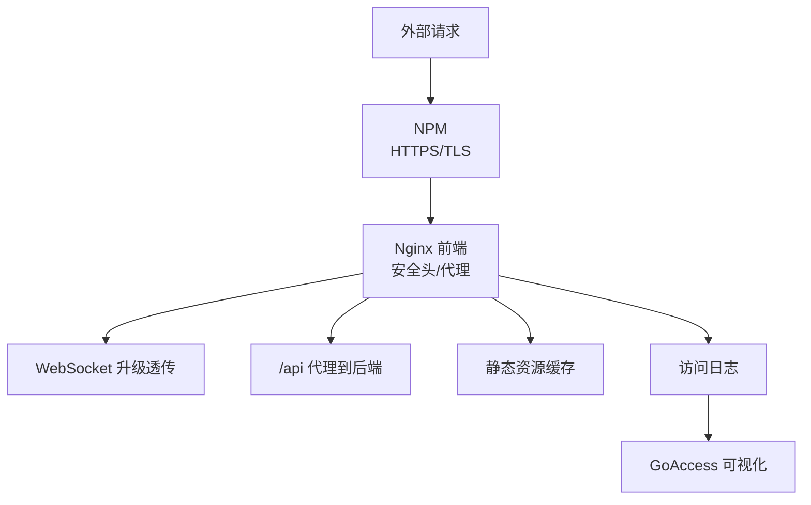
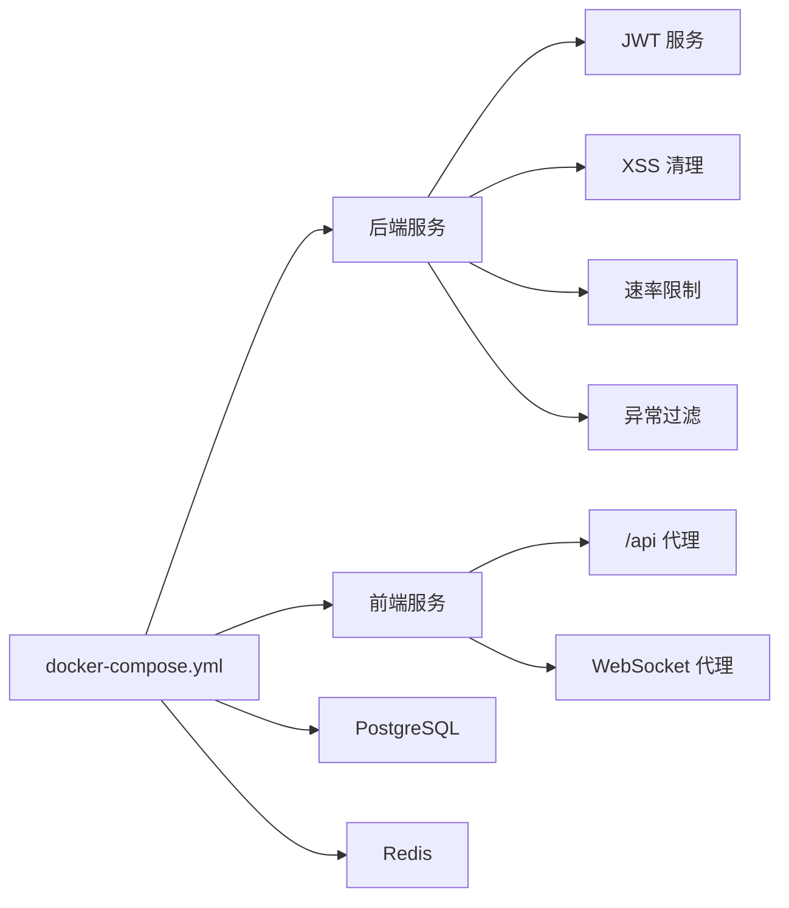

# 安全加固

<cite>
**本文引用的文件**
- [apps/backend/Dockerfile](file://apps/backend/Dockerfile)
- [apps/frontend/Dockerfile](file://apps/frontend/Dockerfile)
- [docker-compose.yml](file://docker-compose.yml)
- [docker-compose.dev.yml](file://docker-compose.dev.yml)
- [scripts/security-audit.js](file://scripts/security-audit.js)
- [SECURITY.md](file://SECURITY.md)
- [apps/backend/src/app.module.ts](file://apps/backend/src/app.module.ts)
- [apps/backend/src/auth/auth.service.ts](file://apps/backend/src/auth/auth.service.ts)
- [apps/backend/src/auth/token.service.ts](file://apps/backend/src/auth/token.service.ts)
- [apps/backend/src/auth/password.service.ts](file://apps/backend/src/auth/password.service.ts)
- [apps/backend/src/auth/jwt-auth.guard.ts](file://apps/backend/src/auth/jwt-auth.guard.ts)
- [apps/backend/src/common/interceptors/sanitize.interceptor.ts](file://apps/backend/src/common/interceptors/sanitize.interceptor.ts)
- [apps/backend/src/common/filters/all-exceptions.filter.ts](file://apps/backend/src/common/filters/all-exceptions.filter.ts)
- [apps/frontend/nginx.conf](file://apps/frontend/nginx.conf)
- [apps/frontend/nginx.main.conf](file://apps/frontend/nginx.main.conf)
- [package.json](file://package.json)
</cite>

## 目录
1. [引言](#引言)
2. [项目结构](#项目结构)
3. [核心组件](#核心组件)
4. [架构总览](#架构总览)
5. [详细组件分析](#详细组件分析)
6. [依赖关系分析](#依赖关系分析)
7. [性能考量](#性能考量)
8. [故障排除指南](#故障排除指南)
9. [结论](#结论)
10. [附录](#附录)

## 引言
本指南面向 Lumina Todo 的安全加固，覆盖容器安全、数据库安全、应用层安全、API 安全、网络安全、密钥与敏感信息管理、安全扫描与漏洞评估、安全事件响应与合规审计等维度。文档基于仓库现有实现与配置进行分析，并提出可落地的加固建议。

## 项目结构
Lumina 采用多容器与反向代理的生产部署模型：
- 反向代理：Nginx Proxy Manager（NPM）负责 TLS 终止与 HTTP/HTTPS 转发
- Web 前端：Nginx 提供静态资源与 API/WS 代理
- 后端：NestJS 应用，通过健康检查与速率限制保障稳定性
- 数据存储：PostgreSQL（数据库）、Redis（缓存/队列/令牌黑名单）

图表来源
- [docker-compose.yml:209-224](file://docker-compose.yml#L209-L224)
- [apps/frontend/nginx.conf:127-142](file://apps/frontend/nginx.conf#L127-L142)
- [apps/backend/Dockerfile:73-88](file://apps/backend/Dockerfile#L73-L88)

章节来源
- [docker-compose.yml:1-237](file://docker-compose.yml#L1-L237)
- [apps/frontend/nginx.conf:1-203](file://apps/frontend/nginx.conf#L1-L203)

## 核心组件
- 容器安全：非 root 用户运行、能力裁剪、只读文件系统、健康检查、tmpfs
- 数据库安全：仅内网暴露、强制密码、连接池参数调优
- 应用层安全：XSS 清理拦截器、全局异常过滤器、统一错误响应
- API 安全：JWT 认证守卫、刷新令牌黑名单、速率限制、CORS
- 网络安全：NPM TLS 终止、Nginx 安全头、WebSocket 透传
- 密钥与敏感信息：环境变量注入、Redis 黑名单、会话失效
- 安全扫描：pnpm audit 自动化脚本
- 合规与响应：安全政策、版本支持范围、私有漏洞上报渠道

章节来源
- [apps/backend/Dockerfile:67-88](file://apps/backend/Dockerfile#L67-L88)
- [apps/frontend/Dockerfile:54-83](file://apps/frontend/Dockerfile#L54-L83)
- [docker-compose.yml:89-136](file://docker-compose.yml#L89-L136)
- [apps/backend/src/app.module.ts:117-138](file://apps/backend/src/app.module.ts#L117-L138)
- [apps/backend/src/auth/jwt-auth.guard.ts:1-10](file://apps/backend/src/auth/jwt-auth.guard.ts#L1-L10)
- [apps/backend/src/common/interceptors/sanitize.interceptor.ts:1-64](file://apps/backend/src/common/interceptors/sanitize.interceptor.ts#L1-L64)
- [apps/backend/src/common/filters/all-exceptions.filter.ts:1-137](file://apps/backend/src/common/filters/all-exceptions.filter.ts#L1-L137)
- [apps/frontend/nginx.conf:74-96](file://apps/frontend/nginx.conf#L74-L96)
- [scripts/security-audit.js:1-53](file://scripts/security-audit.js#L1-L53)
- [SECURITY.md:1-40](file://SECURITY.md#L1-L40)

## 架构总览
Lumina 的安全架构围绕“最小权限、纵深防御、可观测性”展开：
- 容器层：非 root、cap_drop、no-new-privileges、只读根文件系统、tmpfs
- 网络层：NPM 统一 TLS 终止，Nginx 安全头与代理，内网桥接
- 应用层：JWT 令牌体系、XSS 清理、速率限制、统一异常处理
- 数据层：PostgreSQL 仅内网暴露、Redis 密码保护、Redis 作为黑名单与缓存

图表来源
- [apps/backend/src/auth/token.service.ts:15-45](file://apps/backend/src/auth/token.service.ts#L15-L45)
- [apps/backend/src/common/interceptors/sanitize.interceptor.ts:9-36](file://apps/backend/src/common/interceptors/sanitize.interceptor.ts#L9-L36)
- [apps/backend/src/app.module.ts:117-138](file://apps/backend/src/app.module.ts#L117-L138)
- [apps/backend/src/common/filters/all-exceptions.filter.ts:16-35](file://apps/backend/src/common/filters/all-exceptions.filter.ts#L16-L35)
- [docker-compose.yml:209-224](file://docker-compose.yml#L209-L224)

## 详细组件分析

### 容器安全配置
- 非 root 用户与权限分离
  - 后端与前端镜像分别以非 root 用户运行，降低特权提升风险
- 能力裁剪与进程隔离
  - 容器启用 no-new-privileges，丢弃 ALL 能力，减少攻击面
- 只读文件系统与临时文件
  - 前端容器启用 read_only，并挂载 tmpfs 与缓存目录，适配只读根文件系统
- 健康检查与启动缓冲
  - 后端与前端均配置 HEALTHCHECK，后端设置较长启动期以适应初始化压力
- 运行时环境变量
  - 后端设置 NODE_ENV=production 与 IS_DOCKER=true，便于应用侧识别容器环境

图表来源
- [apps/backend/Dockerfile:67-88](file://apps/backend/Dockerfile#L67-L88)
- [apps/frontend/Dockerfile:54-83](file://apps/frontend/Dockerfile#L54-L83)
- [docker-compose.yml:89-136](file://docker-compose.yml#L89-L136)

章节来源
- [apps/backend/Dockerfile:67-102](file://apps/backend/Dockerfile#L67-L102)
- [apps/frontend/Dockerfile:54-94](file://apps/frontend/Dockerfile#L54-L94)
- [docker-compose.yml:89-172](file://docker-compose.yml#L89-L172)

### 数据库安全配置
- 网络隔离与端口绑定
  - PostgreSQL 仅绑定 127.0.0.1:5432，避免直接暴露于公网
- 凭据与连接
  - 使用环境变量注入 POSTGRES_PASSWORD、POSTGRES_DB 等，避免明文硬编码
  - 后端通过 DATABASE_URL 连接数据库，建议使用连接池与只读副本（如需）
- Redis 安全
  - Redis 启用 requirepass，限制最大内存与淘汰策略，仅内网访问
- 参数优化
  - PostgreSQL 调整 shared_buffers、effective_cache_size、work_mem 等参数，兼顾性能与资源占用

图表来源
- [docker-compose.yml:23-68](file://docker-compose.yml#L23-L68)
- [docker-compose.yml:96-101](file://docker-compose.yml#L96-L101)

章节来源
- [docker-compose.yml:23-68](file://docker-compose.yml#L23-L68)
- [docker-compose.yml:96-101](file://docker-compose.yml#L96-L101)

### 应用层安全措施
- 输入验证与 XSS 防护
  - 全局 SanitizeInterceptor 对请求体、查询参数、路径参数进行递归清理，禁止任何 HTML 标签
- 统一异常处理
  - AllExceptionsFilter 将异常标准化为统一响应结构，记录错误日志，支持 i18n
- 国际化与错误键
  - I18nModule 提供多语言错误消息，异常过滤器根据键或字段映射返回结构化错误对象

图表来源
- [apps/frontend/nginx.conf:127-142](file://apps/frontend/nginx.conf#L127-L142)
- [apps/backend/src/common/interceptors/sanitize.interceptor.ts:17-36](file://apps/backend/src/common/interceptors/sanitize.interceptor.ts#L17-L36)
- [apps/backend/src/common/filters/all-exceptions.filter.ts:27-135](file://apps/backend/src/common/filters/all-exceptions.filter.ts#L27-L135)

章节来源
- [apps/backend/src/common/interceptors/sanitize.interceptor.ts:1-64](file://apps/backend/src/common/interceptors/sanitize.interceptor.ts#L1-L64)
- [apps/backend/src/common/filters/all-exceptions.filter.ts:1-137](file://apps/backend/src/common/filters/all-exceptions.filter.ts#L1-L137)
- [apps/backend/src/app.module.ts:139-148](file://apps/backend/src/app.module.ts#L139-L148)

### API 安全配置
- 认证与授权
  - JwtAuthGuard 保护受保护路由，TokenService 生成短期访问令牌与长期刷新令牌
  - 支持刷新令牌黑名单与用户会话失效，结合 Redis 实现
- 速率限制
  - ThrottlerModule 配置短/中/长 TTL 与请求数限制，防止暴力破解与滥用
- CORS
  - CORS_ORIGIN 通过环境变量注入，建议生产环境限定具体域名

图表来源
- [apps/backend/src/auth/auth.service.ts:41-54](file://apps/backend/src/auth/auth.service.ts#L41-L54)
- [apps/backend/src/auth/token.service.ts:175-185](file://apps/backend/src/auth/token.service.ts#L175-L185)
- [apps/backend/src/auth/jwt-auth.guard.ts:1-10](file://apps/backend/src/auth/jwt-auth.guard.ts#L1-L10)
- [apps/backend/src/app.module.ts:117-138](file://apps/backend/src/app.module.ts#L117-L138)

章节来源
- [apps/backend/src/auth/auth.service.ts:1-127](file://apps/backend/src/auth/auth.service.ts#L1-L127)
- [apps/backend/src/auth/token.service.ts:1-187](file://apps/backend/src/auth/token.service.ts#L1-L187)
- [apps/backend/src/auth/jwt-auth.guard.ts:1-10](file://apps/backend/src/auth/jwt-auth.guard.ts#L1-L10)
- [apps/backend/src/app.module.ts:117-138](file://apps/backend/src/app.module.ts#L117-L138)

### 网络安全部署
- TLS 与反向代理
  - NPM 负责 HTTPS 终止与证书管理，后端仅在内网暴露
- Nginx 安全头
  - 设置 X-Frame-Options、X-Content-Type-Options、X-XSS-Protection、Referrer-Policy、Content-Security-Policy、Permissions-Policy
- WebSocket 代理
  - 显式透传 Upgrade/Connection 头，关闭代理缓冲，延长超时时间
- 日志与可视化
  - GoAccess 可视化前端访问日志，便于审计与异常发现

图表来源
- [docker-compose.yml:209-224](file://docker-compose.yml#L209-L224)
- [apps/frontend/nginx.conf:74-96](file://apps/frontend/nginx.conf#L74-L96)
- [apps/frontend/nginx.conf:144-180](file://apps/frontend/nginx.conf#L144-L180)
- [apps/frontend/nginx.main.conf:19-48](file://apps/frontend/nginx.main.conf#L19-L48)
- [docker-compose.yml:177-204](file://docker-compose.yml#L177-L204)

章节来源
- [apps/frontend/nginx.conf:1-203](file://apps/frontend/nginx.conf#L1-L203)
- [apps/frontend/nginx.main.conf:1-51](file://apps/frontend/nginx.main.conf#L1-L51)
- [docker-compose.yml:177-224](file://docker-compose.yml#L177-L224)

### 密钥管理与敏感信息保护
- 环境变量注入
  - JWT_SECRET、JWT_REFRESH_SECRET、CORS_ORIGIN、数据库与 Redis 凭据通过环境变量注入
- 令牌安全
  - 访问令牌短期有效，刷新令牌长期但可黑名单与失效
  - 用户会话失效通过 Redis 记录时间戳实现
- 密码处理
  - bcrypt 哈希，重置令牌使用 SHA-256 哈希存储，防重放

章节来源
- [docker-compose.yml:102-115](file://docker-compose.yml#L102-L115)
- [apps/backend/src/auth/token.service.ts:47-76](file://apps/backend/src/auth/token.service.ts#L47-L76)
- [apps/backend/src/auth/password.service.ts:25-34](file://apps/backend/src/auth/password.service.ts#L25-L34)

### 安全扫描与漏洞评估自动化
- pnpm audit 集成
  - scripts/security-audit.js 执行生产依赖审计，解析 JSON 输出，过滤忽略项，失败时退出
- CI 集成
  - package.json 中 security-audit 脚本与 CI 流程集成，确保每次构建都进行安全扫描

章节来源
- [scripts/security-audit.js:1-53](file://scripts/security-audit.js#L1-L53)
- [package.json:50-50](file://package.json#L50-L50)

### 安全事件响应与应急处理预案
- 安全政策与版本支持
  - SECURITY.md 定义支持版本、漏洞上报渠道（私有漏洞报告、邮件）
- 响应流程
  - 收到报告后 48 小时内确认，私下沟通修复方案，公开前完成修复
- 最佳实践
  - 保持系统与依赖及时更新，定期进行渗透测试与代码审计

章节来源
- [SECURITY.md:1-40](file://SECURITY.md#L1-L40)

## 依赖关系分析
- 容器与服务耦合
  - 后端依赖 Redis（令牌黑名单/缓存）、PostgreSQL（持久化），前端依赖后端 API/WS
- 安全中间件链路
  - Nginx 安全头 → NestJS 速率限制/认证守卫 → XSS 清理 → 统一异常处理
- 配置注入
  - docker-compose.yml 作为单一事实源，集中注入敏感配置

图表来源
- [docker-compose.yml:19-172](file://docker-compose.yml#L19-L172)
- [apps/frontend/nginx.conf:127-180](file://apps/frontend/nginx.conf#L127-L180)
- [apps/backend/src/app.module.ts:117-138](file://apps/backend/src/app.module.ts#L117-L138)

章节来源
- [docker-compose.yml:19-172](file://docker-compose.yml#L19-L172)
- [apps/backend/src/app.module.ts:117-138](file://apps/backend/src/app.module.ts#L117-L138)

## 性能考量
- 健康检查与启动期
  - 后端 HEALTHCHECK 设置较长 start-period，避免冷启动阶段误判
- Nginx 代理缓冲
  - WebSocket 场景关闭代理缓冲，保证实时性
- 缓存与压缩
  - 前端开启 gzip 静态压缩与静态资源长期缓存，降低带宽与服务器负载

章节来源
- [apps/backend/Dockerfile:97-102](file://apps/backend/Dockerfile#L97-L102)
- [apps/frontend/nginx.conf:169-176](file://apps/frontend/nginx.conf#L169-L176)
- [apps/frontend/nginx.conf:11-36](file://apps/frontend/nginx.conf#L11-L36)

## 故障排除指南
- 容器启动失败
  - 检查 no-new-privileges 与只读文件系统是否导致写入失败，确认 tmpfs 挂载与权限修正
- 认证问题
  - 核对 JWT_SECRET/JWT_REFRESH_SECRET 是否正确注入，Redis 是否连通
- XSS 或内容异常
  - 确认 SanitizeInterceptor 是否生效，必要时检查请求体结构
- 速率限制触发
  - 检查 THROTTLE_* 环境变量，适当提高阈值进行调试
- 日志与审计
  - 通过 GoAccess 可视化访问日志，定位异常流量与错误模式

章节来源
- [apps/backend/Dockerfile:84-88](file://apps/backend/Dockerfile#L84-L88)
- [docker-compose.yml:102-125](file://docker-compose.yml#L102-L125)
- [apps/backend/src/common/interceptors/sanitize.interceptor.ts:17-36](file://apps/backend/src/common/interceptors/sanitize.interceptor.ts#L17-L36)
- [apps/frontend/nginx.conf:179-180](file://apps/frontend/nginx.conf#L179-L180)
- [docker-compose.yml:177-204](file://docker-compose.yml#L177-L204)

## 结论
Lumina Todo 已具备较为完善的容器安全基线（非 root、能力裁剪、只读文件系统、健康检查）与应用层安全（XSS 清理、速率限制、JWT 令牌体系）。建议在生产环境中进一步强化以下方面：TLS 证书轮换与 HSTS、数据库审计日志、CORS 白名单细化、API 端点鉴权最小化、密钥轮换策略与硬件安全模块（HSM）集成、渗透测试与红蓝对抗演练、以及完善的安全事件响应流程与合规审计制度。

## 附录
- 开发与生产差异
  - 开发环境使用 Node 镜像与热更新，生产环境使用精简镜像与 Nginx
- 健康检查与可观测性
  - 后端与前端均配置 HEALTHCHECK，配合 GoAccess 实时可视化

章节来源
- [docker-compose.dev.yml:70-142](file://docker-compose.dev.yml#L70-L142)
- [docker-compose.yml:126-172](file://docker-compose.yml#L126-L172)