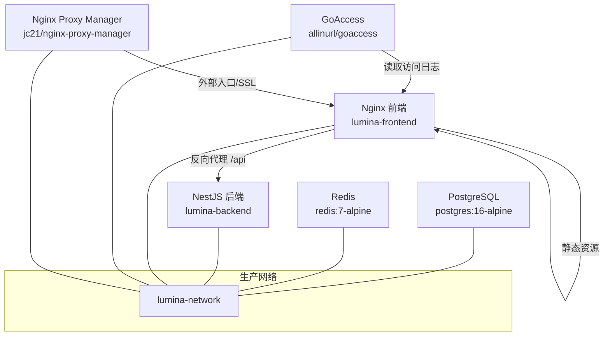
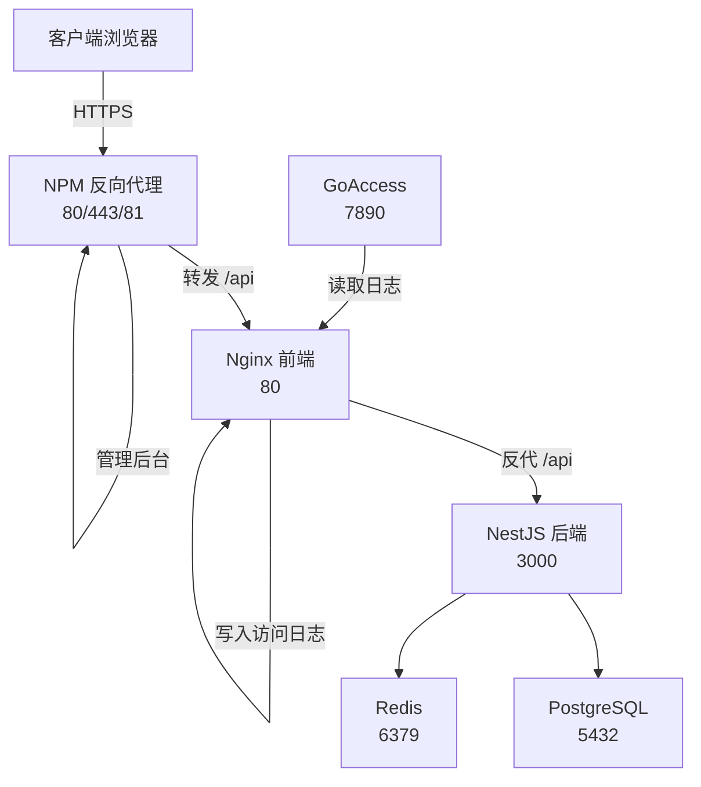
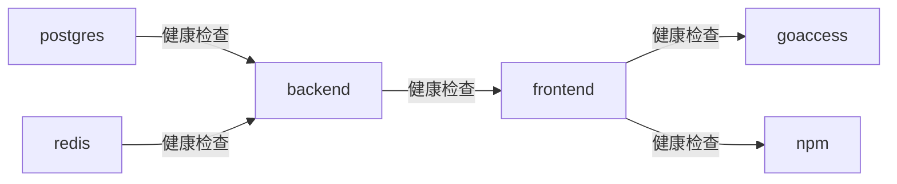

# 容器化部署

<cite>
**本文引用的文件**
- [docker-compose.yml](file://docker-compose.yml)
- [docker-compose.dev.yml](file://docker-compose.dev.yml)
- [apps/backend/Dockerfile](file://apps/backend/Dockerfile)
- [apps/frontend/Dockerfile](file://apps/frontend/Dockerfile)
- [apps/frontend/nginx.conf](file://apps/frontend/nginx.conf)
- [apps/frontend/nginx.main.conf](file://apps/frontend/nginx.main.conf)
- [scripts/deploy-app.sh](file://scripts/deploy-app.sh)
- [scripts/dev-bootstrap.sh](file://scripts/dev-bootstrap.sh)
- [deploy.sh](file://deploy.sh)
- [ecosystem.config.js](file://ecosystem.config.js)
- [package.json](file://package.json)
- [apps/backend/package.json](file://apps/backend/package.json)
- [apps/frontend/package.json](file://apps/frontend/package.json)
</cite>

## 目录
1. [简介](#简介)
2. [项目结构](#项目结构)
3. [核心组件](#核心组件)
4. [架构总览](#架构总览)
5. [详细组件分析](#详细组件分析)
6. [依赖分析](#依赖分析)
7. [性能考虑](#性能考虑)
8. [故障排除指南](#故障排除指南)
9. [结论](#结论)
10. [附录](#附录)

## 简介
本指南面向生产环境，系统性讲解 Lumina Todo 的容器化部署方案。内容涵盖 Docker Compose 生产配置的完整结构、各服务配置项、PostgreSQL 性能参数与健康检查、Redis 安全与内存限制、NestJS 后端构建与健康检查、Nginx 前端只读文件系统与静态服务、GoAccess 日志分析与实时报告、Nginx Proxy Manager 反向代理与 SSL 管理、容器网络与数据持久化、安全加固措施，以及完整的部署命令与故障排除流程。

## 项目结构
生产环境采用单 Compose 文件集中编排，包含数据库、缓存、后端、前端、日志分析与反向代理等服务。开发环境使用独立 Compose 文件，支持热更新与共享依赖卷。

图表来源
- [docker-compose.yml:19-237](file://docker-compose.yml#L19-L237)

章节来源
- [docker-compose.yml:1-237](file://docker-compose.yml#L1-L237)

## 核心组件
- PostgreSQL 数据库：生产镜像带固定 SHA256，配置共享缓冲、有效缓存、工作内存、维护内存、随机页成本、最大连接数；仅本机暴露 5432；健康检查基于 pg_isready；数据卷持久化。
- Redis 缓存与队列：开启 AOF、设置最大内存 512MB、LRU 策略、密码认证；健康检查基于 redis-cli ping；数据卷持久化。
- NestJS 后端：多阶段构建，最终以非 root 用户运行；健康检查通过 /api/health/liveness；依赖环境变量（数据库、Redis、JWT、CORS、邮件、S3 等）。
- Nginx 前端：多阶段构建，最终以非 root 用户运行；只读文件系统 + tmpfs；健康检查 /health；反向代理 /api 与 WebSocket；安全头与缓存策略。
- GoAccess：实时 HTML 报告，监听 7890；读取前端日志卷；输出到报告卷。
- Nginx Proxy Manager：统一入口、HTTP/HTTPS、管理后台；证书存储于 /etc/letsencrypt；依赖前端健康。

章节来源
- [docker-compose.yml:23-237](file://docker-compose.yml#L23-L237)
- [apps/backend/Dockerfile:1-103](file://apps/backend/Dockerfile#L1-L103)
- [apps/frontend/Dockerfile:1-94](file://apps/frontend/Dockerfile#L1-L94)
- [apps/frontend/nginx.conf:1-203](file://apps/frontend/nginx.conf#L1-L203)
- [apps/frontend/nginx.main.conf:1-51](file://apps/frontend/nginx.main.conf#L1-L51)

## 架构总览
生产环境采用桥接网络，服务间通过服务名互联；前端作为统一入口，后端提供 API；日志由 Nginx 写入卷，GoAccess 实时解析；NPM 作为反向代理与证书管理。

图表来源
- [docker-compose.yml:19-237](file://docker-compose.yml#L19-L237)
- [apps/frontend/nginx.conf:128-180](file://apps/frontend/nginx.conf#L128-L180)

## 详细组件分析

### PostgreSQL 数据库容器
- 镜像与固定校验：使用带 SHA256 的 postgres:16-alpine。
- 性能参数：通过 postgres 命令行参数设置 shared_buffers、effective_cache_size、work_mem、maintenance_work_mem、random_page_cost、max_connections。
- 健康检查：使用 pg_isready，间隔 10s，超时 5s，重试 5 次。
- 端口与网络：仅本机 127.0.0.1:5432:5432；加入 lumina-network。
- 数据持久化：卷 lumina_postgres_data 挂载至 /var/lib/postgresql/data。

章节来源
- [docker-compose.yml:23-50](file://docker-compose.yml#L23-L50)

### Redis 缓存与队列容器
- 镜像与固定校验：使用带 SHA256 的 redis:7-alpine。
- 安全与内存：开启 appendonly，最大内存 512MB，淘汰策略 allkeys-lru，强制密码认证。
- 健康检查：redis-cli ping，带密码。
- 数据持久化：卷 lumina_redis_data 挂载至 /data。
- 网络：加入 lumina-network。

章节来源
- [docker-compose.yml:55-69](file://docker-compose.yml#L55-L69)

### NestJS 后端容器
- 镜像与构建：使用 apps/backend/Dockerfile，多阶段构建，最终以非 root 用户运行。
- 环境变量：DATABASE_URL、REDIS_*、JWT_*、CORS_ORIGIN、邮件与 S3 存储、日志级别、速率限制等。
- 健康检查：访问 http://127.0.0.1:3000/api/health/liveness，启动缓冲 60s。
- 依赖关系：等待 postgres 与 redis 健康后启动。
- 安全加固：no-new-privileges、drop ALL 能力。

章节来源
- [docker-compose.yml:74-137](file://docker-compose.yml#L74-L137)
- [apps/backend/Dockerfile:67-102](file://apps/backend/Dockerfile#L67-L102)

### Nginx 前端容器
- 镜像与构建：apps/frontend/Dockerfile，多阶段构建，最终以非 root 用户运行。
- 只读文件系统：read_only: true；tmpfs 用于 /tmp 与 /var/cache/nginx。
- 健康检查：访问 http://127.0.0.1:80/health。
- 反向代理：/api 转发至 backend:3000；WebSocket 专用配置；禁用代理缓冲以保证实时性。
- 安全头与缓存：X-Frame-Options、X-Content-Type-Options、X-XSS-Protection、Referrer-Policy、Content-Security-Policy、权限策略；静态资源长期缓存。
- 日志：写入卷 lumina_frontend_logs。

章节来源
- [docker-compose.yml:142-172](file://docker-compose.yml#L142-L172)
- [apps/frontend/Dockerfile:54-93](file://apps/frontend/Dockerfile#L54-L93)
- [apps/frontend/nginx.conf:1-203](file://apps/frontend/nginx.conf#L1-L203)
- [apps/frontend/nginx.main.conf:1-51](file://apps/frontend/nginx.main.conf#L1-L51)

### GoAccess 日志分析
- 镜像与固定校验：allinurl/goaccess:1.9.4。
- 命令：创建报告目录、touch 日志文件、指定日志格式、日期/时间格式、实时 HTML、端口 7890、允许来源、忽略爬虫、输出到 /srv/report/index.html。
- 端口：默认绑定 127.0.0.1:7890，可通过环境变量调整。
- 依赖：依赖 frontend 健康；读取前端日志卷，输出报告卷。

章节来源
- [docker-compose.yml:177-204](file://docker-compose.yml#L177-L204)

### Nginx Proxy Manager 反向代理
- 镜像：jc21/nginx-proxy-manager:2.13.7。
- 端口：80/443/81，分别映射到宿主机可配置绑定。
- 证书：/etc/letsencrypt 持久化存储。
- 依赖：依赖 frontend 健康。

章节来源
- [docker-compose.yml:209-224](file://docker-compose.yml#L209-L224)

### 开发环境 Compose（对比参考）
- 网络：lumina-network-dev。
- 数据库：开发镜像，端口 127.0.0.1:5432:5432，健康检查。
- Redis：开发镜像，端口 127.0.0.1:6379:6379，maxmemory-policy noeviction。
- 后端：开发镜像 node:20-alpine，工作目录 /app/apps/backend，挂载项目与 node_modules，命令执行 dev-bootstrap.sh 后启动后端。
- 前端：开发镜像 node:20-alpine，工作目录 /app/apps/frontend，挂载项目与 node_modules，命令执行 dev-bootstrap.sh 后启动 Vite。
- 依赖：后端依赖数据库与 Redis 健康；前端依赖后端健康。

章节来源
- [docker-compose.dev.yml:13-192](file://docker-compose.dev.yml#L13-L192)
- [scripts/dev-bootstrap.sh:1-151](file://scripts/dev-bootstrap.sh#L1-L151)

## 依赖分析
- 服务间依赖
  - backend 依赖 postgres 与 redis 健康。
  - frontend 依赖 backend 健康。
  - goaccess 依赖 frontend 健康。
  - npm 依赖 frontend 健康。
- 网络
  - 所有服务加入 lumina-network（生产）或 lumina-network-dev（开发）。
- 数据卷
  - PostgreSQL、Redis、前端日志、GoAccess 报告、NPM 数据与证书均持久化。

图表来源
- [docker-compose.yml:84-88](file://docker-compose.yml#L84-L88)
- [docker-compose.yml:168-170](file://docker-compose.yml#L168-L170)
- [docker-compose.yml:197-199](file://docker-compose.yml#L197-L199)

章节来源
- [docker-compose.yml:19-237](file://docker-compose.yml#L19-L237)

## 性能考虑
- PostgreSQL
  - 通过命令行参数设置共享缓冲、有效缓存、工作内存、维护内存、随机页成本与最大连接数，适合中等规模并发。
  - 建议结合业务峰值调优 work_mem 与 maintenance_work_mem。
- Redis
  - 最大内存 512MB，LRU 策略，适合中小型缓存与队列场景；如业务增长可提升内存上限并评估持久化策略。
- Nginx 前端
  - gzip 预压缩、sendfile、tcp_nopush/nodelay、open_file_cache 提升静态资源性能。
  - WebSocket 禁用代理缓冲，降低延迟。
- 后端
  - 健康检查启动缓冲 60s，适应初始化压力；生产使用非 root 用户运行，减少权限风险。
- GoAccess
  - 实时 HTML 报告，便于快速观测访问趋势；建议仅内网或经 NPM 保护后暴露。

章节来源
- [docker-compose.yml:28-35](file://docker-compose.yml#L28-L35)
- [apps/frontend/nginx.conf:11-72](file://apps/frontend/nginx.conf#L11-L72)
- [apps/frontend/nginx.conf:144-180](file://apps/frontend/nginx.conf#L144-L180)
- [apps/backend/Dockerfile:97-99](file://apps/backend/Dockerfile#L97-L99)

## 故障排除指南
- 部署脚本 deploy.sh
  - 磁盘阈值：支持警告、临界、中止阈值与激进清理开关；部署前后自动清理镜像与构建缓存。
  - 环境校验：要求 .env 中包含 POSTGRES_PASSWORD、REDIS_PASSWORD、JWT_SECRET、JWT_REFRESH_SECRET、CORS_ORIGIN。
  - 镜像构建：按需重建后端/前端镜像，否则复用；构建后以 --no-build 启动。
  - 数据库迁移：等待后端健康后执行 prisma migrate deploy 或 db push。
  - 输出提示：打印前端/API 地址、GoAccess 与 NPM 管理后台访问指引。
- 健康检查失败
  - 使用 docker compose logs -f 查看后端与前端日志；确认数据库与 Redis 已就绪。
- 开发环境
  - 使用 docker-compose.dev.yml 启动，后端与前端分别挂载项目目录与共享 node_modules，命令通过 dev-bootstrap.sh 增量准备依赖与构建。
- Wails 桌面应用部署
  - macOS 专用脚本 scripts/deploy-app.sh，负责关闭旧应用、复制新版本到 /Applications 并启动。

章节来源
- [deploy.sh:1-481](file://deploy.sh#L1-L481)
- [docker-compose.dev.yml:138-142](file://docker-compose.dev.yml#L138-L142)
- [scripts/dev-bootstrap.sh:1-151](file://scripts/dev-bootstrap.sh#L1-L151)
- [scripts/deploy-app.sh:1-66](file://scripts/deploy-app.sh#L1-L66)

## 结论
本方案以 Docker Compose 统一编排生产环境，通过严格的健康检查、只读文件系统、非 root 用户运行与持久化卷实现高可用与可维护性。前端 Nginx 提供高性能静态服务与反向代理，后端 NestJS 专注业务逻辑，Redis 与 PostgreSQL 分工明确，GoAccess 与 NPM 提供可观测性与统一入口。建议在生产中结合监控与备份策略进一步完善。

## 附录

### 部署命令与常用操作
- 启动生产环境
  - docker compose up -d
- 停止与清理
  - docker compose down
  - docker compose down -v --rmi local
- 查看日志
  - docker compose logs -f
- 清理与重建
  - docker compose build
  - docker compose prune
- 开发环境
  - docker compose -f docker-compose.dev.yml up -d
  - docker compose -f docker-compose.dev.yml logs -f
  - docker compose -f docker-compose.dev.yml restart backend frontend

章节来源
- [package.json:57-68](file://package.json#L57-L68)
- [docker-compose.yml:4-11](file://docker-compose.yml#L4-L11)
- [docker-compose.dev.yml:4-11](file://docker-compose.dev.yml#L4-L11)

### 环境变量清单（生产）
- 数据库
  - POSTGRES_USER、POSTGRES_PASSWORD、POSTGRES_DB
- Redis
  - REDIS_PASSWORD
- 后端
  - JWT_SECRET、JWT_REFRESH_SECRET、CORS_ORIGIN、JWT_ACCESS_EXPIRES_IN、JWT_REFRESH_EXPIRES_IN、LOG_LEVEL、THROTTLE_*、MAIL_*、S3_*
- NPM
  - NPM_HTTP_BIND、NPM_HTTPS_BIND、NPM_ADMIN_BIND、NPM_ADMIN_PORT
- GoAccess
  - GOACCESS_REPORT_BIND、GOACCESS_REPORT_PORT

章节来源
- [docker-compose.yml:38-125](file://docker-compose.yml#L38-L125)
- [docker-compose.yml:213-216](file://docker-compose.yml#L213-L216)
- [docker-compose.yml:195-196](file://docker-compose.yml#L195-L196)

### 安全加固要点
- 容器安全
  - 后端与前端均启用 no-new-privileges 与 cap_drop: ALL；后端与前端以非 root 用户运行。
- 网络隔离
  - 数据库与 Redis 仅本机暴露端口；NPM 作为统一入口与证书管理。
- 配置安全
  - Redis 强制密码；后端环境变量集中管理；前端 CSP 与安全头强化。
- 日志与审计
  - 统一日志输出到卷；GoAccess 实时报告便于审计。

章节来源
- [docker-compose.yml:89-92](file://docker-compose.yml#L89-L92)
- [apps/frontend/Dockerfile:54-83](file://apps/frontend/Dockerfile#L54-L83)
- [apps/frontend/nginx.conf:74-96](file://apps/frontend/nginx.conf#L74-L96)

### 后端进程管理（PM2）
- ecosystem.config.js 定义了后端进程名称、脚本路径、工作目录、实例数、日志输出、环境变量等；Docker 环境下实例数设为 1，日志输出到标准流。

章节来源
- [ecosystem.config.js:1-33](file://ecosystem.config.js#L1-L33)