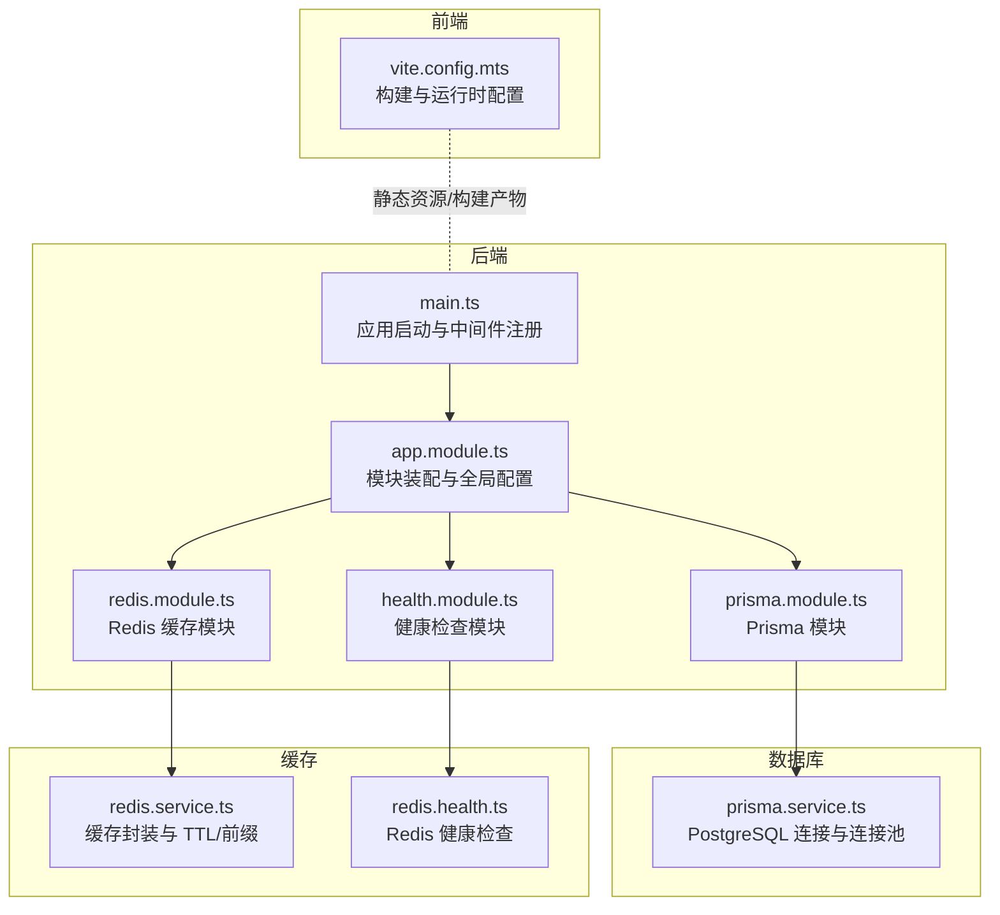
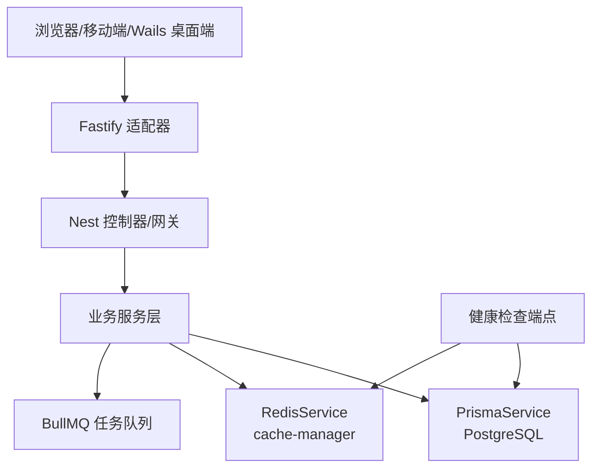
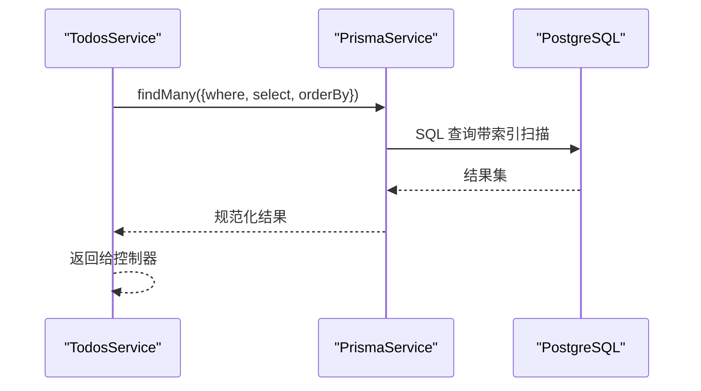
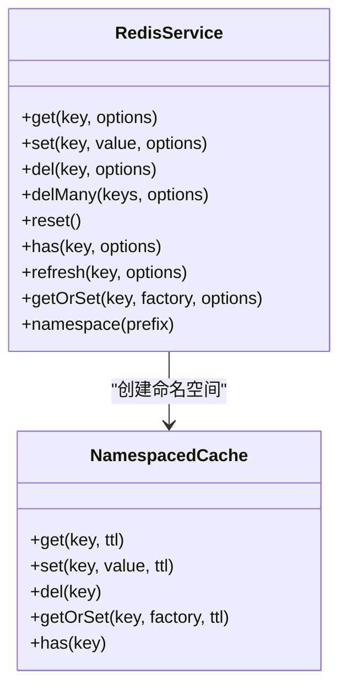
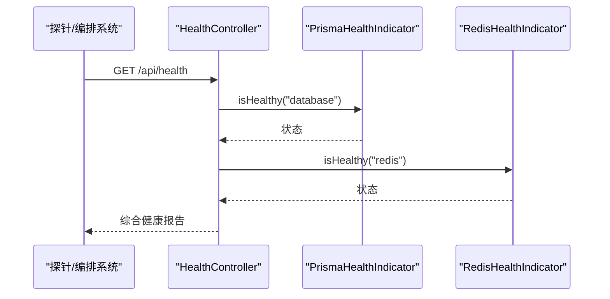
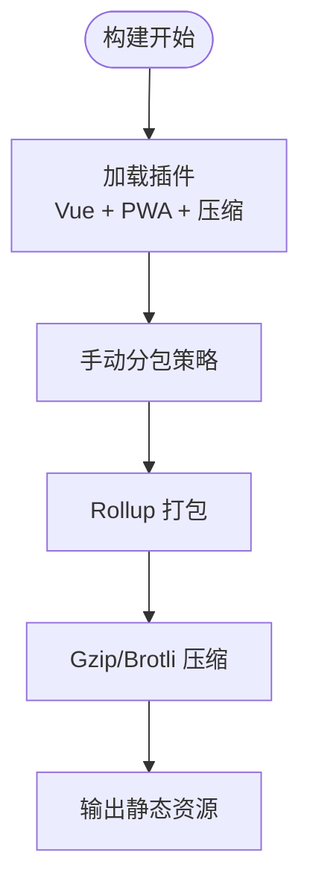
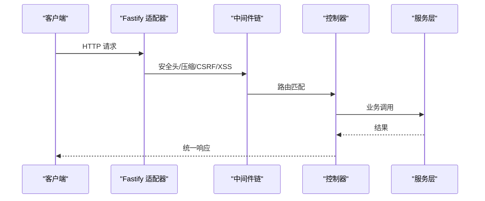
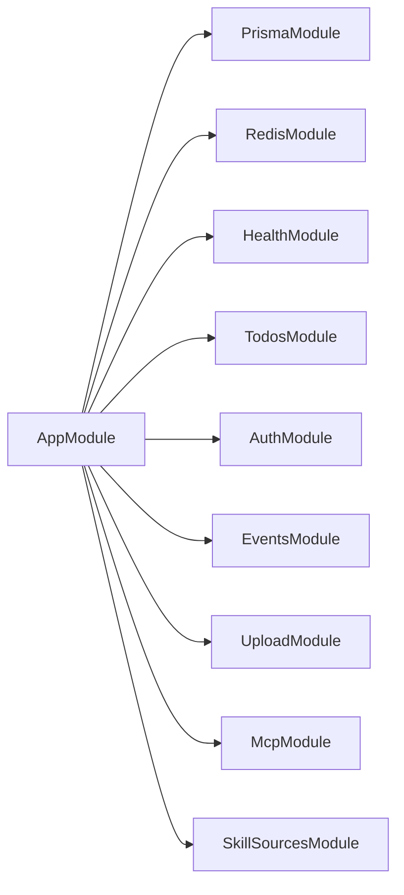

# 性能优化

<cite>
**本文引用的文件**
- [apps/backend/src/prisma/prisma.service.ts](file://apps/backend/src/prisma/prisma.service.ts)
- [apps/backend/src/prisma/prisma.module.ts](file://apps/backend/src/prisma/prisma.module.ts)
- [apps/backend/src/redis/redis.module.ts](file://apps/backend/src/redis/redis.module.ts)
- [apps/backend/src/redis/redis.service.ts](file://apps/backend/src/redis/redis.service.ts)
- [apps/backend/src/redis/redis.health.ts](file://apps/backend/src/redis/redis.health.ts)
- [apps/backend/src/health/prisma.health.ts](file://apps/backend/src/health/prisma.health.ts)
- [apps/backend/src/health/health.controller.ts](file://apps/backend/src/health/health.controller.ts)
- [apps/backend/src/health/health.module.ts](file://apps/backend/src/health/health.module.ts)
- [apps/backend/src/todos/todos.service.ts](file://apps/backend/src/todos/todos.service.ts)
- [apps/backend/src/app.module.ts](file://apps/backend/src/app.module.ts)
- [apps/backend/src/main.ts](file://apps/backend/src/main.ts)
- [apps/backend/package.json](file://apps/backend/package.json)
- [apps/frontend/vite.config.mts](file://apps/frontend/vite.config.mts)
</cite>

## 目录
1. [简介](#简介)
2. [项目结构](#项目结构)
3. [核心组件](#核心组件)
4. [架构总览](#架构总览)
5. [详细组件分析](#详细组件分析)
6. [依赖关系分析](#依赖关系分析)
7. [性能考量](#性能考量)
8. [故障排查指南](#故障排查指南)
9. [结论](#结论)
10. [附录](#附录)

## 简介
本指南面向 Lumina Todo 的性能优化实践，覆盖数据库、缓存、后端服务、前端构建与运行时、监控与健康检查、CDN 与静态资源、负载均衡与水平扩展、移动端与桌面端差异等主题。内容基于仓库中现有实现进行提炼，并提供可落地的优化建议与排障思路。

## 项目结构
后端采用 NestJS + Fastify，数据库使用 Prisma + PostgreSQL，缓存使用 Redis；前端采用 Vite + Vue，内置 PWA 与压缩插件。整体以模块化组织，便于按需启用/禁用能力。

图示来源
- [apps/backend/src/main.ts:34-195](file://apps/backend/src/main.ts#L34-L195)
- [apps/backend/src/app.module.ts:27-175](file://apps/backend/src/app.module.ts#L27-L175)
- [apps/backend/src/prisma/prisma.module.ts:1-10](file://apps/backend/src/prisma/prisma.module.ts#L1-L10)
- [apps/backend/src/prisma/prisma.service.ts:1-34](file://apps/backend/src/prisma/prisma.service.ts#L1-L34)
- [apps/backend/src/redis/redis.module.ts:1-84](file://apps/backend/src/redis/redis.module.ts#L1-L84)
- [apps/backend/src/redis/redis.service.ts:1-233](file://apps/backend/src/redis/redis.service.ts#L1-L233)
- [apps/backend/src/health/health.module.ts:1-14](file://apps/backend/src/health/health.module.ts#L1-L14)
- [apps/backend/src/health/health.controller.ts:1-77](file://apps/backend/src/health/health.controller.ts#L1-L77)
- [apps/frontend/vite.config.mts:1-185](file://apps/frontend/vite.config.mts#L1-L185)

章节来源
- [apps/backend/src/main.ts:34-195](file://apps/backend/src/main.ts#L34-L195)
- [apps/backend/src/app.module.ts:27-175](file://apps/backend/src/app.module.ts#L27-L175)
- [apps/frontend/vite.config.mts:1-185](file://apps/frontend/vite.config.mts#L1-L185)

## 核心组件
- 数据库层：Prisma + PostgreSQL，使用连接池与适配器，提供统一的 ORM 访问与事务能力。
- 缓存层：Redis + cache-manager，提供 TTL、键前缀、命名空间、批量删除、穿透保护等能力。
- 后端服务：NestJS + Fastify，启用安全头、Gzip 压缩、CSRF/XSS 清理、全局拦截器与异常过滤器。
- 健康检查：基于 @nestjs/terminus，检查数据库、Redis、内存、磁盘。
- 前端构建：Vite + Vue，内置 PWA、Gzip/Brotli 压缩、手动分包策略、代理与开发服务器配置。

章节来源
- [apps/backend/src/prisma/prisma.service.ts:1-34](file://apps/backend/src/prisma/prisma.service.ts#L1-L34)
- [apps/backend/src/redis/redis.service.ts:1-233](file://apps/backend/src/redis/redis.service.ts#L1-L233)
- [apps/backend/src/redis/redis.module.ts:1-84](file://apps/backend/src/redis/redis.module.ts#L1-L84)
- [apps/backend/src/health/health.controller.ts:1-77](file://apps/backend/src/health/health.controller.ts#L1-L77)
- [apps/backend/src/main.ts:34-195](file://apps/backend/src/main.ts#L34-L195)
- [apps/frontend/vite.config.mts:1-185](file://apps/frontend/vite.config.mts#L1-L185)

## 架构总览
后端通过 Fastify 提供 HTTP/WebSocket 服务，Prisma 访问 PostgreSQL，Redis 提供缓存与队列（BullMQ）。前端通过 Vite 构建并以 PWA 形式分发静态资源。

图示来源
- [apps/backend/src/main.ts:34-195](file://apps/backend/src/main.ts#L34-L195)
- [apps/backend/src/app.module.ts:96-115](file://apps/backend/src/app.module.ts#L96-L115)
- [apps/backend/src/health/health.controller.ts:31-75](file://apps/backend/src/health/health.controller.ts#L31-L75)
- [apps/backend/src/prisma/prisma.service.ts:1-34](file://apps/backend/src/prisma/prisma.service.ts#L1-L34)
- [apps/backend/src/redis/redis.service.ts:1-233](file://apps/backend/src/redis/redis.service.ts#L1-L233)

## 详细组件分析

### 数据库性能优化（Prisma + PostgreSQL）
- 连接池与适配器
  - 使用 PrismaPg 与 pg.Pool，由 PrismaService 统一初始化与生命周期管理。
  - 建议：在生产环境通过 DATABASE_URL 指定连接参数（如最大连接数、超时），结合数据库侧连接池参数调优。
- 查询优化
  - 使用 select 精确字段，避免 N+1 查询，合理使用 orderBy 与 where 条件。
  - 示例：查询待办列表时仅选择必要字段并按多列排序，减少网络与序列化开销。
- 事务与一致性
  - 对写操作使用事务，保证 tombstone 与删除的原子性。
- 索引与统计
  - 建议：为高频过滤/排序字段建立复合索引；定期更新统计信息；使用 EXPLAIN 分析慢查询。

图示来源
- [apps/backend/src/todos/todos.service.ts:37-46](file://apps/backend/src/todos/todos.service.ts#L37-L46)
- [apps/backend/src/prisma/prisma.service.ts:1-34](file://apps/backend/src/prisma/prisma.service.ts#L1-L34)

章节来源
- [apps/backend/src/prisma/prisma.service.ts:1-34](file://apps/backend/src/prisma/prisma.service.ts#L1-L34)
- [apps/backend/src/todos/todos.service.ts:37-46](file://apps/backend/src/todos/todos.service.ts#L37-L46)

### Redis 缓存策略与参数调优
- 缓存封装
  - 提供 get/set/del/delMany/reset/has/refresh/getOrSet 等方法，支持 TTL 与键前缀。
  - 命名空间 NamespacedCache 自动加前缀，便于隔离与批量失效。
- 连接与重试
  - redisStore 支持延迟连接、ready 检查、最大重试次数与指数退避策略。
  - 默认 TTL 与 keyPrefix 可通过环境变量配置。
- 缓存穿透与热点
  - getOrSet 提供“缓存穿透保护”，先查缓存再回源，避免对下游压力过大。
  - 建议：对热点键设置更短但可刷新的 TTL，配合 refresh 延长生命周期。

图示来源
- [apps/backend/src/redis/redis.service.ts:52-202](file://apps/backend/src/redis/redis.service.ts#L52-L202)

章节来源
- [apps/backend/src/redis/redis.module.ts:1-84](file://apps/backend/src/redis/redis.module.ts#L1-L84)
- [apps/backend/src/redis/redis.service.ts:1-233](file://apps/backend/src/redis/redis.service.ts#L1-L233)

### 健康检查与可用性保障
- 综合健康检查：数据库、Redis、内存堆/常驻集、磁盘使用率。
- 存活/就绪探针：分别用于容器编排的存活与就绪判断。
- 健康指示器：PrismaHealthIndicator 与 RedisHealthIndicator 基于简单查询验证连通性。

图示来源
- [apps/backend/src/health/health.controller.ts:31-75](file://apps/backend/src/health/health.controller.ts#L31-L75)
- [apps/backend/src/health/prisma.health.ts:19-30](file://apps/backend/src/health/prisma.health.ts#L19-L30)
- [apps/backend/src/redis/redis.health.ts:20-41](file://apps/backend/src/redis/redis.health.ts#L20-L41)

章节来源
- [apps/backend/src/health/health.controller.ts:1-77](file://apps/backend/src/health/health.controller.ts#L1-L77)
- [apps/backend/src/health/prisma.health.ts:1-32](file://apps/backend/src/health/prisma.health.ts#L1-L32)
- [apps/backend/src/redis/redis.health.ts:1-43](file://apps/backend/src/redis/redis.health.ts#L1-L43)

### 前端性能优化（Vite + Vue）
- 代码分割与手动分包
  - 通过 manualChunks 将大型依赖拆分为独立包（如 vue-vendor、ui-vendor、chart-vendor、mermaid-vendor、markdown-vendor、utils-vendor）。
- 资源压缩
  - 同时启用 gzip 与 brotli 压缩，阈值 1KB，提升传输效率。
- PWA 与缓存策略
  - 注册 Service Worker，支持离线与增量更新；manifest 与图标资源优化。
- 开发体验
  - 代理到后端 API 与 WebSocket，增加超时容忍，便于联调。
- 构建体积控制
  - 警告阈值 2MB，关注大包引入。

图示来源
- [apps/frontend/vite.config.mts:80-185](file://apps/frontend/vite.config.mts#L80-L185)

章节来源
- [apps/frontend/vite.config.mts:1-185](file://apps/frontend/vite.config.mts#L1-L185)

### 后端服务性能优化（并发、内存与 GC）
- 平台与适配器
  - 使用 FastifyAdapter，具备更好的吞吐与更低的 GC 压力。
- 中间件与安全
  - Helmet、Gzip 压缩、CSRF/XSS 清理、CORS、静态资源托管，降低无效请求与安全风险。
- 全局管道与拦截器
  - Zod 验证、统一响应格式、XSS 清理，减少业务层重复逻辑。
- 进程与内存
  - 构建脚本设置 NODE_OPTIONS="--max-old-space-size=8192"，缓解大体量类型检查/构建时内存不足。
- 速率限制
  - 多档位 TTL/limit，防止滥用与雪崩。

图示来源
- [apps/backend/src/main.ts:34-195](file://apps/backend/src/main.ts#L34-L195)
- [apps/backend/src/app.module.ts:117-138](file://apps/backend/src/app.module.ts#L117-L138)
- [apps/backend/package.json:8-28](file://apps/backend/package.json#L8-L28)

章节来源
- [apps/backend/src/main.ts:34-195](file://apps/backend/src/main.ts#L34-L195)
- [apps/backend/src/app.module.ts:117-138](file://apps/backend/src/app.module.ts#L117-L138)
- [apps/backend/package.json:8-28](file://apps/backend/package.json#L8-L28)

### 负载均衡与水平扩展
- 健康检查端点
  - 提供 /api/health、/api/health/liveness、/api/health/readiness，便于 LB/编排系统探测。
- 连接与会话
  - Redis 既作缓存也作 BullMQ 队列后端，适合无状态服务横向扩展。
- 建议
  - 使用反向代理（如 Nginx 或云负载均衡）分发请求；前端静态资源可前置 CDN；后端按需多实例部署并共享 Redis/DB。

章节来源
- [apps/backend/src/health/health.controller.ts:57-75](file://apps/backend/src/health/health.controller.ts#L57-L75)
- [apps/backend/src/app.module.ts:96-115](file://apps/backend/src/app.module.ts#L96-L115)

### CDN 与静态资源优化
- 前端构建已内置压缩与 PWA，建议：
  - 将构建产物部署至 CDN，开启持久缓存与按需失效；
  - 对图片/字体等资源使用现代编码（WebP/AVIF）与合适的尺寸裁切；
  - 静态资源域名与主站分离，减少 Cookie 开销。

章节来源
- [apps/frontend/vite.config.mts:88-146](file://apps/frontend/vite.config.mts#L88-L146)

### 性能监控与基准测试
- 监控指标
  - CPU/内存/连接数/队列长度/缓存命中率/错误率/请求时延/P95/P99。
- 健康检查
  - 使用 /api/health 与 /api/health/readiness 作为编排探针。
- 基准测试
  - 使用 wrk/Artillery/JMeter 对关键接口（登录、获取待办、同步）施压，记录 RPS、P95/P99 时延与错误率。

章节来源
- [apps/backend/src/health/health.controller.ts:31-75](file://apps/backend/src/health/health.controller.ts#L31-L75)

### 缓存策略与数据预加载
- 缓存策略
  - 低延迟读路径：用户会话、配置、热门列表等设置较短 TTL；热点键配合 refresh 延长。
  - 命名空间：按模块/租户隔离，避免串扰。
- 预加载
  - 首屏关键数据可在路由进入前预取；WebSocket 订阅变更增量推送，减少轮询。

章节来源
- [apps/backend/src/redis/redis.service.ts:30-45](file://apps/backend/src/redis/redis.service.ts#L30-L45)
- [apps/backend/src/redis/redis.service.ts:146-161](file://apps/backend/src/redis/redis.service.ts#L146-L161)

### 移动端与桌面端性能特殊考虑
- 移动端
  - 更换 brotli 压缩阈值与缓存策略；减少首屏 JS 体积；启用 PWA 离线能力；注意电池与网络切换。
- 桌面端（Wails）
  - 构建基座为本地进程，注意资源打包与权限；代理与静态资源路径需适配相对路径。

章节来源
- [apps/frontend/vite.config.mts:16-21](file://apps/frontend/vite.config.mts#L16-L21)
- [apps/frontend/vite.config.mts:154-174](file://apps/frontend/vite.config.mts#L154-L174)

## 依赖关系分析
- 模块耦合
  - AppModule 统一装配配置、日志、事件、队列、速率限制、国际化、Prisma、Redis、各业务模块。
  - PrismaModule/RedisModule 作为全局模块被注入，降低跨模块重复配置。
- 外部依赖
  - Fastify、Prisma、Redis、BullMQ、cache-manager、@fastify/* 插件等。

图示来源
- [apps/backend/src/app.module.ts:13-22](file://apps/backend/src/app.module.ts#L13-L22)

章节来源
- [apps/backend/src/app.module.ts:13-22](file://apps/backend/src/app.module.ts#L13-L22)

## 性能考量
- 数据库
  - 为高频查询字段建立索引；使用 EXPLAIN 分析；避免 SELECT *；合理分页与游标分页。
- 缓存
  - 评估命中率与 TTL；热点键短 TTL + refresh；批量删除与命名空间隔离。
- 后端
  - 保持 Fastify 适配器；启用 Gzip；严格 CORS/CSRF/XSS；全局拦截器减少重复逻辑。
- 前端
  - 代码分割与懒加载；压缩与 PWA；控制包体积与首屏资源。
- 运维
  - 健康检查端点；日志分级；内存与磁盘阈值；CDN 与静态资源优化。

## 故障排查指南
- 数据库不可用
  - 检查 DATABASE_URL 与连接参数；查看 PrismaHealthIndicator 报错；确认数据库服务与网络连通。
- Redis 不可用
  - 检查 REDIS_* 环境变量；查看 RedisHealthIndicator 报错；确认连接重试策略与 keyPrefix。
- 健康检查失败
  - 使用 /api/health 查看具体失败项；定位内存/磁盘/数据库/Redis 任一异常。
- 构建/运行内存不足
  - 检查 NODE_OPTIONS 与构建脚本；适当提高 --max-old-space-size。
- 前端代理/WS 断连
  - 检查 Vite 代理配置与超时；确认后端 CORS/CSRF/XSS 是否拦截了合法请求。

章节来源
- [apps/backend/src/health/prisma.health.ts:19-30](file://apps/backend/src/health/prisma.health.ts#L19-L30)
- [apps/backend/src/redis/redis.health.ts:20-41](file://apps/backend/src/redis/redis.health.ts#L20-L41)
- [apps/backend/src/health/health.controller.ts:31-75](file://apps/backend/src/health/health.controller.ts#L31-L75)
- [apps/backend/package.json:8-28](file://apps/backend/package.json#L8-L28)
- [apps/frontend/vite.config.mts:154-174](file://apps/frontend/vite.config.mts#L154-L174)

## 结论
通过合理的数据库索引与查询优化、Redis 命名空间与 TTL 策略、Fastify 适配器与中间件、Vite 代码分割与压缩、以及完善的健康检查与监控，Lumina Todo 可在多端稳定高效运行。建议持续以监控与基准测试驱动迭代，逐步完善缓存预热、队列背压与异步处理策略。

## 附录
- 关键端点
  - /api/health：综合健康检查
  - /api/health/liveness：存活探针
  - /api/health/readiness：就绪探针
- 关键环境变量（参考）
  - DATABASE_URL、REDIS_HOST、REDIS_PORT、REDIS_PASSWORD、REDIS_DB、REDIS_KEY_PREFIX、REDIS_DEFAULT_TTL、UPLOAD_MAX_SIZE、UPLOAD_MAX_FILES、CORS_ORIGIN、PORT、NODE_ENV、LOG_LEVEL、VITE_BASE_URL、VITE_PROXY_TARGET、VITE_PWA_DEV、WAILS