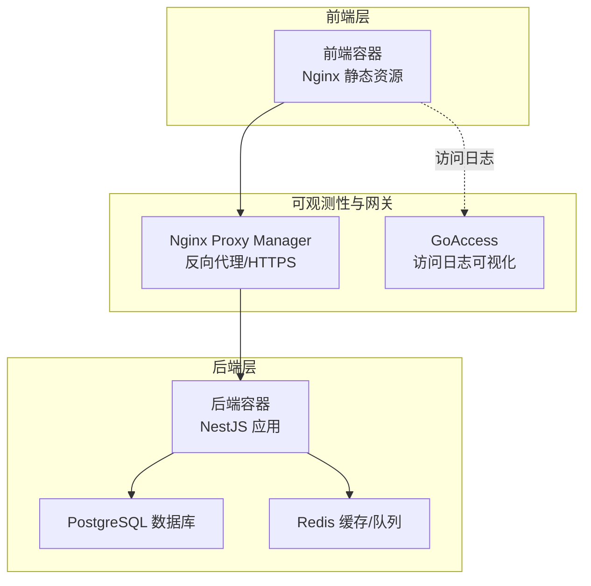
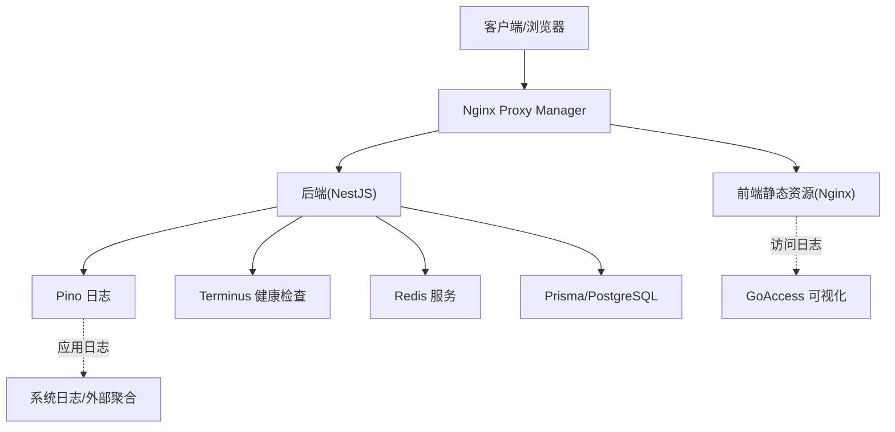
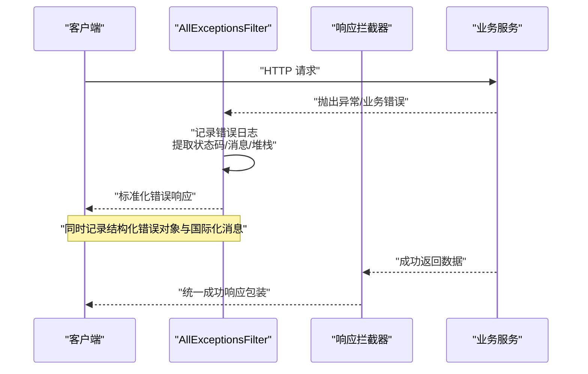
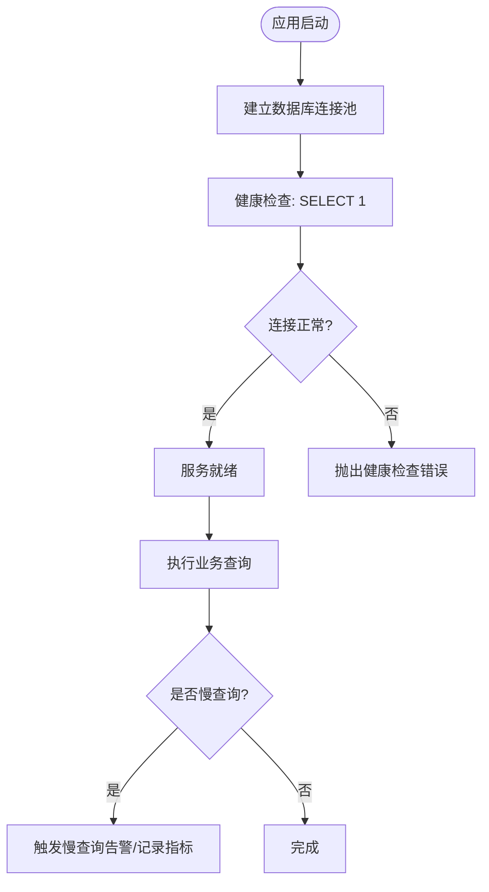
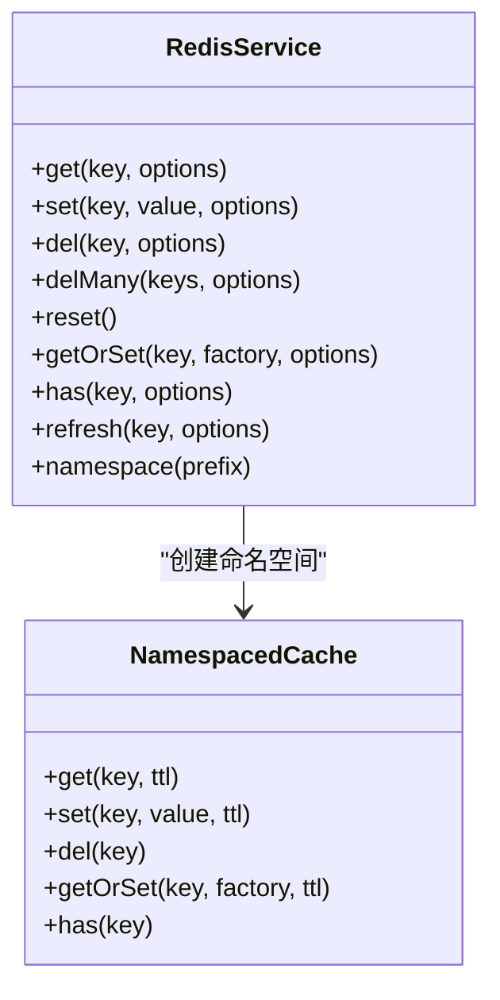
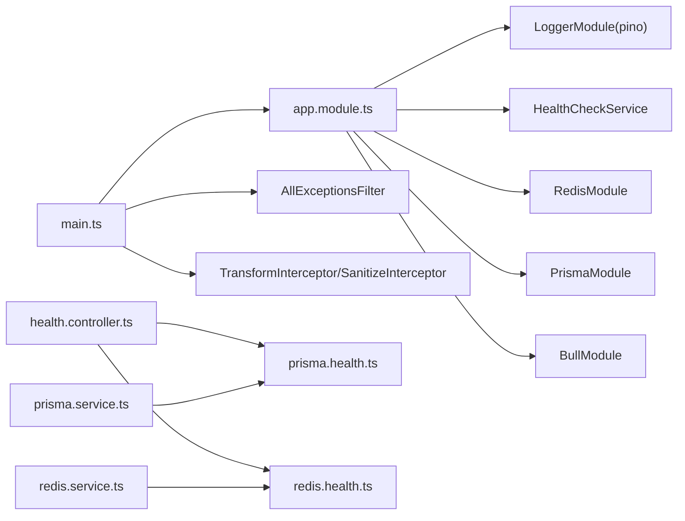

# 监控与日志

<cite>
**本文引用的文件**
- [apps/backend/src/main.ts](file://apps/backend/src/main.ts)
- [apps/backend/src/app.module.ts](file://apps/backend/src/app.module.ts)
- [apps/backend/src/common/filters/all-exceptions.filter.ts](file://apps/backend/src/common/filters/all-exceptions.filter.ts)
- [apps/backend/src/common/interceptors/transform.interceptor.ts](file://apps/backend/src/common/interceptors/transform.interceptor.ts)
- [apps/backend/src/common/interceptors/sanitize.interceptor.ts](file://apps/backend/src/common/interceptors/sanitize.interceptor.ts)
- [apps/backend/src/health/health.controller.ts](file://apps/backend/src/health/health.controller.ts)
- [apps/backend/src/health/prisma.health.ts](file://apps/backend/src/health/prisma.health.ts)
- [apps/backend/src/redis/redis.health.ts](file://apps/backend/src/redis/redis.health.ts)
- [apps/backend/src/redis/redis.service.ts](file://apps/backend/src/redis/redis.service.ts)
- [apps/backend/src/prisma/prisma.service.ts](file://apps/backend/src/prisma/prisma.service.ts)
- [apps/backend/Dockerfile](file://apps/backend/Dockerfile)
- [apps/frontend/Dockerfile](file://apps/frontend/Dockerfile)
- [docker-compose.yml](file://docker-compose.yml)
- [docker-compose.dev.yml](file://docker-compose.dev.yml)
</cite>

## 目录
1. [简介](#简介)
2. [项目结构](#项目结构)
3. [核心组件](#核心组件)
4. [架构总览](#架构总览)
5. [详细组件分析](#详细组件分析)
6. [依赖关系分析](#依赖关系分析)
7. [性能考量](#性能考量)
8. [故障排查指南](#故障排查指南)
9. [结论](#结论)
10. [附录](#附录)

## 简介
本指南面向 Lumina Todo 的运维与开发团队，提供一套完整的监控与日志系统配置说明，覆盖以下方面：
- Docker 日志配置与日志轮转策略
- 应用程序级别的错误处理与异常捕获机制
- 数据库性能监控与慢查询分析方法
- Redis 缓存性能监控与内存使用跟踪
- 前端性能监控与用户体验指标收集
- 系统资源监控（CPU、内存、磁盘、网络）的配置方法
- 自定义指标的采集与可视化展示
- 告警规则配置与通知机制设置
- 日志分析工具的使用指南与常见问题排查
- 监控数据的长期存储与备份策略

## 项目结构
Lumina Todo 采用前后端分离的微服务式架构，后端基于 NestJS，前端基于 Capacitor/Vue，通过 Docker Compose 编排，配合 Nginx Proxy Manager 提供反向代理与 HTTPS，GoAccess 可视化前端访问日志。

图表来源
- [docker-compose.yml:177-204](file://docker-compose.yml#L177-L204)
- [apps/backend/Dockerfile:97-102](file://apps/backend/Dockerfile#L97-L102)
- [apps/frontend/Dockerfile:88-93](file://apps/frontend/Dockerfile#L88-L93)

章节来源
- [docker-compose.yml:19-237](file://docker-compose.yml#L19-L237)
- [apps/backend/Dockerfile:1-103](file://apps/backend/Dockerfile#L1-L103)
- [apps/frontend/Dockerfile:1-94](file://apps/frontend/Dockerfile#L1-L94)

## 核心组件
- 全局日志与安全中间件：后端使用 Pino 日志模块与 Fastify 插件（Helmet、Gzip、Multipart、Cookie），统一请求日志格式与安全策略。
- 全局异常过滤器：统一捕获未处理异常，记录错误日志并返回标准化错误响应。
- 响应转换与 XSS 清理拦截器：统一成功响应格式与输入净化。
- 健康检查控制器：使用 @nestjs/terminus 提供数据库、Redis、内存、磁盘健康检查与存活/就绪探针。
- Redis 服务：封装缓存键前缀、TTL、批量操作与命名空间缓存。
- Prisma 服务：基于 PostgreSQL 的 ORM 客户端，负责连接与生命周期管理。
- Docker 编排：生产与开发环境分别提供日志轮转、健康检查、只读文件系统、非 root 用户等安全加固。

章节来源
- [apps/backend/src/main.ts:34-201](file://apps/backend/src/main.ts#L34-L201)
- [apps/backend/src/app.module.ts:27-175](file://apps/backend/src/app.module.ts#L27-L175)
- [apps/backend/src/common/filters/all-exceptions.filter.ts:16-137](file://apps/backend/src/common/filters/all-exceptions.filter.ts#L16-L137)
- [apps/backend/src/common/interceptors/transform.interceptor.ts:18-30](file://apps/backend/src/common/interceptors/transform.interceptor.ts#L18-L30)
- [apps/backend/src/common/interceptors/sanitize.interceptor.ts:9-64](file://apps/backend/src/common/interceptors/sanitize.interceptor.ts#L9-L64)
- [apps/backend/src/health/health.controller.ts:16-77](file://apps/backend/src/health/health.controller.ts#L16-L77)
- [apps/backend/src/redis/redis.service.ts:51-233](file://apps/backend/src/redis/redis.service.ts#L51-L233)
- [apps/backend/src/prisma/prisma.service.ts:6-34](file://apps/backend/src/prisma/prisma.service.ts#L6-L34)

## 架构总览
下图展示了监控与日志在系统中的位置与交互：

图表来源
- [apps/backend/src/main.ts:115-157](file://apps/backend/src/main.ts#L115-L157)
- [apps/backend/src/app.module.ts:34-88](file://apps/backend/src/app.module.ts#L34-L88)
- [apps/backend/src/health/health.controller.ts:31-75](file://apps/backend/src/health/health.controller.ts#L31-L75)
- [docker-compose.yml:177-204](file://docker-compose.yml#L177-L204)

## 详细组件分析

### Docker 日志配置与日志轮转策略
- 生产镜像与健康检查
  - 后端镜像在 HEALTHCHECK 中对存活探针进行轮询，启动缓冲期较长以适应初始化压力。
  - 前端镜像在 HEALTHCHECK 中对静态站点健康页进行轮询。
- 日志轮转
  - Compose 为各服务统一配置 json-file 驱动的日志轮转：单文件最大 10MB，最多保留 3 个文件。
  - 前端容器将 Nginx 访问/错误日志挂载至命名卷，便于外部采集与可视化。
- 开发环境
  - 开发 Compose 为各服务开启 json-file 日志轮转，便于本地调试与日志聚合。

建议
- 在生产环境中，建议将应用日志与访问日志分别采集到集中式日志系统（如 ELK/EFK、Loki+Grafana、Cloud Logging 等），并启用压缩与索引策略。
- 对于高频错误日志，可在 Pino 中增加采样或阈值过滤，降低噪声。

章节来源
- [apps/backend/Dockerfile:97-102](file://apps/backend/Dockerfile#L97-L102)
- [apps/frontend/Dockerfile:88-93](file://apps/frontend/Dockerfile#L88-L93)
- [docker-compose.yml:13-18](file://docker-compose.yml#L13-L18)
- [docker-compose.yml:150-167](file://docker-compose.yml#L150-L167)
- [docker-compose.dev.yml:36-40](file://docker-compose.dev.yml#L36-L40)
- [docker-compose.dev.yml:61-66](file://docker-compose.dev.yml#L61-L66)
- [docker-compose.dev.yml:132-136](file://docker-compose.dev.yml#L132-L136)

### 应用程序级别的错误处理与异常捕获机制
- 全局异常过滤器
  - 捕获所有未处理异常，记录请求方法、URL、状态码与堆栈信息，并返回统一的错误响应结构（包含 success、data、message、errors、statusCode、timestamp）。
  - 支持 Zod 验证错误的结构化映射与国际化消息处理。
  - 对业务异常（如冲突）进行字段级映射，提升前端可消费的错误语义。
- 响应转换拦截器
  - 成功响应统一包装为 { success: true, data, timestamp }，便于前端一致性处理。
- XSS 清理拦截器
  - 对请求体、查询参数、路径参数进行递归净化，禁止任何 HTML 标签，降低 XSS 风险。
- 安全中间件与 CSRF 防护
  - 使用 Helmet 设置安全头，Gzip 压缩响应，Multipart 解析上传，Cookie 管理。
  - onRequest 钩子对非安全方法进行 CSRF 校验，缺失 X-Requested-With 头时拒绝请求并返回标准化错误。

图表来源
- [apps/backend/src/common/filters/all-exceptions.filter.ts:27-135](file://apps/backend/src/common/filters/all-exceptions.filter.ts#L27-L135)
- [apps/backend/src/common/interceptors/transform.interceptor.ts:20-28](file://apps/backend/src/common/interceptors/transform.interceptor.ts#L20-L28)
- [apps/backend/src/common/interceptors/sanitize.interceptor.ts:17-35](file://apps/backend/src/common/interceptors/sanitize.interceptor.ts#L17-L35)
- [apps/backend/src/main.ts:115-157](file://apps/backend/src/main.ts#L115-L157)

章节来源
- [apps/backend/src/common/filters/all-exceptions.filter.ts:16-137](file://apps/backend/src/common/filters/all-exceptions.filter.ts#L16-L137)
- [apps/backend/src/common/interceptors/transform.interceptor.ts:18-30](file://apps/backend/src/common/interceptors/transform.interceptor.ts#L18-L30)
- [apps/backend/src/common/interceptors/sanitize.interceptor.ts:9-64](file://apps/backend/src/common/interceptors/sanitize.interceptor.ts#L9-L64)
- [apps/backend/src/main.ts:115-169](file://apps/backend/src/main.ts#L115-L169)

### 数据库性能监控与慢查询分析方法
- 连接与生命周期
  - PrismaService 基于 PostgreSQL 连接池，模块初始化时连接，销毁时断开并结束连接池。
- 健康检查
  - Prisma 健康指示器通过一次简单查询验证连接可用性，失败时抛出健康检查错误。
- 慢查询与性能分析
  - 建议在 PostgreSQL 中启用 pg_stat_statements 或 log_slow_queries，结合 Grafana/Prometheus/Cloud SQL Monitoring 进行慢查询识别与趋势分析。
  - 在应用侧，对关键查询增加超时控制与重试策略，避免阻塞主线程。
  - 使用 Prisma 的事务与批量操作减少往返次数，必要时开启只读事务与并行查询优化。

图表来源
- [apps/backend/src/prisma/prisma.service.ts:23-32](file://apps/backend/src/prisma/prisma.service.ts#L23-L32)
- [apps/backend/src/health/prisma.health.ts:19-30](file://apps/backend/src/health/prisma.health.ts#L19-L30)

章节来源
- [apps/backend/src/prisma/prisma.service.ts:6-34](file://apps/backend/src/prisma/prisma.service.ts#L6-L34)
- [apps/backend/src/health/prisma.health.ts:10-31](file://apps/backend/src/health/prisma.health.ts#L10-L31)

### Redis 缓存性能监控与内存使用跟踪
- 健康检查
  - Redis 健康指示器通过一次 set/get 测试验证连通性与读写一致性，失败时抛出健康检查错误。
- 缓存服务
  - 提供统一的 get/set/del/delMany/reset/getOrSet/has/refresh 等操作，支持键前缀与 TTL 管理。
  - 命名空间缓存自动附加前缀，便于隔离与统计。
- 性能与内存
  - 建议启用 Redis AOF/RDB 持久化与 maxmemory 策略（LRU），结合 INFO/STATS 命令与 Prometheus Exporter 监控命中率、内存使用、连接数、阻塞命令等指标。
  - 对热点键设置合理 TTL，定期清理过期键，避免碎片化。

图表来源
- [apps/backend/src/redis/redis.service.ts:51-233](file://apps/backend/src/redis/redis.service.ts#L51-L233)

章节来源
- [apps/backend/src/redis/redis.health.ts:10-42](file://apps/backend/src/redis/redis.health.ts#L10-L42)
- [apps/backend/src/redis/redis.service.ts:51-233](file://apps/backend/src/redis/redis.service.ts#L51-L233)

### 前端性能监控与用户体验指标收集
- 访问日志采集
  - 前端容器将 Nginx 日志目录挂载到命名卷，GoAccess 通过只读挂载读取访问日志并生成实时 HTML 报表。
- 指标建议
  - 关键指标：页面加载时间（TTFB/LCP/FID/CLS）、首次内容绘制（FCP）、用户输入延迟（INP）、服务器响应时间、错误率、并发请求数。
  - 可视化：使用 Grafana 展示 Nginx 指标与 GoAccess 报表，结合告警规则触发通知。
- 采集方式
  - Nginx 指标可通过 Nginx Plus 或第三方 Exporter（如 nginx-prometheus-exporter）采集。
  - 前端应用可集成 Web Vitals SDK 或 PerformanceObserver API 上报关键指标。

章节来源
- [docker-compose.yml:177-204](file://docker-compose.yml#L177-L204)
- [apps/frontend/Dockerfile:62-80](file://apps/frontend/Dockerfile#L62-L80)

### 系统资源监控（CPU、内存、磁盘、网络）
- 容器资源限制与健康检查
  - 后端/前端/数据库/Redis 均配置 HEALTHCHECK，结合 Compose 的 restart 策略实现自愈。
  - 前端容器启用只读文件系统与 tmpfs，降低攻击面。
- 建议指标
  - CPU 使用率、内存使用/限制、磁盘容量/使用率/IO、网络吞吐、连接数、队列长度（BullMQ）。
  - 使用 Prometheus/Grafana 或云平台监控方案进行采集与可视化。
- 安全加固
  - 非 root 用户运行、capabilities drop、seccomp 等安全选项已在镜像与 Compose 中体现。

章节来源
- [apps/backend/Dockerfile:67-88](file://apps/backend/Dockerfile#L67-L88)
- [apps/frontend/Dockerfile:54-83](file://apps/frontend/Dockerfile#L54-L83)
- [docker-compose.yml:126-135](file://docker-compose.yml#L126-L135)
- [docker-compose.yml:161-167](file://docker-compose.yml#L161-L167)

### 自定义指标的采集与可视化展示
- 指标来源
  - 应用日志：通过 Pino 结构化日志，结合日志系统（如 Loki）进行指标抽取（如错误率、响应时间分布）。
  - Nginx 指标：通过 Exporter 采集请求/响应、状态码分布、带宽等。
  - Redis/数据库：通过各自 Exporter 或监控面板采集连接数、命中率、慢查询等。
- 可视化
  - Grafana 仪表板整合多源指标，设置阈值告警与通知。
- 建议
  - 对高频事件进行采样与聚合，避免指标风暴。
  - 为关键路径（登录、创建任务、文件上传）单独建立仪表板。

章节来源
- [apps/backend/src/app.module.ts:34-88](file://apps/backend/src/app.module.ts#L34-L88)
- [docker-compose.yml:177-204](file://docker-compose.yml#L177-L204)

### 告警规则配置与通知机制设置
- 健康检查告警
  - 后端/前端/数据库/Redis 的 HEALTHCHECK 失败即触发告警。
- 日志告警
  - 对错误日志（如 5xx、认证失败、Zod 验证失败）设置阈值告警。
- 指标告警
  - CPU/内存/磁盘/网络/Redis/数据库连接数/慢查询等设置阈值与趋势告警。
- 通知渠道
  - 建议通过 Slack/Webhook/邮件等方式推送告警，结合 Grafana/Alertmanager 或云平台告警中心。

章节来源
- [apps/backend/Dockerfile:97-102](file://apps/backend/Dockerfile#L97-L102)
- [apps/frontend/Dockerfile:88-93](file://apps/frontend/Dockerfile#L88-L93)
- [docker-compose.yml:44-48](file://docker-compose.yml#L44-L48)
- [docker-compose.yml:63-67](file://docker-compose.yml#L63-L67)

### 日志分析工具的使用指南与常见问题排查
- GoAccess 使用
  - 通过只读挂载前端日志卷，启动 GoAccess 实时生成 HTML 报表，默认监听 7890 端口。
  - 可通过环境变量调整绑定地址、端口与忽略爬虫。
- 常见问题
  - 日志为空：确认前端容器已挂载日志卷且 Nginx 正常写入；确认 GoAccess 只读挂载有效。
  - 访问被拒绝：检查绑定地址与防火墙；确认 NPM/反代未阻止访问。
- 建议
  - 将 GoAccess 报表与 Grafana 结合，形成“访问日志可视化 + 指标监控”的双视角。

章节来源
- [docker-compose.yml:177-204](file://docker-compose.yml#L177-L204)

### 监控数据的长期存储与备份策略
- 日志存储
  - 建议将应用日志与访问日志导入集中式日志系统，设置滚动索引与冷热分层存储。
- 指标与告警
  - 指标数据建议保留 3–12 个月，结合压缩与归档策略降低成本。
- 备份策略
  - 数据库与 Redis：定期快照与 WAL/AOF 备份；验证恢复流程。
  - 配置与日志：版本化管理，纳入 CI/CD 流程。

## 依赖关系分析

图表来源
- [apps/backend/src/main.ts:28-30](file://apps/backend/src/main.ts#L28-L30)
- [apps/backend/src/app.module.ts:34-115](file://apps/backend/src/app.module.ts#L34-L115)
- [apps/backend/src/health/health.controller.ts:19-25](file://apps/backend/src/health/health.controller.ts#L19-L25)
- [apps/backend/src/redis/redis.service.ts:52-56](file://apps/backend/src/redis/redis.service.ts#L52-L56)
- [apps/backend/src/prisma/prisma.service.ts:7-21](file://apps/backend/src/prisma/prisma.service.ts#L7-L21)

章节来源
- [apps/backend/src/main.ts:28-30](file://apps/backend/src/main.ts#L28-L30)
- [apps/backend/src/app.module.ts:27-175](file://apps/backend/src/app.module.ts#L27-L175)
- [apps/backend/src/health/health.controller.ts:16-77](file://apps/backend/src/health/health.controller.ts#L16-L77)
- [apps/backend/src/redis/redis.service.ts:51-233](file://apps/backend/src/redis/redis.service.ts#L51-L233)
- [apps/backend/src/prisma/prisma.service.ts:6-34](file://apps/backend/src/prisma/prisma.service.ts#L6-L34)

## 性能考量
- 启动与健康检查
  - 后端 HEALTHCHECK 设置了较长启动缓冲期，避免冷启动期间误判。
- 日志级别与序列化
  - 生产环境使用 JSON 日志，开发环境使用 pino-pretty；自定义日志级别与序列化器，减少冗余字段。
- 压缩与安全
  - Gzip 压缩响应，Helmet 设置安全头，降低带宽与风险。
- 缓存与队列
  - Redis 命名空间与 TTL 策略，BullMQ 指数退避与失败保留，提升稳定性与可观测性。

章节来源
- [apps/backend/Dockerfile:97-102](file://apps/backend/Dockerfile#L97-L102)
- [apps/backend/src/app.module.ts:34-88](file://apps/backend/src/app.module.ts#L34-L88)
- [apps/backend/src/main.ts:84-113](file://apps/backend/src/main.ts#L84-L113)

## 故障排查指南
- 后端无法访问
  - 检查 HEALTHCHECK 是否通过；确认端口 3000 暴露与监听 0.0.0.0；查看容器日志轮转是否生效。
- 前端静态资源 404
  - 检查 Nginx 配置与卷挂载；确认 GoAccess 是否正确读取日志。
- 数据库/Redis 不可用
  - 使用 Compose 健康检查命令验证；查看对应容器日志与卷状态。
- 错误响应不一致
  - 确认全局异常过滤器与响应拦截器已注册；检查 Zod 验证与国际化上下文。
- CSRF/安全头告警
  - 确认 X-Requested-With 头存在；检查 Helmet 配置与反代设置。

章节来源
- [apps/backend/src/main.ts:115-157](file://apps/backend/src/main.ts#L115-L157)
- [apps/backend/src/common/filters/all-exceptions.filter.ts:27-135](file://apps/backend/src/common/filters/all-exceptions.filter.ts#L27-L135)
- [apps/backend/src/common/interceptors/transform.interceptor.ts:20-28](file://apps/backend/src/common/interceptors/transform.interceptor.ts#L20-L28)
- [docker-compose.yml:44-48](file://docker-compose.yml#L44-L48)
- [docker-compose.yml:63-67](file://docker-compose.yml#L63-L67)

## 结论
通过统一的日志与安全中间件、完善的健康检查体系、结构化的错误处理与响应包装，以及 Docker 与 Compose 的日志轮转与健康检查配置，Lumina Todo 已具备可扩展的监控与日志基础设施。建议在此基础上引入集中式日志与指标系统、完善告警与通知机制，并持续优化数据库与缓存的性能与容量规划。

## 附录
- 健康检查端点
  - 综合健康检查：/api/health
  - 存活探针：/api/health/liveness
  - 就绪探针：/api/health/readiness
- GoAccess 报表
  - 默认端口 7890，支持跨域访问与实时 HTML 报表。

章节来源
- [apps/backend/src/health/health.controller.ts:31-75](file://apps/backend/src/health/health.controller.ts#L31-L75)
- [docker-compose.yml:182-194](file://docker-compose.yml#L182-L194)