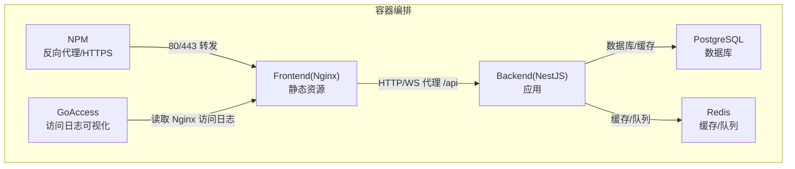
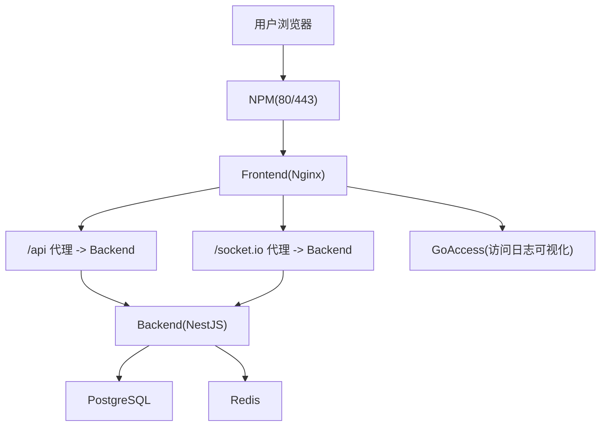
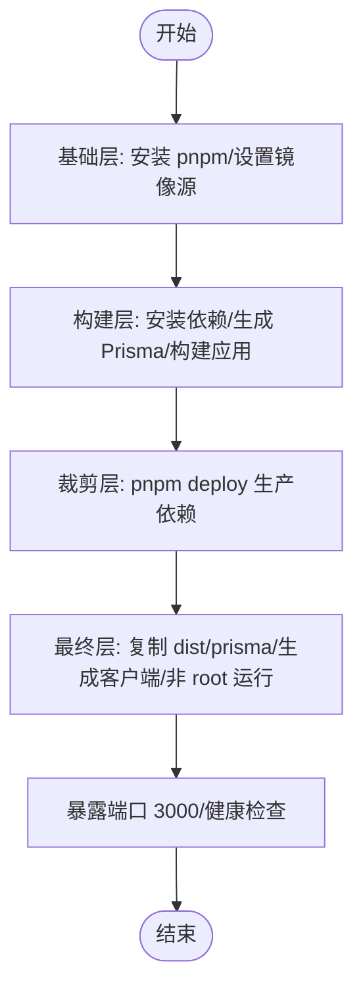
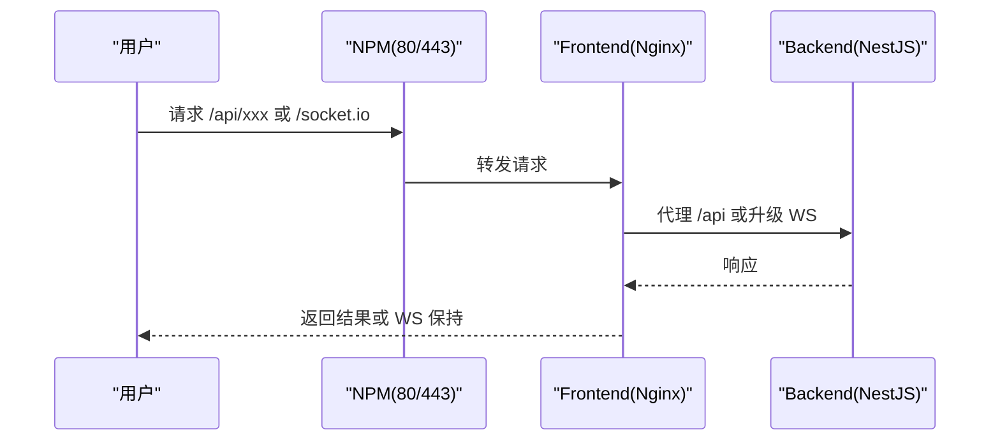
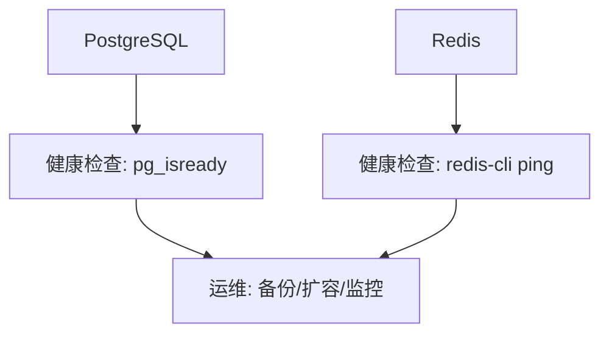
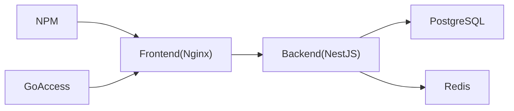

# 部署运维

<cite>
**本文引用的文件**
- [docker-compose.yml](file://docker-compose.yml)
- [docker-compose.dev.yml](file://docker-compose.dev.yml)
- [apps/backend/Dockerfile](file://apps/backend/Dockerfile)
- [apps/frontend/Dockerfile](file://apps/frontend/Dockerfile)
- [apps/frontend/nginx.conf](file://apps/frontend/nginx.conf)
- [apps/frontend/nginx.main.conf](file://apps/frontend/nginx.main.conf)
- [package.json](file://package.json)
- [ecosystem.config.js](file://ecosystem.config.js)
- [scripts/deploy-app.sh](file://scripts/deploy-app.sh)
- [scripts/dev-bootstrap.sh](file://scripts/dev-bootstrap.sh)
- [scripts/security-audit.js](file://scripts/security-audit.js)
</cite>

## 目录
1. [简介](#简介)
2. [项目结构](#项目结构)
3. [核心组件](#核心组件)
4. [架构总览](#架构总览)
5. [详细组件分析](#详细组件分析)
6. [依赖关系分析](#依赖关系分析)
7. [性能考量](#性能考量)
8. [故障排除指南](#故障排除指南)
9. [结论](#结论)
10. [附录](#附录)

## 简介
本指南面向 Lumina Todo 的部署与运维团队，覆盖容器化部署策略、配置文件说明、生产环境系统与硬件建议、CI/CD 流水线与自动化部署、反向代理与负载均衡、数据库与备份恢复、监控与日志、性能指标与告警、安全加固与漏洞扫描、滚动更新与蓝绿部署、故障排除与应急响应、以及成本优化与资源管理等主题。文档同时兼顾技术深度与可操作性，帮助不同背景的读者快速落地。

## 项目结构
Lumina Todo 采用多仓库（monorepo）组织，后端基于 NestJS，前端基于 Vue + Vite，Wails 提供桌面端能力。部署侧通过 Docker 与 Docker Compose 编排 PostgreSQL、Redis、Nginx、GoAccess、Nginx Proxy Manager（NPM）等服务，并提供开发与生产的两套 Compose 配置。

图表来源
- [docker-compose.yml:19-237](file://docker-compose.yml#L19-L237)

章节来源
- [docker-compose.yml:1-237](file://docker-compose.yml#L1-L237)
- [docker-compose.dev.yml:1-192](file://docker-compose.dev.yml#L1-L192)

## 核心组件
- 数据库：PostgreSQL 16（生产镜像带固定 SHA256，确保可重复性），启用健康检查与持久化卷，配置共享缓冲与连接数上限。
- 缓存与队列：Redis 7，开启 AOF、内存上限与淘汰策略，设置密码认证。
- 后端：NestJS 应用，Docker 多阶段构建，非 root 用户运行，健康检查，生产环境变量集中注入。
- 前端：Nginx 镜像承载静态资源，内置健康检查端点，支持 gzip、缓存与安全头，代理 /api 与 /socket.io。
- 可观测性：GoAccess 实时 HTML 报表；NPM 提供反向代理、HTTPS 与管理界面。
- 开发体验：开发 Compose 支持热更新，共享 node_modules 与 pnpm store，分阶段引导脚本加速首次启动。

章节来源
- [docker-compose.yml:23-237](file://docker-compose.yml#L23-L237)
- [apps/backend/Dockerfile:1-103](file://apps/backend/Dockerfile#L1-L103)
- [apps/frontend/Dockerfile:1-94](file://apps/frontend/Dockerfile#L1-L94)
- [apps/frontend/nginx.conf:1-203](file://apps/frontend/nginx.conf#L1-L203)
- [apps/frontend/nginx.main.conf:1-51](file://apps/frontend/nginx.main.conf#L1-L51)

## 架构总览
生产环境采用“反向代理 + 应用 + 数据存储”的三层架构。NPM 统一对外提供 80/443 与证书管理；前端 Nginx 提供静态资源与 API/WS 代理；后端通过数据库与缓存提供业务能力；GoAccess 实时解析前端访问日志并生成报表。

图表来源
- [docker-compose.yml:142-224](file://docker-compose.yml#L142-L224)
- [apps/frontend/nginx.conf:127-180](file://apps/frontend/nginx.conf#L127-L180)

## 详细组件分析

### 容器化与镜像构建
- 后端镜像（NestJS）
  - 多阶段构建：基础层安装 pnpm；构建层安装依赖、生成 Prisma 客户端、构建应用；裁剪层仅保留生产依赖；最终层以非 root 用户运行，暴露 3000 端口，健康检查指向 /api/health/liveness。
  - 环境变量：通过 Compose 注入数据库、缓存、邮件、S3、JWT、CORS、限流等参数。
- 前端镜像（Nginx）
  - 基于官方 Nginx 镜像，复制自定义主配置与站点配置，设置非 root 用户、临时目录至 /tmp、健康检查端点 /health。
  - 站点配置：gzip/brotli、缓存、安全头、路由与代理规则、禁止访问隐藏文件与敏感扩展名。

图表来源
- [apps/backend/Dockerfile:25-102](file://apps/backend/Dockerfile#L25-L102)

章节来源
- [apps/backend/Dockerfile:1-103](file://apps/backend/Dockerfile#L1-L103)
- [apps/frontend/Dockerfile:1-94](file://apps/frontend/Dockerfile#L1-L94)

### 反向代理与负载均衡
- NPM
  - 对外监听 80/443，管理后台 81；数据与证书持久化；作为统一入口转发至前端 Nginx。
- 前端 Nginx
  - /api 代理到 backend:3000；/socket.io 升级为 WebSocket；禁用代理缓冲以保障实时性；设置长连接超时；静态资源长期缓存；安全头与内容安全策略。
  - 主配置适配容器只读文件系统，将临时目录指向 /tmp，设置 real_ip 以正确识别客户端 IP。

图表来源
- [docker-compose.yml:209-224](file://docker-compose.yml#L209-L224)
- [apps/frontend/nginx.conf:127-180](file://apps/frontend/nginx.conf#L127-L180)

章节来源
- [docker-compose.yml:209-224](file://docker-compose.yml#L209-L224)
- [apps/frontend/nginx.conf:1-203](file://apps/frontend/nginx.conf#L1-L203)
- [apps/frontend/nginx.main.conf:1-51](file://apps/frontend/nginx.main.conf#L1-L51)

### 数据库与缓存
- PostgreSQL
  - 固定镜像 SHA256，健康检查使用 pg_isready；生产参数包含 shared_buffers、effective_cache_size、work_mem、maintenance_work_mem、random_page_cost、max_connections。
  - 仅本地映射 5432，建议通过 NPM 或跳板机访问。
- Redis
  - AOF 持久化、最大内存与 LRU 淘汰策略、密码认证；健康检查 ping。

图表来源
- [docker-compose.yml:23-67](file://docker-compose.yml#L23-L67)

章节来源
- [docker-compose.yml:23-67](file://docker-compose.yml#L23-L67)

### 可观测性与日志
- GoAccess
  - 读取前端 Nginx 访问日志，生成实时 HTML 报表，默认绑定到 7890 端口；可配置绑定地址与端口。
- Nginx 日志
  - 主配置与站点配置分别定义 access_log；容器内使用 /var/log/nginx；开发/生产 Compose 中均挂载日志卷。
- PM2（可选）
  - ecosystem.config.js 定义后端进程，支持 Docker 环境下日志输出到标准流。

章节来源
- [docker-compose.yml:177-204](file://docker-compose.yml#L177-L204)
- [apps/frontend/nginx.main.conf:35-35](file://apps/frontend/nginx.main.conf#L35-L35)
- [apps/frontend/nginx.conf:108-108](file://apps/frontend/nginx.conf#L108-L108)
- [ecosystem.config.js:1-33](file://ecosystem.config.js#L1-L33)

### 开发与生产 Compose 差异
- 开发 Compose
  - 后端/前端镜像为 node:alpine，工作目录与端口映射便于调试；共享 node_modules 与 pnpm store；后端/前端分别执行引导脚本以增量准备依赖与构建。
  - 健康检查与日志策略与生产一致，便于对比。
- 生产 Compose
  - 后端/前端镜像分别为构建产物镜像；数据库与缓存服务健康检查；NPM 与 GoAccess 作为可观测性与入口组件。

章节来源
- [docker-compose.dev.yml:1-192](file://docker-compose.dev.yml#L1-L192)
- [docker-compose.yml:1-237](file://docker-compose.yml#L1-L237)

### CI/CD 流水线与自动化部署
- 本地与 CI 常用脚本
  - package.json 中提供 docker:build、docker:up、docker:down、docker:logs、docker:dev、docker:prune 等脚本，便于一键编排。
  - 安全审计脚本 security-audit.js 调用 pnpm audit，过滤忽略项后判断是否通过。
- 建议流水线步骤（概念性）
  - 代码检出 → 依赖安装（复用 pnpm store 缓存）→ 类型检查与 Lint → 单测 → 安全审计 → 构建共享包与应用 → Docker 镜像构建 → 推送镜像 → 编排部署（Compose/Puppet/K8s）→ 健康检查 → 回滚策略（如需）。
- Wails 桌面端部署
  - 提供 deploy-app.sh 自动安装到 /Applications 并启动，适合 macOS 环境的本地分发流程。

章节来源
- [package.json:31-76](file://package.json#L31-L76)
- [scripts/security-audit.js:1-53](file://scripts/security-audit.js#L1-L53)
- [scripts/deploy-app.sh:1-66](file://scripts/deploy-app.sh#L1-L66)

## 依赖关系分析
- 组件耦合
  - 后端依赖数据库与缓存；前端依赖后端 API/WS；NPM 依赖前端；GoAccess 依赖前端日志。
- 外部依赖
  - PostgreSQL/Redis 官方镜像；NPM 与 GoAccess 第三方镜像；NestJS/Prisma/Vue 生态工具链。
- 可能的循环依赖
  - 当前编排无循环依赖；若自行扩展需避免服务间互相 depends_on 循环。

图表来源
- [docker-compose.yml:19-237](file://docker-compose.yml#L19-L237)

章节来源
- [docker-compose.yml:19-237](file://docker-compose.yml#L19-L237)

## 性能考量
- 前端性能
  - gzip 预压缩、sendfile/tcp_nopush、open_file_cache、静态资源一年缓存、WebSocket 禁用代理缓冲。
- 后端性能
  - 多阶段构建减少镜像体积；非 root 运行降低权限风险；健康检查增加启动缓冲期；PM2 配置限制内存重启阈值。
- 数据库调优
  - 生产 Compose 中设置 shared_buffers、effective_cache_size、work_mem、maintenance_work_mem、random_page_cost、max_connections；建议结合业务峰值与硬件资源进一步微调。
- 缓存策略
  - Redis 设置 maxmemory 与淘汰策略；生产环境建议开启持久化与监控内存使用。

章节来源
- [apps/frontend/nginx.conf:11-72](file://apps/frontend/nginx.conf#L11-L72)
- [apps/frontend/nginx.conf:182-187](file://apps/frontend/nginx.conf#L182-L187)
- [apps/frontend/nginx.conf:144-180](file://apps/frontend/nginx.conf#L144-L180)
- [docker-compose.yml:28-35](file://docker-compose.yml#L28-L35)
- [docker-compose.yml:60-60](file://docker-compose.yml#L60-L60)
- [ecosystem.config.js:18-18](file://ecosystem.config.js#L18-L18)

## 故障排除指南
- 健康检查失败
  - 后端：检查 /api/health/liveness 是否可达；确认数据库/缓存健康；查看容器日志。
  - 前端：检查 /health 是否返回 200；确认 Nginx 配置与代理目标。
  - 数据库/缓存：确认健康检查命令与密码；查看容器日志与端口映射。
- 端口冲突
  - 80/443/81 端口被占用时，调整 NPM 绑定端口或释放占用。
- 权限问题
  - 容器内写入 /tmp 与 /var/log/nginx 需要正确权限；非 root 用户运行时注意目录归属。
- 日志定位
  - 生产 Compose 挂载日志卷；开发 Compose 使用 json-file 驱动；必要时使用 docker compose logs -f 实时查看。
- 安全审计
  - 运行安全审计脚本，关注未忽略的中高等级漏洞并及时修复。

章节来源
- [docker-compose.yml:126-135](file://docker-compose.yml#L126-L135)
- [docker-compose.yml:161-167](file://docker-compose.yml#L161-L167)
- [apps/frontend/nginx.conf:108-113](file://apps/frontend/nginx.conf#L108-L113)
- [apps/frontend/nginx.main.conf:43-47](file://apps/frontend/nginx.main.conf#L43-L47)
- [scripts/security-audit.js:1-53](file://scripts/security-audit.js#L1-L53)

## 结论
通过 Docker 与 Compose 的标准化编排，Lumina Todo 实现了前后端分离、数据库与缓存独立、反向代理与证书管理一体化、可观测性与日志可视化的生产级部署方案。配合安全审计、健康检查与合理的性能参数，可在保证稳定性的同时提升用户体验与运维效率。建议在上线前完成压测与容量规划，并制定完善的回滚与应急响应机制。

## 附录

### 生产环境系统要求与硬件建议
- CPU 与内存
  - 建议至少 2 核心 4GB 内存起步，结合业务并发与数据库连接数进行扩容。
- 存储
  - PostgreSQL 与 Redis 建议使用 SSD；为日志与证书预留足够空间。
- 网络
  - 明确 NPM 绑定地址与端口；防火墙放通 80/443/81；内部网络隔离数据库与缓存。
- 备份
  - PostgreSQL：定期逻辑备份（如 pg_dump）与物理备份；验证恢复流程。
  - Redis：开启 AOF 并定期快照；异地容灾。
  - 证书：Let’s Encrypt 证书自动续期，建议监控到期时间。

### 数据库部署与备份恢复策略
- 备份
  - 使用 pg_dump 进行逻辑备份；结合归档 WAL 与时间点恢复（PITR）。
  - Redis：AOF/RDB 结合，定期校验快照完整性。
- 恢复
  - 制定演练计划，验证备份可恢复性；恢复窗口与数据一致性评估。
- 监控
  - 监控连接数、慢查询、磁盘 IO、缓存命中率。

章节来源
- [docker-compose.yml:23-48](file://docker-compose.yml#L23-L48)
- [docker-compose.yml:55-67](file://docker-compose.yml#L55-L67)

### 监控与日志收集
- 指标
  - 前端：访问量、响应时间、错误率、WebSocket 连接数。
  - 后端：CPU/内存/GC、请求延迟、数据库连接池、缓存命中率。
  - 基础设施：磁盘/网络/IO、容器健康状态。
- 告警
  - 设定阈值与静默窗口；区分严重/警告级别；结合值班流程。
- 日志
  - 标准输出到 stdout/stderr；集中化收集（如 Fluent Bit/Fluentd/Elastic Stack）；脱敏与合规。

章节来源
- [apps/frontend/nginx.main.conf:35-35](file://apps/frontend/nginx.main.conf#L35-L35)
- [ecosystem.config.js:27-28](file://ecosystem.config.js#L27-L28)

### 性能监控指标与告警配置
- 指标示例
  - QPS、P95/P99 延迟、错误率、数据库连接数、Redis 内存使用率、NPM 4xx/5xx。
- 告警建议
  - 延迟突增、错误率上升、连接池耗尽、磁盘空间不足、证书即将到期。

章节来源
- [apps/frontend/nginx.conf:182-187](file://apps/frontend/nginx.conf#L182-L187)
- [docker-compose.yml:126-135](file://docker-compose.yml#L126-L135)

### 安全加固与漏洞扫描最佳实践
- 镜像与运行时
  - 使用固定 SHA256 镜像；非 root 用户；最小权限；只读根文件系统；tmpfs 临时目录。
- 网络与证书
  - 仅暴露必要端口；NPM 管理证书；TLS 最低版本与加密套件升级。
- 供应链安全
  - 定期执行安全审计脚本；忽略列表需审慎维护；依赖升级遵循变更管理。
- 配置
  - 禁止访问敏感文件；设置安全头；CORS 与 CSP 精准配置。

章节来源
- [apps/backend/Dockerfile:67-88](file://apps/backend/Dockerfile#L67-L88)
- [apps/frontend/Dockerfile:54-83](file://apps/frontend/Dockerfile#L54-L83)
- [apps/frontend/nginx.conf:77-94](file://apps/frontend/nginx.conf#L77-L94)
- [scripts/security-audit.js:1-53](file://scripts/security-audit.js#L1-L53)

### 滚动更新与蓝绿部署实施方案
- 滚动更新
  - 使用 Compose 的默认重启策略；逐步替换容器，结合健康检查与回滚。
- 蓝绿部署
  - 通过 NPM 的 Upstreams 与域名切换实现；蓝/绿两组前端/后端实例，切换 Upstream 后清理旧实例。
- 回滚
  - 记录镜像标签与配置版本；一键回滚至上一个稳定版本。

章节来源
- [docker-compose.yml:74-137](file://docker-compose.yml#L74-L137)
- [docker-compose.yml:142-172](file://docker-compose.yml#L142-L172)

### 故障排除与应急响应流程
- 常见问题
  - 健康检查失败、端口冲突、权限错误、日志不可写、证书过期。
- 应急响应
  - 快速定位受影响组件；降级策略（缓存/限流/熔断）；回滚至上一版本；通知相关方。
- 文档化
  - 记录每次事件与处置过程，持续改进预案。

章节来源
- [docker-compose.yml:126-135](file://docker-compose.yml#L126-L135)
- [docker-compose.yml:161-167](file://docker-compose.yml#L161-L167)
- [scripts/security-audit.js:1-53](file://scripts/security-audit.js#L1-L53)

### 成本优化与资源管理策略
- 镜像与构建
  - 多阶段构建与缓存层复用；固定镜像 SHA256；精简依赖。
- 运行时
  - 非 root 用户与最小权限；容器资源限制；健康检查与自动重启。
- 存储与网络
  - SSD 存储与快照策略；NPM 证书与日志轮转；日志卷清理。
- 观测性
  - GoAccess 与 NPM 日志；集中化日志与指标；告警去噪。

章节来源
- [apps/backend/Dockerfile:50-58](file://apps/backend/Dockerfile#L50-L58)
- [apps/frontend/Dockerfile:50-83](file://apps/frontend/Dockerfile#L50-L83)
- [docker-compose.yml:13-17](file://docker-compose.yml#L13-L17)
- [docker-compose.yml:177-204](file://docker-compose.yml#L177-L204)