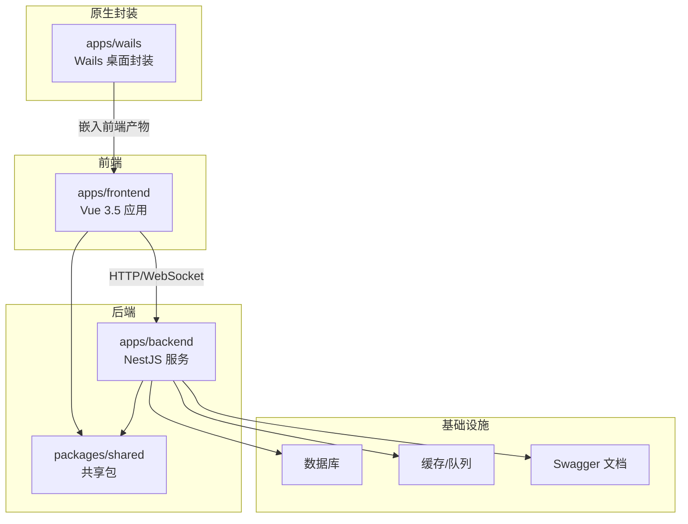
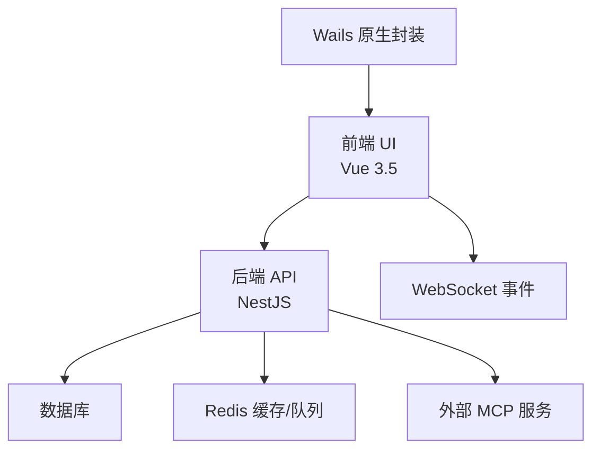
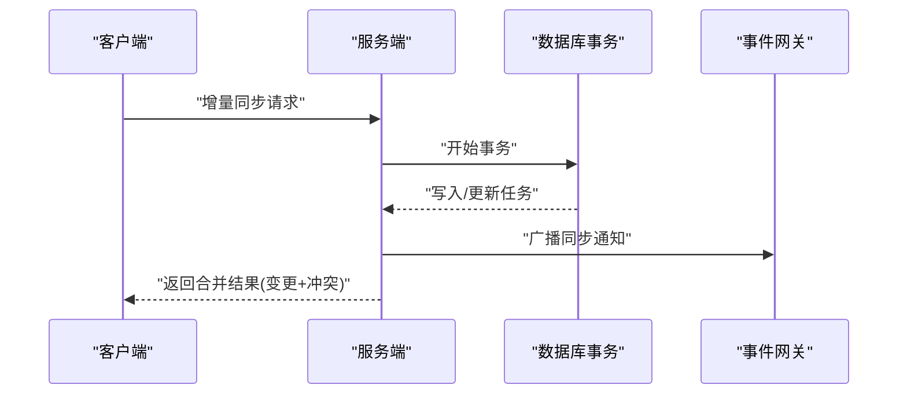
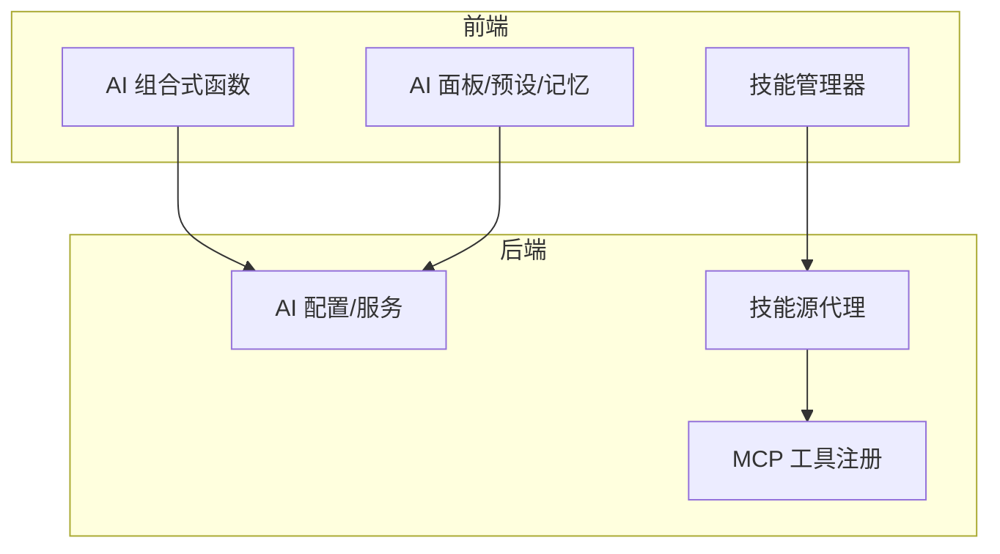
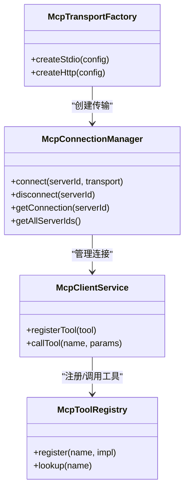
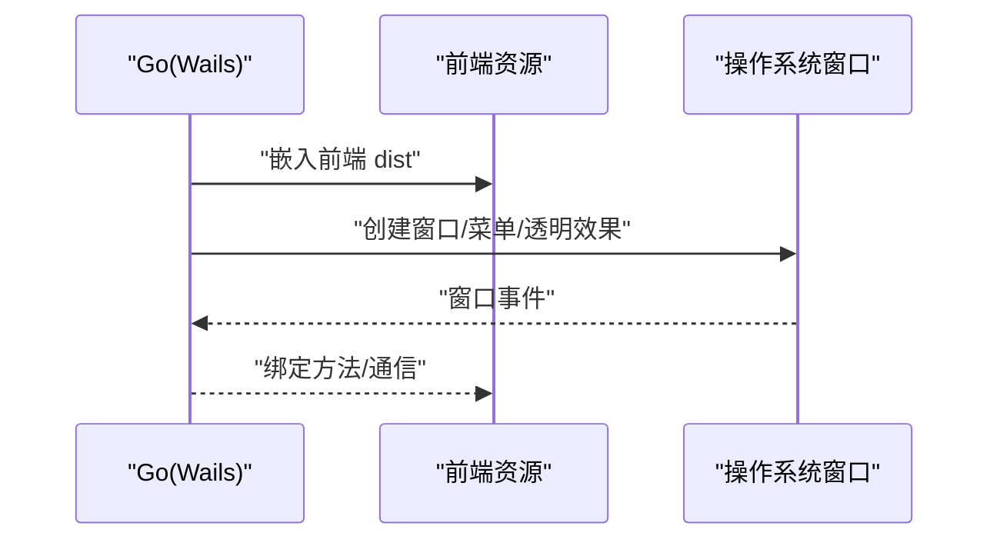
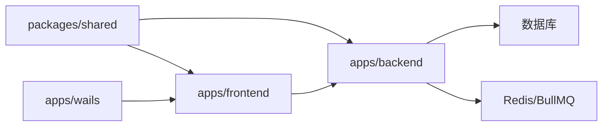

# 项目概述

<cite>
**本文引用的文件**
- [package.json](file://package.json)
- [turbo.json](file://turbo.json)
- [apps/backend/src/main.ts](file://apps/backend/src/main.ts)
- [apps/backend/src/app.module.ts](file://apps/backend/src/app.module.ts)
- [apps/backend/src/mcp/mcp.module.ts](file://apps/backend/src/mcp/mcp.module.ts)
- [apps/backend/src/todos/todos.module.ts](file://apps/backend/src/todos/todos.module.ts)
- [apps/backend/src/todos/todos-sync.service.ts](file://apps/backend/src/todos/todos-sync.service.ts)
- [apps/backend/src/mcp/core/mcp-connection.manager.ts](file://apps/backend/src/mcp/core/mcp-connection.manager.ts)
- [apps/frontend/src/main.ts](file://apps/frontend/src/main.ts)
- [apps/frontend/src/App.vue](file://apps/frontend/src/App.vue)
- [apps/frontend/src/features/todo/TodoView.vue](file://apps/frontend/src/features/todo/TodoView.vue)
- [apps/frontend/src/features/ai/services/aiService.ts](file://apps/frontend/src/features/ai/services/aiService.ts)
- [apps/wails/main.go](file://apps/wails/main.go)
- [packages/shared/src/index.ts](file://packages/shared/src/index.ts)
</cite>

## 目录

1. [引言](#引言)
2. [项目结构](#项目结构)
3. [核心组件](#核心组件)
4. [架构总览](#架构总览)
5. [详细组件分析](#详细组件分析)
6. [依赖分析](#依赖分析)
7. [性能考量](#性能考量)
8. [故障排查指南](#故障排查指南)
9. [结论](#结论)
10. [附录](#附录)

## 引言

Lumina Todo 是一个“极简交互体验 + 工程严谨”的个人 AI 驱动待办系统。项目以 Thin Shell（轻壳）、Thick Brain（厚脑）的架构理念为核心，通过“前端薄壳 + 后端厚脑”的分层设计，实现跨平台一致体验与强大的 AI 能力。项目采用 monorepo 架构，统一管理共享包、后端服务、前端应用与原生封装层，强调工程化实践与可维护性。

- 核心目标：提供极致交互体验的个人生产力工具，围绕“任务管理 + AI 助手 + 实时同步 + MCP 工具生态”构建闭环。
- 技术愿景：以现代 Web 技术栈为基础，结合 NestJS、Vue 3.5、Wails、Capacitor 等，打造高可用、可扩展、跨端一致的产品。
- 产品定位：面向追求效率与体验的个人用户，提供“所想即所得”的智能待办与知识管理体验。

## 项目结构

项目采用基于工作区的 monorepo 设计，核心目录与职责如下：

- apps/backend：后端服务，基于 NestJS，提供认证、任务、同步、邮件、定时任务、MCP 管理等能力。
- apps/frontend：前端应用，基于 Vue 3.5 + Vite，提供任务管理、AI 助手、可视化统计、实时同步等界面与交互。
- apps/wails：原生桌面封装层，使用 Wails 将前端资源打包为跨平台桌面应用。
- packages/shared：共享包，统一导出 Zod Schema、通用 DTO、工具函数等，保障前后端契约一致。
- scripts：工程化脚本，如数据库迁移、部署、安全审计等。
- 根级配置：Turbo、ESLint、Prettier、Docker Compose 等，支撑大规模工程化流水线。

图示来源

- [apps/backend/src/app.module.ts:28-146](file://apps/backend/src/app.module.ts#L28-L146)
- [apps/frontend/src/main.ts:54-137](file://apps/frontend/src/main.ts#L54-L137)
- [apps/wails/main.go:51-89](file://apps/wails/main.go#L51-L89)

章节来源

- [package.json:31-76](file://package.json#L31-L76)
- [turbo.json:1-202](file://turbo.json#L1-L202)

## 核心组件

- Thin Shell（前端薄壳）
  - 以 Vue 3.5 为核心，结合 Pinia、Vue Query、ECharts 等，提供流畅的交互与可视化能力；通过 WebSocket 实现实时同步与多端一致体验。
  - 关键点：全局错误处理、持久化状态、图表渲染、主题与国际化初始化。
- Thick Brain（后端厚脑）
  - 以 NestJS 为核心，提供认证、任务、同步、邮件、定时任务、MCP 管理、事件网关、缓存与队列等能力；统一 Zod 校验、全局拦截器与异常过滤器，保障接口稳定与安全。
  - 关键点：全局 CORS、Helmet 安全头、CSRF 防护、Gzip 压缩、Swagger 文档、优雅退出钩子。
- 原生封装（Wails）
  - 将前端产物嵌入原生窗口，提供跨平台桌面体验，并支持菜单、透明窗口、隐藏标题栏等平台特性。
- 共享包（Shared）
  - 统一导出 Zod Schema、通用 DTO、工具函数，确保前后端契约一致，降低耦合与重复。

章节来源

- [apps/frontend/src/main.ts:54-137](file://apps/frontend/src/main.ts#L54-L137)
- [apps/backend/src/main.ts:34-205](file://apps/backend/src/main.ts#L34-L205)
- [apps/wails/main.go:51-89](file://apps/wails/main.go#L51-L89)
- [packages/shared/src/index.ts:10-22](file://packages/shared/src/index.ts#L10-L22)

## 架构总览

Thin Shell 与 Thick Brain 的协作模式：

- 前端负责用户交互、视图渲染与本地状态持久化；后端负责业务规则、数据一致性、实时事件与安全防护。
- 前后端通过 HTTP/WS 通信，后端提供 REST 接口与 WebSocket 事件通道；前端通过 Vue Query 管理缓存与并发控制。
- 原生封装层将前端资源打包为桌面应用，提供更贴近原生的体验。

图示来源

- [apps/backend/src/main.ts:181-190](file://apps/backend/src/main.ts#L181-L190)
- [apps/backend/src/app.module.ts:97-145](file://apps/backend/src/app.module.ts#L97-L145)
- [apps/frontend/src/App.vue:16-23](file://apps/frontend/src/App.vue#L16-L23)
- [apps/wails/main.go:51-89](file://apps/wails/main.go#L51-L89)

## 详细组件分析

### 任务管理与实时同步

- 同步机制
  - 增量合并：客户端推送变更，服务端在事务中执行 upsert，严格版本校验避免冲突；拉取自上次同步以来的服务端变更，合并后返回给客户端。
  - 冲突处理：对墓碑（删除）、所有权不匹配、版本冲突进行分类标记，指导客户端决策。
  - 递归任务：根据规则与时区生成下一次周期性任务，保持时间线一致性。
  - 广播通知：当有客户端提交变更时，向其他在线设备广播同步通知，确保多端一致。
- 前端体验
  - 视图切换与动画：列表/可视化/统计/便签视图，配合 GSAP 实现平滑过渡与 3D 效果。
  - 输入与搜索：输入框高度与可见性随视图与过滤条件动态调整，移动端适配良好。
  - 冲突面板：展示冲突原因与建议，辅助用户快速解决同步问题。

图示来源

- [apps/backend/src/todos/todos-sync.service.ts:49-224](file://apps/backend/src/todos/todos-sync.service.ts#L49-L224)
- [apps/backend/src/todos/todos.module.ts:1-15](file://apps/backend/src/todos/todos.module.ts#L1-L15)

章节来源

- [apps/backend/src/todos/todos-sync.service.ts:49-224](file://apps/backend/src/todos/todos-sync.service.ts#L49-L224)
- [apps/frontend/src/features/todo/TodoView.vue:1-200](file://apps/frontend/src/features/todo/TodoView.vue#L1-L200)

### AI 助手与技能生态

- AI 助手
  - 提供对话式交互、记忆管理、预设管理、上下文压缩、工具调用与流式输出等能力；支持图片附件、Markdown 渲染、Mermaid 图表编辑与预览。
  - 前端通过组合式函数管理聊天状态、附件、模式与面板，后端提供统一的 AI 配置与技能运行时代理。
- 技能运行时
  - 支持外部技能源的发现、配置与材料化，提供 HTTP/STDIO 等传输方式；前端提供技能管理器与设置面板，后端提供代理与工具注册。
- 价值体现
  - 将 AI 与任务管理深度融合，实现“从想法到行动”的闭环；通过工具系统扩展能力边界，满足个性化需求。

图示来源

- [apps/frontend/src/features/ai/services/aiService.ts:1-6](file://apps/frontend/src/features/ai/services/aiService.ts#L1-L6)
- [apps/backend/src/mcp/mcp.module.ts:1-25](file://apps/backend/src/mcp/mcp.module.ts#L1-L25)

章节来源

- [apps/frontend/src/features/ai/services/aiService.ts:1-6](file://apps/frontend/src/features/ai/services/aiService.ts#L1-L6)
- [apps/backend/src/mcp/mcp.module.ts:1-25](file://apps/backend/src/mcp/mcp.module.ts#L1-L25)

### MCP 工具系统

- 连接管理
  - 维护多个 MCP 服务器连接，支持 STDIO/HTTP 等传输；提供连接生命周期管理、错误日志与断开重连。
- 工具注册
  - 将外部工具注册到系统，统一暴露能力接口；支持请求超时、能力声明与能力协商。
- 与 AI 的协作
  - 在聊天过程中，AI 可以调用已注册的工具，实现“思考—计划—执行—观察—反思”的完整链路。

图示来源

- [apps/backend/src/mcp/core/mcp-connection.manager.ts:12-101](file://apps/backend/src/mcp/core/mcp-connection.manager.ts#L12-L101)
- [apps/backend/src/mcp/mcp.module.ts:1-25](file://apps/backend/src/mcp/mcp.module.ts#L1-L25)

章节来源

- [apps/backend/src/mcp/core/mcp-connection.manager.ts:12-101](file://apps/backend/src/mcp/core/mcp-connection.manager.ts#L12-L101)
- [apps/backend/src/mcp/mcp.module.ts:1-25](file://apps/backend/src/mcp/mcp.module.ts#L1-L25)

### 原生桌面封装（Wails）

- 将前端构建产物嵌入原生窗口，提供跨平台桌面体验；支持菜单、透明窗口、隐藏标题栏、macOS About 等平台特性。
- 与前端的协作：通过 AssetServer 提供静态资源，绑定 Go 层方法供前端调用。

图示来源

- [apps/wails/main.go:51-89](file://apps/wails/main.go#L51-L89)

章节来源

- [apps/wails/main.go:51-89](file://apps/wails/main.go#L51-L89)

## 依赖分析

- monorepo 与工程化
  - Turbo 管理构建、测试、类型检查与缓存；PNPM 工作区统一依赖；ESLint/Prettier/Husky 保障代码质量与提交规范。
- 核心依赖选择
  - 前端：Vue 3.5、Pinia、Vue Query、ECharts、GSAP、TailwindCSS、Capacitor（跨端）、Wails（原生封装）。
  - 后端：NestJS、Fastify、Pino、BullMQ、Prisma、Redis、Socket.IO、Swagger、Zod。
  - 共享：Zod Schema、通用 DTO、工具函数。
- 依赖关系
  - 前端依赖共享包，后端同样依赖共享包；后端模块化拆分，MCP、任务、事件、定时任务等模块独立；原生封装依赖前端构建产物。

图示来源

- [packages/shared/src/index.ts:10-22](file://packages/shared/src/index.ts#L10-L22)
- [apps/backend/src/app.module.ts:134-145](file://apps/backend/src/app.module.ts#L134-L145)
- [apps/frontend/src/main.ts:54-137](file://apps/frontend/src/main.ts#L54-L137)
- [apps/wails/main.go:51-89](file://apps/wails/main.go#L51-L89)

章节来源

- [turbo.json:1-202](file://turbo.json#L1-L202)
- [package.json:78-139](file://package.json#L78-L139)

## 性能考量

- 前端
  - 持久化状态与缓存：Pinia 持久化插件减少重复加载；Vue Query 默认缓存与重试策略提升弱网体验。
  - 渐进式组件与动画：异步组件按需加载，GSAP 管理动画上下文，避免内存泄漏。
  - 错误恢复：动态导入失败与 ResizeObserver 良性错误的全局处理，提升稳定性。
- 后端
  - 全局 Zod 校验、XSS 清理与响应转换，减少无效请求与异常传播。
  - Helmet、CSRF 防护与 Gzip 压缩，降低安全风险与带宽消耗。
  - BullMQ 队列与 Redis 缓存，支持高并发与可扩展的后台任务处理。
- 同步与一致性
  - 增量合并与严格版本校验，减少冲突概率；事务写入与墓碑机制，保障最终一致性。
  - 广播通知与 WebSocket 事件，确保多端实时同步。

章节来源

- [apps/frontend/src/main.ts:115-137](file://apps/frontend/src/main.ts#L115-L137)
- [apps/backend/src/main.ts:169-180](file://apps/backend/src/main.ts#L169-L180)
- [apps/backend/src/todos/todos-sync.service.ts:49-224](file://apps/backend/src/todos/todos-sync.service.ts#L49-L224)

## 故障排查指南

- 前端
  - 动态导入错误：页面会在检测到 Chunk 加载失败时尝试自动刷新，若多次失败，建议手动刷新或检查部署版本。
  - ResizeObserver 错误：属于浏览器良性告警，框架已忽略，无需处理。
- 后端
  - CSRF 防护：缺失 X-Requested-With 请求头会被拦截并返回 403，需确保前端正确携带该头部。
  - 安全中间件：Helmet、压缩与静态资源已启用，若出现跨域或资源加载问题，请检查 CORS 配置与静态目录。
  - Swagger 文档：可通过 /api/docs 访问，便于调试与联调。
- 原生封装
  - 资源加载：Wails 通过 AssetServer 提供前端资源，若窗口空白，检查构建产物与菜单项是否正确绑定。

章节来源

- [apps/frontend/src/main.ts:58-114](file://apps/frontend/src/main.ts#L58-L114)
- [apps/backend/src/main.ts:125-167](file://apps/backend/src/main.ts#L125-L167)
- [apps/wails/main.go:51-89](file://apps/wails/main.go#L51-L89)

## 结论

Lumina Todo 以 Thin Shell + Thick Brain 的架构理念，结合 monorepo 工程化实践，构建了“AI 驱动 + 实时同步 + MCP 工具生态”的个人生产力系统。通过前后端模块化与共享契约，项目在保证工程严谨的同时，提供了跨端一致、交互流畅、能力可扩展的用户体验。对于初学者，建议从任务管理与 AI 助手入手；对于有经验的开发者，可深入 MCP 工具系统与同步机制，探索更多定制化与性能优化空间。

## 附录

- 关键特性清单
  - AI 助手：对话、记忆、预设、上下文压缩、工具调用、流式输出、图片与 Markdown/Mermaid 支持。
  - MCP 工具系统：多传输协议、工具注册、能力协商、错误日志与断线重连。
  - 任务管理：列表/可视化/统计/便签视图、递归任务、搜索与筛选、Pomodoro 计时。
  - 实时同步：增量合并、冲突检测、墓碑机制、广播通知、多端一致。
  - 原生桌面：跨平台窗口、透明/隐藏标题栏、菜单、About 信息。
- 技术栈选择理由
  - Vue 3.5：成熟生态、组合式 API、性能与开发体验兼顾。
  - NestJS：模块化架构、装饰器与依赖注入、企业级后端最佳实践。
  - Wails：将 Web 技术与原生体验结合，降低跨平台成本。
  - Capacitor：移动端 Web 化方案，与 Web 技术栈无缝衔接。
  - Shared 包：统一契约，减少前后端耦合，提升协作效率。
