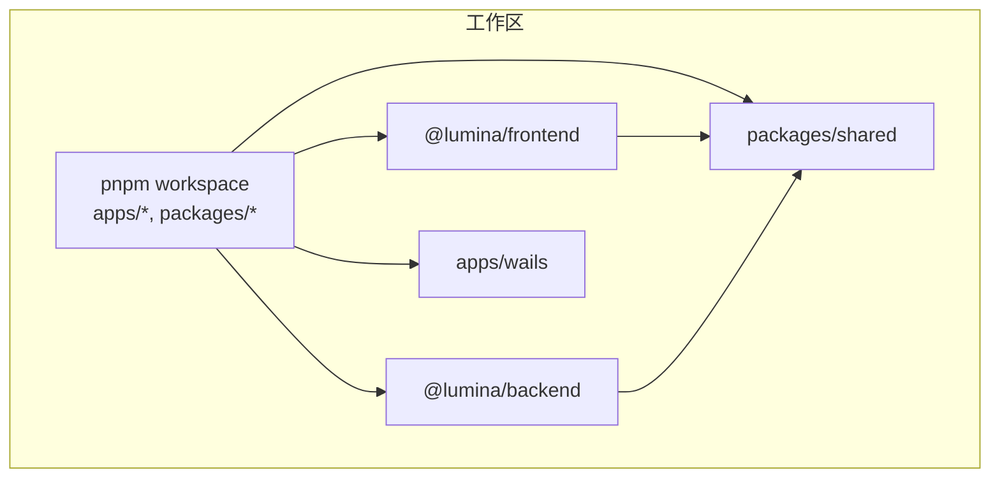
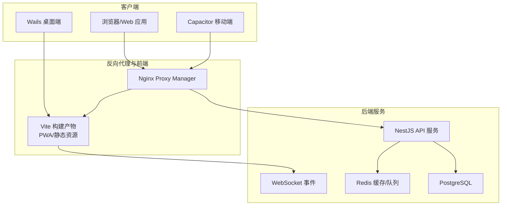
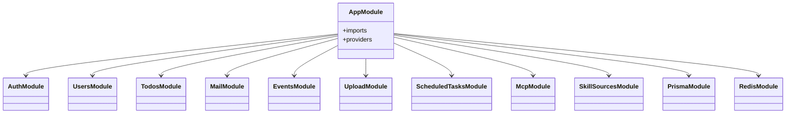
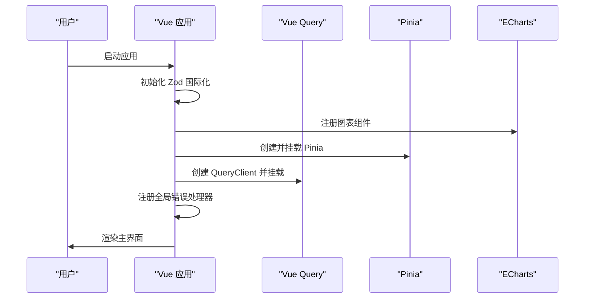
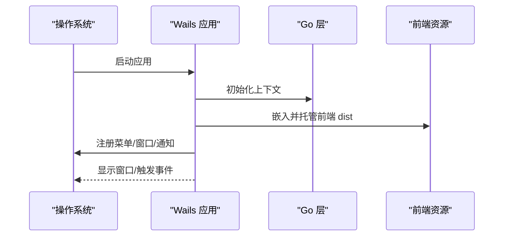
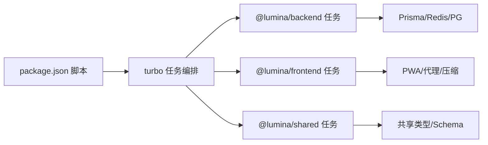

# 项目概述

<cite>
**本文引用的文件**
- [package.json](file://package.json)
- [pnpm-workspace.yaml](file://pnpm-workspace.yaml)
- [turbo.json](file://turbo.json)
- [apps/backend/package.json](file://apps/backend/package.json)
- [apps/frontend/package.json](file://apps/frontend/package.json)
- [packages/shared/package.json](file://packages/shared/package.json)
- [apps/backend/src/app.module.ts](file://apps/backend/src/app.module.ts)
- [apps/frontend/src/main.ts](file://apps/frontend/src/main.ts)
- [apps/frontend/vite.config.mts](file://apps/frontend/vite.config.mts)
- [apps/frontend/capacitor.config.ts](file://apps/frontend/capacitor.config.ts)
- [apps/wails/main.go](file://apps/wails/main.go)
- [apps/wails/app.go](file://apps/wails/app.go)
- [docker-compose.yml](file://docker-compose.yml)
- [CONTRIBUTING.md](file://CONTRIBUTING.md)
- [CODE_OF_CONDUCT.md](file://CODE_OF_CONDUCT.md)
- [SECURITY.md](file://SECURITY.md)
</cite>

## 目录
1. [引言](#引言)
2. [项目结构](#项目结构)
3. [核心组件](#核心组件)
4. [架构总览](#架构总览)
5. [详细组件分析](#详细组件分析)
6. [依赖关系分析](#依赖关系分析)
7. [性能考量](#性能考量)
8. [故障排除指南](#故障排除指南)
9. [结论](#结论)
10. [附录](#附录)

## 引言
Lumina Todo 是一个“AI 驱动的个人待办事项管理系统”，其核心价值主张在于：
- 极致交互体验：通过现代化前端框架与动画、图形、实时通信等能力，提供流畅、直观且富有表现力的用户界面。
- 严格工程实践：采用 monorepo 管理、完善的 CI/CD 流程、类型安全、测试覆盖、静态检查与安全审计，确保高质量交付。
- 全栈一体化：后端基于 NestJS，前端基于 Vue 3，桌面端通过 Wails 封装，移动端通过 Capacitor 支持，形成跨平台统一体验。

技术选型决策体现为：
- 后端：NestJS 提供模块化、可扩展的企业级服务端能力；结合 Prisma、Redis、BullMQ、WebSocket 等实现数据层、缓存与异步任务。
- 前端：Vue 3 + Vite + PWA，兼顾现代开发体验与高性能构建；Capacitor 提供移动端原生能力桥接。
- 桌面端：Wails 将前端资源嵌入 Go 应用，实现跨平台桌面应用。
- 工程化：pnpm workspace + Turborepo，统一管理多包、并行构建与缓存加速。

## 项目结构
Lumina 采用 monorepo 结构，以 pnpm workspace 管理多个包，Turborepo 实现任务编排与缓存加速。整体目录组织如下：
- apps/backend：NestJS 后端服务，包含认证、用户、待办、邮件、定时任务、AI/MCP 集成等模块。
- apps/frontend：Vue 3 前端应用，包含路由、状态管理、国际化、AI 助手、Todo 视图等。
- apps/wails：Go 语言桌面壳，嵌入前端产物，提供系统菜单、窗口控制、通知等原生能力。
- packages/shared：共享的 Zod Schema 与工具函数，被前后端复用。
- docker-compose.yml：生产级容器编排，包含 PostgreSQL、Redis、NPM 反向代理、日志可视化等。

**图表来源**
- [pnpm-workspace.yaml:1-4](file://pnpm-workspace.yaml#L1-L4)
- [turbo.json:1-186](file://turbo.json#L1-L186)

**章节来源**
- [pnpm-workspace.yaml:1-4](file://pnpm-workspace.yaml#L1-L4)
- [turbo.json:1-186](file://turbo.json#L1-L186)
- [package.json:1-133](file://package.json#L1-L133)

## 核心组件
- 后端服务（NestJS）：负责业务逻辑、认证授权、数据库访问、缓存、队列、邮件、健康检查、国际化、WebSocket 事件等。
- 前端应用（Vue 3）：提供 Todo 管理、AI 助手、国际化、状态持久化、PWA、实时数据同步等。
- 桌面壳（Wails）：将前端资源打包为桌面应用，提供窗口控制、系统菜单、通知等。
- 移动端（Capacitor）：在 Android/iOS 上运行，通过 Capacitor 插件桥接原生能力。
- 共享包（packages/shared）：统一的数据校验与工具，减少重复代码。

**章节来源**
- [apps/backend/src/app.module.ts:1-175](file://apps/backend/src/app.module.ts#L1-L175)
- [apps/frontend/src/main.ts:1-138](file://apps/frontend/src/main.ts#L1-L138)
- [apps/wails/main.go:1-95](file://apps/wails/main.go#L1-L95)
- [apps/frontend/capacitor.config.ts:1-23](file://apps/frontend/capacitor.config.ts#L1-L23)
- [packages/shared/package.json:1-51](file://packages/shared/package.json#L1-L51)

## 架构总览
Lumina 的系统架构围绕“后端 API + 前端应用 + 桌面/移动端壳”展开，并通过容器化进行生产部署。核心交互流程如下：

**图表来源**
- [docker-compose.yml:1-237](file://docker-compose.yml#L1-L237)
- [apps/frontend/vite.config.mts:1-185](file://apps/frontend/vite.config.mts#L1-L185)
- [apps/backend/src/app.module.ts:1-175](file://apps/backend/src/app.module.ts#L1-L175)

## 详细组件分析

### 后端（NestJS）模块化设计
后端通过 AppModule 组织多个子模块，涵盖认证、用户、待办、邮件、定时任务、MCP、技能源等。全局配置包括：
- 配置模块：集中加载 .env 并注入到各模块。
- 日志模块：Pino 结合自定义序列化与级别选择，区分开发与生产输出。
- 事件模块：EventEmitter 支持通配符事件与内存泄漏告警。
- 队列模块：BullMQ 连接 Redis，配置默认作业选项（去重、重试、指数退避）。
- 速率限制：多粒度限流策略，防止暴力破解。
- 国际化：i18n 加载器与解析器，支持头部与 Accept-Language。

**图表来源**
- [apps/backend/src/app.module.ts:1-175](file://apps/backend/src/app.module.ts#L1-L175)

**章节来源**
- [apps/backend/src/app.module.ts:1-175](file://apps/backend/src/app.module.ts#L1-L175)

### 前端（Vue 3）应用初始化与错误处理
前端入口完成以下关键步骤：
- 初始化 Zod 国际化，确保表单校验与错误提示本地化。
- 注册 ECharts 图表组件，支持多种统计与可视化场景。
- 全局错误处理：捕获动态模块加载失败（Chunk 错误）、忽略 ResizeObserver 良性错误、记录未处理异常。
- 状态管理与持久化：Pinia + 持久化插件。
- 数据查询：@tanstack/vue-query，默认缓存策略与重试机制。
- 国际化与样式：vue-i18n、主题与 Markdown 样式。

**图表来源**
- [apps/frontend/src/main.ts:1-138](file://apps/frontend/src/main.ts#L1-L138)

**章节来源**
- [apps/frontend/src/main.ts:1-138](file://apps/frontend/src/main.ts#L1-L138)

### 桌面壳（Wails）集成
Wails 将前端构建产物嵌入 Go 应用，提供：
- 菜单栏与编辑菜单（macOS 标准）。
- 窗口控制：最小化、置顶、尺寸调整、居中显示。
- 浏览器打开链接、消息对话框、系统通知。
- 平台特定外观：Windows 透明与 Mica 效果、macOS 标题栏隐藏。

**图表来源**
- [apps/wails/main.go:1-95](file://apps/wails/main.go#L1-L95)
- [apps/wails/app.go:1-168](file://apps/wails/app.go#L1-L168)

**章节来源**
- [apps/wails/main.go:1-95](file://apps/wails/main.go#L1-L95)
- [apps/wails/app.go:1-168](file://apps/wails/app.go#L1-L168)

### 移动端（Capacitor）配置
Capacitor 将 Web 应用转换为原生应用：
- 应用标识与名称、Web 目录指向构建产物。
- 开发服务器可配置为本机 IP，支持热重载。
- 插件：启动屏、透明背景等。

**章节来源**
- [apps/frontend/capacitor.config.ts:1-23](file://apps/frontend/capacitor.config.ts#L1-L23)

### 构建与开发流水线（Vite + PWA + 压缩）
前端构建配置要点：
- 基础路径按模式动态计算（Wails 使用相对路径）。
- 手动分包策略，将 Vue、UI、图表、Mermaid、Markdown、工具库等拆分为独立 vendor 包。
- Gzip/Brotli 压缩提升传输效率。
- PWA 清单与图标生成，支持自动更新。
- 代理配置：将 /api 与 /socket.io 转发至后端，WS 长连接超时延长。
- 开发服务器监听 0.0.0.0，便于容器内访问。

**章节来源**
- [apps/frontend/vite.config.mts:1-185](file://apps/frontend/vite.config.mts#L1-L185)

### 生产部署（Docker Compose）
生产环境通过 Docker Compose 编排：
- PostgreSQL：健康检查、卷持久化、参数优化。
- Redis：AOF、最大内存策略、密码保护。
- Backend：NestJS 服务，依赖数据库与缓存健康状态，暴露健康检查端点。
- Frontend：Nginx 静态服务，只读文件系统与临时缓存，健康检查。
- NPM：反向代理与 HTTPS 终端，管理后台端口可配置。
- 日志可视化：GoAccess 实时分析 Nginx 访问日志。

**章节来源**
- [docker-compose.yml:1-237](file://docker-compose.yml#L1-L237)

## 依赖关系分析
- 包管理：pnpm workspace 统一管理 apps 与 packages。
- 任务编排：Turborepo 为每个包提供 build/dev/test/lint/type-check 等任务，并支持缓存与并发。
- 版本与安全：package.json 中 overrides 对齐关键依赖版本，降低供应链风险。
- 脚本：顶层脚本统一调用 Turborepo，支持并行开发与一键构建。

**图表来源**
- [package.json:1-133](file://package.json#L1-L133)
- [turbo.json:1-186](file://turbo.json#L1-L186)

**章节来源**
- [package.json:1-133](file://package.json#L1-L133)
- [turbo.json:1-186](file://turbo.json#L1-L186)

## 性能考量
- 构建性能：手动分包策略减少首屏体积，Gzip/Brotli 压缩提升传输速度；Vite 开发服务器监听 0.0.0.0 适配容器环境。
- 运行时性能：后端使用 BullMQ 与 Redis，合理配置退避与重试；日志模块按状态码选择级别，避免生产环境冗余输出。
- 前端稳定性：全局错误处理过滤常见良性错误，动态模块加载失败时自动刷新，提升用户体验。
- 可观测性：NPM + GoAccess 提供实时访问日志可视化，便于问题定位与容量评估。

## 故障排除指南
- 动态模块加载失败（Chunk 错误）：前端入口已内置检测与自动刷新逻辑，若频繁出现需检查部署版本一致性。
- ResizeObserver 相关警告：全局错误处理器已忽略该类良性错误，无需干预。
- 开发代理超时：Vite 配置已延长 WebSocket 超时，若仍断连请检查网络与防火墙。
- 容器健康检查：后端与前端均配置健康检查端点，可通过日志定位依赖（数据库/缓存）未就绪问题。
- 安全漏洞报告：遵循安全政策，通过私有渠道提交，维护者将在 48 小时内响应。

**章节来源**
- [apps/frontend/src/main.ts:54-113](file://apps/frontend/src/main.ts#L54-L113)
- [apps/frontend/vite.config.mts:154-182](file://apps/frontend/vite.config.mts#L154-L182)
- [docker-compose.yml:126-136](file://docker-compose.yml#L126-L136)
- [SECURITY.md:1-40](file://SECURITY.md#L1-L40)

## 结论
Lumina Todo 以“极致交互体验 + 严格工程实践”为核心，采用 NestJS + Vue 3 + Wails + Capacitor 的全栈组合，配合 Turborepo 与 pnpm workspace，实现了跨平台、高可用、易维护的个人生产力工具。通过完善的监控、安全与贡献规范，项目在工程化与产品化之间取得了良好平衡，适合初学者快速上手，也为资深开发者提供了清晰的扩展路径。

## 附录
- 许可证：GNU Affero General Public License v3.0（AGPL-3.0）
- 贡献指南：遵循 Conventional Commits，通过 PR 流程协作，所有贡献以 AGPL-3.0 许可发布。
- 行为准则：采用 Contributor Covenant，明确标准与执行流程，保障社区健康生态。

**章节来源**
- [package.json:4-5](file://package.json#L4-L5)
- [CONTRIBUTING.md:80-87](file://CONTRIBUTING.md#L80-L87)
- [CODE_OF_CONDUCT.md:1-79](file://CODE_OF_CONDUCT.md#L1-L79)