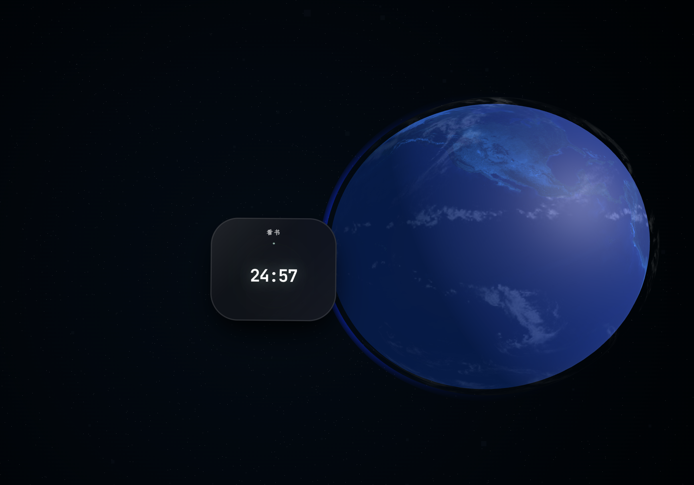

# Lumina（简思）

[](./LICENSE)
[](#技术栈)
[](#项目结构)

> 简于形，深于思。
>
> Lumina 是一个 AI 驱动的个人 Todo 系统。它想做的不是把待办再做一遍，而是把任务管理、上下文记忆、专注流程和多端体验放进同一个工作台里。

如果你想找的是一个“打开就记两条待办”的极简清单，Lumina 可能偏重一些。  
如果你更希望 Todo 不只是记录，而是能和 AI、知识上下文、专注节奏一起工作，它会更合适。

## 它能帮你做什么

- 把任务拆分、排序、过滤、统计放在一个连续工作流里，而不是散落在多个页面
- 让 AI 助手带着上下文继续对话，而不是每次都从零开始
- 用 MCP 扩展外部工具能力，把 AI 从“会聊天”推进到“能接工具”
- 用 Pomodoro Earth 这类低干扰视觉专注体验，减少工作切换时的断裂感
- 在 Web、桌面端与移动端之间尽量保持一致的核心能力

## 适合谁

- 已经把 Todo 当作日常工作台，而不只是备忘录的人
- 想把 AI 助手放进个人效率系统，而不是单独开一个聊天窗口的人
- 在意交互质感，也在意工程质量、类型安全和可维护性的人

## 界面预览

### Todo 列表
<p align="center">
  
</p>

### 完成反馈
<p align="center">
  
</p>

### AI 助手
<p align="center">
  
</p>

### 专注模式
<p align="center">
  
</p>

## 快速开始

### 1. 环境要求

- Node.js `>= 20.19.0`
- pnpm `>= 9.15.0`
- Docker / Docker Compose

建议先启用 corepack：

```bash
corepack enable
corepack prepare pnpm@9.15.0 --activate
```

### 2. 安装依赖

```bash
pnpm install
```

### 3. 推荐启动方式：Docker 开发环境

这是目前仓库默认、也最省心的开发路径。

```bash
pnpm docker:dev
```

启动后常用地址：

- 前端：<http://localhost:5173>
- 后端 Swagger：<http://localhost:3000/api/docs>
- 后端健康检查：<http://localhost:3000/api/health/liveness>

常用辅助命令：

```bash
pnpm docker:dev:logs
pnpm docker:dev:ps
pnpm docker:dev:restart
pnpm docker:dev:down
```

### 4. 本地混合开发

如果你更习惯本地起前后端，也可以这样跑：

```bash
pnpm install
docker compose up -d
pnpm db:push
pnpm dev
```

说明：

- `docker compose up -d` 会启动 PostgreSQL、Redis 等基础服务
- `pnpm dev` 会并行启动前端和后端开发服务
- 修改 `packages/shared` 后，先执行 `pnpm --filter @lumina/shared build`

## 环境变量

仓库根目录提供了 [`.env.example`](./.env.example)。

最常见的做法：

```bash
cp .env.example .env
```

第一次本地体验时，你主要关注这几类配置：

- 数据库 / Redis：`POSTGRES_*`、`REDIS_*`
- 鉴权安全：`JWT_SECRET`、`JWT_REFRESH_SECRET`
- 前端访问地址：`FRONTEND_URL`、`CORS_ORIGIN`
- AI 能力：`VITE_AI_API_URL`、`VITE_AI_API_KEY`、`VITE_AI_MODEL`

其中 AI 相关变量是按需配置的。如果你暂时只想先把 Todo 主流程跑起来，可以先不填完整的 AI 配置。

## 核心能力

### 任务管理不是单点功能

Lumina 的 Todo 模块不只是增删改查。它包含任务树、筛选、统计、可视化、专注模式，以及围绕任务上下文展开的交互设计。目标不是“功能尽量多”，而是让处理一件事时尽量少跳出当前上下文。

### AI 助手不是装饰层

AI 在这里不是一个孤立弹窗。仓库里已经包含上下文压缩、历史会话、预设、附件输入、结构化消息渲染等能力，方向很明确：让 AI 真正参与工作流，而不是只负责回答一句话。

### MCP 是可扩展边界

项目内置了 MCP 配置与工具调用能力，支持把外部服务接进 AI 助手。对于需要把个人系统连接到更多工具的人，这一层很关键。

### 多端是一套核心逻辑的延展

当前仓库覆盖 Web、Wails 桌面端与 Capacitor 移动端。原则是“业务逻辑尽量统一，原生壳只负责系统能力”，避免把核心规则拆碎到不同端里。

## 技术栈

| 层级 | 选型 |
| :--- | :--- |
| 前端 | Vue 3.5、Vite 8、Pinia、Tailwind CSS、GSAP、Three.js |
| 后端 | NestJS 11（Fastify）、Prisma、PostgreSQL、Redis、BullMQ |
| 跨端 | Wails、Capacitor |
| 共享契约 | Zod、TypeScript |
| 工程化 | pnpm Monorepo、Turborepo、ESLint、Prettier、Vitest |

## 架构说明

Lumina 采用的是明确的 `Thin Shell, Thick Brain` 思路：

- 前端负责交互、状态、可视化和用户体验
- 后端负责领域逻辑、鉴权、持久化、任务调度和实时通信
- 原生层只负责托盘、快捷键、窗口、文件等系统能力

这意味着：

- Vue 和 NestJS 通过标准 HTTP / WebSocket 通信
- Wails / Capacitor 不承载业务决策，只暴露原生能力
- `packages/shared` 负责放共享 Schema、DTO 与类型，减少前后端漂移

## 项目结构

```text
.
├── apps/
│   ├── backend/    # NestJS 后端，负责业务“大脑”
│   ├── frontend/   # Vue 前端，负责主要交互体验
│   └── wails/      # Wails 桌面壳
├── packages/
│   └── shared/     # 共享 Zod Schema、DTO、工具类型
├── docs/           # 项目文档与界面截图
├── docker-compose.dev.yml
├── docker-compose.yml
└── turbo.json
```

## 常用命令

```bash
# 开发
pnpm dev
pnpm docker:dev

# 质量门禁
pnpm lint
pnpm test
pnpm type-check

# CI 常用组合
pnpm ci:check
pnpm ci:test
pnpm security-audit

# 数据库
pnpm db:generate
pnpm db:push
pnpm db:migrate
pnpm db:studio

# 桌面端
pnpm wails:dev
pnpm wails:build
pnpm wails:deploy
```

## 工程约定

这个仓库对工程质量是认真执行的，不是口头上的“最好这样”：

- 行为变更必须补测试或同步更新测试
- 默认要求通过 `pnpm lint`、`pnpm test`、`pnpm type-check`
- TypeScript 使用严格类型，避免 `any`
- 共享契约优先放在 `packages/shared`
- 优先小而清晰、可审阅的改动

更完整的工程规范请看 [docs/AI_RULES.md](./docs/AI_RULES.md)。这份文档也是仓库内 AI 协作时的单一规范源。

## 下载与发布

- Release 列表：[GitHub Releases](https://github.com/xixixiaoyu/lumina/releases)
- 桌面端构建产物：[GitHub Actions / desktop-packages](https://github.com/xixixiaoyu/lumina/actions/workflows/desktop-packages.yml)

如果 macOS 提示应用“已损坏”或“无法打开”，通常不是 App 真坏了，而是这个版本没有走 Apple Developer 签名 / 公证流程。说白一点，就是我还没给苹果交那笔开发者年费。可执行：

```bash
xattr -dr com.apple.quarantine /Applications/Lumina.app
```

## 参与贡献

- 贡献说明：[CONTRIBUTING.md](./CONTRIBUTING.md)
- 安全反馈：[SECURITY.md](./SECURITY.md)
- 许可证：[LICENSE](./LICENSE)

如果你准备提 PR，建议先看完仓库规则，再动手改。这样你和我都会少走一点弯路。

---

<p align="center">
  Made by <b>牧云 (Mu Yun)</b>
</p>
